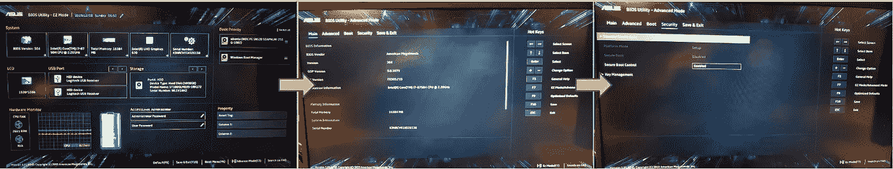

# 在 Windows 10 机器上安装 Ubuntu 的故障排除

> 原文：<https://medium.com/analytics-vidhya/troubleshooting-ubuntu-installation-on-a-windows-10-machine-b74b0e6cda14?source=collection_archive---------8----------------------->

## 准确的说是在双存储的 Windows 10 机器上。

顾名思义，这篇文章讲述了删除 Windows 10 并用 Ubuntu (在我的例子中是 18.04)取而代之的**的不那么简单的过程。
如果我的机器没有双存储(在我的情况下，256GB 固态硬盘+ 1TB 硬盘)，这个过程可能会更简单。
实际上，半天的工作只是**发现双存储**是我的问题的根本原因。**

所以，这篇文章的其余部分是这样的:

1.  在双存储机器上顺利安装 Ubuntu 的说明。
2.  双储是我的根本原因吗？
3.  宝贝，这还没有结束，直到它结束(更多的故障排除)

# 1.在双存储机器上顺利安装 Ubuntu 的说明。

1.  创建一个[可引导 USB](https://tutorials.ubuntu.com/tutorial/tutorial-create-a-usb-stick-on-windows#0) 。
2.  插入可启动 USB，重新启动计算机。在 Windows 加载之前，反复按下`F10`(或`F2`或任何在你机器上有效的键)进入 BIOS 屏幕。
3.  按`F8`进入启动菜单。
4.  选择您的可启动 USB 并快速按下`ESC` **一次**。这将引导您进入 GRUB 屏幕。(如果你不小心按了两次`ESC`，到达了奇怪的 bash 屏幕，输入`exit` + `Enter`返回)
5.  站在 Ubuntu 选项上按`e`编辑。
6.  [在选项中添加](https://askubuntu.com/questions/1153654/ubuntu-19-04-installer-cant-find-ssd/1153740#1153740) `pci=nomsi`。
7.  按`F10`启动。
8.  在 Ubuntu 安装过程中，选择:“擦除磁盘并安装 Ubuntu”。
9.  选择要安装 Ubuntu 的固态硬盘。

# 2.双储是我的根本原因吗？

你可能在探索安装过程中遇到的一些问题时偶然发现了这篇文章。

我就是这样发现双存储是我费力安装的根本原因的:

我创建了一个[可引导的 USB](https://tutorials.ubuntu.com/tutorial/tutorial-create-a-usb-stick-on-windows#0) ，上面有 Ubuntu 18.04 的安装程序，照章安装 Ubuntu，选择擦除磁盘，看起来安装很顺利很成功。

我的第一个提示是安装有问题，Ubuntu 只会在*恢复模式下加载，即使这样屏幕分辨率也是错误的。*

*然后我开始进一步探索，发现磁盘是**不是**擦除的，我电脑上还有 Windows！！😨😫😡*

**

*我是通过加载启动菜单并看到 Windows 启动管理器仍然存在来判断这一点的。*

*经过一番探索，我发现 Ubuntu 安装在我的硬盘上，而不是我的固态硬盘上。不仅如此，我再次尝试安装 Ubuntu，它甚至不识别固态硬盘！*

****

*我试图重新安装 Ubuntu，但在安装选项中看不到固态硬盘。*

*既然我已经找到了根本原因，并且经过了更多的尝试和错误之后，我找到了顺利安装的流程(在前一节中有详细描述)。一旦我确定这是正确的流程，我就沿着原路返回，并撤销了一些我在途中尝试过的诡计。*

*假设你自己也做过一些探索，我建议你也阅读下一节，以确保你的机器是干净的，然后*才*按照说明顺利安装。如果你有任何需要撤销的进一步探索，请在评论中分享！下一次我们中的任何人将不得不再次处理这个问题，这将是很好的有更多的信息来钻研。*

## *宝贝，这还没有结束，直到它结束(更多的故障排除)*

*如果你在这里，你已经在你的主 SSD 上成功安装了 Ubuntu，你的机器上已经没有 Windows 10 了。*

*你以为这就完了，哈？*

*我也是。*

**

*因此，这里有几个额外的步骤，我采取，以确保我的机器工作顺利。*

# *清除机器上所有不成功的安装*

*在连接了可启动 USB 的情况下，我使用“不安装就尝试 Ubuntu”选项启动。
然后我用 [GParted](https://gparted.org/) 对我的 SSD 和 HDD 进行[格式化](https://gparted.org/display-doc.php%3Fname%3Dhelp-manual#gparted-format-partition)(GParted 不会自动安装在 Ubuntu 上，但它应该内置在你的可启动 USB 上的试用版中)。直到那时，我才按照第一部分的说明去做。*

**

## *更新 Nvidia 驱动程序*

*如果你的机器上有 Nvidia GPU，你可能会遇到一些麻烦，就像我一样。这些表现为 Ubuntu 无法加载，尽管一切似乎都是正确的，然后在 [*恢复模式*](https://wiki.ubuntu.com/RecoveryMode) 上，一些“图形组件没有正确加载”和屏幕分辨率都是错误的。*

*第一步是让一位同事将最新的 Nvidia 驱动程序下载到他们的计算机上，并远程连接到我的计算机，将驱动程序复制到我的个人文件夹中。*

*然后，按照第一部分的步骤 1-5，然后[切换到*运行级别* 3](https://www.if-not-true-then-false.com/2012/howto-change-runlevel-on-grub2/) ，我们直接引导到终端(没有加载 Ubuntu GUI)，然后尝试安装驱动程序。安装没有成功，但在安装过程中，驱动安装程序问了我一些关于安装帮助文件或类似的问题(请原谅我的巫毒解释，我无意重现这一场景)，我欣然同意。
然后我重启电脑，Ubuntu 终于加载成功。*

*但是！驱动程序尚未正确安装！幸运的是最后一步很简单，在这个的帮助下[，我用`auto-install`安装了推荐的驱动程序。](https://linuxconfig.org/how-to-install-the-nvidia-drivers-on-ubuntu-18-04-bionic-beaver-linux)*

## *返回到安全引导控制*

*在这个过程中，我尝试了许多事情，其中之一就是禁用安全引导控制:在 BIOS 菜单中，按下`F7`进入高级模式，按下安全选项卡，向下滚动进入安全引导控制选项。*

*在某个时候，我禁用了这个选项，所以在按照第一部分中的说明操作之前，我重新启用了它。*

**

# *尾声——现在我终于可以平静地忍受 Ubuntu 作为我的操作系统的所有后续步骤了*

*我有机会在 Mac、Windows 和 Ubuntu 上开发软件。我一个都不喜欢。我告诉你实话，我讨厌电脑。讨厌！。几乎和我爱他们一样多…*

*我从处理 IT 摩擦的经验中学到的是**事情就是这样**。计算机是复杂的机器，而我如果我想用它们自己制作复杂的东西，一路上必然会遇到一些摩擦。
我在这些遭遇战中最有效的口头禅是“*我是* ***不是*** *打算让电脑* ***打败*** *我！*”。事实上我从来没有。*

*我对自己的愿望是开发一个更和平的咒语。或者让世界为开发人员开发一个无 IT 摩擦的体验…但是…我很难想象它们中的任何一个会很快发生…*

**

> *如果没有我出色的同事 Roee Kremer 的大力帮助，这一切会变得更加困难。谢谢罗伊！*