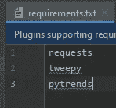
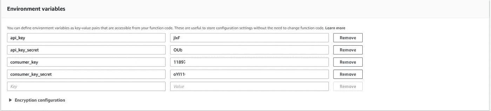
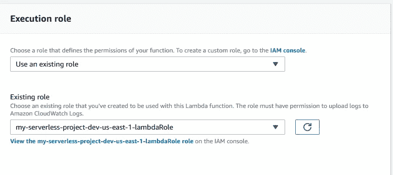

# 将 Pycharm 项目转换为 AWS Lambda 函数时的故障排除(Windows)

> 原文：<https://medium.com/analytics-vidhya/troubleshooting-while-turning-a-pycharm-project-into-an-aws-lambda-function-windows-cec052e6b01c?source=collection_archive---------9----------------------->


萨法尔·萨法罗夫在 [Unsplash](https://unsplash.com?utm_source=medium&utm_medium=referral) 上拍摄的照片

我最初的项目是一个使用 Pytrends 和 Tweepy 的 API 的机器人，每当我运行 Python 脚本时，它就会发出一个笑话。我想把它变成一个 Lambda 函数，这样它就可以每天自动运行。本指南展示了我遇到的一些错误及其解决方案。如果您有需要查找的特定错误，请查看目录，或者如果您试图将 Python 项目移植到 Lambda 中，请通读全文。

作为一名学生，我远非专家，但这篇文章的目的是提出一些我希望在从事我的项目时能找到的答案。我对任何在错误中挣扎的人的最大建议是访问 AWS Discord(【https://discord.gg/ZNGyXk】)。记住要有礼貌，对你的问题要有耐心。作为免责声明，我不知道我做的任何事情是否是最佳实践，但我成功地修复了我自己的问题。

## 目录:

出于某种原因，我需要点击链接两次来导航到该部分。

[无服务器 vs Jetbrains 插件:如果你不知道自己在做什么，请阅读这一部分](#71fd)

[Requirements.txt 问题](#3d17)

[配置文件出，环境变量入](#11b8)

[读写 s3 桶 txt 文件](#c875)

[调用 GetObject 操作时 AccessDenied】](#4aa8)

[无法读取未定义](#50e8)的属性“工件”

# 无服务器 vs Jetbrains 插件:如果你不知道自己在做什么，请阅读这一部分

第一个问题是弄清楚使用哪种技术。我尝试使用 Pycharm AWS 插件，但是我努力想出如何避免 ImportModuleError。错误看起来像这样，运行 Lambda 函数时的响应，pytrends 被替换为您正在使用的任何未包含的库。

```
{ 
“errorMessage”: “Unable to import module ‘app’: No module named ‘pytrends’”, 
“errorType”: “Runtime.ImportModuleError” 
}
```

问题是在 Lambda 中运行的 Python 环境没有您已经安装的要求。为了解决这个问题，我切换到了[无服务器框架](https://serverless.com/)，它有[无服务器 Python 需求插件](https://serverless.com/plugins/serverless-python-requirements/)来为你处理需求。 [**这本优秀的中级指南**](https://read.iopipe.com/the-right-way-to-do-serverless-in-python-e99535574454) 讲解了如何使用 Python 演示无服务器需求插件。老实说，该指南帮助我走了很远，因为它使用 python 模板奠定了基础。

从该指南中获得的关键是创建新的。py 文件，将其添加到 serverless.yml 文件中并进行部署。部署后，Lambda 函数出现在 AWS Lambda 控制台上(如果看不到它，请检查不同的服务器，例如俄勒冈州和弗吉尼亚州)。

从那里，我有一些错误，这是这篇文章的主要贡献。

# Requirements.txt 问题

首先，前面提到的指南使用

```
echo “requests” >> requirements.txt
```

向需求文本文件添加请求，但是实际上添加了“请求”而不是请求(没有引号)。为了让您的功能正常工作，您的需求应该如下所示:



我的项目 requirements.txt

不需要放 boto3，os，json，因为默认情况下 Lambda 的 Python 版本中包含了它们。如果您不知道默认情况下已经包含了哪些库，您可以像我一样，将 import 语句中的所有库复制到 requirements.txt 中，然后逐个处理错误。sls deploy 回复中的 json 错误如下所示:

```
STDERR: ERROR: Could not find a version that satisfies the requirement json (from -r /var/task/requirements.txt (line 1)) (from versions: none)
 ERROR: No matching distribution found for json (from -r /var/task/requirements.txt (line 1))
```

如果您看到这个，这意味着您需要从 requirements.txt 中删除这一行，在这种情况下，需要删除的是 json。

# 配置文件输出，环境变量输入

接下来，我最初有一个 config.json 文件来存储我的 Twitter API 键。由于 Lambda 无法访问该文件，我的选择是将文件上传到数据库，每次都检索并解析它，或者在 Lambda 中设置环境变量，这要容易得多。

下面是使用配置文件的“之前”代码:

```
# Open config file
with open(‘config.json’) as config_file:
 config = json.load(config_file)# Tweepy authentication
auth = tweepy.OAuthHandler(config[‘keys’][‘api_key’], config[‘keys’][‘api_key_secret’])
auth.set_access_token(config[‘keys’][‘consumer_key’], config[‘keys’][‘consumer_key_secret’])
api = tweepy.API(auth)
```

我需要做的是添加环境变量，方法是转到 Lambda 控制台→函数→单击您的函数→向下滚动到环境变量，并输入您的键值对，如下所示:(keys redacted)



然后，“之后”代码看起来像这样:

```
# Tweepy authentication using AWS environmental values
auth = tweepy.OAuthHandler(os.environ['api_key'], os.environ['api_key_secret'])
auth.set_access_token(os.environ['consumer_key'], os.environ['consumer_key_secret'])
api = tweepy.API(auth)
```

记得在你的顶部导入操作系统。努力让它发挥作用。

# 从 s3 bucket txt 文件中读取和写入

下一个大问题是我的机器人最初是从。txt 文件作为推特的潜在候选文件。这和 config.json 有同样的问题，但是这一次，我也写入文件来跟踪我已经在 tweets 中使用了哪些单词。这需要一个数据库，不和谐中的人推荐 s3，因为它是免费的，我不需要任何简单文本文件的重型数据流。我创建了一个 bucket 并上传了文本文件。

要使用 s3，您需要在您的顶部导入 boto3。py 文件。同样，这是之前和之后:

之前，从与。py 文件:

```
lines = open("samples.txt").read().splitlines()
chosenSamplesString = random.choice(lines)
```

之后，使用名为 playbarnesbot 的 s3 存储桶:

```
s3 = boto3.resource('s3')
samples = s3.Object('playbarnesbot', 'samples.txt')
body = samples.get()['Body'].read().splitlines()
chosenSamplesString = random.choice(body)
tempString = chosenSamplesString.decode('ascii') #ascii or utf-8
```

请注意，我必须解码该字符串，因为当我们从 s3 存储桶中取出它时，它是二进制数据。中看到的示例词。txt 文件将作为 b'sampleWord '检索，无需解码。

下面是另一个示例，该方法检查 playbarnesbot 存储桶中名为 search.txt 的文件中是否包含字符串:

```
def checkHistory(string):
    s3 = boto3.resource('s3')
    obj = s3.Object('playbarnesbot', 'search.txt')

    if string in str(obj.get()['Body'].read()):
        print(string + ' has been used already')
        return True
    else:
        print(string + ' hasn\'t been used before')
        return False
```

这向另一个方向提出了挑战:如果它不在 search.txt 文件中，我如何将它添加到文件中？我了解到物体(如。txt 文件)在 s3 桶中是不可变的，这意味着它们不能被更改。这意味着我不能像以前那样只是追加到 samples.txt 文件中。相反，我必须将文件下载到分配给每个 Lambda 函数的/tmp/ storage 中，像平常一样编辑文件，然后再次上传到 s3 bucket 中。

之前，只需将。本地 txt 文件:

```
def addHistory(string):
    with open('search.txt', "a", encoding="utf-8") as file:
        file.write(string)
        file.write("\n")
```

之后，将文件下载到/tmp/目录，并在编辑后重新加载:

```
def addHistory(string):
    s3_client = boto3.client('s3')
    s3_client.download_file('playbarnesbot','search.txt','/tmp/search.txt')
    with open('/tmp/search.txt', "w", encoding="utf-8") as file:
        file.write(string)
        file.write("\n")
    s3_client.upload_file('/tmp/search.txt','playbarnesbot','search.txt')
```

有人建议我使用 [tempfile](https://docs.python.org/3/library/tempfile.html) 而不是/tmp/

# 调用 GetObject 操作时 AccessDenied

前一节中用于检索对象的代码应该可以工作，但是没有，而是给了我以下错误:

```
{
 “errorMessage”: “An error occurred (AccessDenied) when calling the GetObject operation: Access Denied”,
 “errorType”: “ClientError”,
 “stackTrace”: [
 “ File \”/var/task/playBarnes.py\”, line 89, in lambda_handler\n body = samples.get()[‘Body’].read().splitlines()\n”,
 “ File \”/var/runtime/boto3/resources/factory.py\”, line 520, in do_action\n response = action(self, *args, **kwargs)\n”,
 “ File \”/var/runtime/boto3/resources/action.py\”, line 83, in __call__\n response = getattr(parent.meta.client, operation_name)(**params)\n”,
 “ File \”/var/runtime/botocore/client.py\”, line 272, in _api_call\n return self._make_api_call(operation_name, kwargs)\n”,
 “ File \”/var/runtime/botocore/client.py\”, line 576, in _make_api_call\n raise error_class(parsed_response, operation_name)\n”
 ]
}
```

此错误是由无服务器帐户无权访问存储桶的数据引起的，我不能 100%确定是什么修复了此错误，但我执行了以下操作，问题得到了解决:

1.  我进入 s3 控制台，使我的 bucket 不阻止公共访问(单击 bucket→Permissions→edit block public access)。我不确定这一步是否有必要。
2.  我写了一个桶策略来允许访问(桶→权限→桶策略)

策略看起来像这样，但是您可能想使用策略生成器来创建自己的策略。

```
 {
 “Version”: “2012–10–17”,
 “Id”: “Policy1578283143575”,
 “Statement”: [
 {
 “Sid”: “Stmt1578283132694”,
 “Effect”: “Allow”,
 “Principal”: {
 “AWS”: “arnofyourserverlessuser”
 },
 “Action”: “s3:*”,
 “Resource”: “arn:aws:s3:::playbarnesbot/*”
 }
 ]
}
```

您可以在 IAM 控制台的“用户→无服务器→用户 arn”下找到无服务器用户的 arn。用你的桶替换 playbarnesbot。这一步可能是必要的。

3.在 IAM 控制台中，我为无服务器用户编写了一个内联策略，授予它访问 bucket 的权限。

该策略如下所示:

```
{
 “Version”: “2012–10–17”,
 “Statement”: [
 {
 “Effect”: “Allow”,
 “Action”: [
 “s3:ListBucket”
 ],
 “Resource”: [
 “arn:aws:s3:::playbarnesbot”
 ]
 },
 {
 “Effect”: “Allow”,
 “Action”: [
 “s3:PutObject”,
 “s3:GetObject”,
 “s3:DeleteObject”
 ],
 “Resource”: [
 “arn:aws:s3:::playbarnesbot/*”
 ]
 }
 ]
}
```

这一步似乎也很重要，但下一步是解决问题的步骤。

4.在 lambda 设置中，在执行角色下，我点击了“查看我的-无服务器-项目…角色”



然后将 AdministratorAccess 策略附加到该角色。请注意，无服务器用户已经拥有 AdministratorAccess 策略，但这是角色。

这解决了我的问题，但是如果你仍然有问题，你可以试试亚马逊的故障诊断指南。

# 无法读取未定义的属性“artifact”

我遇到的最后一点麻烦是运行 sls deploy 和 sls invoke -f playBarnes(测试 Lambda 函数的标准过程),没有遇到 Python/Lambda 错误，但却得到了以下错误:

```
TypeError: Cannot read property ‘artifact’ of undefined
 at ServerlessPythonRequirements.BbPromise.bind.then.then.then (C:\Users\Kevin\myService2\node_modules\serverless-python-requirements\index.js:176:48)
 at ServerlessPythonRequirements.tryCatcher (C:\Users\Kevin\myService2\node_modules\bluebird\js\release\util.js:16:23)
 at Promise._settlePromiseFromHandler (C:\Users\Kevin\myService2\node_modules\bluebird\js\release\promise.js:547:31)
 at Promise._settlePromise (C:\Users\Kevin\myService2\node_modules\bluebird\js\release\promise.js:604:18)
 at Promise._settlePromise0 (C:\Users\Kevin\myService2\node_modules\bluebird\js\release\promise.js:649:10)
 at Promise._settlePromises (C:\Users\Kevin\myService2\node_modules\bluebird\js\release\promise.js:729:18)
 at _drainQueueStep (C:\Users\Kevin\myService2\node_modules\bluebird\js\release\async.js:93:12)
 at _drainQueue (C:\Users\Kevin\myService2\node_modules\bluebird\js\release\async.js:86:9)
 at Async._drainQueues (C:\Users\Kevin\myService2\node_modules\bluebird\js\release\async.js:102:5)
 at Immediate.Async.drainQueues [as _onImmediate] (C:\Users\Kevin\myService2\node_modules\bluebird\js\release\async.js:15:14)
 at runCallback (timers.js:705:18)
 at tryOnImmediate (timers.js:676:5)
 at processImmediate (timers.js:658:5)
 at process.topLevelDomainCallback (domain.js:120:23)
```

这显然是由 Python 需求插件引起的，这里讨论[的](https://github.com/UnitedIncome/serverless-python-requirements/issues/414)。在我阅读 github 问题时，似乎还没有解决方案(除了恢复版本之外),但是我最终通过使用

```
sls deploy --stage devsls invoke -f playBarnes
```

而不是标准部署。我不知道这为什么有效，但它确实有效，而且后续的常规部署也允许常规调用。

我希望至少有一个人发现了他们遇到的错误，并使用这篇文章修复了它。