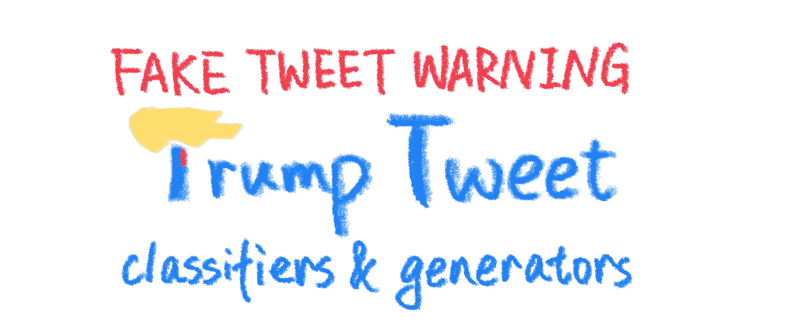
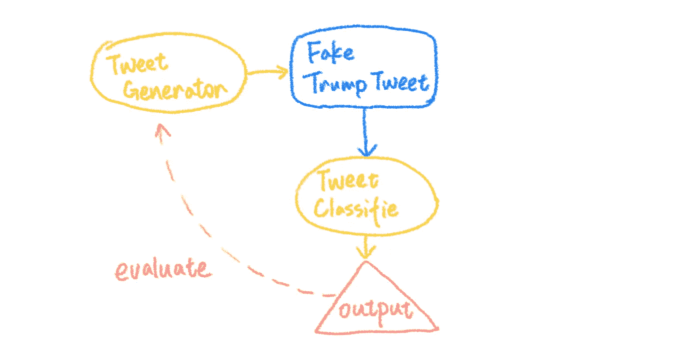
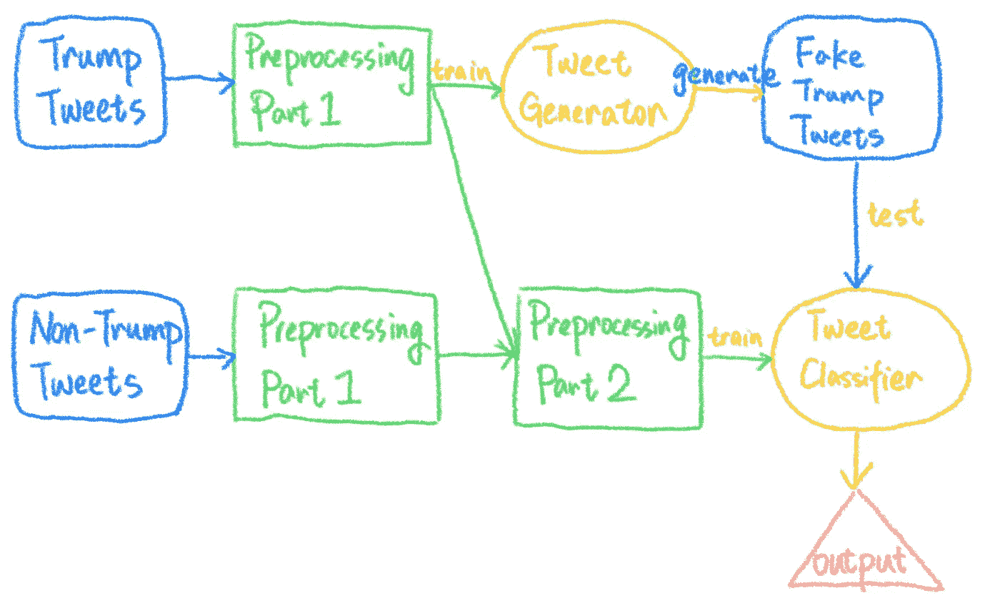
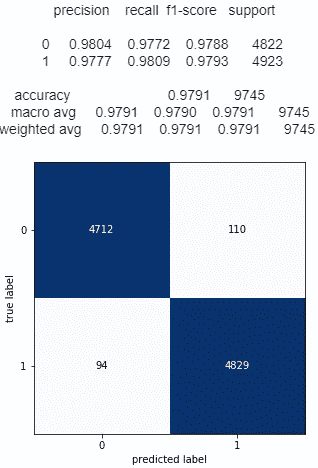
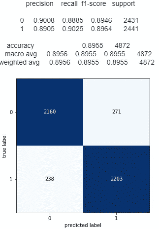
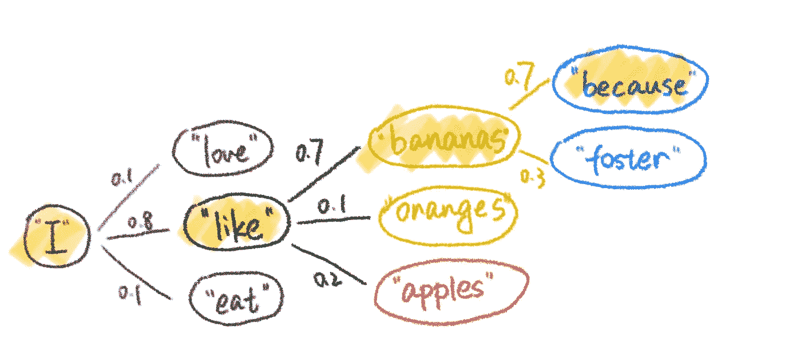

# 特朗普推文—特朗普推文分类器和生成器

> 原文：<https://medium.com/analytics-vidhya/trumpy-tweets-trump-tweet-classifiers-and-generators-9ccfddc7764e?source=collection_archive---------10----------------------->



# 摘要

*   使用特朗普的大约 24k 条推文来训练特朗普推文生成器。
*   增加了来自奥巴马、希拉里和金·卡戴珊的另外 24k 条推文来训练推文分类器。
*   比较不同分类器的性能，使用性能更好的分类器来评估推文生成器的性能，并挑选出最“特朗普式”的虚假推文。

# 动机

我是特雷弗·诺亚主持的每日秀的粉丝，我喜欢看他模仿川普。他的节目提醒我，特朗普有一种非常独特的说话方式——这有望被 NLP 模型识别和模仿。此外，特朗普如此沉迷于 Twitter，以至于它为我提供了大量数据来训练我的机器人。

# 计划

我计划建立两个推文生成器和两个推文分类器，并使用性能更好的分类器来评估生成器的性能，并选择最“特朗普式”的推文。



这个计划

我计划尝试传统的统计方法和现代的神经网络方法。因此，对于分类器，我将训练一个多项式朴素贝叶斯模型和一个长短期记忆(LSTM)模型；对于生成器，我将训练一个马尔可夫链模型和一个 LSTM 模型。

## 分类者

*   多项式朴素贝叶斯
*   LSTM

## 发电机

*   马尔可夫链模型
*   LSTM

# 数据

## 特朗普的推文

Twitter API 有许多限制——它只能访问用户的最后 3200 条推文，但布伦丹·布朗(Brendan Brown)创建了一个名为“[特朗普 Twitter Archive](http://www.trumptwitterarchive.com) ”的伟大网站，收集了几乎所有特朗普的推文。所以我使用这个档案来获取特朗普的推文数据。原始的。csv 文件包含在这个项目的 GitHub repo[此处添加链接]的数据文件夹中，但确定的来源是[布朗的 GitHub 资源库。](https://github.com/bpb27/trump_tweet_data_archive)

## 其他人的推文

为了训练一个可以对特朗普和非特朗普推文进行分类的分类器，我需要一些非特朗普的数据。这个 [Kaggle 数据集](https://www.kaggle.com/speckledpingu/RawTwitterFeeds/data)收集了几位政治家和名人的推文。在这个项目中，我将奥巴马、希拉里和金·卡戴珊的推文作为“非特朗普”推文。

# 数据预处理

我做了两个层次的数据预处理:1)对所有推文的基本清理，2)对训练分类器的进一步预处理。之所以分两步完成，是因为我希望分类器学习的数据与生成器学习的数据略有不同。例如，对于生成器，我想保留@提及、#标签和特殊字符(比如！？,.)在我们的数据集中，因为我们确实希望我们的机器人能够@提及、#标记或使用感叹号。然而，像@、#和特殊字符这样的东西给标记化带来了很多困难，所以我需要在训练分类器之前删除它们。



数据预处理有两个部分。

## 数据预处理第 1 部分

首先，删除所有转发。这样，特朗普发了 24595 条推文，奥巴马、希拉里和金·卡戴珊发了 24127 条推文。

然后我从 tweets 中删除了引用、URL、' n's，并用' and '替换了' &amp '。

```
def clean_tweet(t):
    # remove quotes
    t = re.sub(r'"@.*', '', t)
    t = re.sub(r'^“.*”$', '', t) # remove URLs
    t = re.sub(r'https*:\/\/\S*', '', t)
    t = re.sub(r'pic\.twitter\.com\/\S*', '', t) # remove \n
    t = re.sub('\n', ' ', t) # remove extra whitespaces
    t = re.sub(r'\s+', ' ', t) # replace '&amp' with 'and'
    t = re.sub('&amp;', 'and', t)    return(t)
```

上面清理的数据后来被用来训练发电机。

## 数据预处理第 2 部分

除了上面的清理，为了训练分类器，我们需要先去掉@和#这样的东西。

```
def prepare_tweet_clf(t):
    # clean
    t = t.lower()
    t = re.sub("'ll", ' will', t) # replace abbreviations
    t = re.sub("won't", 'will not', t)
    t = re.sub("n't", ' not', t) 
    t = re.sub(r'@[A-Za-z0-9_]+', '', t) # remove @mention
    t = re.sub(r'#[A-Za-z0-9_]+', '', t) # remove #tag
    t = re.sub(r'[^a-zA-Z ]', '', t) # remove special characters # remove stopwords 
    stop = set(stopwords.words('english')) 
    stop.update(['rt', 'cc']) 
    stop = stop - set(['no', 'not', 'never']) 
    t = [word for word in t.split(' ') if word not in stop] 
    t = ' '.join(t)

    return t
```

经过第二清洗步骤的数据用于训练分类器。

# 模型

本项目有两种模式:

1.  对特朗普的推文和其他人的推文进行分类的文本分类器
2.  生成特朗普风格的虚构推文的文本生成器

在测试集上具有最高预测准确度的分类器被认为是最佳分类器，并用于评估文本生成器。

# 推特分类器

## 分割数据

特朗普和其他人的推文首先被合并成一个数据集，然后数据集被随机拆分成一个训练集(80%)和一个测试集(20%)。

```
df_train, df_test = train_test_split(df_combine, test_size=0.2)x_train, y_train = df_train['cleaned_text_clf'], df_train['author']
x_test, y_test = df_test['cleaned_text_clf'], df_test['author']
```

## 公制的

分类器针对精度进行了优化，精度等于


在这种情况下，它可以写成


直观上，精确度是分类器不将虚假推文标记为特朗普的能力。

## 分类器 1 —多项式朴素贝叶斯

[多项式朴素贝叶斯分类器](https://scikit-learn.org/stable/modules/generated/sklearn.naive_bayes.MultinomialNB.html)适用于具有离散特征的分类，例如文本分类。

这个模型的流水线由三部分组成:用 CountVectorizer()矢量化，用 TfidfTransformer()转换，用 MultinomialNB()建模。我使用 10 重交叉验证网格搜索来优化参数，模型的最佳超参数集是:使用一元、二元和三元模型；使用原始计数代替 tf-idf，并使用 0.1 的平滑系数。

该模型在训练集上进行训练，并使用数据集的其余部分评估其性能。正如下面的混淆矩阵所示，多项式朴素贝叶斯分类器令人印象深刻——它的精度大约是 **0.9791** 。



多项式朴素贝叶斯分类器的混淆矩阵

## 分类器 2 — LSTM

第二个分类器基于 LSTM。长短期记忆(LSTM)是一种具有反馈网络的递归神经网络(RNN)架构。它被开发来处理在训练传统的 RNNs 时可能遇到的爆炸和消失梯度问题。作为 RNN 的变体，LSTM 非常适合对序列数据进行分类、处理和预测。

该项目中实现的模型有两个双向 LSTM 层、两个密集层和一个输出层。这个模型的灵感来自 Manash Pratim Barman 发明的[仇恨推特探测器](https://github.com/manashpratim/Tweet-Classification)。

我使用来自手套的 [Twitter 预训练单词嵌入对令牌进行矢量化(200d 个向量)，并对模型进行 20 个时期的训练。](https://nlp.stanford.edu/projects/glove/)



LSTM 分类器的混淆矩阵

LSTM 模型在测试集上获得了 0.8955 的准确率，这还不错。但是由于多项式朴素贝叶斯分类器获得了更高的准确性，我将使用它来评估 tweet 生成器的性能。

## 模型比较

对于给定的任务和数据集，多项式朴素贝叶斯分类器优于 LSTM 分类器。我认为这是因为文本分类是一项相对简单的任务，我们的数据集不够大，所以像 LSTM 这样的复杂模型可能会过度拟合。换句话说，如果我们有更多的数据，LSTM 的表现可能会更好。

# Tweet 生成器

## 生成器 1 —马尔可夫链模型

马尔可夫链基于这样的思想:可能的下一个状态完全依赖于当前状态。基于这个想法，我们可以训练一个马尔可夫链模型来学习这样的事情:你在“喜欢”之后找到“香蕉”/“橙子”/“苹果”的可能性有多大。



马尔可夫链的例子

换句话说，在生成文本时，我们随机选择第一个单词，然后在概率基础上连续选择“下一个单词”。

对于第一个 tweet 生成器，我使用了一个名为 [Markovify](https://github.com/jsvine/markovify) 的包。它是一个基于马尔可夫链的文本生成器包，由 Jeremy Singer-Vine 开发。它为用户提供了设置`state_size`(一元/二元/三元)和使用词性(POS)标记的选项。

训练三个模型:二元模型基线模型、三元模型基线模型和三元模型+位置模型基线模型。然后，我分别用这三个模型生成了 1000 条推文，并根据它们的推文欺骗之前训练的分类器的程度来评估它们的性能。

**二元马尔可夫链模型:**推文愚弄分类器的比例为 0.93。也就是说，在生成的 1000 条虚假推文中，有 930 条推文被我们的多项分类器归类为“特朗普的”。最‘特朗普式’的推文(概率= 0.9999)是:

> 从一大批军用武器和供给品到我在苏格兰 Trump 国际高尔夫球场的会员！

具有 75%的“特朗普”概率(概率= 0.98)的推文是:

> 看，应该为使用名人的名字感到羞耻，然后是新冠军克里斯·韦德曼！

“特朗普”推文的中位数(概率=0.94)是:

> #辩论。美国有胆量承受更高的失业率。

**Trigram 马尔可夫链模型:**Trigram 生成器生成的 tweets 欺骗了我们的分类器的比例为 0.946。我们收到的最“特朗普式”的推文(概率= 0.9999)是:

> 由 13 名愤怒的民主党人和其他完全腐败和/或矛盾的人领导的操纵政治迫害。

第 75 百分位的“特朗普”推文(概率= 0.99):

> 谢谢你，这是一个非常明智的举动，但特德·克鲁兹忘记提交了。

中值推文(概率= 0.96):

> 与此同时，他们继续被它所吸引。

**Trigram + POS 马尔可夫链模型:**对于这个生成器，tweets 愚弄我们的分类器的比例是 0.947。最‘特朗普式’的推文(概率= 0.9999)是:

> 我们想要胜利..苏格兰特朗普国际高尔夫球场。

第 75 百分位的“特朗普”推文(概率= 0.99):

> 我会轻而易举地击败希拉里，但林赛·格雷厄姆说我不会在这里呆太久了，这叫嫉妒。

中值推文(概率= 0.95):

> 。代表整个国家，感谢你今天的更新和伟大的工作！

——看起来更复杂的模型在欺骗分类器方面做得(稍微)更好，我们得到的虚假推文甚至对“中值特朗普”的推文也很好。

## LSTM

在这一部分，我使用了 Max Woolf 开发的 [textgenrnn](https://github.com/minimaxir/textgenrnn) 包来构建生成器。textgenrnn 是一个基于 Keras/TensorFlow 的 Python 3 模块，用于创建 char-rnn，它可以在字符级或单词级生成文本。

与前面的模型类似，我用每个生成器生成了 1000 条 tweets，并计算它们愚弄分类器的成功率。这是推特——

**人物级 LSTM 模型:**推文愚弄我们分类器的比例是 0.985。最‘特朗普式’的推文(概率= 0.99999)是:

> 。@marklevinshow 访谈讨论名人学徒和歪希拉里只会在世界上出生。我将是《纽约时报》上拥有仇恨者和真相的最佳人选——刚刚报道说我是唯一一个被假新闻媒体报道的人

第 75 百分位的“特朗普”推文(概率= 0.99595):

> 我的@SquawkCNBC 采访讨论了美利坚合众国的董事会会议室，这将是一个很好的事实，即中国将永远是世界上最伟大的，所有其他人，准备好迎接胜利者吧！

中值推文(概率= 0.97986):

> 一个必须花费的记录和积极的过程爱德华总统奥巴马在一个失败的政策中所做的悲惨交易@SecretaryZinkens 将是一个伟大的家伙，在美国军队的领域将是美国人民和 Stoc 受害者的耻辱

**词级 LSTM 模型:**推文愚弄我们分类器的比例是#。最“特朗普式”的推文(概率= 0.99996)是:

> 假新闻媒体拒绝为 cnn 报道我的大新闻。我很荣幸能在亚利桑那号上发言。谢谢大家！#特朗普 2016

第 75 百分位的“特朗普”推文(概率= 0.97720):

> “我非常尊重代表美国医疗保险的人们。还记得伟大的总统吗？他是个好人！

中值推文(概率= 0.89935):

> 。@ hillaryclinton 上了伊利诺斯报的头版。。。但是要写 a，因为这应该是墨西哥的经济失败。问题 12。你们两个都是。

## 模型比较

通过阅读生成的推文，我认为马尔可夫链模型和 LSTM 模型在模仿川普的推文方面做得很好。他们愚弄分类器的表现证实了我的观察——至少 93%的推文愚弄了分类器。尽管根据我的个人判断，马尔可夫链和 LSTM 生成的推文都很不错，但 LSTM 生成器似乎更擅长欺骗分类器——它有更高比例的推文成功欺骗了分类器。

我认为这可能是因为马尔可夫链模型在预测下一个令牌时只考虑当前令牌，这往往会导致上下文的丢失(换句话说，马尔可夫链模型是“无记忆的”)。另一方面，LSTM 模型特别擅长长时间记忆信息。这种行为可能使 LSTM 模型在这个任务上胜过马尔可夫链模型。

# 未来计划

*   润色输出的句子，例如拼写纠正、必要时的大写和标点符号纠正。
*   使用生成对抗网络来提高文本生成器和文本分类器的性能

# 笔记

这个包的所有数据和代码都可以在这个 [GitHub repo](https://github.com/SUN-Wenjun/Trump_Tweet_Generator) 和这个[笔记本](https://github.com/SUN-Wenjun/Trump_Tweet_Generator/blob/master/trumpy_tweet.ipynb)上找到。