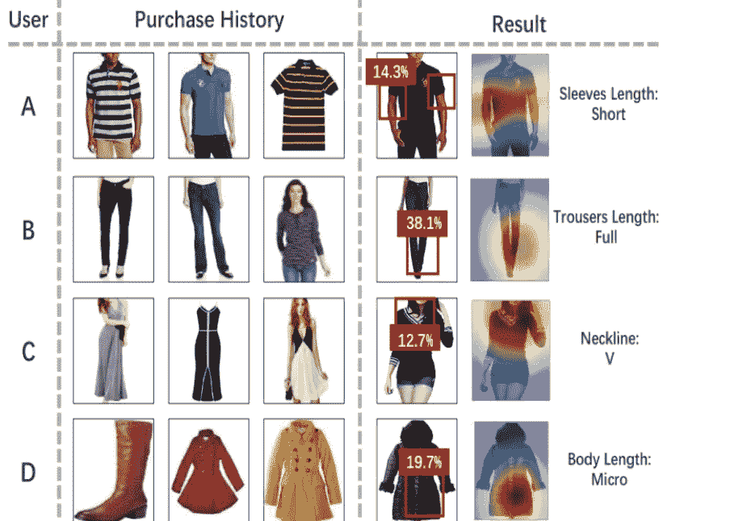

# 推荐系统中的信任:综述

> 原文：<https://medium.com/analytics-vidhya/trust-in-recommender-systems-a-survey-c2b4c350ee6?source=collection_archive---------13----------------------->

信任:人工智能/人工智能未来的关键因素

这是一个关于信任作为推荐系统衡量标准的深度学习视角。

论文:-[https://arxiv.org/pdf/2004.03774.pdf](https://arxiv.org/pdf/2004.03774.pdf)

随着人工智能越来越受欢迎，世界上的各种服务都将严重依赖人工智能，尤其是推荐系统。

推荐系统已经在许多地方有了自己的方式，如网飞推荐电影，亚马逊推荐产品，谷歌推荐新闻，脸书推荐朋友系统，Instagram 推荐影响者或最受欢迎的 Youtube 推荐视频。

由 [Clarisse Croset](https://unsplash.com/@herfrenchness?utm_source=medium&utm_medium=referral) 在 [Unsplash](https://unsplash.com?utm_source=medium&utm_medium=referral) 上拍摄的照片

很明显，这种推荐系统正在进入我们生活的几乎所有方面，这就带来了一个很大的问题:我们应该在多大程度上信任推荐者？

我们将关注推荐系统的 3 个方面，它们可以帮助我们决定对该系统的信任度:

1.  社交意识:推荐系统如何利用一个人及其同伴的社交行为。
2.  *鲁棒性:推荐系统如何能够排除数据产生的噪声*
3.  *可解释性:如果最终用户理解了导致特定推荐的因素*

让我们详细研究一下这些方法

# 社交感知推荐系统

*利用用户信任、用户偏好和用户信任的邻居*

*   协同过滤最好的例子，简单优雅的推荐方式。你朋友圈其他人对产品的评价。
*   基于自动编码器的方法，神经网络模型有助于学习用户和用户选择的潜在因素，这些因素不容易观察到
*   基于 RNN 的模型处理序列和时间序列数据。一般来说，捕捉用户当前的偏好。基于用户的在线状态和在线活动。脸书使用这种方法
*   基于 GNN 的模型，挖掘社会图结构。这是一个相当复杂的程序。在该方法中，用户历史、用户邻居历史及其邻居历史等被聚集。并且喜欢和不喜欢被存储。并且基于该数据产生推荐。这个 GNN 总是在进步。谷歌，脸书使用这种技术。
*   混合方法，所有上述方法并行使用，并创建了一个通用的推荐系统。

# 推荐系统的鲁棒性

伯纳德·赫曼特在 [Unsplash](https://unsplash.com?utm_source=medium&utm_medium=referral) 上的照片

推荐系统容易受到[先令攻击](https://journals.plos.org/plosone/article?id=10.1371/journal.pone.0196533)或[噪音](https://link.springer.com/chapter/10.1007/978-3-319-49001-4_1)

***商家可能会雇佣一群垃圾邮件发送者将他们的个人资料和虚假评级插入系统，这将影响推荐的性能，也会影响客户对推荐系统的信任***

如果这些攻击可以被系统检测到，并且噪声被忽略，则推荐可以被称为“值得信任的”

这方面有许多方法和各种研究。

*   先令攻击检测算法

一种可以发现个人攻击或协作攻击的系统，在这两种检测模型中，都有时间序列数据，以查看信息的真实性以及信息的类型/内容。基于此，使用了许多不同的分类模型。

此外，还有一种无人监管的方式来检测先令攻击。我们将用户分组并排除可疑用户。

*   基于深度学习的先令攻击检测算法

一些模型利用深度卷积网络来检测这些攻击。递归神经网络。这些模型试图对恶意评论和噪音进行自动分类。

# **可解释的推荐系统**

与其他个性化推荐算法不同，可解释的推荐系统提供了系统为什么向用户提供这样的推荐的原因，并且还为系统设计者提供了改进推荐结果的指导。

它不仅提高了推荐系统的有效性和用户满意度，而且使系统能够生成可信的推荐。

这些是最近提出的一些方法

1.  解释协同过滤；

每当有基于各种因素的推荐时，我们的推荐器模型应该用一些例子来解释为什么要进行特定的推荐。

每一个建议都有关于这个建议是基于什么的

2.解释文本数据:

每当一个网站被推荐给一个人，基于他的新闻搜索和过去喜欢的话题。一个推荐系统也应该建议一些关于是什么让它推荐那个特定页面的指示。

解释引用的文件类型和导致具体建议的词语

3.解释视觉数据:

这是时尚界在这个时间点使用最多的推荐模型。增加对系统信任的更好方法是，推荐系统应该给出是什么让它推荐特定产品的模型。

用一组例子解释得出建议所用的方法

有一种特殊类型的推荐系统，它使用文本数据、图像数据和协同过滤。解释这样一个模型是一项艰巨的任务。但本文作者提出的一些建议如下。

CNN +文字说明求推荐

结论

我们讨论了在推荐系统中建立信任的各种技术。随着人工智能和机器学习的进步。这些系统的可靠性将是一个关键因素。这篇论文是迈向未来的一步。