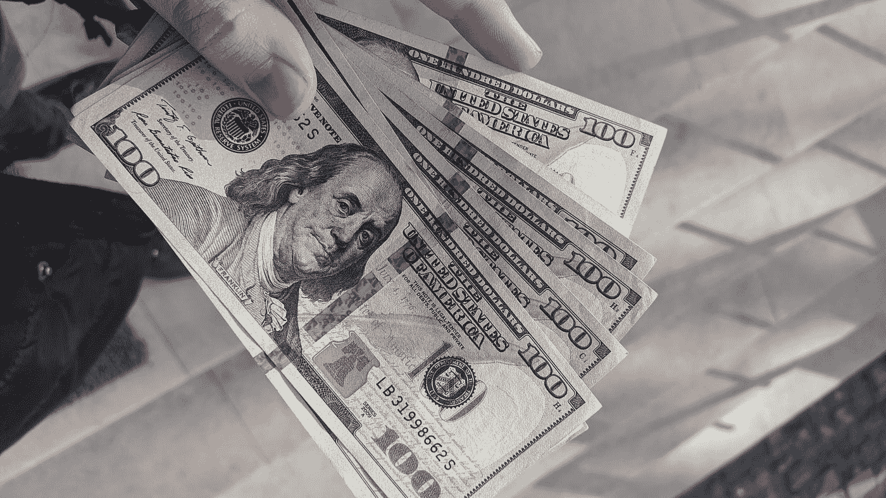
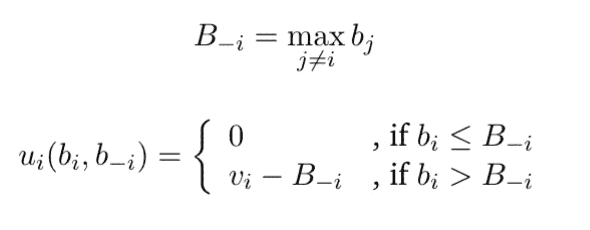
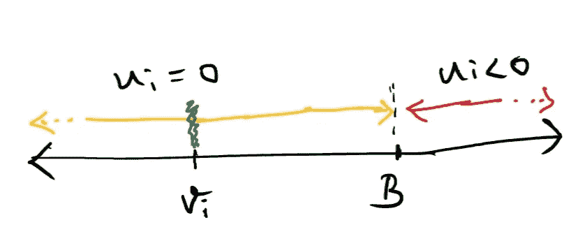
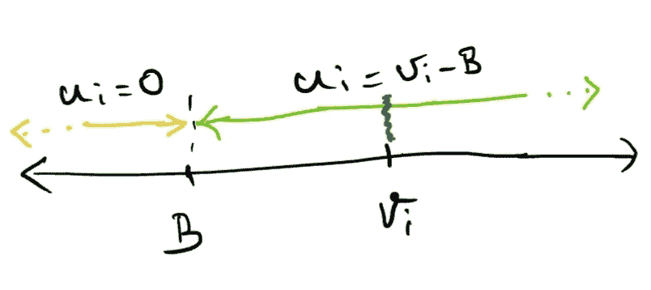

# 真实拍卖(维克瑞的拍卖)

> 原文：<https://medium.com/analytics-vidhya/truthful-auctions-vickreys-auction-96d49ce9cc4d?source=collection_archive---------37----------------------->

我需要钱。谢天谢地，我有一块古董表，可以卖掉赚点钱。因此，我呼吁拍卖，并邀请所有潜在买家出价(可互换地称为玩家、个人、投标人)。

弗雷德里克·沃伦在 [Unsplash](https://unsplash.com?utm_source=medium&utm_medium=referral) 上的照片

我现在有很多想法…

我没有资源把大家拉到一个共同的地方进行拍卖。因此，我使用了一种[密封投标拍卖](https://www.investopedia.com/terms/s/sealed-bid-auction.asp#:~:text=A%20sealed%2Dbid%20auction%20is,placed%20in%20a%20sealed%20envelope.)的形式，我要求参与者通过密封邮件提交他们的投标。不像在拍卖室里拍卖过程中可以喊多个出价，每个参与者只能通过邮件发送一个出价。

我非常想从拍卖中赚很多钱。但是，这只古董表对我来说非常珍贵，我想把它送给最珍惜它的人，这样我就可以放心，它会得到珍惜和良好的维护。

但是，我怎样才能发现谁最重视它呢？在拍卖中，人们会根据他们对物品的估价诚实地出价吗？

萨姆可能把我的手表估价为 800 美元，但也可能被诱惑出价 700 美元来买到真正的便宜货，因为他认为没有人会出价 700 美元。
另一方面，杰克可能将我的手表估价为 750 美元，但认为竞争将会很激烈，保守地出价 730 美元，并有机会击败原本更看重我的手表的山姆赢得拍卖。

就像上面的例子一样，如果参与者担心竞争对手会出价，并过多地参与战略制定，我就很难真正找出谁最重视它了，怎么办？这些参与者毕竟是自私的！他们为什么要配合我的愿望呢？

别担心。有**办法让投标人老实做人**！

在我们进入方法/环境之前，让我们温和地将手头的问题正式化。

我有一件不可分割的物品正在被拍卖。有 *n* 个投标人，(1，2，..n)并且每个投标人 *i* 都有一个私人估价 *vᵢ* ，这是他愿意为该项目支付的最高金额。最后，一个人 *i* 的效用(或快乐)用 *uᵢ* 表示。

不严格地说，如果这个人没有得到这个对象，他的效用是 0，如果他得到了这个对象，他的效用就是他的估价减去他要为它付出的代价。

例如，如果杰克把手表估价为 750 美元，赢得了拍卖，并支付了 730 美元，他的效用(或幸福)是 20 美元。

这里是拍卖形式，将使投标人诚实行事！

每个人 *i* 提交该物品的密封投标 *bᵢ* 。然后，所有的出价同时开启，物品被授予出价最高的人。现在，**的诀窍是，赢家必须支付最高失败出价**(第二高出价)的价值，而不是他自己的出价。所有其他人没有得到该项目，也不需要支付任何费用。

这种被称为“第二价格拍卖”的机制偏离了众所周知的正常拍卖形式，即最高出价者赢得物品并支付与其出价相等的金额，也就是第一价格拍卖。

在我们的“第二价格拍卖”中，效用 *uᵢ* 可以定义如下。

对于一个人 *i* ，我们将 *b₋ᵢ* 定义为除了 *i* 之外的所有出价人的出价配置文件，*t15 将 *B₋ᵢ* 定义为其他玩家出价中的最高出价，如果 *i* 作为最高出价人赢得拍卖，这就是他必须支付的费用。*

解释上面的截图/片段，对于一个玩家 *i，* 如果他在拍卖中失败，即他的出价 *bᵢ* 小于 *B₋ᵢ* ， *h* 是效用 uᵢ是 0，如果他在拍卖中获胜，即 *bᵢ* 是所有出价中最大的出价，他的效用等于 *vᵢ -B₋ᵢ* 。请注意， *vᵢ -B₋ᵢ* 是他对该物品的真实内在估价减去他必须支付的价格( *B₋ᵢ* 成为最高的松散出价)。

请注意，一个人的出价只对确定拍卖的获胜者有用，而在获胜后，效用与他的出价 *bᵢ* 无关，重要的只是他的真实评价 *vᵢ* 。

虽然实际的效用只有在拍卖结果公布后才能知道(谁赢得了物品，他为物品付了多少钱)，但所有的玩家都知道，这就是最终每个人的效用是如何确定的。

**主张的是，在这种拍卖形式下，每个人如实出价是有好处的，即 *bᵢ = vᵢ* ，为了自己的私利**，即最大化自己的效用 *uᵢ* 。

为了分析玩家 *i* 的选择，让我们把所有其他玩家的任意出价集合固定为 *b₋ᵢ* ，这也固定了 *B₋ᵢ。*

我们来看看玩家 *i* 的真实估价 *vᵢ* 的两种可能情况，看看每种情况下他的叫牌 *bᵢ* 能是多少。

**案例一:*v****ᵢ****≤b₋ᵢ***(*我*不是最看重对象的那个)

如果出价 *bᵢ = vᵢ* ，效用 *uᵢ = 0，*他就失去了拍卖。对于任何其他的 *bᵢ'* ，他的效用是 0 或者负的，因为他失去了拍卖，或者赢得了拍卖并且支付了比他愿意支付的更多的钱。
因此，对玩家 *i* 来说，对他的真实估价 *vᵢ* 出价和其他出价一样好。

**案例二:*v****ᵢ****>b₋ᵢ***(*I*是最看重对象的人)

如果出价 *bᵢ = vᵢ* ，效用
*uᵢ = vᵢ - B₋ᵢ* ，则他赢得拍卖，并在其他玩家的出价中支付最高，即最高的失败出价。对于任何其他出价 *bᵢ'* ，效用是
*max(0，vᵢ -B)* ，因为他要么失去拍卖，要么赢得并支付低于他的估价/出价的次高出价。
因此，对于玩家 *i* 来说，对他的真实估价 *vᵢ* 出价和任何其他出价一样好。

**两起案件结束。**

很明显，在这两种情况下，当出价处于“深绿色点”时，即处于真实估值 *vᵢ* 时，它的效用与任何其他点一样高/好。

因此，玩家 *i* 对其真实估价出价的策略是一种“弱优势策略”,因为不管其他玩家的策略或估价如何，它至少与其他任何策略一样好。

由于所有这些分析都是针对任意玩家 *i* 进行的，它同时适用于所有玩家，因此所有玩家(出于他们的自私利益)最好如实地对该物品的实际估价进行出价。这样一个所有玩家的弱优势策略集合就是一个**‘弱优势策略均衡’**，一个无论别人怎么做，都没有玩家愿意偏离自己行动/策略的状态。

因此，我很确定我把我的古董表送给了最珍视它的人。1961 年，威廉·维克瑞提出并解释了“第二价格拍卖”机制及其均衡，这是博弈论和机制设计的基石。

敏锐的观察者可能会注意到我们掩盖了一些重要的问题。

1.  对真实估价进行投标是一种弱优势策略。但是，有没有另一个策略和这个一样好呢？
2.  为了把它送给最珍视我的古董表的人，我投入了大量的精力，并设计了一个机制，让每个人都能发现真相。但是，我是否有可能在拍卖中失去我的收入(由获胜者支付)？(毕竟，我是在让获胜者支付第二高的出价，而不是他自己的出价)
3.  如果我有多个待售物品，上述原则会失效吗？

对上述所有问题的简短回答是“不”。让我们在未来的帖子中看看其中的一些。

**参考文献:**

1.  反投机、拍卖和竞争性密封投标，1961 年，威廉·维克瑞。