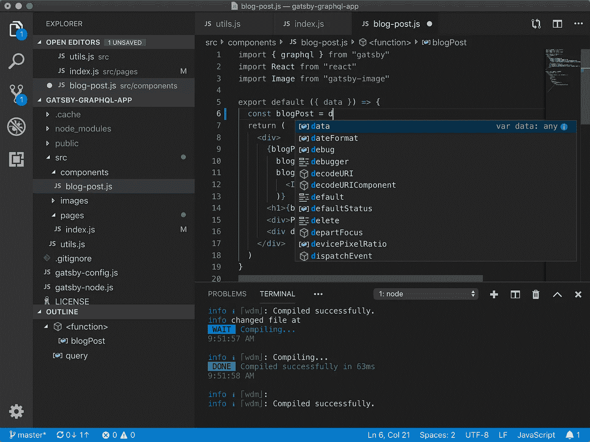

# 尝试新的 Vs 代码特性以提高生产力

> 原文：<https://medium.com/analytics-vidhya/try-out-new-vs-code-features-for-improved-productivity-29d3969ad872?source=collection_archive---------3----------------------->

## VSCODE 工作区，选项卡，调试

## VS 代码是许多程序员最常用和最喜欢的 IDE

Vs 代码编辑器: [VsCode GitHub](https://github.com/microsoft/vscode)

[Visual Studio 代码](https://github.com/microsoft/vscode)结合了代码编辑器的简单性和开发人员核心编辑-构建-调试周期的需要。它提供了全面的代码编辑、导航和…