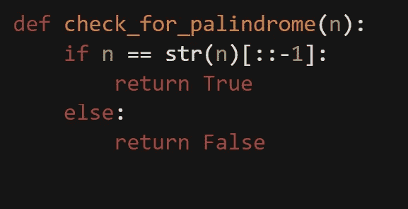

# 尝试欧拉项目

> 原文：<https://medium.com/analytics-vidhya/trying-project-euler-b5dc3383ffaf?source=collection_archive---------9----------------------->

## 使用 Python 解决复杂的数学问题

## 关于欧拉项目:

欧拉项目是一系列具有挑战性的数学/计算机编程问题，解决这些问题需要的不仅仅是数学洞察力。它创建于 2001 年，是另一个问题解决网站[mathschallenge.net](http://mathschallenge.net)的子网站。每周增加一次新问题，大多数新问题是由 PE 社区的成员提出的。欧拉项目的目标是为人们提供一个保持和提高他们在数学、编程和解决问题方面的技能的机会。截至 2019 年 11 月 21 日，网站待解决问题共计 689 个。

## 从问题开始:

我决定按照从最难到最难的顺序检查问题(PE 给每个问题分配一个“难度等级”)。这将允许我构建每个成功完成的问题，并使更复杂的问题变得更容易管理。

## 问题 1:

为了解决这个问题，我在 for 循环中使用了 if 语句。这是一个非常简单的解决方案。

233,168

## 问题二:

这个问题肯定比问题 1 难。幸运的是，我最近学习了 Python 中的递归，其中一个例子是计算斐波那契数列。

下面是计算第 n 项值的代码:

我制作了一个新的 python 模块来保存我需要创建来解决 PE 问题的所有计算，并将 Fibonacci 函数放在这个新模块中。然后，我用 Fibonacci 函数导入模块，这样我可以保持我的解决方案代码干净。

4,613,732

## 问题三:

这是第一个真正给我带来麻烦的。为了解决这个问题，我必须找出一种方法来检查一个数是否是质数，然后检查这个数是否是 600851475143 的因子。这要求模块中有两个独立的函数，一个检查给定的数是否是质数，另一个检查所有可能的因子。

这是两个功能:`isprime`检查所有可能使一个数不是质数的条件，而 max_prime_factor 遍历一系列可能的因子，并将这些数推入`isprime`函数。如果一个数是质数，并且是给定数的一个因子，`max_prime_factor`函数会将该数设置为最大质数的返回值。由于迭代按升序进行，这意味着最后找到的质因数将具有最大值。在这种情况下，600851475143 的最大素数因子是 6857。

## 问题 4:

到目前为止，这个问题无疑是最难的。为了解决这个问题，我不得不使用嵌套的 for 循环。起初，我认为我可以向后迭代，只取第一个解。不幸的是，我无法让这种方法奏效。最后，我正常迭代并创建了一个变量，该变量将被赋给找到的最高回文。

在 check_for_palindrome 函数中，我必须将输入(一个整数)转换成一个字符串。然后，我将结果与它的反面进行了比较。如果字符串与其反向字符串匹配，那么函数返回 true。

## 问题 5:

这个问题有一个非常简单的解决方案:对于从 2520 开始的每个数字，检查它是否能被 1 到 20 之间的所有数字整除。

## 问题 14:

从现在开始，我将只强调那些特别困难或有趣的问题。

问题 14 很有趣，因为它需要一个新的函数来计算序列。

这需要一些稍微有创意的循环，但总的来说，这个函数并不难构建。一旦构建了函数，我所要做的就是将函数插入到一个循环中，以迭代一百万以下的所有值。

## 问题 17:

问题 17 提出了一个有趣的挑战。最快的解决方案需要我找到一个系统来编码一个给定的数字，然后遍历所有可能的数字，找到字母的总数。

在这个代码片段中，“S”是一个包含从“1”到“19”的字母数的列表，“D”包含从“10”到“90”的 10 的倍数的字母数，“H”代表“100”，“T”代表“1000”弄清楚编码后，只需要一个简单的 for 循环和一些条件语句来计算答案。

起初，我有一个更复杂的方法来计算总长度，虽然该方法有效，但需要几分钟才能运行，所以显然我需要一个更简化的解决方案。

# 结论:

到目前为止，欧拉项目已经对我的编程和数学技能提出了一些挑战。虽然没有一个问题花了我太多的时间来解决，但每个问题都提出了一系列需要创造性解决的新问题。PE 是一个非常好的工具来保持你的编程技能，它甚至已经教会了我一些好的新技术。当我继续解决问题的时候，我会补充这一点。