# Python 中使用不可观测组件模型的时间序列分析

> 原文：<https://medium.com/analytics-vidhya/tsa-ucm-python-5fde69d42e28?source=collection_archive---------1----------------------->

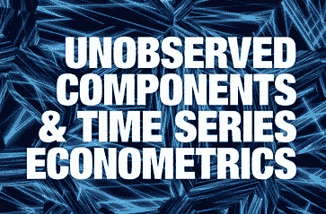

嘿，统计学家和时间序列狂热者们！以下是我对未观察组件模型的看法。快乐阅读！

什么是 UCM？

未观测成分模型(UCM) (Harvey (1989))将时间序列分解为趋势、季节、周期等成分，以及预测序列的回归效应。

**从这篇文章中可以期待什么？**

在一篇有影响力的文章中，Harvey 和 Jaeger (1993)描述了使用未观察到的成分模型(也称为“结构时间序列模型”)来推导商业周期的程式化事实。特别是，他们认为使用不可观测成分方法比流行的霍德里克-普雷斯科特滤波器或博克斯-詹金斯 ARIMA 建模技术更能满足这些目标。受哈维和耶格的启发，我考虑了以下时间序列:

*   美国实际国民生产总值，“产出”，( [GNPC96](https://research.stlouisfed.org/fred2/series/GNPC96) )
*   美国 GNP 隐性价格缩减指数，“价格”，( [GNPDEF](https://research.stlouisfed.org/fred2/series/GNPDEF) )

原始论文中的时间框架在不同系列中有所不同，但大体上是 1954-1989 年。下面我使用了 1970-2020 年期间的所有数据。尽管未观测成分方法允许在模型中分离出季节性成分，但本文中考虑的序列和这里的序列已经进行了季节性调整。此处考虑的所有数据系列均取自[美联储经济数据(FRED)](https://research.stlouisfed.org/fred2/) 。很方便，Python 库 [Pandas](https://pandas.pydata.org/) 可以直接从 FRED 那里下载数据。

您可以深入了解 UCM 背后的理论，以及 UCM 在真实世界数据中的实际应用。

小心前进！(附——没那么难，相信自己)

## 获取数据

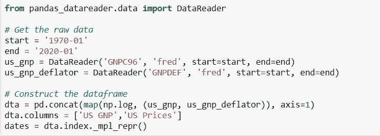

数据看起来是这样的:

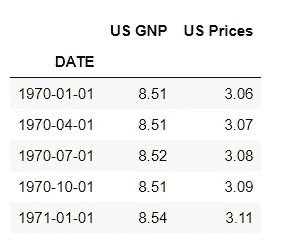

5 行数据

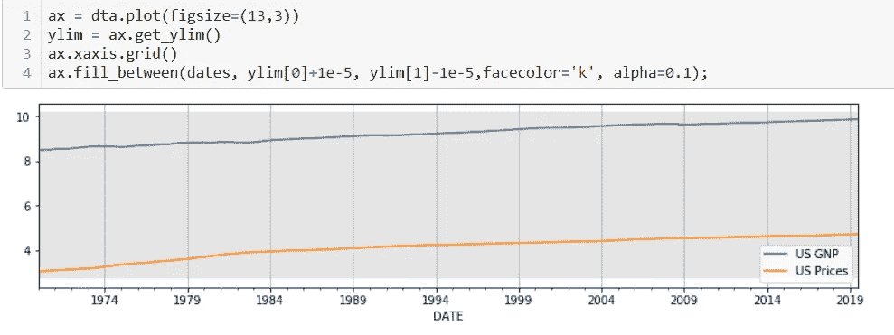

# 关于模型-

好吧，这就是你在这里的原因！

现在我们知道:反应时间序列=趋势、季节、周期和回归效应等成分的叠加…

模型中的每个组件都捕捉到了系列动力学的一些重要特征。模型中的组件有它们的概率模型。概率组件模型包括有意义的确定性模式作为特例。

这是广义模型的样子:

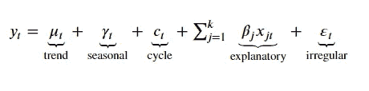

# 组件-

> **趋势** *-*

趋势组件是回归模型的动态扩展，包括截距和线性时间趋势。

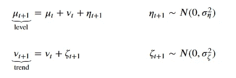

其中水平是截距项的概括，其可以随时间动态变化，趋势是时间趋势的概括，使得斜率可以随时间动态变化。对于两种元素(水平和趋势)，我们可以考虑以下模型:

该元素是包含的还是排除的(如果包含趋势，还必须包含一个级别)。该元素是确定性的而非随机性的(即误差项的方差是否被限制为零)

趋势被宽泛地定义为在没有任何其他影响变量的情况下，序列在一段时间内增加或减少或保持不变的自然趋势。UCM 可以用两种方式模拟趋势；第一个是随机行走模型，意味着趋势在系列的时间段内大致保持不变，第二个是具有向上或向下斜率的局部线性趋势。

> 特殊情况-

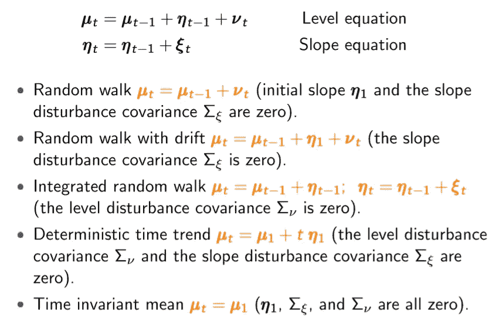

> 示例-

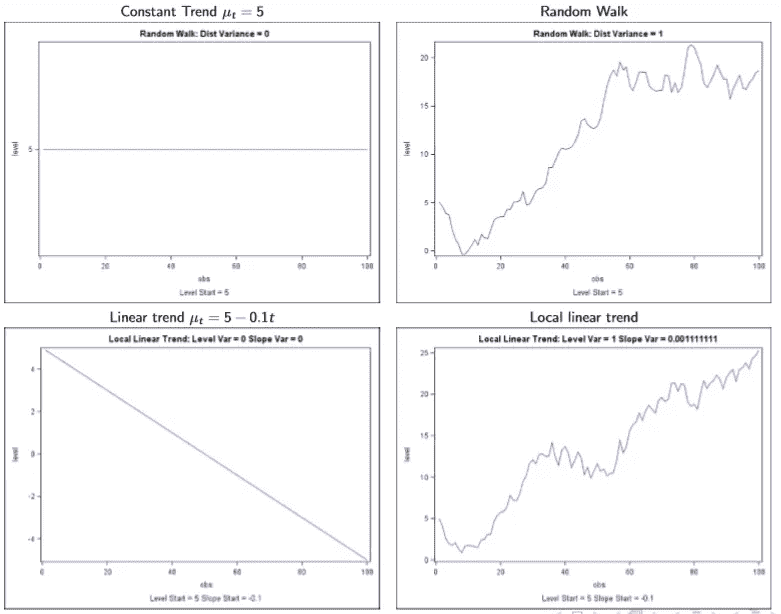

> **季节性** *-*

季节性成分写为:

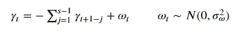

周期性(季节数)是 s，定义特征是(没有误差项)，在一个完整的周期内，季节分量的总和为零。误差项的引入使得季节效应随时间而变化。如果季节效应是随机的，那么就有一个额外的参数需要通过 MLE(误差项的方差)来估计。

当存在受季节因素影响的一致的变化模式时(例如，一年中的一个季度，或一周中的某一天等)，就存在季节模式。).

> 季节模式的表示(周期)

1.  作为总和为零的 s 个数字的列表
2.  作为周期为 s、s/2、s/3、…的[s/2]确定性无阻尼周期的总和，称为谐波

这里，如果 s 是偶数，则[s/2] = s/2，如果 s 是奇数，则[s/2] = (s-1)/2。

例如:对于 s = 12，季节模式总是可以写成周期为 12、6、4、3、2.4 和 2 的六个周期的总和。

> 模型的变体-

1.  ***随机虚拟变量季节模型-*** 设一年中有 s 个季节，月度数据 s = 12，季度数据 s = 4，双年度数据 s = 2。考虑时间 t 的季节效应γt 的以下模型:

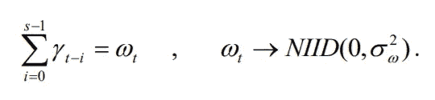

在该模型中，季节效应的总和具有零均值，尽管它们的随机性质允许它们随时间缓慢演变(当方差(sigma_w)较小时)或随时间快速演变(当方差较大时)。

***2。*-**确定性虚拟变量季节模型

在上述模型中方差为 0 的特殊情况下，我们有以下所谓的确定性虚拟变量季节模型。在这个模型中，季节效应-

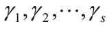

是固定的，不随时间变化，与前一种情况下的随机规格相反。在这种情况下，对正在分析的时间序列数据中季节性缺失的测试相当于对零假设的测试

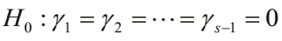

其中总和约束

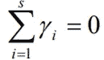

暗示着

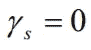

> 示例-

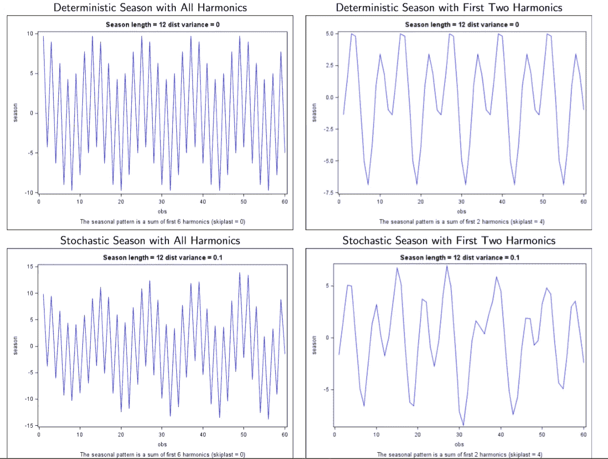

> **周期** *-*

周期性因素旨在捕捉比季节性因素长得多的时间范围内的周期性影响。例如，在经济学中，周期一词通常是用来描述商业周期的，预计周期在“1.5 至 12 年”之间。

该循环写为:

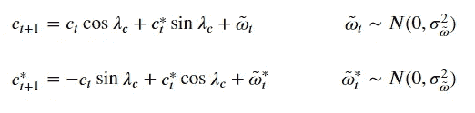

参数λc(循环频率)是 MLE 估计的附加参数。如果季节效应是随机的，那么还有另一个参数需要估计(误差项的方差——注意，这里的两个误差项共享相同的方差，但假设具有独立的绘制)。当数据表现出非固定周期的上升和下降时，时间序列数据中存在周期。这些波动的持续时间通常至少为两年。

> 模型的变体-

***1。确定性循环模型*** -让确定性循环具有频率

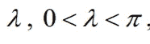

被写成

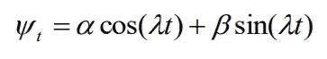

如果连续观察 t，这是一个周期函数

句号-

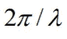

振幅-

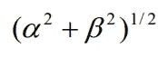

阶段-

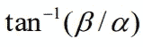

如果只在 t 的整数值上测量响应，那么它就不是精确周期性的，除非-

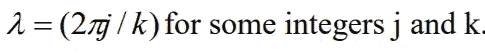

不幸的是，经济和商业时间序列数据的周期很少像任何一个确定性周期函数所描述的那样系统。

***2。随机循环模型*** -作为指定一个或多个确定性循环和引入大量参数的替代方案，可以指定一个随机循环模型，如-

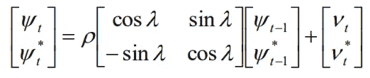

其中 0≤rho≤1 为阻尼因子，扰动 vt 和 vt*独立分布为 N(0，sigma_v)个随机变量。该模型可以捕捉经济和商业时间序列中相当复杂的周期模式，而无需引入大量的参数。若ρ<1, series has a stationary distribution with mean zero and variance -

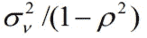

If rho=1, series is non-stationary. Of course, if variance (sigma_v²)=0, we revert to the deterministic cyclical model.

> Examples-

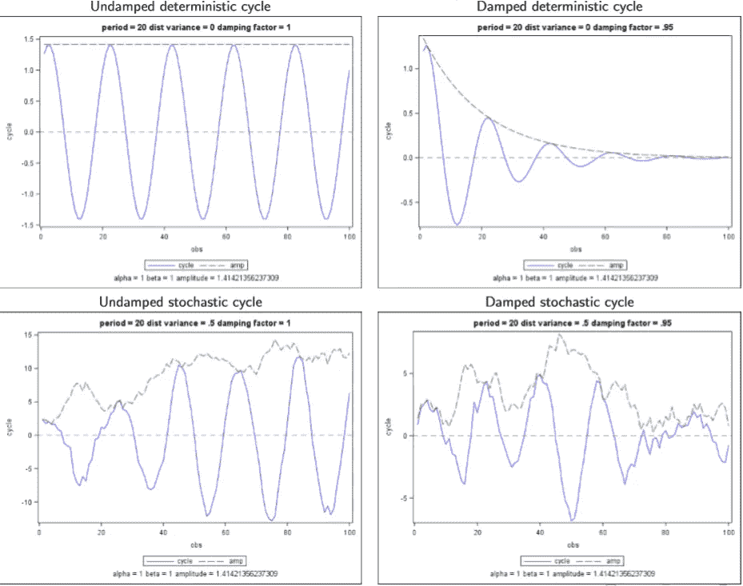

> **不规则** *-*

假设不规则分量是白噪声误差项。它的方差是用 MLE 估计的一个参数；即

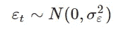

在某些情况下，我们可能希望将不规则分量一般化，以考虑自回归效应:

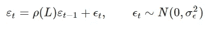

在这种情况下，自回归参数也将通过 MLE 进行估计。

> **回归效果-**

我们可能希望通过包含附加术语来考虑解释性变量

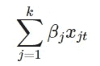

或通过以下方式获得干预效果

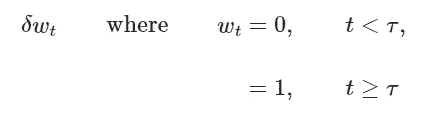

这些附加参数可以通过 MLE 或通过将它们作为状态空间公式的组成部分来估计。

# 拟合 UCM 模型

由于数据已经进行了季节性调整，并且没有明显的解释变量，因此考虑的通用模型为:

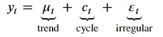

不规则将被假设为白噪声，周期将是随机的和阻尼的。最终的建模选择是用于趋势组件的规范。哈维和耶格考虑了两种模型:

-局部线性趋势(“无限制”模型)

-平滑趋势(“受限”模型，因为我们强制ση=0)

下面，我们为每种模型类型构造 kwargs 字典。请注意，有两种方式来指定模型。一种方法是直接指定组件，如上表所示。另一种方法是使用映射到各种规范的字符串名称。

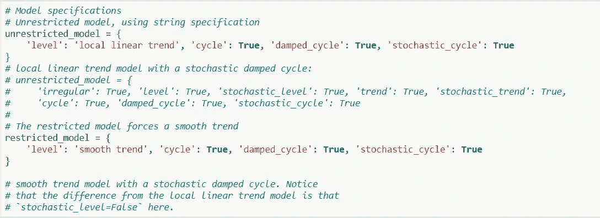

论证词典

我们现在适合以下模型:

1.  输出，无限制模型
2.  价格，无限制模型
3.  价格，受限型号

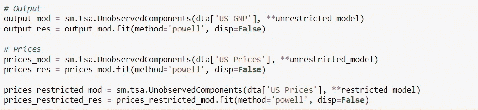

安装 3 个模型

对于未观察到的成分模型，绘制估计的未观察到的成分(如水平、趋势和周期)本身，以查看它们是否提供了有意义的数据描述，通常更有指导意义。

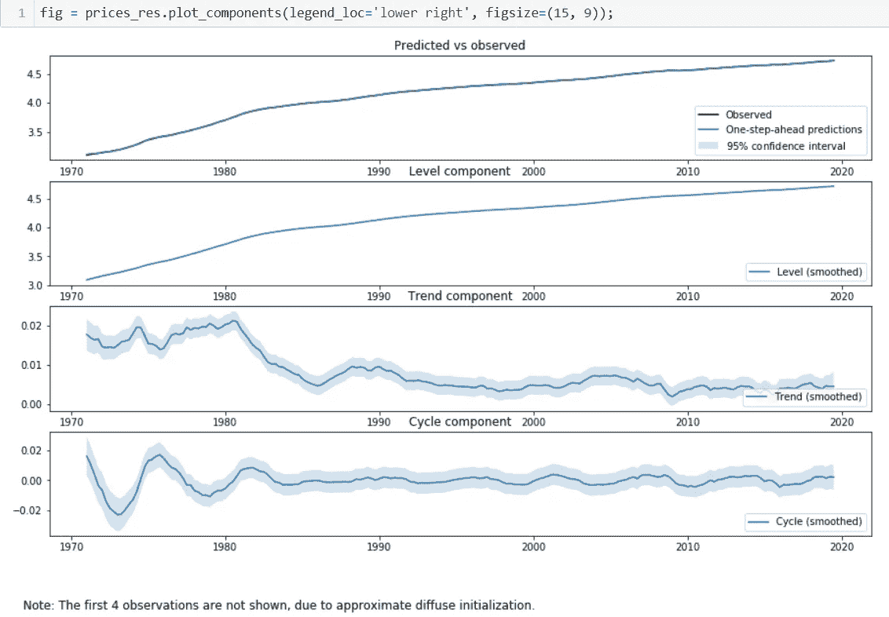

# 推理

让我们总结一下这些模型，以强调趋势和周期性因素的相对重要性。

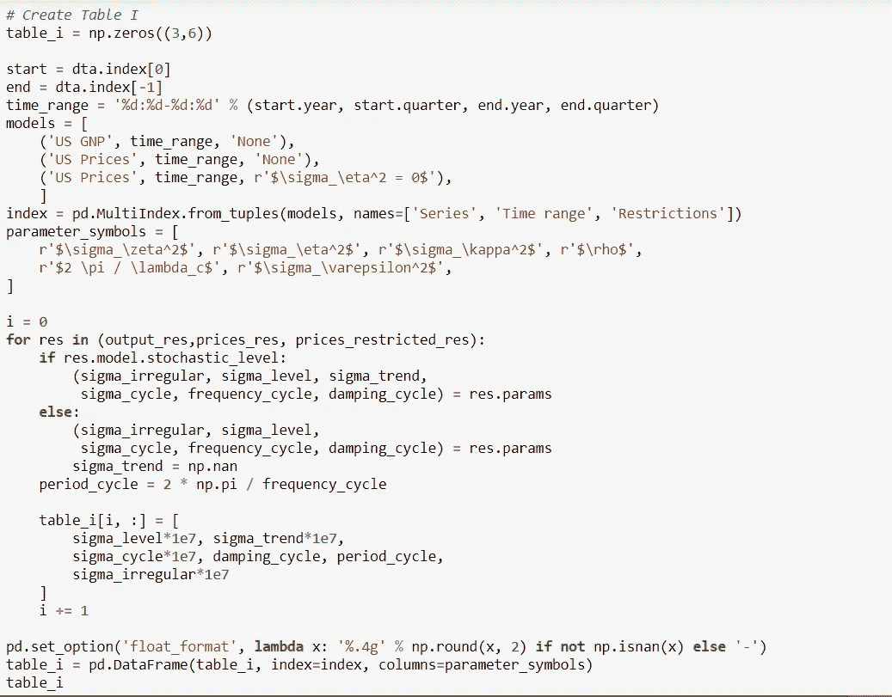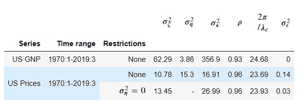

系数的顺序是— —级别、趋势、
周期、阻尼 _ 周期、周期 _ 周期(= 2 * pi/频率 _ 周期)和
不规则。此外，除阻尼和周期循环之外的所有值都通过乘以 1e7 按比例放大。

对于不受限制的 GNP 模型，周期系数为 24.63，是所有系数中最高的，表明它是该模型中最重要的组成部分。

# 结论

大家好！希望这是有帮助的！要获取代码并亲自尝试，请访问我的 Github。以下链接-

 [## varishupant 99/未观察到的 _ 组件 _ 模型

### 此时您不能执行该操作。您已使用另一个标签页或窗口登录。您已在另一个选项卡中注销，或者…

github.com](https://github.com/VarishuPant99/Unobserved_Components_Model) 

由**瓦里舒喘气**

-统计学家、数据科学家和作词人。

如有任何建议、更正或只是想和我聊聊，请联系我-

【https://www.linkedin.com/in/varishu-pant/ 

另外，点击这里查看我在 [Analytics Vidhya](https://medium.com/analytics-vidhya) 发表的其他博客(比如 Youtube 人气预测)

 [## V Pawk -培养基

### 在介质上阅读 V Pawk 的作品。每天，V Pawk 和成千上万的其他声音阅读，写作，并分享重要的…

medium.com](/@varishupant) 

如果你喜欢听嘻哈音乐，我的 Youtube 频道上有一些原创音乐-

还有 Spotify 和其他流媒体服务:

[distrokid.com/hyperfollow/vpawk/spaz](https://l.instagram.com/?u=https%3A%2F%2Fdistrokid.com%2Fhyperfollow%2Fvpawk%2Fspaz&e=ATOuTxJqio3J_ehnOyIEOxNVJblY9ulQJub457eQfLfIC8Kimh1Sprt6dU9TOeo_Rv7hCrrpKW7j_HO1gYVYgg&s=1)