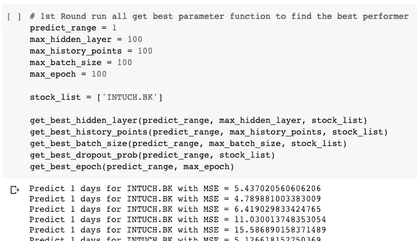

# 📈调整 LSTM 预测 SET50 中的股票价格

> 原文：<https://medium.com/analytics-vidhya/tuning-lstm-to-predict-stock-price-in-set50-with-lower-than-5-5-error-e19b422304b7?source=collection_archive---------7----------------------->


马库斯·斯皮斯克在 [Unsplash](https://unsplash.com?utm_source=medium&utm_medium=referral) 上的照片

知道未来总是更好的，尤其是在股票交易中，因为我们可以很好地计划何时买入何时卖出以获利。

当我在互联网上搜索时，我发现了一些使用长期短期记忆(LSTM)等深度学习算法预测股票价格的例子。
然而，我还没有看到很多例子和结果，当我们对不同数量的股票使用该模型时，针对不同的预测范围调整 LSTM 以获得最佳结果和模型的准确性。

🎯**在这篇博文中，我将分享以下活动的过程和结果:**

1.  使用 LSTM 构建股票预测器，并调整一只选定股票的参数，以预测其在未来 1、5 和 10 天的调整后收盘价。我打算调整参数的方式是:

*   从所有参数的最低值开始，只允许调整一个参数。
*   在构建、训练和验证参数的不同值的循环中循环，以找到这些参数的最佳值。
*   对所有参数都这样做，以查看哪个参数和哪个值的误差最小。
*   用值更新特定的参数，而其他参数仍然是最低的。
*   重复所有步骤，直到误差不再降低，这将是最佳参数值的设置。

2.通过使用从以前的主题中找到的一组参数来建立一个模型，以对另一组股票进行预测，并测量该模型可以在可接受的误差率下预测多少股票。

3.构建用户友好的脚本，用户可以:

*   提供股票列表、历史数据的日期范围，并训练模型。
*   通过选择股票和价格预测的日期范围来查询预测价格。

**数据来源**


照片由[将](https://unsplash.com/@will0629?utm_source=medium&utm_medium=referral)放在 [Unsplash](https://unsplash.com?utm_source=medium&utm_medium=referral) 上拍摄

由于我居住在泰国，我的模型的目标股票列表将是泰国证券交易所中价值最高的 50 只股票(或 SET50)。名单在这里:[https://www.settrade.com/C13_MarketSummary.jsp?detail=SET50。](https://www.settrade.com/C13_MarketSummary.jsp?detail=SET50.)我将用作调整 LSTM 参数的样本的股票将是 SET50 中的一只股票。我使用的数据将来自雅虎财经——https://finance.yahoo.com/，它提供了开盘价、最高价、最低价、收盘价、调整后收盘价和交易量的历史数据。

**指标**


照片由[张家瑜](https://unsplash.com/@danielkcheung?utm_source=medium&utm_medium=referral)在 [Unsplash](https://unsplash.com?utm_source=medium&utm_medium=referral) 上拍摄

每个研究主题的指标将是预测准确性的度量。因为，这将是预测线与实际线拟合程度的度量。均方差是衡量模型准确性的合适指标(越低越好)。我们甚至可以用平方根来找出数据和预测线之间的实际距离。


克里斯·里德在 [Unsplash](https://unsplash.com?utm_source=medium&utm_medium=referral) 上拍摄的照片

⚠️ **长文及前方技术内容**

这里的内容将是上面列出的每个主题的深层实现。可以从这里阅读带有可执行源代码的 Jupyter 笔记本版本—[https://github . com/path ompong-y/stock _ predictor/blob/master/stock _ predictor _ tuning _ study . ipynb](https://github.com/pathompong-y/stock_predictor/blob/master/stock_predictor_tuning_study.ipynb)

如果你想运行笔记本，并与内容相处，请检查项目的资源库上的说明—[https://github.com/pathompong-y/stock_predictor/](https://github.com/pathompong-y/stock_predictor/blob/master/stock_predictor_tuning_study.ipynb)

👌**TLDR——结果和忙碌的家伙们如何自己做:)**

*   通过迭代调整每个 LSTM 参数，我们可以降低模型的均方误差。我的试验中影响最大的参数是纪元和历史点(用于预测的历史数据范围)。
*   为了优化误差，逐个股票地做比将一组参数推广到每个股票要好。
*   你可以用这个 Jupyter 笔记本试试我的参数。
    [https://github . com/path ompong-y/stock _ predictor/blob/master/stock _ predictor . ipynb](https://github.com/pathompong-y/stock_predictor/blob/master/stock_predictor.ipynb)
    它不需要在你的电脑上安装，因为它将在【https://colab.research.google.com】上运行。说明已经在笔记本里了。
*   使用此笔记本，您可以(1)提供股票列表和历史数据的日期范围来训练模型。我的参数将被自动应用(2)通过提供从训练数据的结束日期开始的日范围来查询预测价格。它最多可以预测 10 天。预测的 MSE 也会回归给你。
*   我不保证任何预测结果的准确性:)

# 1.根据 1、5 和 10 天的预测，为集合 50 中的一个股票建立 LSTM 并优化参数

***1.1 选择工作区，安装 yfinance 库***


詹姆斯·庞德在 [Unsplash](https://unsplash.com?utm_source=medium&utm_medium=referral) 上拍摄的照片

首先，我们需要从雅虎财经获得股票数据。 **yfinance** 库是我们需要安装的包。它包含了从雅虎财经获取数据的功能。文档可以在这里找到—[https://pypi.org/project/yfinance/](https://pypi.org/project/yfinance/)。

使用安装 yfinance！pip 安装命令。

```
!pip install yfinance
import yfinance as yf
```

由于 LSTM 需要 TensorFlow 来构建和训练模型，我在谷歌的合作实验室—[https://colab.research.google.com](https://colab.research.google.com/)上开发了这款笔记本，该实验室提供免费的 Jupyter 笔记本工作空间，安装了 TensorFlow GPU 支持。它还能够读取/写入文件到谷歌驱动器，这对于我来说非常方便，因为我的机器没有 GPU。

Keras 是一个深度学习库，它实现了我将在这次探索中使用的 LSTM——[https://keras.io/](https://keras.io/)。


我笔记本上的合作实验室截图

***1.2 准备数据***


弗兰·雅克耶在 Unsplash[上的照片](https://unsplash.com?utm_source=medium&utm_medium=referral)

因为我们将在下一个主题中使用所有的 SET50 数据，所以我将下载它们。我选择探究的股票是 INTUCH。BK 就是我最近用来交易的那个。

我使用 collaboratory 的 Google Drive 挂载功能来存储下载的数据以及在这台笔记本上工作时的中间结果。

yfinance 下面有一个方便的命令，可以下载 2 行内的历史数据。首先，我们必须使用股票代码名称启动 yfinance 的实例。之后，我们可以使用历史功能下载历史数据。yfinance 文档中的更多细节:[https://pypi.org/project/yfinance/](https://pypi.org/project/yfinance/)

```
# Instantiate object from stock ticker
stock_data = yf.Ticker(stock)# yfinance history function is able to define period to download historical data
pd.DataFrame(stock_data.history(period='max',auto_adjust=False,actions=False)).to_csv(file)
```

在我将数据保存到 CSV 之后，我对它们进行了一些研究，以检查数据的完整性、空数据和预期的特征(开盘、盘高、盘低、收盘、调整收盘、成交量)。


插管。BK 的例子数据来自雅虎财经


检查数据帧的空值和数据类型

根据快速检查，这些数据完全可以使用。

获得所有数据后，我们必须准备好训练模型。下面是要做的事情列表:

1.  删除空行(如果有的话),因为我们无论如何都不能使用它。
2.  丢弃 ate，因为我们不能在模型训练中使用它作为特征。
3.  将数据标准化为 0-1 之间的值，因为这将有助于神经网络具有更好的性能。这是根据这个帖子:[https://towardsdatascience . com/why-data-should-normalized-before-training-a-neural-network-c 626 b 7 f 66 c 7d](https://towardsdatascience.com/why-data-should-be-normalized-before-training-a-neural-network-c626b7f66c7d)。为了标准化和扩展数据备份，我们可以使用 Python 的预处理。MinMaxScaler()。我们必须保留我们用来缩小数据的对象，并使用同一个对象放大数据。
4.  转换数据格式。我们将预测预测日范围(1、5 和 10)期间的调整收盘。因此，数据集将由每天的开盘价、最高价、最低价和成交量组成，我们将使用这些数据来进行预测。
5.  例如，如果我们说要使用 30 个历史点。我们数据集的一行将由以下特征组成:
    `[dayAopen, dayAclose, dayAvolume, dayAhigh, dayAlow,dayA-1open, dayA-1close, dayA-1volume, dayA-1high, dayA-1low....dayA-29low]`

下面是我用来执行上述所有活动的代码。

```
# Construct the CSV filepath for INTUCH.BKstock = 'INTUCH.BK'
filename = gdrive_path+stock+'.csv'# Read the file and drop null rowdf = pd.read_csv(filename)
df_na = df.dropna(axis=0)# Drop Date as this is time series data, Date isn't used. Also drop Close as we will predict Adj Close.df_na = df_na.drop(['Date','Close'],axis=1)# As neural network has better performance with normalize data, we will normalize the data before train and predict# After we got the predict result, we will scale them back to normal value to measure error rate.# Normalise all data to the value range of 0-1 as neural network algorithm has better performance with this data rangedata_normaliser = preprocessing.MinMaxScaler()y_normaliser = preprocessing.MinMaxScaler()data_normalised = data_normaliser.fit_transform(df_na)# The length of dataset, number of day to predict and number of featureshistory_points = 30
predict_range = 1# Prepare the data in the format of [day-1-open,day-1-max,day-1-min,...day-history_point ] as 1 row input for predict the 'predict_range' price for train and testohlcv_histories_normalised = np.array([data_normalised[i  : i + history_points].copy() for i in range(len(data_normalised) - history_points - predict_range +1)])# Get the actual price [day1-adj close,day2-adj close....day-predict_range adj close] for train and testnext_day_adjclose_values_normalised = np.array([data_normalised[i + history_points:i + history_points + predict_range,3].copy() for i in range(len(data_normalised) - history_points - predict_range+1)])# Create the same array as the normalised adj close but with the actual value not the scaled down value. This is used to calculate the prediction accuracynext_day_adjclose_values = np.array([df_na.iloc[i + history_points:i + history_points+predict_range]['Adj Close'].values.copy() for i in range(len(df_na) - history_points - predict_range+1)])# Use the passed normaliser to fit the actual value so that we can scale the predicted result back to actual valuey_normaliser.fit(next_day_adjclose_values)
```

现在，数据准备好了。由于我们要训练模型，我们将不得不分割数据来训练和测试。

较旧的数据将成为训练集，较新的数据将成为测试集。我选择 90%的数据作为训练数据，10%的数据作为测试数据。

所以，我们可以使用 Python 的数组切片来拆分数据。下面的代码是我的函数中的例子。ohlcv_histories 是我们之前准备的数据。

```
n = int(ohlcv_histories.shape[0] * 0.9)ohlcv_train = ohlcv_histories[:n]
y_train = next_day_adj_close[:n]ohlcv_test = ohlcv_histories[n:]
y_test = next_day_adj_close[n:]
```

***1.3 构建、训练和验证模型***


克里斯汀·图曼扬在 [Unsplash](https://unsplash.com?utm_source=medium&utm_medium=referral) 上的照片

然后，准备创建 LSTM 模型，训练，并通过使用均方误差验证模型。我将使用的 LSTM 是一个简单的由隐藏层，下降层和预测层组成。

我创建了一个函数，这样我就可以改变模型的参数。当我们建立 LSTM 模型时，我们改变的参数是:

*   隐藏层数—LSTM 层
*   丢失概率——忘记前一节点信息的概率
*   历史点-在每次迭代中训练模型时使用的数据范围(例如，来自训练集中所有数据的每次迭代的 30 天)
*   特征数量-特征的数量。如果我们添加更多的功能，这个数字必须改变。
*   优化器(我们通常会使用“adam”)

下面是函数内部的代码。

```
# Initialize LSTM using Keras librarymodel = Sequential()# Defining hidden layer number and the shape of the input (number of data in the dataset and the number of feature)model.add(LSTM(layer_num, input_shape=(history_points, features_num)))# Add forget (dropout) layer with probability per argumentmodel.add(Dropout(dropout_prob))# End the network with hiddenlayer per the size of forecast day e.g. 1,5,10model.add(Dense(predict_range))# Build and return the model per the selected optimizermodel.compile(loss='mean_squared_error', optimizer=optimizer)
```

在我们从 compile()获得模型结果后，我们可以用训练数据来拟合它。拟合数据时，我们可以更改的其他参数有:

*   批量
*   世

```
model.fit(x=ohlcv_train, y=y_train, batch_size=batch_size, epochs=epoch, shuffle=True, validation_split=0.1)
```

一旦模型完成训练，我们可以使用测试数据来预测结果，并通过计算均方误差(MSE)将结果与实际结果进行比较。然而，我们得到的实际结果是按比例放大的值(正常价格，而不是我们从模型中得到的标准化的 0-1)

在计算 MSE 之前，我们必须将预测价格按比例缩小。

```
# The model is train. Test with the test datasety_test_predicted = model.predict(ohlcv_test)# Scale up the result to actual value with y_normaliser that we use earliery_test_predicted = y_normaliser.inverse_transform(y_test_predicted)# Calculate the error with MSEreal_mse = np.mean(np.square(unscaled_y_test - y_test_predicted))scaled_mse = real_mse / (np.max(unscaled_y_test) - np.min(unscaled_y_test)) * 100
```

现在，我们有了完整的代码来准备数据、构建、训练和验证模型，并且还能够在构建和训练模型时更改参数，以找到给出最低 MSE 的集合。

对于第一次尝试，我尝试用所有最低参数进行 1 天预测。我使用的历史点是下载的所有历史数据的 30 天。

```
# Must be the same as history point that we use to prepare datahistory_points = 30# Must be the same number of features when we prepare datafeatures_num = 5# LSTM parameterslayer_num = 30predict_range = 1optimizer = 'adam'dropout_prob = 1.0# Create LSTM model objectmodel = get_LSTM_Model(layer_num, history_points, features_num,predict_range,optimizer,dropout_prob)# Parameter for model trainingbatch_size = 10epoch = 10# Train model with our train datamodel.fit(x=ohlcv_train, y=y_train, batch_size=batch_size, epochs=epoch, shuffle=True, validation_split=0.1)
```

得到结果后，我们可以把预测价格和实际价格画出来，看看它们有什么不同。

```
real = plt.plot(unscaled_y_test, label='real')
pred = plt.plot(y_test_predicted, label='predicted')plt.legend(['Real', 'Predicted'])
plt.show()
```


第一次尝试的 MSE 约为 6.18


来自插入预测的示例结果。参数是最低的一个，和 10 一样。

我们可以说，结果能够很好地捕捉趋势。当价格呈上升趋势时，它会不断预测低于实际价格，而预测高于实际价格。

***1.4 优化 1、5、10 天预测参数***


[张家瑜](https://unsplash.com/@danielkcheung?utm_source=medium&utm_medium=referral)在 [Unsplash](https://unsplash.com?utm_source=medium&utm_medium=referral) 上拍照

然后，是时候通过寻找最佳参数值来加强我们的模型了。总之，下面是要优化的参数列表:

*   隐藏层数
*   退出概率
*   历史要点
*   批量
*   世

我做的方法是创建一个函数，该函数将遍历一个参数的范围，而所有其他参数值将固定，以查看特定参数的哪个值给出最低的 MSE。所以，我总共有 5 个函数。

下面是该函数的示例。其他函数共享相同的结构，但只是改变了参数。

```
def get_best_history_points(predict_range, max_history_points, stock_list, hidden_layer=10, batch_size=10,epoch=10,dropout_probability=1.0,mode='file'):mse_list = []exception_list = []for history_points in range(30,max_history_points+1,round(max_history_points/10)):for stock in stock_list:try:model, scaled_mse = train_and_validate_stock_predictor(stock,history_points,predict_range,hidden_layer,batch_size,epoch,dropout_probability,mode)print("Predict {} days for {} with MSE = {}".format(str(predict_range),str(stock),str(scaled_mse)))mse_list.append([history_points,stock,scaled_mse])pd.DataFrame(mse_list).to_csv('/content/drive/My Drive/Colab Notebooks/stocklist_'+str(predict_range)+'_mse_history_'+mode+'.csv')except Exception as e:print("exception "+str(e)+"on "+stock)
exception_list.append([predict_range,stock,str(e)])
pd.DataFrame(exception_list).to_csv('/content/drive/My Drive/Colab Notebooks/exception_list.csv')continue
```

然后，我开始运行所有的函数，看看哪个参数在哪个值下给出最低的 MSE。



从第一轮开始，我们发现 epoch = 90 的 MSE 最低，约为 2.85

我们将再次运行除 epoch 之外的所有函数，并将 epoch 值固定为 60，作为所有函数的输入。这是为了找到可以进一步降低 MSE 的其他参数。我重复这些步骤，直到 MSE 不再下降。

最后，我得到了在 2.79 左右给出最低 MSE 的结果如下:

*   隐藏层数= 10
*   退出概率= 1.0
*   批量=10
*   纪元=90
*   历史点数=90

我试图通过添加一些常用于股票交易的技术分析指标来进一步优化 MSE。我选择 MACD 和均线，它们计算起来并不复杂。示例代码如下。它会把 20 天和 50 天的 MACD 和均线添加到股票数据框架中。

```
# Extract Close data to calculate MACDdf_close = df[['Close']]df_close.reset_index(level=0, inplace=True)df_close.columns=['ds','y']# Calculate MACD by using DataFrame's EWM https://pandas.pydata.org/pandas-docs/stable/reference/api/pandas.DataFrame.ewm.htmlexp1 = df_close.y.ewm(span=12, adjust=False).mean()exp2 = df_close.y.ewm(span=26, adjust=False).mean()macd = exp1-exp2# Merge MACD back as new column to the input dfdf = pd.merge(df,macd,how='left',left_on=None, right_on=None, left_index=True, right_index=True)# Rename DataFrame columnsdf.columns = ['Date','Open','High','Low','Close','Adj Close','Volume','MACD']# Add new columns using EMA windwos size. EWM can use directly.df[ema1] = df['Close'].ewm(span=20, adjust=False).mean()df[ema2] = df['Close'].ewm(span=50, adjust=False).mean()return df
```

然而，具有附加数据的 MSE 反而增加到大约 6.7。因此，将它们相加用于 1 天预测可能不是这样。

查找 1 天参数的全部步骤如前所述。因此，我重复 5 天和 10 天预测的所有步骤，并得到如下结果:

**2.78 毫秒时的 1 天预测**

*   历史分数:90
*   隐藏层:10
*   批量:10 个
*   辍学概率:1.0
*   纪元:90 年
*   添加 MACD 和 EMA？:没有

**7.56 毫秒时的 5 天预测**

*   历史分数:30
*   隐藏层:70
*   批量:10 个
*   辍学概率:1.0
*   纪元:60 年
*   添加 MACD 和 EMA？:没有

**14.55 毫秒时的 10 天预测**

*   历史分数:50
*   隐藏层:60
*   批量:10 个
*   辍学概率:0.3
*   纪元:80 年
*   添加 MACD 和 EMA？:没有

对我来说，增加 MACD 和均线对预测任何范围的 INTUCH 都没有帮助，这很令人惊讶。不过，我还是会保留这个功能，改为在 SET50 中用其他股票试一试。

现在，我们有了每天预测范围的参数。我们可以用 SET50 股票来尝试它们，看看有多少股票可以在 1 天、5 天和 10 天的预测中达到可接受的精度。


# 2.将上面设置的参数应用于 SET50，看看它与其他股票的配合如何


马库斯·斯皮斯克在 [Unsplash](https://unsplash.com?utm_source=medium&utm_medium=referral) 上的照片

1、5、10 天贯穿 50 只股票需要很长时间。为了节省时间，我必须复制我的笔记本，并在 3 个浏览器选项卡上同时运行它们。
我通过使用均方差直方图来可视化每一天的预测结果。


1 天预测 MSE 直方图


5 天预测 MSE 直方图


10 天预测 MSE 直方图

> 预测范围越大，MSE 越高。

我还使用相同的参数值再次运行 5 天预测，但这次将 MACD 和 EMA 添加到数据集，以查看在有和没有附加数据的情况下结果有何不同。

MSE 微分直方图如下:

```
df_set50_five_days = pd.read_csv('/content/drive/My Drive/Colab Notebooks/set50_5_mse.csv')df_set50_five_days_add = pd.read_csv('/content/drive/My Drive/Colab Notebooks/set50_5_mse_add_data.csv')df_set50_five_days_diff = pd.DataFrame(df_set50_five_days['1'] - df_set50_five_days_add['1'])plt.hist(df_set50_five_days_diff['1'], bins=100, color='#0504aa',alpha=0.7, rwidth=0.85)
```


大约 50%的股票具有 MSE 增量，而另外 50%的股票具有 MSE 减量


有趣的是，他们中大约一半人的成绩较好，另一半人的成绩较差。

**我们可以看到的一些结论是:**

*   用于建立和训练模型的当前参数是基于一个示例股票而创建的，然而，可以用于预测其他股票，其中一些甚至比示例情况具有更好的准确性。
*   我们可以看到，在我们添加 MACD 和均线作为训练附加特征后，一些股票的 MSE 增加了，一些股票的 10 天预测的 MSE 也减少了。基于此，很明显，为了优化股票价格预测的准确性，我们应该缩小一只股票的范围，因为该参数不会对所有股票给出好的结果，因为每只股票的价格都会因不同因素的影响而变化。

# 3.创建用户友好的功能，供用户选择他们感兴趣的股票，训练和查询股票价格预测


由[凯利·西克玛](https://unsplash.com/@kellysikkema?utm_source=medium&utm_medium=referral)在 [Unsplash](https://unsplash.com?utm_source=medium&utm_medium=referral) 上拍摄的照片

在我得到最适合 1 天、5 天和 10 天预测的 LSTM 参数集之后，我将尝试构建一个脚本，用户可以用它来训练模型和查询股票价格预测。

由于使用 Keras 的 LSTM 模型需要 Tensorflow 和一台像样的机器来运行，因此构建 web 服务器来构建和训练模型的成本相当高。


Heroku 是我尝试过的一个，但自由级不能管理运行模型训练这么长时间。

我在 Heroku 上试过免费层的网络服务器，但是免费层的网络服务器任何功能的执行时间都是有限的。因此，不可能运行需要超过 5 分钟的模型训练。

所以，我决定把笔记本分开。新的将有 2 个代码单元。一个用于接收股票列表和一系列训练数据，另一个用于查询预测价格。

为此，我需要将我的所有功能打包到一个文件中，以便通过将笔记本和功能文件一起上传到新的 collaboratory 空间并准备好运行来轻松使用它。
用户将能够提供股票列表和数据的日期范围来训练模型。然后，查询限制在 10 天预测的预测价格。


你可以在我的资料库里找到这个笔记本的副本。已经提供了设置的说明—[https://github . com/path ompong-y/stock _ predictor/blob/master/stock _ predictor . ipynb](https://github.com/pathompong-y/stock_predictor/blob/master/stock_predictor.ipynb)

同样，最方便的运行方式是使用[https://colab.research.google.com](https://colab.research.google.com)


由 [David Lusvardi](https://unsplash.com/@lusvardi?utm_source=medium&utm_medium=referral) 在 [Unsplash](https://unsplash.com?utm_source=medium&utm_medium=referral) 上拍摄的照片

# 💻结论

1.  调整 LSTM 参数的一种方式是通过从将每个参数设置为最低开始逐一迭代调整，并且一次仅迭代改变一个参数，以找到具有最低 MSE 的值。然后，将该参数值与其他参数一起使用，并迭代找到下一个参数的最佳值。
2.  预测范围越大，我们得到的误差就越大。
3.  添加技术分析指标，如 MACD 和均线，有助于提高 50%的股票在 5 天内预测的准确性。
4.  在一天结束时，为了优化预测的准确性，我们必须一个股票一个股票地做，因为会影响它的特征是不同的。

# 👓进一步改进

1.  我们有很多进一步改进模型的可能性，例如我们可以调整均线范围，甚至增加其他技术分析指标，并尝试组合使用它们。
2.  我们也可以将股票重新分组，使其价格变动基于相同的一组特定标准。例如，将石油和天然气公司分组在一起，我们可以添加石油价格作为额外的数据特征，因为这些公司的股票价格将受到石油价格运动的影响。

就是这样。感谢你阅读这篇长文，我希望它能给你一些启发，让你有灵感去进一步改进它。

由于我也是这个领域的新手，请让我知道我在这里分享的工作的任何错误或进一步改进的地方。那会很感激我的。

下一个项目再见！