# 调整随机森林算法预测收入

> 原文：<https://medium.com/analytics-vidhya/tuning-random-forest-algorithm-to-predict-income-14005371656e?source=collection_archive---------3----------------------->

## 机器学习案例研究。

在这个项目中，我们将使用年龄、教育和职业等各种特征来预测一个人的收入是高于 50k 还是低于 50k。我们将要使用的数据集是来自 Kaggle 的成人人口普查收入数据集，它包含大约 32561 行和 15 个特征，可以在这里[下载](https://www.kaggle.com/uciml/adult-census-income)。我们还将使用 Flask 构建一个 web 应用程序，并使用 Heroku 进行部署。

> web app:【https://census-income-prediction.herokuapp.com/ 


照片由[rupixen.com](https://unsplash.com/@rupixen?utm_source=medium&utm_medium=referral)在 [Unsplash](https://unsplash.com?utm_source=medium&utm_medium=referral) 上拍摄

## 动机

建立这样的预测模型可以帮助我们更好地了解一个国家的人口以及影响经济的各种因素。政府可以理解这些因素并加以改善，从而促进国家的发展。

## 理解问题

数据集包含我们必须预测哪个是从属特征“收入水平”的标签。该特征是离散的，包括收入低于 50k 和高于 50k 的两个类别。所以我们的问题是一个**监督二进制分类**类型。

## 步骤 0:导入库和数据集

所有的标准库，如 numpy、pandas、matplotlib 和 seaborn 都是在这一步导入的。我们使用 numpy 进行线性代数运算，pandas 使用数据框，matplotlib 和 seaborn 绘制图形。使用 pandas 命令 *read_csv()* 导入数据集。

```
*# Import libraries*
import pandas as pd
import numpy as np
import matplotlib.pyplot as plt
import seaborn as sns*# Importing dataset*
dataset = pd.read_csv('adult.csv')
```

## 步骤 1:描述性分析

```
*# Preview dataset*
dataset.head()
```

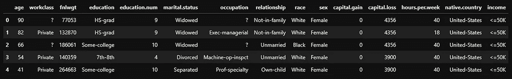

```
*# Shape of dataset*
print('Rows: **{}** Columns: **{}**'.format(dataset.shape[0], dataset.shape[1]))**Output:**
Rows: 32561 Columns: 15*# Features data-type* 
dataset.info()**Output:**
<class 'pandas.core.frame.DataFrame'>
RangeIndex: 32561 entries, 0 to 32560
Data columns (total 15 columns):
 #   Column          Non-Null Count  Dtype 
---  ------          --------------  ----- 
 0   age             32561 non-null  int64 
 1   workclass       32561 non-null  object
 2   fnlwgt          32561 non-null  int64 
 3   education       32561 non-null  object
 4   education.num   32561 non-null  int64 
 5   marital.status  32561 non-null  object
 6   occupation      32561 non-null  object
 7   relationship    32561 non-null  object
 8   race            32561 non-null  object
 9   sex             32561 non-null  object
 10  capital.gain    32561 non-null  int64 
 11  capital.loss    32561 non-null  int64 
 12  hours.per.week  32561 non-null  int64 
 13  native.country  32561 non-null  object
 14  income          32561 non-null  object
dtypes: int64(6), object(9)
memory usage: 3.7+ MB*# Statistical summary*
dataset.describe().T
```

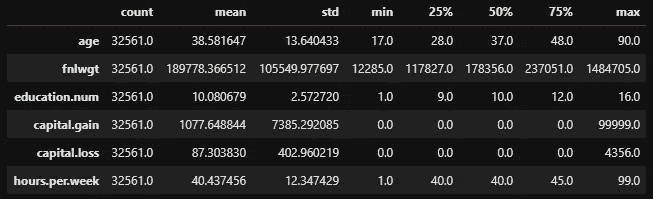

```
*# Check for null values*
round((dataset.isnull().sum() / dataset.shape[0]) * 100, 2).astype(str) + ' %'**Output:** age               0.0 %
workclass         0.0 %
fnlwgt            0.0 %
education         0.0 %
education.num     0.0 %
marital.status    0.0 %
occupation        0.0 %
relationship      0.0 %
race              0.0 %
sex               0.0 %
capital.gain      0.0 %
capital.loss      0.0 %
hours.per.week    0.0 %
native.country    0.0 %
income            0.0 %
dtype: object*# Check for '?' in dataset*
round((dataset.isin(['?']).sum() / dataset.shape[0]) * 100, 2).astype(str) + ' %'**Output:**
age                0.0 %
workclass         5.64 %
fnlwgt             0.0 %
education          0.0 %
education.num      0.0 %
marital.status     0.0 %
occupation        5.66 %
relationship       0.0 %
race               0.0 %
sex                0.0 %
capital.gain       0.0 %
capital.loss       0.0 %
hours.per.week     0.0 %
native.country    1.79 %
income             0.0 %
dtype: object*# Checking the counts of label categories*
income = dataset['income'].value_counts(normalize=True)
round(income * 100, 2).astype('str') + ' %'**Output:** <=50K    75.92 %
>50K     24.08 %
Name: income, dtype: object
```

> 观察结果:
> 
> 1.数据集没有任何空值，但它包含“？”形式的缺失值这需要进行预处理。
> 
> 2.数据集是不平衡的，因为从属特征“收入”包含 75.92%的收入低于 50k 的值，以及 24.08%的收入高于 50k 的值。

## 步骤 2:探索性数据分析

***2.1 单因素分析:***

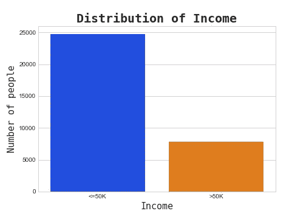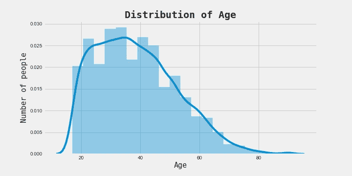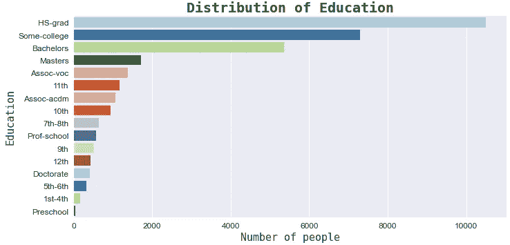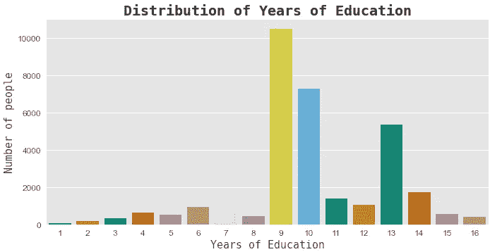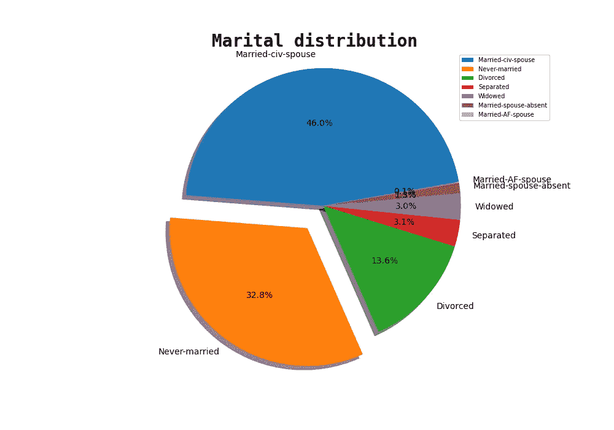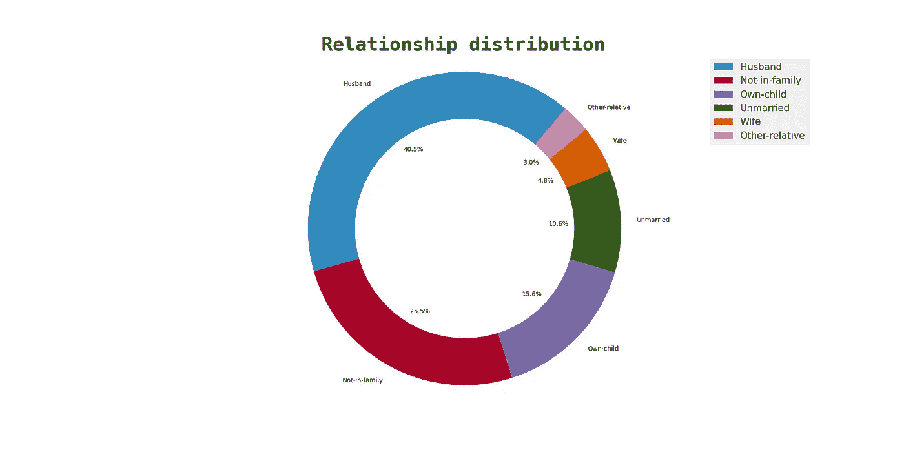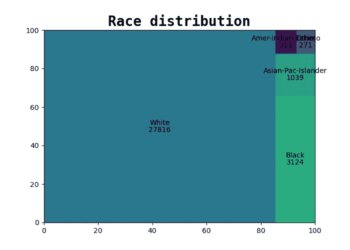

***2.2 二元分析:***

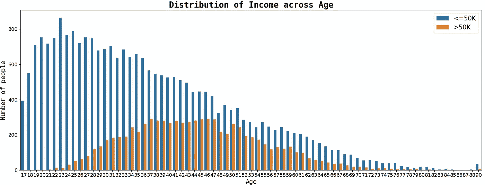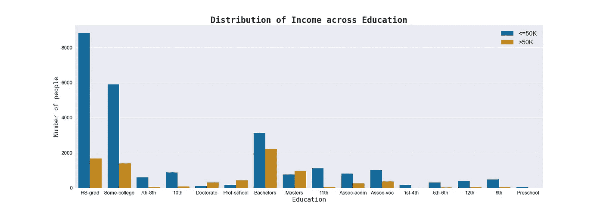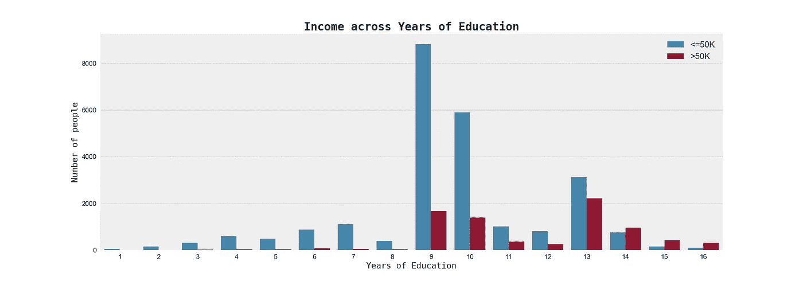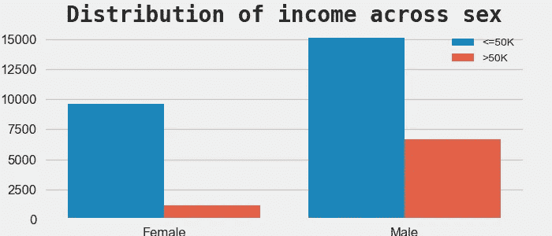

***2.3 多元分析:***

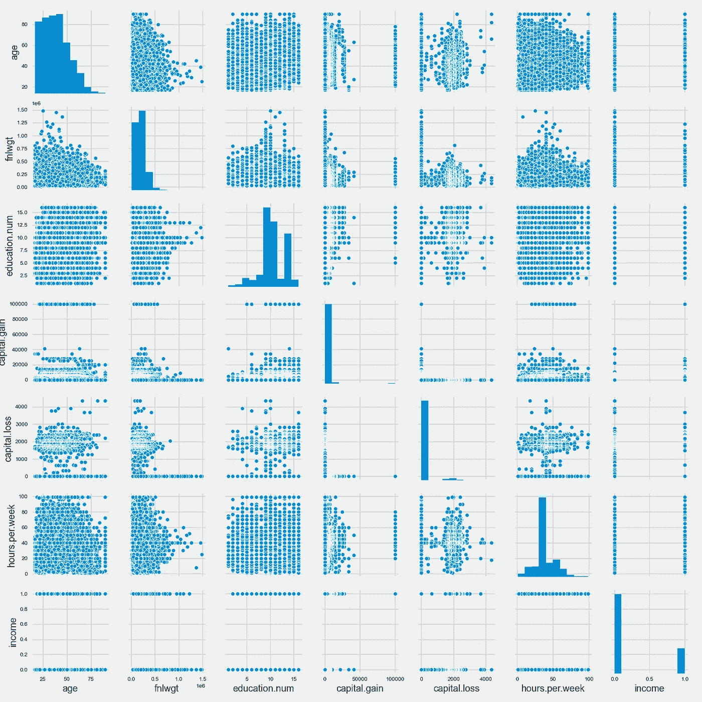

数据集的配对图

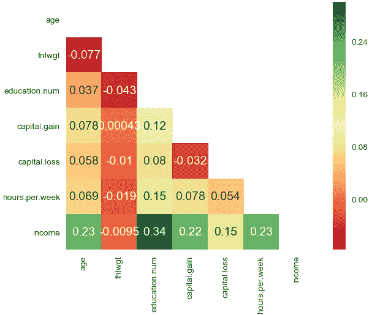

相关矩阵的热图

> 观察结果:
> 
> 1.在这个数据集中，大多数人是年轻的白人男性，高中毕业，受教育 9 到 10 年，每周工作 40 小时。
> 
> 2.从相关热图中，我们可以看到，从属特征“收入”与年龄、受教育年限、资本收益和每周工作小时数高度相关。

## 步骤 3:数据预处理

空值的形式为“？”使用 *fillna()* 命令可以很容易地用最频繁的值(模式)替换它。

```
dataset = dataset.replace('?', np.nan)*# Checking null values*
round((dataset.isnull().sum() / dataset.shape[0]) * 100, 2).astype(str) + ' %'**Output:**
age                0.0 %
workclass         5.64 %
fnlwgt             0.0 %
education          0.0 %
education.num      0.0 %
marital.status     0.0 %
occupation        5.66 %
relationship       0.0 %
race               0.0 %
sex                0.0 %
capital.gain       0.0 %
capital.loss       0.0 %
hours.per.week     0.0 %
native.country    1.79 %
income             0.0 %
dtype: objectcolumns_with_nan = ['workclass', 'occupation', 'native.country']for col in columns_with_nan:
    dataset[col].fillna(dataset[col].mode()[0], inplace = True)
```

数据集中的对象列需要编码，以便可以进一步使用。这可以通过使用 sklearn 预处理库中的**标签编码器**来完成。

```
from sklearn.preprocessing import LabelEncoderfor col in dataset.columns:
  if dataset[col].dtypes == 'object':         
    encoder = LabelEncoder()         
    dataset[col] = encoder.fit_transform(dataset[col])
```

然后，数据集被分成包含所有独立特征的 X 和包含从属特征“收入”的 Y。

```
X = dataset.drop('income', axis = 1) 
Y = dataset['income']
```

多重共线性的诅咒和过度拟合的问题可以通过执行**特征选择**来解决。使用*提取树分类器*可以很容易地找到特征的重要性。

```
from sklearn.ensemble import ExtraTreesClassifier
selector = ExtraTreesClassifier(random_state = 42)selector.fit(X, Y)feature_imp = selector.feature_importances_for index, val in enumerate(feature_imp):
    print(index, round((val * 100), 2))**Output:**
0 15.59
1 4.13
2 16.71
3 3.87
4 8.66
5 8.04
6 7.27
7 8.62
8 1.47
9 2.84
10 8.83
11 2.81
12 9.64
13 1.53X = X.drop(['workclass', 'education', 'race', 'sex', 'capital.loss', 'native.country'], axis = 1)
```

使用**特征缩放**我们可以标准化数据集，以帮助模型学习模式。这可以用 sklearn 预处理库中的 *StandardScaler()* 来完成。

```
from sklearn.preprocessing import StandardScalerfor col in X.columns:     
  scaler = StandardScaler()     
  X[col] = scaler.fit_transform(X[col].values.reshape(-1, 1))
```

从属特征“收入”非常不平衡，75.92%的值的收入低于 50k，24.08%的值的收入高于 50k。这个问题需要解决，因为它会导致 F1 分数很低。由于我们有一个小数据集，我们可以使用 RandomOverSampler 等技术执行**过采样**。

```
round(Y.value_counts(normalize=True) * 100, 2).astype('str') + ' %'**Output:** 0    75.92 %
1    24.08 %
Name: income, dtype: objectfrom imblearn.over_sampling import RandomOverSampler 
ros = RandomOverSampler(random_state = 42)ros.fit(X, Y)X_resampled, Y_resampled = ros.fit_resample(X, Y)round(Y_resampled.value_counts(normalize=True) * 100, 2).astype('str') + ' %'**Output:** 1    50.0 %
0    50.0 %
Name: income, dtype: object
```

使用 *train_test_split()* 命令将数据集分成比例为 80:20 的训练数据和测试数据。

```
from sklearn.model_selection import train_test_split
X_train, X_test, Y_train, Y_test = train_test_split(X_resampled, Y_resampled, test_size = 0.2, random_state = 42)print("X_train shape:", X_train.shape) 
print("X_test shape:", X_test.shape) 
print("Y_train shape:", Y_train.shape) 
print("Y_test shape:", Y_test.shape)**Output:**
X_train shape: (39552, 8)
X_test shape: (9888, 8)
Y_train shape: (39552,)
Y_test shape: (9888,)
```

## 步骤 4:数据建模

**随机森林分类器:**

```
from sklearn.ensemble import RandomForestClassifier
ran_for = RandomForestClassifier(random_state = 42)ran_for.fit(X_train, Y_train)Y_pred_ran_for = ran_for.predict(X_test)
```

> 理解算法:

随机森林是一种监督学习算法，用于分类和回归。这是一种 bagging 集成算法，它同时创建多个决策树，试图从彼此独立的数据集学习。使用多数投票选择最终预测。

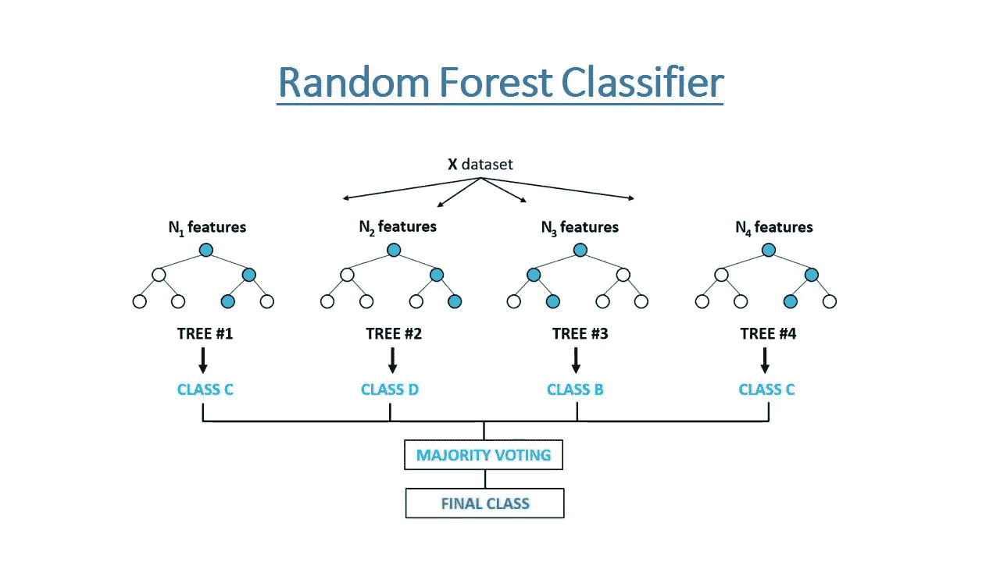

随机森林非常灵活，并且具有很高的准确性，因为它通过组合多个决策树的结果来克服过度拟合的问题。即使对于大型数据集，随机森林也能提供良好的性能。如果我们的数据集有大量缺失值，它们也能提供很好的准确性。但是随机森林比决策树更复杂，计算量更大，导致模型构建过程非常耗时。它们也比决策树更难解释，更不直观。

该算法有一些重要的参数，如最大深度、最大特征、n 估计量和最小样本叶。可用于建立模型的树的数量由 n 个估计器定义。Max_features 确定随机森林在单个树中可以使用的最大功能数。决策树的最大深度由参数 max_depth 给出。叶节点所需的最小样本数由 min_sample_leaf 给出。

## 第五步:模型评估

在这一步中，我们将使用两个指标来评估我们的模型，这两个指标是**准确性分数**和 **f1 分数**。准确度是正确预测值与总预测值的比率。它告诉我们我们的预测有多准确。F1 分数是精确度和召回率的加权平均值，其值越高，模型越好。我们将使用 f1 得分的准确性得分，因为我们有一个不平衡的数据集。

```
from sklearn.metrics import accuracy_score
from sklearn.metrics import f1_scoreprint('Random Forest Classifier:')
print('Accuracy score:',round(accuracy_score(Y_test, Y_pred_ran_for) * 100, 2))
print('F1 score:',round(f1_score(Y_test, Y_pred_ran_for) * 100, 2))**Output:**
Random Forest Classifier:
Accuracy score: 92.6
F1 score: 92.93
```

## 步骤 6:超参数调整

我们将使用 **RandomizedSearchCV** 来调整我们的随机森林分类器的超参数，该分类器通过随机搜索来找到最佳超参数，从而避免不必要的计算。我们将尝试找到‘n _ estimators’和‘max _ depth’的最佳值。

```
from sklearn.model_selection import RandomizedSearchCVn_estimators = [int(x) for x in np.linspace(start = 40, stop = 150, num = 15)]
max_depth = [int(x) for x in np.linspace(40, 150, num = 15)]param_dist = {
    'n_estimators' : n_estimators,
    'max_depth' : max_depth,
}rf_tuned = RandomForestClassifier(random_state = 42)rf_cv = RandomizedSearchCV(estimator = rf_tuned, param_distributions = param_dist, cv = 5, random_state = 42)rf_cv.fit(X_train, Y_train)rf_cv.best_score_**Output:**
0.9131271105332539rf_cv.best_params_**Output:** {'n_estimators': 40, 'max_depth': 102}rf_best = RandomForestClassifier(max_depth = 102, n_estimators = 40, random_state = 42)rf_best.fit(X_train, Y_train)Y_pred_rf_best = rf_best.predict(X_test)print('Random Forest Classifier:') 
print('Accuracy score:',round(accuracy_score(Y_test, Y_pred_rf_best) * 100, 2)) 
print('F1 score:',round(f1_score(Y_test, Y_pred_rf_best) * 100, 2))**Output:**
Random Forest Classifier:
Accuracy score: 92.77
F1 score: 93.08from sklearn.metrics import confusion_matrix 
cm = confusion_matrix(Y_test, Y_pred_rf_best)
```

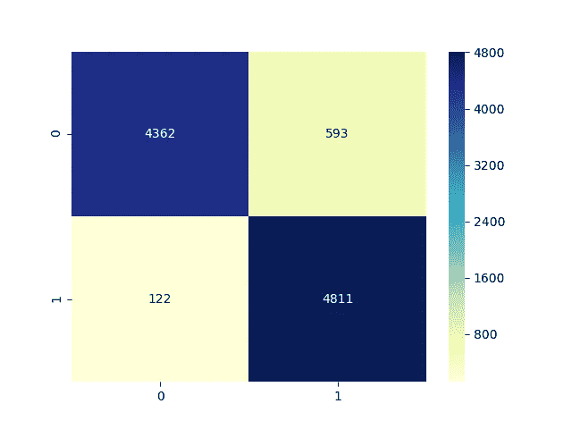

混淆矩阵的热图

```
from sklearn.metrics import classification_report
print(classification_report(Y_test, Y_pred_rf_best))**Output:** precision    recall   f1-score  support

           0       0.97      0.88      0.92      4955
           1       0.89      0.98      0.93      4933

    accuracy                           0.93      9888
   macro avg       0.93      0.93      0.93      9888
weighted avg       0.93      0.93      0.93      9888
```

在调整其超参数后，该模型为我们提供了 92.77 的准确度分数和 93.08 的 f1 分数的最佳值。

## 步骤 7:模型部署

为了部署我们的模型，我们将首先使用 **Flask** 微框架构建一个 web 应用程序。这个应用程序可以使用 **Heroku** 部署到网络上。Heroku 是一个平台即服务(PaaS ),使开发人员能够完全在云中构建、运行和操作应用程序。应用程序在这里找到了。


Heroku 上部署的 Flask WebApp

## 未来工作:

*   我们有一个足够大的数据集，所以我们可以使用人工神经网络等神经网络来建立一个可以产生更好性能的模型。

[](https://github.com/Aditya-Mankar/Census-Income-Prediction) [## aditya-Mankar/人口普查-收入-预测

### 使用成人人口普查收入数据集构建预测收入的分类模型。在本笔记本中，我们…

github.com](https://github.com/Aditya-Mankar/Census-Income-Prediction)