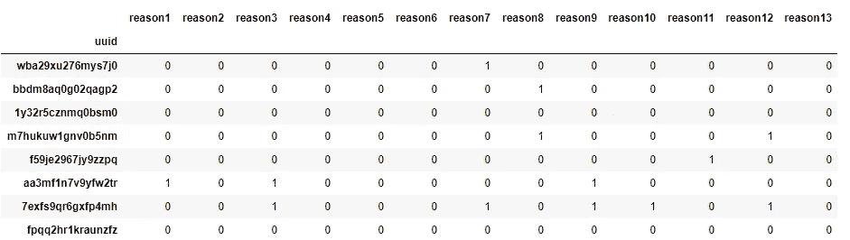
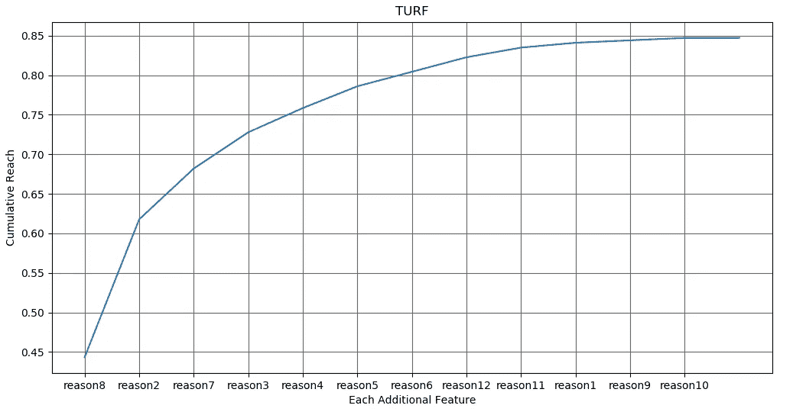

# Python 中的草皮分析

> 原文：<https://medium.com/analytics-vidhya/turf-analysis-in-python-d8368f06c050?source=collection_archive---------9----------------------->

## 总无重复范围和频率

完全不重复接触和频率分析(简称 TURF)是营销人员和市场研究人员用来确定产品或服务最佳组合的一种统计方法。如果你想要更多的背景，我喜欢这个[解释](https://conjointly.com/blog/turf-analysis/)。

这种分析实现起来相对简单，但是如果在 Excel 这样的工具中手动完成，可能会非常耗时。为了简化我的工作流程，并且因为我找不到 Python 中的包来进行这种分析，我编写了一个简短的程序，它可以给我一个快速的 TURF 输出。如果你想了解这个过程，请继续阅读，或者如果你对代码更感兴趣，请前往我的 [GitHub 库](https://github.com/nhcamp/TURF_Analysis)。

## 第 1 部分|数据格式

草皮分析是基于调查数据中的一系列偏好选择，其中 1 =偏好，0 =不偏好。如何对这两者进行分类取决于手头的特定问题以及向受访者提出的问题。

草皮分析的数据设置

要在 Python 中使用此工具运行草皮分析，数据需要位于如上所示的矩阵中，其中每个唯一 id 都与所有要素的偏好相关联(此处标记为原因)。该问题的设置允许受访者选择他们喜欢的多个选项。在这个分析中，假设这个偏好在所有选择中是相等的。

## 第 2 部分| Python 中的集合

集合是唯一值的无序集合，允许简单、快速的比较和连接。使用集合来创建偏好每个特性的用户 id 的唯一分组，允许在大型数据集之间进行闪电般的快速比较(与使用列表相反)。逐列迭代 pandas 数据帧使这变得简单。

现在，使用这个集合列表和具有最大单个范围的特征，我可以确定每个连续特征的最佳排序和范围。为此，我将使用差分方法将所选集合与所有其他集合分别进行比较。在计算出另一个集合中惟一用户 id 的差异最大之后，我可以使用 union 方法来连接这些集合并删除重复的集合。

这个新集合的长度除以回答者的数量，给出了两个特征的集合可能的最大不重复范围。对每个特征重复这个过程，我将得到最佳的排序和完全不重复的范围。执行这些操作的代码如下。

## 第 3 部分|输出和注释

上面代码的输出是两个列表。第一个是功能名称的有序列表，第二个是通过每个附加功能获得的累积范围。将这两者结合在一起，我可以构建下图，我的地盘输出。我可以看到，我的第一个功能覆盖了大约 45%的人群，再增加 4 个功能(原因 4)就可以覆盖超过四分之三的人群。

草皮产量

感谢阅读。如果你想自己进行简单的草皮分析，请查看我的 GitHub 知识库。