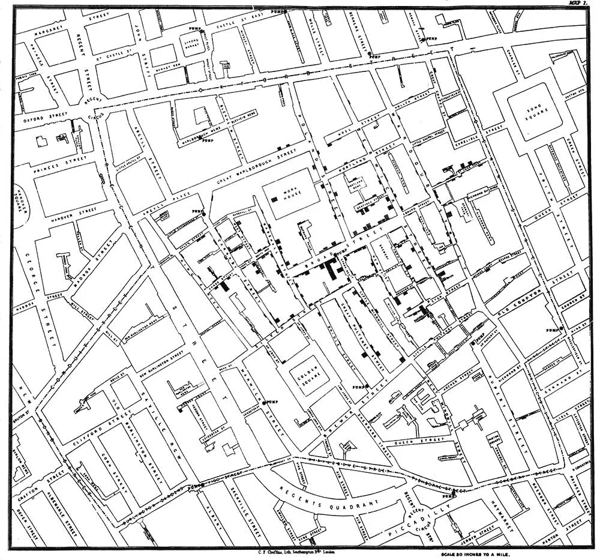

# 用 Python 进行空间分析的新方法

> 原文：<https://medium.com/analytics-vidhya/turfpy-a-new-way-to-do-spatial-analysis-in-python-c69a7110bc7c?source=collection_archive---------9----------------------->



图片来自[地图框](https://docs.mapbox.com/help/img/screenshots/snow-cholera-map-1.jpg)

大家好，最近几个月前，我开始和 TurfPy 一起工作。这是一个用于执行地理空间数据分析的 Python 库。实际上它是 turf.js 的 python 替代品。这是一个新的包，所以目前它支持 turf.js 的**测量**功能主义者。由[turpy](https://pypi.org/project/turfpy/)支持的操作可以应用于简单的几何类型或基本上是标准 **geojson 特征**的特征对象。

草皮:[https://pypi.org/project/turfpy/](https://pypi.org/project/turfpy/)

turpy Github:[https://github.com/omanges/turfpy](https://github.com/omanges/turfpy)

让我们深入了解每项功能的一些示例。

*   **方位**:取两个点特征，找出它们之间的地理方位。

```
from turfpy import measurement
from geojson import Point, Feature start = Feature(geometry=Point((-75.343, 39.984)))
end = Feature(geometry=Point((-75.534, 39.123)))measurement.bearing(start,end)
```

*   **距离**:计算两点特征之间的距离。一个点包含十进制度的纬度和经度，而`unit`是可选的。

```
from turfpy import measurement
from geojson import Point, Featurestart = Feature(geometry=Point((-75.343, 39.984)))
end = Feature(geometry=Point((-75.534, 39.123)))measurement.distance(start,end)
```

*   **面积**:该函数计算作为输入给出的 Geojson 对象的面积。

```
from turfpy.measurement import area
from geojson import Feature, FeatureCollection

geometry_1 = {"coordinates": [[[0, 0], [0, 10], [10, 10], [10, 0], [0, 0]]], "type": "Polygon"};
geometry_2 = {"coordinates": [[[2.38, 57.322], [23.194, -20.28], [-120.43, 19.15], [2.38, 57.322]]], "type": "Polygon"};feature_1 = Feature(geometry=geometry_1)
feature_2 = Feature(geometry=geometry_2)
feature_collection = FeatureCollection([feature_1, feature_2])

area(feature_collection)
```

*   **包围盒**:该函数用于生成给定 geojson 的包围盒坐标，输入可以是几何类型，也可以是特征，也可以是特征集合。

```
from turfpy.measurement import bbox
from geojson import Polygon, Feature

p = Polygon([[(2.38, 57.322), (23.194, -20.28), (-120.43, 19.15), (2.38, 57.322)]])
feature = Feature(geometry=p)bb = bbox(feature)
```

*   **边界框** **多边形**:为使用上述边界框功能生成的边界框生成一个多边形特征。

```
from turfpy.measurement import bbox_polygon, bbox
from geojson import Polygon

p = Polygon([[(2.38, 57.322), (23.194, -20.28), (-120.43, 19.15), (2.38, 57.322)]])bb = bbox(p)feature = bbox_polygon(bb)
```

*   **中心**:获取一个特征或特征集合，并返回所有特征的绝对中心点。

```
from turfpy.measurement import center
from geojson import Feature, FeatureCollection, Point

f1 = Feature(geometry=Point((-97.522259, 35.4691)))
f2 = Feature(geometry=Point((-97.502754, 35.463455)))
f3 = Feature(geometry=Point((-97.508269, 35.463245)))feature_collection = FeatureCollection([f1, f2, f3])feature = center(feature_collection)
```

*   **Envelope** :获取任意数量的特征并返回一个包含所有顶点的矩形多边形。

```
from turfpy.measurement import envelope
from geojson import Feature, FeatureCollection, Point

f1 = Feature(geometry=Point((-97.522259, 35.4691)))
f2 = Feature(geometry=Point((-97.502754, 35.463455)))
f3 = Feature(geometry=Point((-97.508269, 35.463245)))
feature_collection = FeatureCollection([f1, f2, f3])feature = envelope(feature_collection)
```

*   **长度**:取一个 geojson 并以指定单位测量其长度。

```
from turfpy.measurement import length
from geojson import LineString, Featurels = LineString([(115, -32), (131, -22), (143, -25), (150, -34)])
f = Feature(geometry=ls)length(f)
```

*   **目的地**:取一个点，给定以度、弧度、英里或公里为单位的距离和以度为单位的方位角，计算目的地点的位置。

```
from turfpy.measurement import destination
from geojson import Point, Featureorigin = Feature(geometry=Point([-75.343, 39.984]))
distance = 50
bearing = 90
options = {'units': 'mi'}destination(origin,distance,bearing,options)
```

*   **质心**:获取一个或多个特征，并使用所有顶点的平均值计算质心。

```
from turfpy.measurement import centroid
from geojson import Polygon, Featurepolygon = Polygon([[(-81, 41), (-88, 36), (-84, 31), (-80, 33), (-77, 39), (-81, 41)]])
f = Feature(geometry=polygon)centroid(polygon)
```

*   **沿**:该功能用于识别沿线串指定距离处的点特征。

```
from turfpy.measurement import along
from geojson import LineString, Featurels = LineString([(-83, 30), (-84, 36), (-78, 41)])
f = Feature(geometry=ls)along(f,200,'mi')
```

*   **中点**:该功能用于获取任意两点之间的中点。

```
from turfpy.measurement import midpoint
from geojson import Point, Featurepoint1 = Feature(geometry=Point([144.834823, -37.771257]))
point2 = Feature(geometry=Point([145.14244, -37.830937]))midpoint(point1, point2)
```

*   **最近点**:取一个参考点特征和点特征的特征集合，并从特征集合中返回最接近参考点特征的点。

```
from turfpy.measurement import nearest_point
from geojson import Point, Feature, FeatureCollectionf1 = Feature(geometry=Point([28.96991729736328,41.01190001748873]))
f2 = Feature(geometry=Point([28.948459, 41.024204]))
f3 = Feature(geometry=Point([28.938674, 41.013324]))
fc = FeatureCollection([f1, f2 ,f3])
t = Feature(geometry=Point([28.973865, 41.011122]))nearest_point(t ,fc)
```

*   **特征上的点**:获取一个特征或特征集合，并返回一个保证在特征表面上的点。

```
from turfpy.measurement import point_on_feature
from geojson import  Polygon, Featurepoint = Polygon([[(116, -36), (131, -32), (146, -43), (155, -25), (133, -9), (111, -22), (116, -36)]])
feature = Feature(geometry=point)point_on_feature(feature)
```

*   **多边形中的点**:取一个点或一个点特征和多边形或多边形特征作为输入，如果点在给定的特征中，则返回 True。

```
from turfpy.measurement import boolean_point_in_polygon
from geojson import Point, MultiPolygon, Featurepoint = Feature(geometry=Point([-77, 44]))
polygon = Feature(geometry=MultiPolygon([([(-81, 41), (-81, 47), (-72, 47), (-72, 41), (-81, 41)],),
([(3.78, 9.28), (-130.91, 1.52), (35.12, 72.234), (3.78, 9.28)],)]))boolean_point_in_polygon(point, polygon)
```

*   **与多边形相切**:从一个点找到一个(多)多边形的切线。

```
from turfpy.measurement import polygon_tangents
from geojson import Polygon, Point, Featurepoint = Feature(geometry=Point([61, 5]))
polygon = Feature(geometry=Polygon([[(11, 0), (22, 4), (31, 0), (31, 11), (21, 15), (11, 11), (11, 0)]]))polygon_tangents(point, polygon)
```

*   **点到线的距离**:返回一个点和任意线段之间的最小距离。

```
from turfpy.measurement import point_to_line_distance
from geojson import LineString, Point, Featurepoint = Feature(geometry=Point([0, 0]))
linestring = Feature(geometry=LineString([(1, 1),(-1, 1)]))point_to_line_distance(point, linestring)
```

*   **恒向方位**:取两个点，沿恒向线找到它们之间的方位角度，即以度为单位测量的角度从北线(0 度)开始。

```
from turfpy.measurement import rhumb_bearing
from geojson import Feature, Pointstart = Feature(geometry=Point([-75.343, 39.984]))
end = Feature(geometry=Point([-75.534, 39.123]))rhumb_bearing(start, end, True)
```

*   **恒向目的地**:返回从原点沿恒向线以给定方位行进了给定距离的目的点。

```
from turfpy.measurement import rhumb_destination
from geojson import Point, Featurestart = Feature(geometry=Point([-75.343, 39.984]), properties={"marker-color": "F00"})
distance = 50
bearing = 90rhumb_destination(start, distance, bearing, {'units':'mi', 'properties': {"marker-color": "F00"}})
```

*   **恒向距离**:计算两点之间沿恒向线的距离，单位为度、弧度、英里或千米。

```
from turfpy.measurement import rhumb_distance
from geojson import Point, Featurestart = Feature(geometry=Point([-75.343, 39.984]))
end = Feature(geometry=Point([-75.534, 39.123]))rhumb_distance(start, end,'mi')
```

*   **Square** :获取一个边界框，并计算包含输入的最小正方形边界框。

```
from turfpy.measurement import squarebbox = [-20, -20, -15, 0]square(bbox)
```

*   **Circle** :取一个点，计算给定半径为度、弧度、英里或千米的圆多边形；和精确的步骤。

```
from turfpy import circle
from geojson import Point, Featurecircle(center=Feature(geometry=Point((-75.343, 39.984))), radius=5, steps=10)
```

# 单位类型

有些功能支持将`units`作为参数，对于单位为参数的功能，`units`的默认值为`kilometers`。其值为:

```
'km' = kilometers
'm' = meters
'mi = miles
'ft' = feets
'in' = inches
'deg' = degrees
'cen' = centimeters
'rad' = radians
'naut' = nauticals
'yd' = yards
```

这就是 Turfpy 的所有功能。我希望你喜欢它。

非常欢迎对新功能和新特性或现有功能和特性的改进提出任何建议。

享受快乐编码！！！