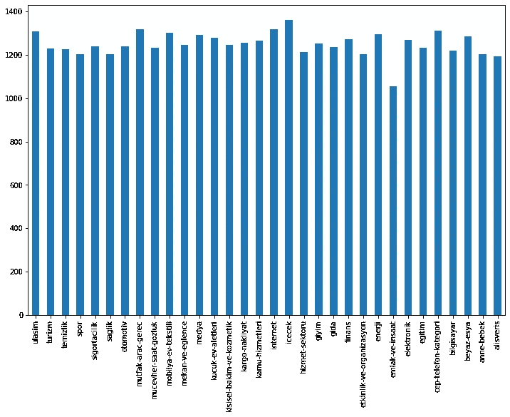
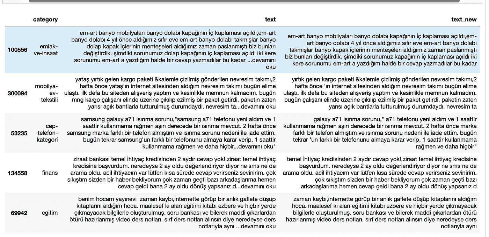
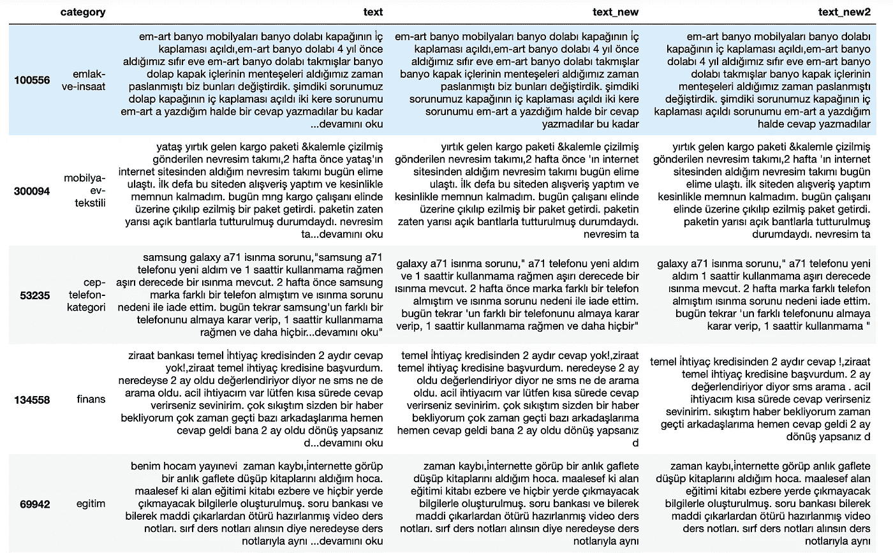
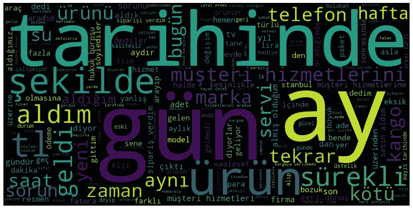
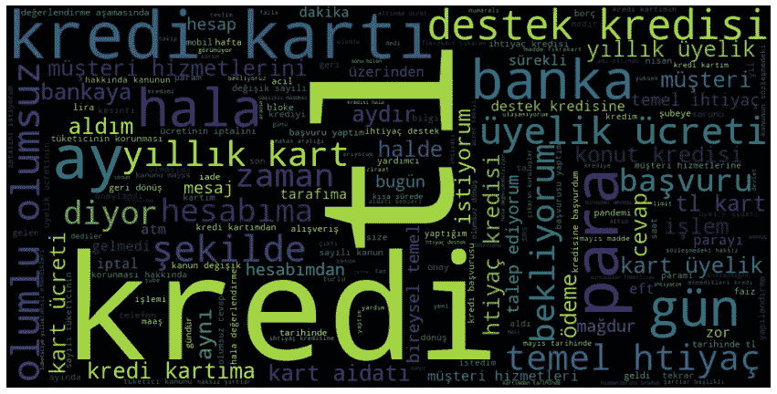
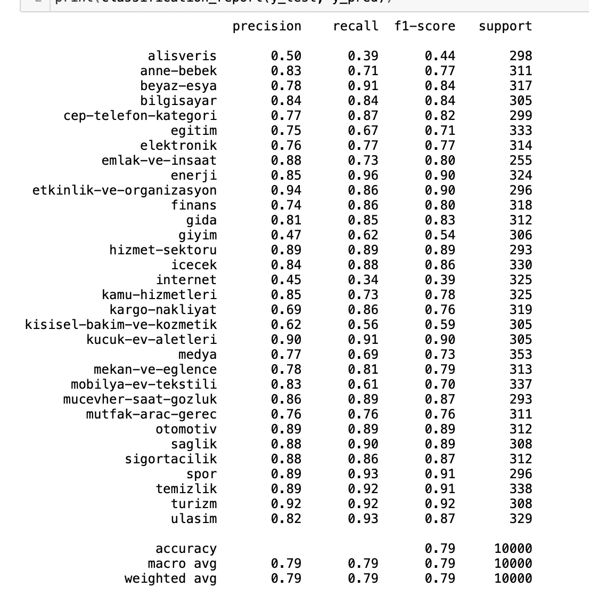
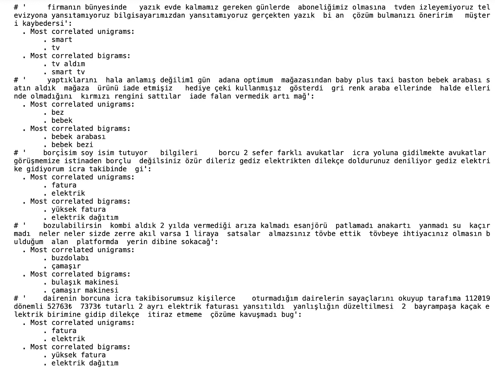

# 土耳其语文本分类，一个快速，简单和天真的方法

> 原文：<https://medium.com/analytics-vidhya/turkish-text-classification-a-fast-easy-and-naive-approach-d1b85609f7f3?source=collection_archive---------15----------------------->


来源:[https://www . analyticsvidhya . com/blog/2020/03/6-pre trained-models-text-class ification/](https://www.analyticsvidhya.com/blog/2020/03/6-pretrained-models-text-classification/)

文本分类是使用机器学习对句子进行分类的任务，不需要人工。

在这项工作中，我尝试在土耳其数据集上进行快速文本分类。数据集很大，所以我的电脑无法处理所有的数据，这就是为什么我只取了 40k 行。这使得我的代码更快。数据集由投诉和它们的类别组成，我无法证明，但应该来自 https://www.sikayetvar.com 的。

很久以前，我曾尝试用 SGDClassifer 完成类似的任务，所以我的第一个模型是 SGDClassifer。SGDClassifer 是一个很好的多类文本分类工具，所以当你开始这样的任务时，我强烈推荐你首先使用它。除此之外，我还尝试了 LinearSVC。

需要导入的库:

```
#Mains
import numpy as np
import pandas as pd
import re
import string*#Models
from sklearn.linear_model import SGDClassifier
from sklearn.svm import LinearSVC**#Sklearn Helpers
from sklearn.feature_extraction.text import TfidfVectorizer, CountVectorizer
from sklearn.feature_extraction.text import TfidfTransformer
from sklearn.preprocessing import LabelEncoder
from sklearn.metrics import accuracy_score
from sklearn.pipeline import Pipeline
from sklearn.model_selection import GridSearchCV, train_test_split
from sklearn.metrics import classification_report
from sklearn.feature_selection import chi2**#For plots
from wordcloud import WordCloud
import matplotlib.pyplot as plt**pd.set_option(‘display.max_colwidth’, -1)*
```

读取数据集，首先让我们将文本列设置为较低，并删除一些土耳其字符，并且在每个句子的结尾都有 devam noku，这意味着继续读取，这意味着句子没有完全爬行，我还更改了一些土耳其字符。这里要提到的一点是，数据大约有 400k 行，这对我的计算机来说太多了，所以我只使用了 40k，但可以随意尝试更多。

```
df=pd.read_csv(‘ticaret-yorum.csv’)
df=df.sample(n=40000, random_state=1)
df[‘text’]=df[‘text’].str.lower()df[‘text_new’] = df[‘text’].str.replace(‘...devamını oku’, ‘’)
```

让我们看看 32 个类的值计数:

```
df[‘category’].value_counts().sort_index(ascending=False).plot(kind=’bar’, figsize=(12, 8))
```



我们在文本列中有品牌名称，我认为这可能会导致过度拟合，所以我去了 www.şikayetvar.com 的获取品牌名称，这样我就可以将它们从数据集中排除。在某种程度上，你可能不得不使用更复杂的方法来寻找-排除品牌名称，作为一个提示，我可以建议你从句子中删除所有的第一个单词，因为它包含了品牌的名称。

```
brands=pd.read_csv(‘[https://raw.githubusercontent.com/pytmar/Jupyter-Notebooks/master/turkish_brands%20-%20Sayfa1.csv'](https://raw.githubusercontent.com/pytmar/Jupyter-Notebooks/master/turkish_brands%20-%20Sayfa1.csv'))
brands.columns=[‘brand_name’]
pat = r’\b(?:{})\b’.format(‘|’.join(list(brands[‘brand_name’].str.lower())))
df[‘text_new’] = df[‘text_new’].str.replace(pat, ‘’)
df.head(5)
```



虽然 nltk 模块有土耳其语的停用词，但它是有限的，所以我找到了一个很好的数据集，其中包含大约 1000 个土耳其语的停用词，在这里我删除了这些停用词:

```
stop_words=pd.read_csv(‘[https://raw.githubusercontent.com/InJuxSanct/turkish-stopwords/master/src/lib/stopwords/raw-stopwords.txt'](https://raw.githubusercontent.com/InJuxSanct/turkish-stopwords/master/src/lib/stopwords/raw-stopwords.txt'), sep=” “, header=None)
stop_words.columns=[‘words_list’]
pat2 = r’\b(?:{})\b’.format(‘|’.join(list(stop_words[‘words_list’].str.lower())))
df[‘text_new2’] = df[‘text_new’].str.lower().str.replace(pat2, ‘’)
df.sample(5)
```



最后，删除标点符号任务:

```
df=df.dropna()
PUNCT_TO_REMOVE = string.punctuation
def remove_punctuation(text):
 return text.translate(str.maketrans(‘’, ‘’, PUNCT_TO_REMOVE))
df[‘text_final’] = df[‘text_new2’].apply(lambda text: remove_punctuation(text)) 
```

现在我们来做一个 wordcloud 的剧情:

```
wordcloud = WordCloud(width=1000, height=500).generate(“+”.join(df[‘text_final’]))
plt.figure(figsize=(15,8))
plt.imshow(wordcloud, interpolation=’bilinear’)
plt.axis(“off”)
plt.show()
```



我们还可以显示特定类别的词云:

```
wordcloud = WordCloud(width=1000, height=500).generate(“+”.join(df[‘text_final’].loc[df[‘category’]==’finans’]))
plt.figure(figsize=(15,8))
plt.imshow(wordcloud, interpolation=’bilinear’)
plt.axis(“off”)
plt.show()
```



分割数据集，如果你对精度不满意，你也可以尝试 GridSearch。最后，对于文本分类，我更喜欢 sklearn 管道:

```
X_train, X_test, y_train, y_test = train_test_split(df[‘text_final’], df[‘category’], random_state = 0)trial = Pipeline([(‘vect’, CountVectorizer()),
 (‘tfidf’, TfidfTransformer()),
 (‘clf’, SGDClassifier()),])parameters = {
 ‘vect__max_df’: (0.5, 0.75, 1.0),
 ‘vect__max_features’: (None, 5000, 10000, 50000),
 ‘vect__ngram_range’: ((1, 1), (1, 2)), # unigrams or bigrams
 #’tfidf__use_idf’: (True, False),
 # ‘tfidf__norm’: (‘l1’, ‘l2’),
 ‘clf__max_iter’: (20,),
 ‘clf__alpha’: (0.00001, 0.000001),
 ‘clf__penalty’: (‘l2’, ‘elasticnet’),
 # ‘clf__max_iter’: (10, 50, 80),
}
grid_search = GridSearchCV(trial, parameters, n_jobs=-1, verbose=1)grid_search.fit(X_train, y_train)
print(“Best score: %0.3f” % grid_search.best_score_)
print(“Best parameters set:”)
best_parameters = grid_search.best_estimator_.get_params()
print(best_parameters)
```

我尝试了一些最好的估计参数，但我没有努力:

```
trial = Pipeline([(‘vect’, CountVectorizer(max_df=0.75, ngram_range=(1, 2))),
 (‘tfidf’, TfidfTransformer()),
 (‘clf’, SGDClassifier(loss=’modified_huber’,alpha=1e-05, max_iter=20, penalty=’elasticnet’)),])
trial.fit(X_train, y_train)
print(“Accuracy: “ + str(trial.score(X_test, y_test)))output: Accuracy: 0.7904
```

无任何调谐的线性 SVC:

```
trial2 = Pipeline([(‘vectorizer’,CountVectorizer()), 
 (‘tfidf’, TfidfTransformer()),
 (‘classifier’, LinearSVC())])
trial2.fit(X_train, y_train)
print(“Accuracy: “ + str(trial2.score(X_test, y_test)))output: Accuracy: 0.7886
```

现在让我们来看看好的试验能预测什么，如果你想试试，去 www.şikayetvar.com 写一个句子，然后看这里:

SGD 分类器:

```
cv = CountVectorizer(ngram_range=(1,2))message=”””çocuğum doğduğundan beridir Molfix bel bantlı bezi çok güzeldi, taki 3 gün önce bir eczaneden
Molfix 3 midi 6–11 kg 94 adetlik külot bez alana kadar. Aldığım bez daha 3 kez kullanımda sızdırma yapıyor
ve halen külot bez sızdırmakta devam ediyor. İçinden daha fazla bir şey kullanamadık elimizde kaldı. Öyle 
bu geri kalanı iade veya değişim yapılmasını talep ediyorum. Molfix’e hiç yakışmadı. Gerçekten sürekli bez
değiştirirken elbisede değiştirmek zorunda kalıyorduk. Normal bel bantlı bezle değiştirilirse sevinirim.”””data = [message]
n=3
probs = trial.predict(data)
probs
output:array(['anne-bebek'], dtype='<U25')
```

线性 SVC:

```
message=”””çocuğum doğduğundan beridir Molfix bel bantlı bezi çok güzeldi, taki 3 gün önce bir eczaneden
Molfix 3 midi 6–11 kg 94 adetlik külot bez alana kadar. Aldığım bez daha 3 kez kullanımda sızdırma yapıyor
ve halen külot bez sızdırmakta devam ediyor. İçinden daha fazla bir şey kullanamadık elimizde kaldı. Öyle 
bu geri kalanı iade veya değişim yapılmasını talep ediyorum. Molfix’e hiç yakışmadı. Gerçekten sürekli bez
değiştirirken elbisede değiştirmek zorunda kalıyorduk. Normal bel bantlı bezle değiştirilirse sevinirim.”””data = [message]
probs = trial2.predict(data)
probs
output:array(['anne-bebek'], dtype='<U25')
```

你用 predict_proba:

```
message=”””çocuğum doğduğundan beridir Molfix bel bantlı bezi çok güzeldi, taki 3 gün önce bir eczaneden
Molfix 3 midi 6–11 kg 94 adetlik külot bez alana kadar. Aldığım bez daha 3 kez kullanımda sızdırma yapıyor
ve halen külot bez sızdırmakta devam ediyor. İçinden daha fazla bir şey kullanamadık elimizde kaldı. Öyle 
bu geri kalanı iade veya değişim yapılmasını talep ediyorum. Molfix’e hiç yakışmadı. Gerçekten sürekli bez
değiştirirken elbisede değiştirmek zorunda kalıyorduk. Normal bel bantlı bezle değiştirilirse sevinirim.”””data = [message]pd.DataFrame(sorted(zip(trial.classes_, trial.predict_proba(data)[0])), columns=[‘class’, ‘probability’]).sort_values(by=’probability’, ascending=False).head(3)
output: 

class,     probability
anne-bebek, 1.00
alisveris,  0.0
turizm,     0.0
```

别忘了查看班级表演的分类报告:

```
y_pred=trial.predict(X_test)
print(classification_report(y_test, y_pred))
```



还有一个很好的方法来检查每个类最重要的 uni 和 bigrams:

```
df[‘category_id’]=df[‘category’].factorize()[0]
category_id_df = df[[‘text_final’, ‘category_id’]].drop_duplicates().sort_values(‘category_id’)
category_to_id = dict(category_id_df.values)
tfidf = TfidfVectorizer(sublinear_tf=True, min_df=5, norm=’l2', encoding=’latin-1', ngram_range=(1, 2))features = tfidf.fit_transform(df.text_final).toarray()
labels = df.category_idN = 2
for Product, category_id in sorted(category_to_id.items()):
 features_chi2 = chi2(features, labels == category_id)
 indices = np.argsort(features_chi2[0])
 feature_names = np.array(tfidf.get_feature_names())[indices]
 unigrams = [v for v in feature_names if len(v.split(‘ ‘)) == 1]
 bigrams = [v for v in feature_names if len(v.split(‘ ‘)) == 2]
 print(“# ‘{}’:”.format(Product))
 print(“ . Most correlated unigrams:\n . {}”.format(‘\n . ‘.join(unigrams[-N:])))
 print(“ . Most correlated bigrams:\n . {}”.format(‘\n . ‘.join(bigrams[-N:])))
```

我不能展示全部结果，但这里是输出的一部分:



感谢您的阅读。请用不同的模型挑战自己，因为这是一个大数据，您可以尝试 pyspark 来完成这项任务。

**来源**:

数据:[https://www . ka ggle . com/savasy/multi class-classification-data-for-Turkish-tc32](https://www.kaggle.com/savasy/multiclass-classification-data-for-turkish-tc32)

灵感:[https://towards data science . com/multi-label-text-class ification-with-scikit-learn-30714 b 7819 C5](https://towardsdatascience.com/multi-label-text-classification-with-scikit-learn-30714b7819c5)

Jupyter 笔记本:[https://github . com/pyt mar/Jupyter-Notebooks/blob/master/medium _ text _ class _ sk learn . ipynb](https://github.com/pytmar/Jupyter-Notebooks/blob/master/medium_text_class_sklearn.ipynb)