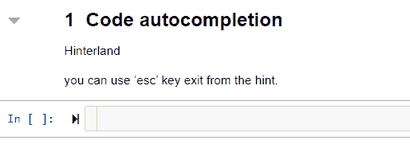
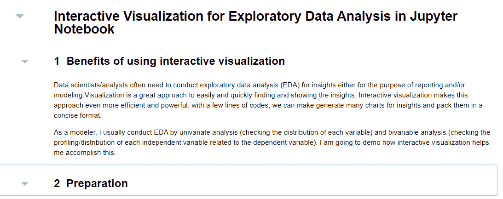

# 现在就打开 Jupyter 笔记本的这六个高级用户功能

> 原文：<https://medium.com/analytics-vidhya/turn-on-these-six-power-user-features-of-your-jupyter-notebook-now-a80e35854358?source=collection_archive---------16----------------------->


Ian Stauffer 在 Unsplash 上拍摄的照片

# 你是 Jupyter 笔记本的超级用户吗？

你可能用过一段时间 Jupyter Notebook 做编程。你一直在用的 Jupyter 笔记本有哪些功能？我听到一些用户抱怨 Jupyter Notebook 不如其他编辑器如 VS，spyder 等强大..这是真的吗？

我不得不承认，在我发现 QuantEcon 网站([https://github.com/QuantEcon/lecture-python-intro.notebooks](https://github.com/QuantEcon/lecture-python-intro.notebooks))的笔记本之后，我才开始成为 Jupyter 笔记本的超级用户。他们的笔记本看起来棒极了。事实上，有一个基于这些笔记本的打印输出书版本。在研究了他们的笔记本之后，我发现了 Jupyter 笔记本的一些高级特性，这是超级用户必须知道的。

我将在下面与您分享这些高级功能。

# 关于 Jupyter 笔记本电脑，您应该知道的六个高级用户功能

# 1.代码自动完成。

这是我推荐打开的第一个特性，因为它对所有程序员来说都非常强大。您可以通过启用**【腹地】**nbextension 来开启此功能。



没有人能记住所有的命令和语法。代码自动完成是一个智能特性，它自动完成常用命令，让您在编码时节省时间和精力。它将检查命令/方法是否可用于特定对象。因此，代码自动完成不仅会提高您的键入准确性，还会确保您使用正确的命令和方法，而无需测试运行您的代码。

您可以按“enter”键选择推荐的代码，或按“esc”键退出提示。

# 2.可折叠标题。

我们可以用标题将整个笔记本分成几个部分。这非常有用，尤其是当你的程序有点长的时候。扩展“可折叠标题”使所有级别的标题都可以折叠和展开。这个特性使你的程序更加结构化。



# 3.编辑器中的代码折叠。

这个特性使我们能够在一个代码单元中折叠和展开多行代码。类似于可折叠的标题，这个特性使得代码易于阅读和诊断编码错误。


# 4.目录

就像每本书都有目录一样，我认为每个 Jupyter 笔记本程序也应该包括目录(TOC)。目录基于程序中使用的标题。TOC 使得在程序中导航变得非常容易。


# 5.执行时间。

如果你还在用%%timeit 记录代码运行时间，你一定会爱上 nbextension 'ExecuteTime '启用此功能后，代码单元上次运行的时间以及运行时间的信息将显示在每个代码单元的下方。您不再需要使用%%timeit 来手动记录代码单元执行信息。


# 6.现场演示。

你能想象你能把你的 Jupyter 笔记本变成一个实时演示平台吗？Nbextension 'RISE '让这一奇迹发生。使用“上升”，您可以设置每个降价单元格和代码单元格的幻灯片类型。“崛起”使忙碌的程序员能够用最少的努力从他们的编程工具中创建一个令人印象深刻的演示平台。您甚至可以在演示时运行代码单元格。

您可以将演示文稿导出为 pdf 并与其他人共享。


# 如何打开这些高级用户功能？

如果之前没有用过 nbextensions，需要先安装 Jupyter 笔记本 Nbextensions。

Jupyter 笔记本 nbextension 文档([https://jupyter-contrib-nbextensions . readthedocs . io/en/latest/install . html](https://jupyter-contrib-nbextensions.readthedocs.io/en/latest/install.html))解释了如何安装 nb extension。简而言之，你可以采取以下三个步骤:

1.  安装 Python 包。

```
# pip installation: 
pip install jupyter_contrib_nbextensions
```

2.安装 javascript 和 css 文件。

```
jupyter contrib nbextension install --user
```

3.启用扩展。

```
jupyter nbextension enable codefolding/main
```

一旦通过这三个步骤完成了 nbextensions 的安装，您就可以激活所选的 nbextensions，如下所示:


所以，不用再等了。现在，打开 Jupyter 笔记本的这些高级用户功能，开始提高您的编程效率。

正如您将看到的，还有许多其他的 nb 扩展可用。如果发现有特别有用的，请分享给我。

注意:大部分动画插图图片来自我的另一篇帖子:

## [Jupyter 笔记本中探索性数据分析的交互式可视化](/@ppeng08/interactive-visualization-for-exploratory-data-analysis-in-jupyter-notebook-adc826e1e76a?source=friends_link&sk=222682550f11d7120c3eacc5f4b77dbe)