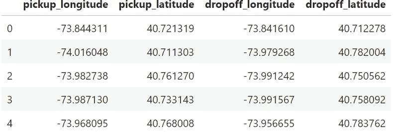
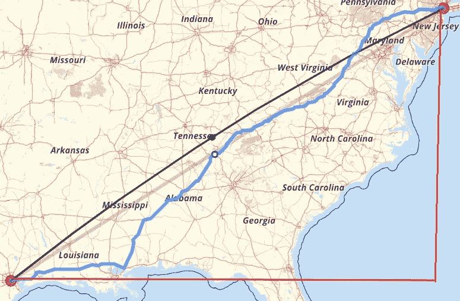
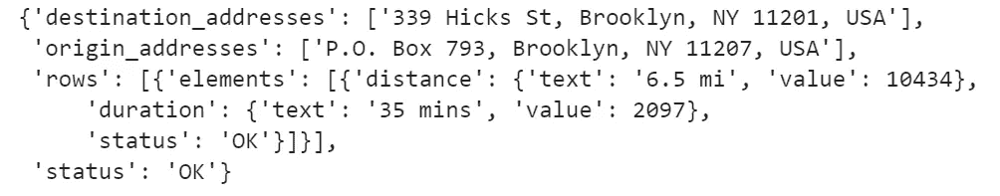
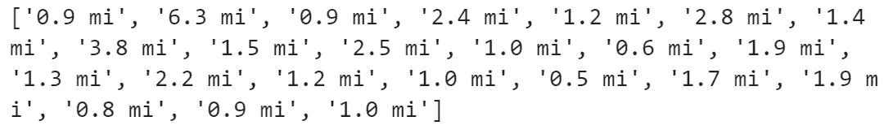
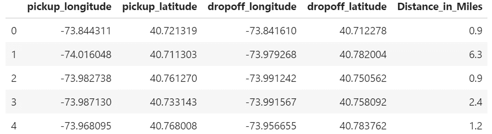

# 在 2 英里内右转:使用谷歌地图 API 和熊猫查找距离的简单方法

> 原文：<https://medium.com/analytics-vidhya/turn-right-in-2-miles-finding-distances-using-the-google-maps-api-and-pandas-fef8554f0b7d?source=collection_archive---------4----------------------->

# 背景

每天都会产生大量的位置数据。优步、Lyft、谷歌地图、Yelp、Lime 和许多其他公司都在各自的平台上使用和生成这些数据。有大量的信息等待访问，但是您可能会发现自己需要一些关于如何处理这些数据并从中获得洞察力的指导。

在本帖中，我们将使用 Google Maps API，在给定纬度和经度的情况下，确定上下车地点之间的距离。

我们将查看以下数据框架来计算接送点之间的距离:

```
df.head()
```



在访问 API 之前，您需要首先[在谷歌地图平台上创建一个账户](https://developers.google.com/maps/documentation)。

请注意，你将不得不把支付信息，但你得到每月 200 美元的信用免费访问。如果您需要访问更多 API，可以在[这里](https://cloud.google.com/maps-platform/pricing/sheet/?_ga=2.244908933.1023964652.1576690143-691402014.1576690143)找到更多定价。查看距离矩阵单元。

我使用的数据来自 Kaggle，可以在这里找到。

# 为什么要使用谷歌地图 API？

根据您对数据的处理，您可能希望以不同的方式计算距离。下面，我将讨论两种流行的利用三角形计算距离的方法(勾股定理)。谷歌地图 API 给你实际的驾驶距离，因此如果你的模型需要这种精度，它可以更精确。

让我们看一个例子，用每种方法计算从纽约到休斯顿的距离:

**欧几里德距离**

欧几里得距离被计算为直角三角形的斜边，就像勾股定理一样。这只是一条从 A 点到 b 点的直接路径。在下图中，这将是黑线。欧几里得距离大约是 1417 英里。虽然不完美，但这可能是对飞行距离的一个很好的估计。



**曼哈顿距离**

曼哈顿距离的计算方法是直角三角形边的总和。这在图中用红线表示。从纽约到休斯顿的曼哈顿距离约为 2015 英里。这种方法有其问题，但在基于网格的城市中可能是一个很好的估计。

**谷歌地图 API 距离**

谷歌地图 API 给我们提供了实际的行驶距离，就像你在谷歌地图手机应用程序中绘制从纽约到休斯顿的地图一样。在图像中，蓝线是谷歌地图的 API 距离，大约为 1，630 英里。如果您有优步数据或任何其他想要了解行驶距离的数据，这将非常有用。

根据您的目的，每种方法都有其优点和缺点，但是我们将在下面的代码中介绍如何访问 Google Maps API 距离。

理解这个 API 遵循交通规则是很重要的。因此，您的纬度和经度需要尽可能精确。如果你只偏离了 10 英尺，API 可能会认为你在马路的另一边，并错误地计算了驾驶距离。

# Python 代码

## 1.要导入的包

*   **pandas**:Python 中的数据分析工具。这些可以用来操作数据和创建数据帧。
*   **json** :数据交换包。我用它来访问存储在. json 文件中的 API 密钥；这是为了保持我的 API 密匙私有。
*   **请求:**使用最常见的 HTTP 方法发出请求。

```
import json
import requests
import pandas as pd
```

## 2.使用 Test Try 访问 API

首先，您需要访问您的 API 密钥。我把我的 API 存储在不同的。json 文件，并使用下面的代码访问它们(如果您有访问 API 密钥的首选方式，那么就使用它。):

```
def get_keys(path):
    with open(path) as f:
        return json.load(f)API_key = get_keys("/Users/Documents/google_key.json")google_key = list(API_key.values())[0]
```

引入 API Url 并调用一个测试(我通常从在 Postman 中进行测试开始，然后转移到我的 Jupyter 笔记本)。输出如下所示:

```
url = f"[https://maps.googleapis.com/maps/api/distancematrix/json?units=imperial&origins=40.6655101,-73.89188969999998&destinations=40.6905615%2C-73.9976592&key={google_key](https://maps.googleapis.com/maps/api/distancematrix/json?units=imperial&origins=40.6655101,-73.89188969999998&destinations=40.6905615%2C-73.9976592&key={google_key)}"r = requests.get(url)
data = r.json()
data
```



好吧，看来 API 成功了。我们可以在上面的输出中看到信息。对于这个特殊的例子，我只对显示我“6.5 英里”的参数感兴趣——或者行程的距离。我们可以使用以下代码来访问该特定项目:

```
data['rows'][0]['elements'][0]['distance']['text']
```

这将输出字符串:“6.5 英里”

我们稍后将处理字符串。

## 3.访问数据帧中所有值的 API

现在我们知道了如何访问 API，我们希望对数据帧中的每一行都这样做。我首先将每个 lat/long 转换成它们自己的列表，并遍历每个列表项的 API。

```
lat_origin = df['pickup_latitude'].tolist()
long_origin = df['pickup_longitude'].tolist()
lat_destination = df['dropoff_latitude'].tolist()
long_destination = df['dropoff_longitude'].tolist()distance = []
for i in range(len(long_destination)):
    url = f"[https://maps.googleapis.com/maps/api/distancematrix/json?units=imperial&origins={lat_origin[i]},{long_origin[i]}&destinations={lat_destination[i]}%2C{long_destination[i]}&key={google_key](https://maps.googleapis.com/maps/api/distancematrix/json?units=imperial&origins={lat_origin[i]},{long_origin[i]}&destinations={lat_desitnation[i]}%2C{long_destination[i]}&key={google_key)}"
    r=requests.get(url)
    data = r.json()
    try:
        distance.append(data['rows'][0]['elements'][0]['distance']['text'])
    except:
        passdistance
```



从上面的输出可以看到，我们现在有了一个距离列表，按照我们从 API 访问它们的顺序排列。

## 4.清理数据并添加到数据帧

最后，我们将从列表中的每个项目中删除“mi ”,然后将新列表放入我们的原始数据帧中。

```
distance2 = []
for i in range(len(distance)):
    distance2.append(float((distance[i].replace(' mi', ''))))df['Distance_in_Miles'] = distance2df.head()
```



从上图中，您可以看到带有经度/纬度数据的原始数据框架，以及我们创建的新列，该列显示了每次旅行的行驶距离。

有许多方法可以找到位置之间的距离，但是您必须了解哪种方法可以为您正在处理的项目或模型增加最大的价值。Google Maps API 是一个有用的工具，可以用来查找两点之间的行驶距离。