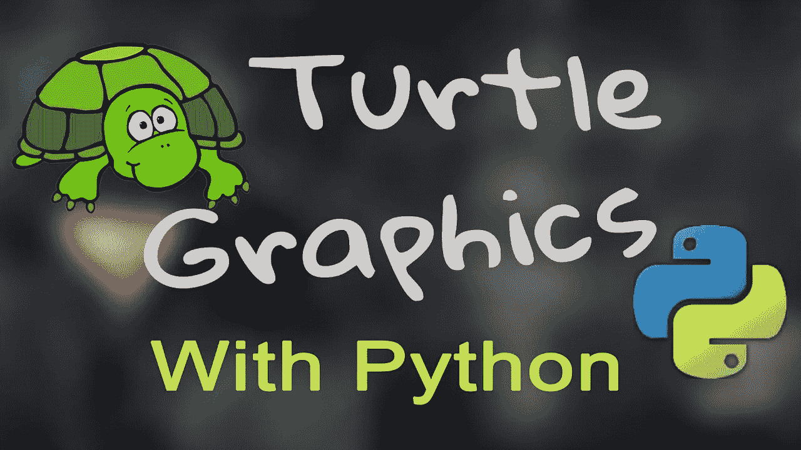
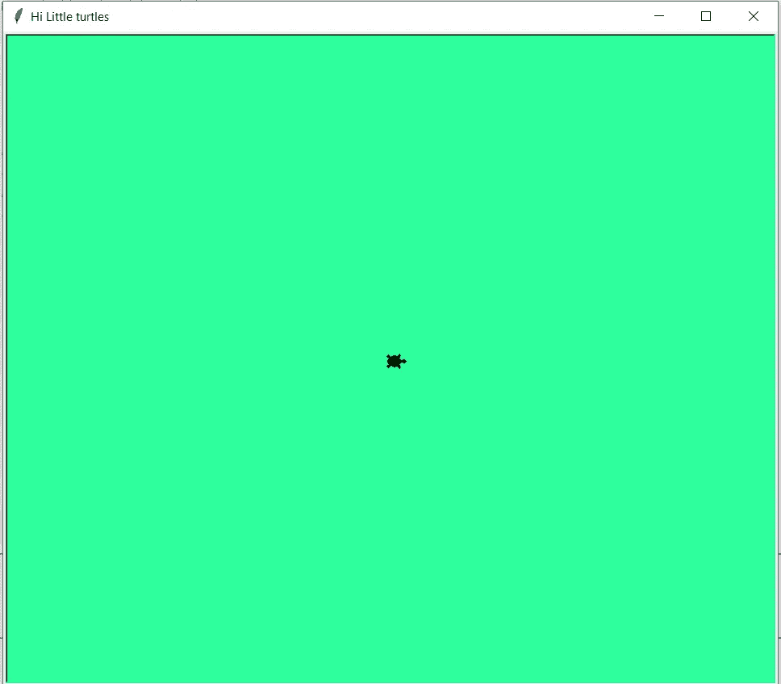
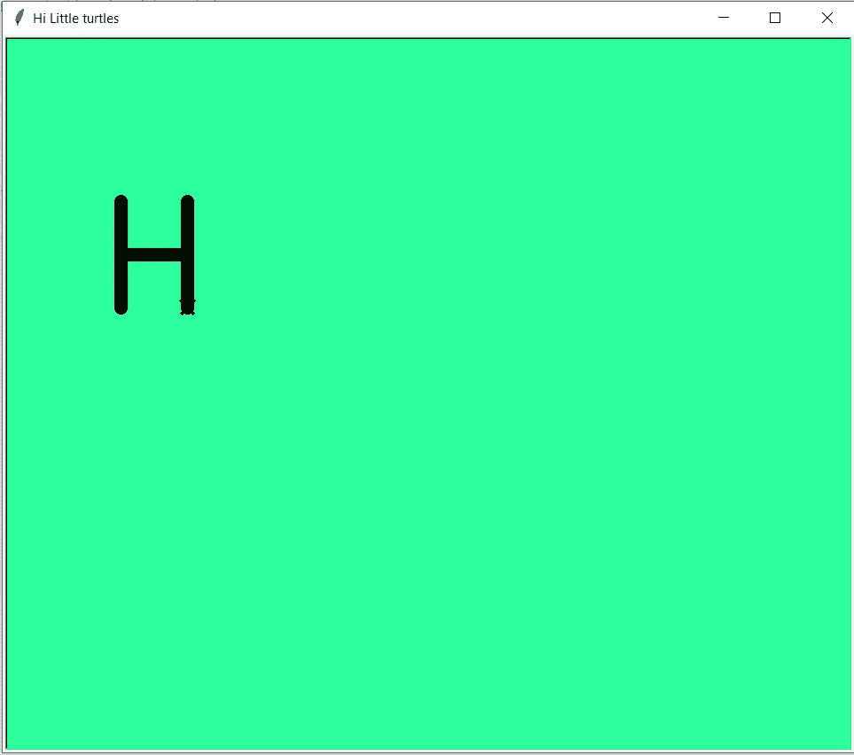
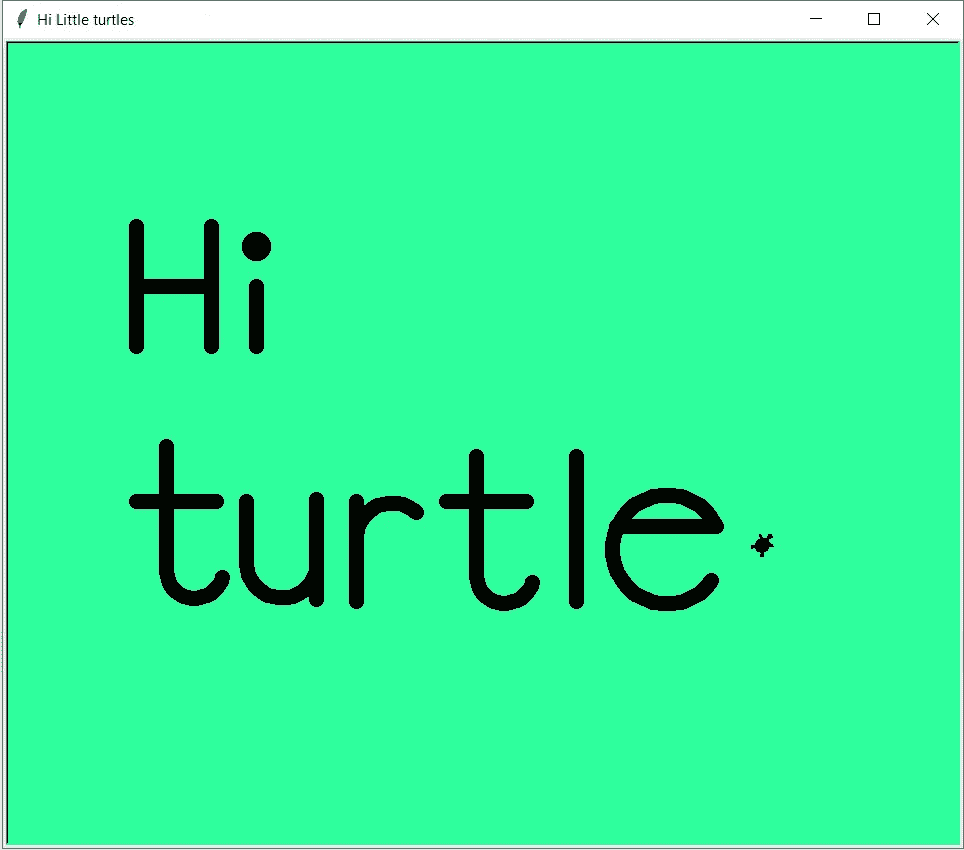

# 蟒蛇皮海龟图案

> 原文：<https://medium.com/analytics-vidhya/turtle-graphics-in-python-99fa9dc98c78?source=collection_archive---------17----------------------->

“乌龟”是一个类似画板的特征。我们可以给创造出来的乌龟下达命令，让它画出我们想要的东西。为此，需要遵循四(4)个步骤。



1.  导入海龟模块。
2.  创建一只乌龟来控制。
3.  用海龟的方法画周围。
4.  运行 turtle.done()。

# 第一步:导入海龟模块。

“海龟”库应该进口，使使用“海龟”的方法来控制我们的海龟。

```
import turtle    #import the turtles library
```

# 第二步:创建一只乌龟来控制。

导入这个库后，我们应该创建一个新的画板/屏幕和一只乌龟。创建画板时，我们可以指定标题和背景颜色。(这里，我用了 RGB 色码)

```
turt = turtle.Screen()            #create a graphic window
turt.title("Hi Little turtles")   #assign a title name
turt.bgcolor("#2EFF9E")           #assign a background color
```

现在，画板准备好了，我们需要创造一只乌龟。我们可以指定笔的大小、速度、颜色和乌龟的形状(“乌龟”、“经典”、“箭头”、“圆形”)。

```
casper=turtle.Turtle()          #creat turtle called casper
casper.pensize(15)              #set width of the line
casper.shape("turtle")          #set shape of the pointer 
casper.pencolor("black")        #set a colour to draw
casper.speed(10)                #set pen speed
```

现在，你的乌龟(卡斯帕)准备好了。



# 第三步:用海龟方法四处画。

在开始画之前，我们必须了解海龟的方法。这里，已经提到了一些方法。

1.  **前进(数量)-** 乌龟向前移动
2.  **向后(量)-** 乌龟向后移动
3.  **右转(角度)-** 乌龟右转(顺时针)
4.  **向左(角度)-** 乌龟向左(逆时针)
5.  **goto(x，y)-** 乌龟在 x 轴和 y 轴上移动
6.  **penup()-** 拿起笔
7.  把笔放下
8.  **点()-** 将点留在当前位置
9.  **形状(形状名称)-** 指针的形状

# 让我们给我们的乌龟下命令吧

要画字母“ **H** ”，

```
#commands for letter "H"
casper.penup()               #pick the pen up
casper.goto(-350,100)        #turtle moves to position (-350,100)
casper.pendown()             #put the pen down
casper.left(90)              #turtle turns left by 90 degrees
casper.forward(120)          #turtle moves forward by 120 units
casper.goto(-350,160)
casper.right(90)             #turtle turns right by 90 degrees
casper.forward(75)
casper.left(90)
casper.forward(60)
casper.backward(120)         #turtle moves backward by 120 units
```



通过一步一步的画，我们可以画出“嗨，海龟”。



# 第四步:运行 turtle.done()。

现在，我们可以用 turtle.done()函数来完成程序。

下面是完整的 python 代码，

```
import turtle                   #import the turtles libraryturt = turtle.Screen()            #create a graphic window
turt.title("Hi Little turtles")   #assign a title name
turt.bgcolor("#2EFF9E")           #create a graphic windowcasper=turtle.Turtle()          #creat turtle called casper
casper.pensize(15)              #set width of the line
casper.shape("turtle")          #set drawing pointer shape
casper.pencolor("black")        #set a colour to draw
casper.speed(10)                #set pen speed#commands for letter "H"
casper.penup()
casper.goto(-350,100)
casper.pendown()
casper.left(90)
casper.forward(120)
casper.goto(-350,160)
casper.right(90)
casper.forward(75)
casper.left(90)
casper.forward(60)
casper.backward(120)#commands for letter "i"
casper.penup()
casper.goto(-230,100)
casper.pendown()
casper.forward(60)
casper.penup()
casper.goto(-230,200)
casper.pendown()
casper.dot()
casper.penup()#commands for letter "t"
casper.goto(-320,0)
casper.pendown()
casper.backward(125)
casper.right(180)
for i in range(20):
    casper.left(8)
    casper.forward(4)
casper.penup()
casper.goto(-350,-55)
casper.pendown()
casper.right(70)
casper.forward(80)#commands for letter "u"
casper.penup()
casper.goto(-240,-55)
casper.pendown()
casper.right(90)
casper.forward(63)
for i in range(20):
    casper.left(8)
    casper.forward(5)
casper.left(20)
casper.forward(72)
casper.backward(100)#commands for letter "r"
casper.penup()
casper.goto(-130,-55)
casper.pendown()
casper.backward(100)
casper.forward(65)for i in range(16):
    casper.right(8)
    casper.forward(5)
casper.penup()
#commands for letter "t"
casper.goto(-10,-10)
casper.right(232)
casper.pendown()
casper.backward(120)
casper.right(180)
for i in range(20):
    casper.left(8)
    casper.forward(4)
casper.penup()
casper.goto(-40,-55)
casper.pendown()
casper.right(70)
casper.forward(80)#command for letter "l"
casper.penup()
casper.goto(90,-55)
casper.pendown()
casper.left(90)
casper.backward(100)
casper.forward(145)
casper.penup()#command for letter "e"
casper.goto(130,-80)
casper.pendown()
casper.right(90)
casper.forward(100)
casper.left(110)
for i in range(30):
    casper.left(10)
    casper.forward(9.5)
casper.penup()
casper.goto(275,-100)turtle.done()
```