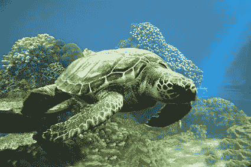
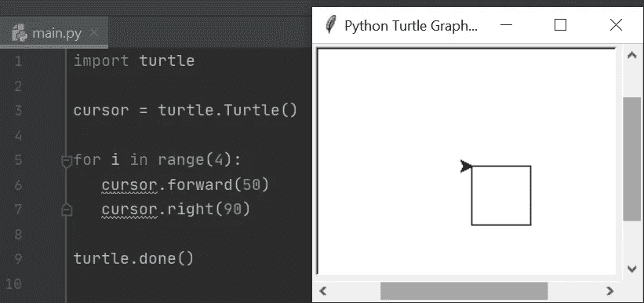
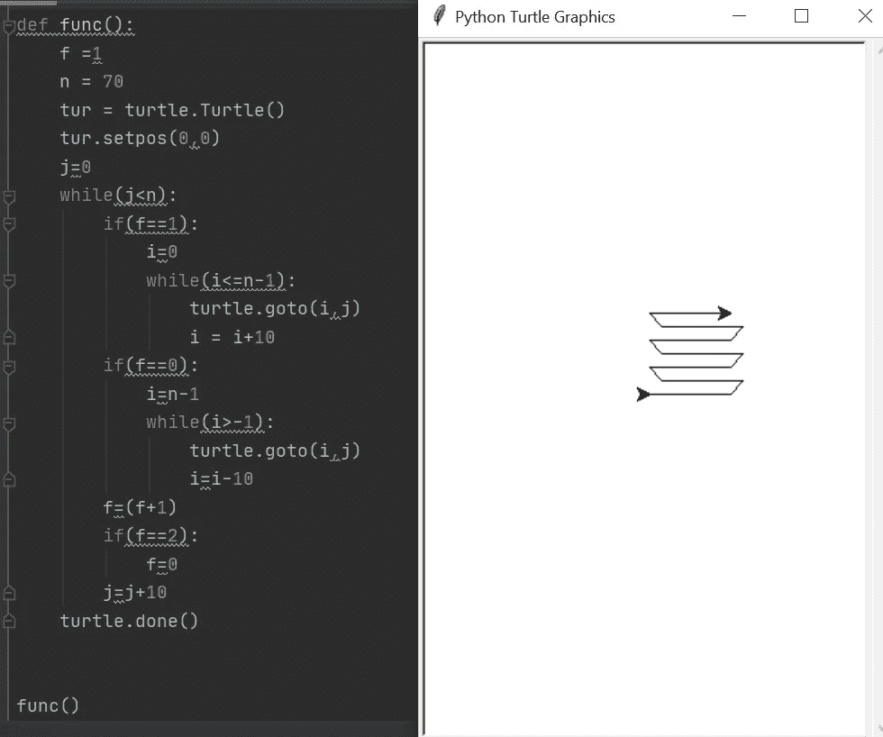
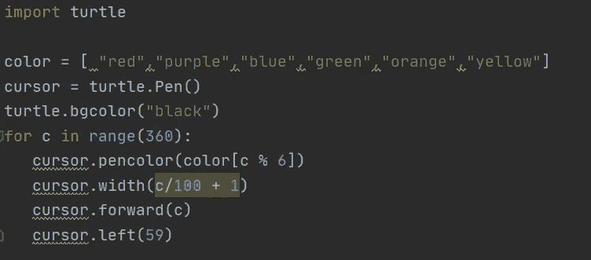
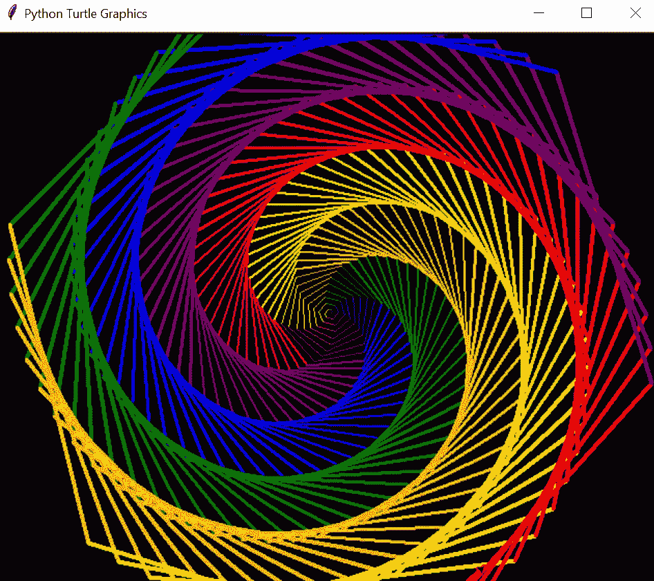

# 蟒蛇皮海龟

> 原文：<https://medium.com/analytics-vidhya/turtle-in-python-6efc3494b26e?source=collection_archive---------6----------------------->

了解 python 中的 turtle 库，您可以将它用于矢量图形并创建漂亮的图案和形状。

海龟图形的灵感来自真正的海龟和它们的动作！

# 关于乌龟:

Python 中的 Turtle 允许你画出形状和图案之类的东西。它是 Python 中的一个库，你可以导入它，然后用它来画你想要的任何东西。在这里，你会看到一个屏幕上的指针形状的光标，你可以命令向左，向右，向后或向前移动，为你画点什么，这个指针形状的光标被称为“海龟”。

向孩子们讲授 turtle 是向他们介绍编程的一种有趣方式。在这个的帮助下，你可以创建一些很酷的迷你游戏或者动画，包括贪吃蛇游戏。

# 一点历史:

这个海龟图形的概念在 1966 年由沃利·弗兹格和西蒙·派珀特开发的标志编程语言中使用。" **Logo** 是一种通用的*教育编程语言*，用来教授与函数式编程语言 Lisp 相关的编程概念。

# 使用海龟:

让我们看一些语句(下面用粗体写的)开始用 python 实验海龟图形:

导入海龟库并使用其功能:**导入海龟**

创建一个你将要绘制的屏幕: **myscreen = turtle。Screen()**

改变屏幕颜色: **myscreen = turtle.bgcolor("浅蓝色")**

给你的屏幕加个标题: **myscreen = turtle.title("我的画板")**

创建一个为你绘制的乌龟光标对象:**turtle = turtle。海龟()**

将乌龟光标向右移动 90 度:**tortoise = turtle . right(90)**

将乌龟向后移动 120 度:**乌龟=乌龟.向后(120)**

注意**我的屏幕**和**乌龟**是变量名，你可以用任何其他单词代替它们。这完全是你的选择。此外，这个 turtle 库中还有很多其他的内置函数，你可以在[文档](https://docs.python.org/3/library/turtle.html)中查看。

# **使用海龟库创建方块**

使用 turtle 库创建正方形的代码，如右侧所示

# 使用 turtle 创建模式的另一个例子:

如果尝试上面的代码，不要忘记首先导入 turtle。

# 让我们用乌龟创造一个美丽的图案

现在，既然你已经了解了 turtle，让我们来看看你可以创建的一个漂亮的小图案。尝试如下图所示的代码:

试试这段代码吧！

上面代码的输出

想了解更多关于海龟的信息，我推荐去看看这个。

结束了。希望这篇文章对你有帮助:)