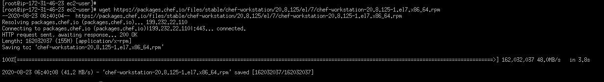
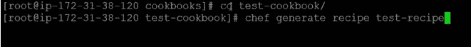

# 教程-2:如何创建食谱和食谱厨师

> 原文：<https://medium.com/analytics-vidhya/tutorial-2-how-to-create-cookbook-and-recipe-chef-4c6467956d40?source=collection_archive---------17----------------------->

在本教程中，我们将创建一个文件使用厨师食谱和食谱。如果你不知道什么是食谱，我推荐你去看看我以前的博客。[https://medium . com/@ ommore 524/chef-tutorial-1-简介-配置-管理-工具-cmt-chef-ff03a4eab5ad](/@ommore524/chef-tutorial-1-introduction-to-configuration-management-tool-cmt-chef-ff03a4eab5ad) 。只需遵循以下步骤:

1.  首先，你需要一个安装在机器上的厨师。在我的情况下，我要去 AWS linux 机器。你也可以使用你的系统。


图一。Aws 实例

2 .去 https://downloads.chef.io/products/workstation?os=el 的。根据您的系统配置，即操作系统，复制下载链接。在我的例子中，我使用的是 AWS linux 机器，默认是 Red Hat。


图 2 厨师网站

3.去 linux 机器写 wget

```
wget [https://packages.chef.io/files/stable/chef-workstation/20.8.125/el/7/chef-workstation-20.8.125-1.el7.x86_64.rpm](https://packages.chef.io/files/stable/chef-workstation/20.8.125/el/7/chef-workstation-20.8.125-1.el7.x86_64.rpm)
```



图三。[计] 下载

4.使用“ls”安装的包的检查列表。使用命令' yum install <package name="">安装软件包。</package>


5.安装检查已成功。写命令 **chef - version。**


6.现在，我们将开始创建一本食谱和食谱。整个想法是


7.制作一本食谱目录。请注意，目录名应该相同。


8.进入 cookbooks 文件夹，使用命令“***chef generate cookbook test-cookbook***”创建一个名为“test-cookbook”的 cookbook


9.现在你已经完成了你的食谱。现在进入 test-cookbook 文件夹，用命令***chef generate recipe test-recipe 生成一个名为‘test-recipe’的食谱。***



10.现在回到 cookbooks 目录，使用 vi 命令'***VI test-cookbook/recipes/test-recipe . Rb****'打开一个测试配方文件。*键入 I 作为插入模式，并键入以下行。进入 escape 并键入 **:wq** 从其中出来。

```
file ‘/myfile’ do content ‘ welcome to chef ’action :createend
```

11.执行命令'***chef exec ruby-c******test-cookbook/recipes/test-recipe . Rb***'检查代码写的是否正确。现在使用***chef-client-Zr“recipe[test-cookbook::test-recipe]”应用一个食谱。***


12.一旦你应用了代码。您现在可以看到，在根目录中创建了名为 myfile 的文件。如果您尝试再次应用该命令，它会显示“最新”


现在，您已经创建了一个简单的食谱和食谱来在系统中创建一个文件。