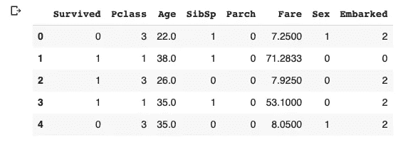
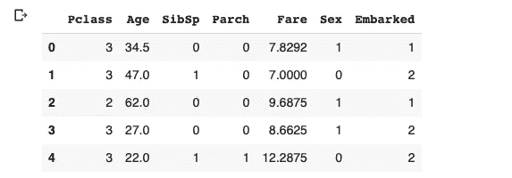
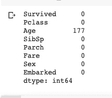
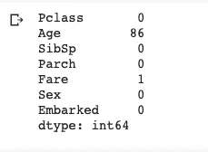
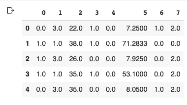
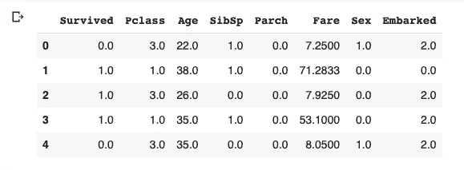
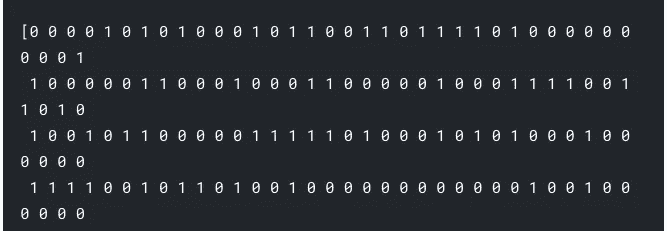

# 教程:关于 Keras 顺序 API (Tensorflow 2.0)的详细笔记

> 原文：<https://medium.com/analytics-vidhya/tutorial-a-detailed-notebook-on-keras-sequential-api-tensorflow-2-0-30480ca8ea73?source=collection_archive---------9----------------------->

S o，这是我上一篇教程[的下一部分教程:tensorflow2.0](/analytics-vidhya/tutorial-a-quick-overview-of-tensorflow2-0-b28e5c6906fa) 快速概览。在上一个教程中，我们学习了 tensorflow2.0 的所有基础知识和不同类型的 Keras API。

看看吧！如果你还没有！链接在上面。

那么我们就从 Keras tensorflow2.0 中的顺序 API 的详细分析开始吧，这里我们要借助顺序 API 在 Titanic 数据集上进行预测。你可以从[这里](https://www.kaggle.com/c/titanic/data)下载数据集。和我一起做这件事。

正如我以前告诉过你的。我首选的运行 tensorflow2.0 的方式是 Google Colab。它为我们提供 CPU/ GPU/ TPU 支持。在 Google Colab 中，直接导入 TensorFlow，它会返回给你最新的版本。Keras 运行 tensorflow2.0 作为后端。

> 我将在下一篇教程中展示如何将任何 Kaggle 数据集直接下载到 Google Colab 中。(此处将编辑/更新[链接。)](https://media.giphy.com/media/3oz8xqUy7P6IWIq8G4/giphy.gif)

1.  **导入库**:让我们导入助手库。

```
*# Import Basic Libraries* 
import numpy as np *# numerical data processing*
import pandas as pd *# data processing, CSV file I/O*# This will be some files of titanic dataset downloaded from kaggle
titanic/train.csv
titanic/gender_submission.csv
titanic/test.csv
```

让我们导入所需的 TensorFlow 库。

```
# Sklearn.preprocessing module for preprocessing of data 
from sklearn import preprocessing# Import Keras from tensorflow backend
from tensorflow.python import keras# SimpleImputer for filling missing values
from sklearn.impute import SimpleImputer# Import tensorflow
import tensorflow as tf# Import Sequential class (i.e for putting it together)
from tensorflow.python.keras.models import Sequential# Import different layers from Layer class
from tensorflow.python.keras.layers import Dense, Dropout
```

> 在这里，我们导入将用于这个项目的库。我们将使用 Keras 库构建一个序列模型，并实现 dropout 来对抗任何类型的过度拟合。我们将使用 sklearn 的简单估算器来填充不在数据集中的值，并使用 LabelEncoder 来标记分类值，以便它们是数字值。

2.**导入数据:**现在让我们导入本地目录中的 titanic 数据集。

```
# Import Data
train_data = 'titanic/train.csv'
test_data = "titanic/test.csv"
```

> 对于接下来的 2 个单元格，我们将把 csv 文件转换成 Pandas 数据集。在我们将它们加载到 Pandas 中之后，我们将使用 head()方法来检查文件是否被正确加载。

```
# Load data in pandas dataframe
train = pd.read_csv(train_data, index_col = "PassengerId")# Take look at the data
train.head()
```


上述单元的输出

```
# Load data in pandas dataframe
test = pd.read_csv(test_data)# Take look at the test data
test.head()
```


测试数据如上所示

厉害！一切看起来都已经正确加载。所以我们想去掉一些数据，因为它对我们的模型影响很小，甚至可能完全破坏我们的模型。有太多唯一值或缺少值的列对我们来说几乎没有用处。有一个方法可以返回一个列中所有唯一的值，但是我们在这里只是使用常识，说我们不想要这些列(“Name”、“Cabin”、“Ticket”)。这些都是对我们的模型的准确性几乎没有影响的列，甚至更糟的是可能使数据过度拟合，使它看起来在我们的验证集上表现很好，但在我们的测试集或真实世界中表现很差。这是因为模型将开始学习唯一变量(如名称)，并在训练时给它们太重的权重。我们可以通过使用 drop()方法来实现这一点，但是我们会用一种不同的方式来排除它们，我稍后会对此进行解释。

对于我们的下一个单元格，我们将使用 LabelEncoder。我可以从 sklearn . preprocessing import label encoder 中使用“ ***”完全导入上面的内容，但是我还想展示另一种访问它的方法。我们已经导入了预处理，所以我们可以用点符号来访问这个方法。我们需要做的第一件事是找出哪些列是分类的(需要标记)，然后找出哪些列是数字的。我们可以通过简单地查找我们在上面打印了几个单元格的表格来做到这一点。对于标签编码，我们需要我们的分类列(任何不是 int 或 float 的列)，所以我们有(" Name "、" Sex "、" Cabin "、" Embarked ")。我们不希望名字或小屋出现在最终的训练集中，所以我们不会费心给它们贴标签。***

因此，让我们继续前进，使自己成为一个标签编码器。

```
# Create Labelencoder object
encoder = preprocessing.LabelEncoder()
```

> 很简单吧！接下来，我们将列出要编码到数据中的特征。

```
# Select categorical features
cat_features = ["Sex", "Embarked"]
```

当我们实际编码我们的标签时，我们会得到一个错误，说 apolloed 不属于 str 类型，但只用于训练数据集，而不是测试数据集。太奇怪了！这很容易解决。astype()方法！因此，我们将从我们的训练熊猫中提取列，并用下面的这行代码将其转换为一列字符串。

```
train["Embarked"] = train["Embarked"].astype(str)
```

现在我们对训练和测试数据集进行编码。为什么？因为我们正在训练我们的模型，即“性别”列只有 1 和 0，当我们进行预测时，它将无法连接“男性”是 0 或“女性”是 1。因此，我们创建了一个编码数据集，其中包含我们为编码而留出的列(cat_features)。

```
encoded_train = train[cat_features].apply(encoder.fit_transform)
encoded_test = test[cat_features].apply(encoder.fit_transform)
```

现在，我们必须将所有的数字列(除了“Ticket”)放在一个列表中，我们还需要将测试数据的所有数字列(除了“Ticket”)放在一个组中。

```
# Select num features
num_features = ["Survived","Pclass","Age","SibSp","Parch","Fare"]
test_features= ["Pclass","Age","SibSp","Parch","Fare"]
```

现在，这就是我们创造奇迹的地方。我们会将编码数据重新加入到我们的常规测试和训练集中。但是当我们这样做时，我们将只接受我们想要的列(除了姓名、客舱和机票之外的所有内容)，并且我们已经做了所有的工作来实现这一点！

> 让我们看看我们的新数据是什么样的。

```
training_data.head()
```



预处理后的数据是这样的！

> 还有测试的那个。



预处理后的测试数据是这样的！并且必须对两种数据进行相同的预处理。

酷，现在我们的数据是我们的模型可以理解的格式，但是等等，有没有丢失的值？！让我们通过使用 **isnull()** 方法和 **sum()** 方法获得数据中所有空值的总和来进行检查。

```
# Look for null values
training_data.isnull().sum()
```



那么谁最缺少价值观呢？

```
# Look for missing values in test data
test_data.isnull().sum()
```



你现在只看！

看起来我们的数据还没有完全准备好。这里有很多选择。我们可以放弃列年龄，但我们不喜欢丢失所有这些数据。我们可以用 0 填充它，但我们不希望它过多地偏离我们的数据，所以让我们继续使用插补来填充这些值。插补允许您使用列表中所有缺失年龄的平均值等值来填充值。这似乎是保持模型准确的最佳选择。

我们将在同一个单元格中定义估算器并转换我们的数据集。

```
# Define Imputer object
my_imputer = SimpleImputer()# Fit and transform train data
imputed_train = pd.DataFrame(my_imputer.fit_transform(training_data))# Fit and transform test data
imputed_test_data = pd.DataFrame(my_imputer.fit_transform(test_data))
```

现在让我们再次检查我们的数据。

```
imputed_train.head()
```



估算数据！

呃哦！看起来我们的列标签不见了！我们的索引标签也是如此！这很好，我将保留索引标签，因为它们并不重要，但我们确实需要重置列标签。每次估算时都会发生这种情况，需要解决。

```
# Apply col names again
imputed_train.columns = training_data.columns
imputed_test_data.columns = test_data.columns
```

> 我们检查我们的数据



对不对？

终于！我们的数据已经准备好为我们的模型拆分。我们有我们想要预测的(y ),还有我们需要定义的预测因子(X)。对于 X，我们将创建一个没有“**幸存**”的熊猫数据帧，因为这是我们试图预测的。我们告诉代码它可以在 axis=1 上找到(它表示列)。我们给 Y 贴上标签，除了“**幸存**”。

```
# Drop the target column
X = imputed_train.drop("Survived", axis = 1)# Store the target column in y
y = imputed_train["Survived"]X.shape # (891, 7)
```

一切看起来都很好！现在我们设置我们的随机种子。它可以是您想要的任何数字，但建议您为模型一致性设置一个数字。

```
tf.random.set_seed(42)
```

现在是时候建立我们的模型了！我们将构建一个**顺序模型**。这是您可以从头开始构建模型的地方。我知道这是一个初学者教程，但我们不会把这个弄得太复杂。让我们从定义模型变量开始。

> 什么是*顺序 API* ？(一般来说)在这里勾选[和](/analytics-vidhya/tutorial-a-quick-overview-of-tensorflow2-0-b28e5c6906fa)

```
# Create model object of Sequential type
model = Sequential()
```

我们将第一层设置为具有 7 个神经元的**密集**，以及一个“ **Relu** 激活函数。理解本笔记本的所有激活功能并不是非常重要，但建议您了解它们是什么以及如何使用它们。第一层需要始终具有参数 input_shape。我们可以在使用 shape 方法的地方查找，找出它是什么。形状列为(891，7)，我们将输入行，因此 input_shape 为(7，)。我们还实现了一个叫做 dropout 的方法。简而言之，它在训练时关闭随机神经元，以避免过度拟合。使用参数(0.2)，我们告诉它关闭 20%的神经元。

```
# Add dense layer to sequence with add() function.
model.add(Dense(7, activation = "relu", input_shape = (7,)))# Add dropout layer to sequence with add() function.
model.add(Dropout(0.2))
```

现在让我们添加 2 个更密集的层，有 50 个神经元，重新激活。

```
# Add more
model.add(Dense(50, activation = "relu"))
model.add(Dropout(0.2))
model.add(Dense(50, activation = "relu"))
```

现在让我们添加我们的输出层。我们有 2 个类或从这个死或活(1 或 0)的结果，所以我们指定的层。我们正在使用 softmax 激活来对乘客生存进行分类。Softmax 将返回每个结果的概率，我们将选择最高的概率作为我们的预测。

```
# Add output dense layer
model.add(Dense(2, activation = "softmax"))
```

是时候将所有这些层编译在一起并构建模型了！我们需要定义我们的损失测量、我们的优化器和我们的准确性测量。有许多不同的选择，你绝对应该尝试一下。Adam 被认为是最好的优化者之一，你的准确性指标总是取决于你的模型和它预测的数据。

```
# Compile the model (It's like providing metadata)
model.compile(loss=keras.losses.sparse_categorical_crossentropy, optimizer = "adam", metrics = ['accuracy'])
```

是时候调整(训练)我们的模型了！我们传递之前得到的 X 和 y 数据。我们的批量大小将是 1，因为我们不会一次查看一个以上的乘客。历元是它将经历的训练周期的数量。我们将分离出 20%的数据进行验证。如果您想观看实际的训练，可以将 verbose 更改为 1。我觉得这很令人兴奋，但我相信如果其他人试图这样做，他们会觉得自己在看着油漆变干。

```
# Train the model
model.fit(X, y,
          batch_size=1,
          epochs=700,
          validation_split = 0.2,
          verbose = 0)# It returns training history
# Output will be <tensorflow.python.keras.callbacks.History at 0x7f576807d1d0>
```

我看着我的模特接受训练！

> 一个小时后……除非你不用谷歌可乐。

现在，让我们使用刚刚建立的模型来进行预测！

```
# Make prediction
preds = model.predict(imputed_test_data)
```

让我们看看它是什么样子的

```
print(preds)
```


这是什么？这是一个很长的列表

这不是我们想要的！还记得我说过 Softmax 会返回每个答案的概率吗？我们需要选择概率最高的一个作为我们的预测。我们将使用 **argmax** ()方法来实现这一点。

```
# Single valued predictions
predictions = np.array(model.predict(imputed_test_data)).argmax(axis=1)
print(predictions)
```



输出是正的还是负的

# 恭喜你从零开始为泰坦尼克号的生存预测建立了一个人工智能模型！

干杯！

接下来的教程，我们将学习！

1.  如何评价回归模型？链接会在这里。
2.  如何评价分类模型？链接会在这里。
3.  教程:关于 Keras Functional API(tensor flow 2.0)的详细笔记本。链接会在这里。
4.  教程:Keras 子类化 API 的详细笔记本(Tensorflow 2.0)。链接会在这里。
5.  如何将 Kaggle 数据集直接下载到 Google Colab 中？链接会在这里。

好吧，那我就告辞了，完整的代码可以在这里找到。

# 谢谢大家！