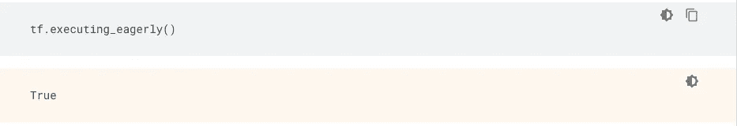

# 教程:tensorflow2.0 快速概述

> 原文：<https://medium.com/analytics-vidhya/tutorial-a-quick-overview-of-tensorflow2-0-b28e5c6906fa?source=collection_archive---------19----------------------->

很开心吧！

首先，让我告诉你。这只是对 tensorflow2.0 的一个概述，我不知道你的情况，但我在开始学习时对它感到非常困惑。许多博客和教程直接从**功能 API** 或**顺序 API**(Keras 框架的)开始，我就想“这是什么？”，“它们之间有什么联系？”，“先学什么？”诸如此类。

但是不要担心，我会在拥有它之前解决你所有的困惑。嗯，很抱歉还有第三个，即**子类化。**

> 不要慌！又不是火箭科学什么的！

**那么**我们开始吧！

> 我也是！**兴奋**嗯

# 什么是张量流？

**张量流。**是一个[免费的](https://en.wikipedia.org/wiki/Free_software)和[开源的](https://en.wikipedia.org/wiki/Open-source_software) [软件库](https://en.wikipedia.org/wiki/Library_(computing))，用于[数据流](https://en.wikipedia.org/wiki/Dataflow_programming)和[跨一系列任务的差异化编程](https://en.wikipedia.org/wiki/Differentiable_programming)。它是一个符号数学库，也用于[机器学习](https://en.wikipedia.org/wiki/Machine_learning)应用，如[神经网络](https://en.wikipedia.org/wiki/Neural_networks)。它被用于谷歌的研究和生产。

> 等一下。现在越来越理论化了，好吧！而上面的那一段，就是从维基上抄来的。

但是你知道这些技术知识也很重要。所以我会坚持下去，

在更技术性的方面，TensorFlow 允许你在 PC/Mac (CPU & GPU)、Android、iOS 和更多地方进行计算。当然，它是由谷歌创造的，旨在给你的反向传播思考带来巨大的并行性。所有魔术背后的主要抽象是[有状态数据流图](https://arxiv.org/pdf/1603.04467.pdf)。


你的数据在 TensorFlow 中的图表中流动

上图显示了在 Tensorflow 中流经图表的数据。虽然这是张量流的一个基本机制。但是现在这在 Tensorflow2.0 中被抽象了。你现在已经有了**急切的执行**。

> 等一下！什么是急切执行？

TensorFlow 的急切执行是一个命令式的编程环境，**立即计算运算** ( *简而言之，它允许我们以 Pythonic 方式*执行运算，而无需构建图形:运算返回具体值，而不是构建一个计算图形供以后运行。这使得开始使用 TensorFlow 和调试模型变得容易，并且减少了样板文件。

在 Tensorflow 2.0 中，默认情况下启用急切执行。现在可以运行 TensorFlow 操作，结果会立即返回。



在笔记本中运行上述程序块。

> 首先，告诉你知道 NumPy 吗？对！
> 
> NumPy 是一个用于处理数组的 python 库。它还具有在线性代数、傅立叶变换和矩阵领域工作的功能。

牢记在心。Tensorflow 也有自己的 NumPy 来处理数组。有点类似于 NumPy，但可能更有效。它叫做**张量**。

# **张量是什么？**

*张量是一个类型化的多维数组。例如，一个 4-D 浮点数数组，表示一个小批量的图像，其尺寸为[批次、高度、宽度、通道]。*

张量的基本运算，我们将在下一个博客中看到，因为这只是一个介绍性的博客。感兴趣的可以去查看[这里](https://www.tensorflow.org/guide/tensor)。

嘿，别这样！说重点

> 好吧！

# 我们先安装 Tensorflow2.0

> 转到[这里](https://www.tensorflow.org/install)获得在 Mac/ Windows/ Ubantu 中安装它的详细说明。

我首选的运行 tensorflow2.0 的方式是 Google Colab。它为我们提供 CPU/ GPU/ TPU 支持。在 Google Colab 中，直接导入 TensorFlow，它会返回给你最新的版本。

```
import tensorflow as tf
# you can check version with this command
print(tf.__version__)
```

# 1.对于初学者

最好的起点是用户友好的 ***顺序 API*** 。你可以通过组合积木来创建模型。运行下面的“Hello World”示例，然后访问[教程](https://www.tensorflow.org/tutorials)了解更多信息。

```
import tensorflow as tf
mnist = tf.keras.datasets.mnist

(x_train, y_train),(x_test, y_test) = mnist.load_data()
x_train, x_test = x_train / 255.0, x_test / 255.0

model = tf.keras.models.Sequential([
  tf.keras.layers.Flatten(input_shape=(28, 28)),
  tf.keras.layers.Dense(128, activation='relu'),
  tf.keras.layers.Dropout(0.2),
  tf.keras.layers.Dense(10, activation='softmax')
])

model.compile(optimizer='adam',
              loss='sparse_categorical_crossentropy',
              metrics=['accuracy'])

model.fit(x_train, y_train, epochs=5)
model.evaluate(x_test, y_test)
```

> 那么什么是顺序 API 呢？

这只是**将 Keras 层排列在彼此之上**。正如你在程序中看到的，首先，我们从 **tf.keras** 中定义了顺序模型。现在有了它的帮助，我们可以安排层次。因此，第一层是展平层，它采用(28 X 28)的形状输入，并将其展平为(1 X 784)的形状。稍后，第一层将处理后的输入传递给下一层，即具有 128 个单元的密集层，这些单元具有 ReLu 激活。最后一个密集层输出 shape (1 X 10)的输出。你可以在这里了解更多[，在这里](https://github.com/tejassathe117/TF2.0/blob/master/TF%20Fundamentals/k1.theSequentialModel.ipynb)了解更多[。](https://www.tensorflow.org/guide/keras/sequential_model)

> 简单来说，顺序 API 的意思是“用预制的墙和屋顶建造木屋”。我们只是把它放在一起。”

我已经写了非常简单的关于顺序 API 的教程。看看这里的。

# 2.对于专家来说

***子类化 API*** 为高级研究提供了一个由运行定义的接口。为您的模型创建一个类，然后强制性地编写正向传递。轻松创作自定义层、激活和训练循环。运行下面的“Hello World”示例，然后访问[教程](https://www.tensorflow.org/tutorials)了解更多信息。

```
class MyModel(tf.keras.Model):
  def __init__(self):
    super(MyModel, self).__init__()
    self.conv1 = Conv2D(32, 3, activation='relu')
    self.flatten = Flatten()
    self.d1 = Dense(128, activation='relu')
    self.d2 = Dense(10, activation='softmax') def call(self, x):
    x = self.conv1(x)
    x = self.flatten(x)
    x = self.d1(x)
    return self.d2(x)
model = MyModel()with tf.GradientTape() as tape:
  logits = model(images)
  loss_value = loss(logits, labels)
grads = tape.gradient(loss_value, model.trainable_variables)
optimizer.apply_gradients(zip(grads, model.trainable_variables))
```

> **那么什么是 API 的子类化呢？**

它只是从废料中制造一切。我们可以借助预定义的结构 Keras 模型和 Keras 层类。Keras 模型和 Keras 层都有明确定义的结构。你可以在这里了解更多[，在这里](https://github.com/tejassathe117/TF2.0/blob/master/TF%20Fundamentals/k4.subClassing.ipynb)了解更多[。](https://www.tensorflow.org/guide/keras/custom_layers_and_models)

> 简单来说，对 API 进行子类化意味着“从砍树开始建造木屋，然后用木头切割出墙壁和屋顶的形状。然后把它们组合在一起。”

# 我们现在完成了吗？

不要。

> 还有一种左功能 API

# 功能 API

Keras ***功能 API*** 是一种创建比`[tf.keras.Sequential](https://www.tensorflow.org/api_docs/python/tf/keras/Sequential)` API 更灵活的模型的方法。功能 API 可以处理具有非线性拓扑的模型、具有共享层的模型以及具有多个输入或输出的模型。

深度学习模型的主要思想通常是层的有向无环图(DAG)。因此，函数式 API 是一种构建层的*图的方式。*

```
dense = layers.Dense(64, activation="relu")
x = dense(inputs)
x = layers.Dense(64, activation="relu")(x)
outputs = layers.Dense(10)(x)
model= keras.Model(inputs=inputs,outputs=outputs,name="mnist_model")
model.summary()
```

> **那么什么是函数式 API 呢？**

只是排列不同的 Keras 层。您可以在不同的地方和不同的模型中重用已经定义的层。这里可以了解更多[这里](https://github.com/tejassathe117/TF2.0/blob/master/TF%20Fundamentals/k2.theFunctionApi.ipynb)[可以了解更多](https://www.tensorflow.org/guide/keras/functional)。

> 简单来说，功能 API 意味着“建造两层楼的房子”。正如我们所知，我们使用地下房屋的屋顶作为上层房屋的地板”

# 到目前为止我们所做的

最重要的是，你知道一点张量流。以及 **tensorflow.keras** 中不同类型的 API。接下来——用一个真实的例子详细解释顺序 API。

# 参考

*   [了解 TensorFlow](https://www.tensorflow.org/learn)
*   [Tejas Sathe 的 GitHub](https://github.com/tejassathe117/TF2.0)
*   [张量流的维基百科](https://en.wikipedia.org/wiki/TensorFlow)