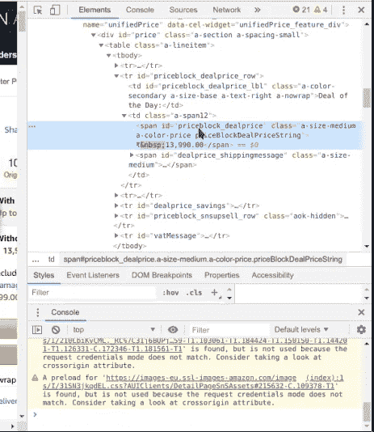

# 教程:使用 Python 和 MongoDB 的 Amazon 价格跟踪器(第 1 部分)

> 原文：<https://medium.com/analytics-vidhya/tutorial-amazon-price-tracker-using-python-and-mongodb-part-1-aece6347ec63?source=collection_archive---------1----------------------->

## 关于如何创建亚马逊价格追踪器的两部分教程。


[M. B. M.](https://unsplash.com/@m_b_m?utm_source=medium&utm_medium=referral) 在 [Unsplash](https://unsplash.com?utm_source=medium&utm_medium=referral) 上的照片

最近有一个亚马逊的销售，我想买一个我已经看了很久的产品。但是，当我准备买下它时，我注意到价格上涨了，我怀疑这种销售是否合法。所以我想通过创建这个价格跟踪应用程序，它不仅可以提高我在 python 方面的流畅性，还可以让我拥有自己的自制应用程序来跟踪亚马逊的价格。

> 虽然我已经编程很长时间了，但是直到最近我才开始学习 python，但是到目前为止这是一种享受。如果你们中的任何 python 专家发现我的代码不太“python 化”，我道歉，我会学习更多:)。

> 本教程假设您至少具备 python 的基础知识。另外，您的系统上安装了 Python 和 MongoDB。
> 
> 请注意，本教程旨在演示如何创建亚马逊价格追踪器，而不是教授编程。

所以，事不宜迟，让我们开始本教程的第 1 部分。

# 这个教程到 2022 年就过时了。我将很快创建一个更新的版本。

## 步骤 1:为项目创建文件和文件夹

*   打开你喜欢的任何目录，创建一个文件夹，命名为 amazon_price_tracker 或任何你想要的名字。
*   现在打开文件夹，创建两个文件`scraper.py`和`db.py`。

这是第一步，现在打开项目目录中的*终端*，进入下一步。

## 步骤 2(可选):使用 virtualenv 创建虚拟环境

这是一个**可选的**步骤，用于隔离正在安装的软件包。你可以在这里找到更多关于 virtualenv [的信息。](https://virtualenv.pypa.io/en/latest/userguide/)

运行此命令来创建一个环境。

```
$ virtualenv ENV
```

运行这个来激活环境。

```
$ source ENV/bin/activate
```

如果您想停用环境，只需运行以下命令。

```
$ deactivate
```

现在，如果您还没有激活环境，请执行第 3 步。

## 步骤 3:安装所需的软件包。

*   运行这个命令来安装**请求**(一个产生 HTTP 请求的库)

```
$ pip install requests
```

*   运行这个命令来安装 **BeautifulSoup4** (一个从网页中抓取信息的库)

```
$ pip install bs4
```

*   运行这个命令来安装 **html5lib** (现代 HTML5 解析器)

```
$ pip install html5lib
```

*   运行这个命令来安装 **pymongo** (访问 MongoDB 的驱动程序)

```
$ pip install pymongo
```

## 步骤 4:开始编写 extract_url(URL)函数

现在，打开`scraper.py`，我们需要导入一些我们之前安装的包。

```
import requests
from bs4 import BeautifulSoup
```

现在，让我们创建一个函数`extract_url(URL)`来缩短 URL，并验证该 URL 是否是有效的 [www.amazon.in](http://www.amazon.in) URL。

URL 提取功能

该函数接受一个 Amazon India URL，例如:

> [https://www . Amazon . in/Samsung-Galaxy-M30-Gradation-Blue/DP/b 07 hgj 58k/ref = br _ MSW _ PDT-1？_ encoding = UTF8&smid = a1 eweiv 3 f 4 b 24 b&pf _ rd _ m = a1 vbal 9 TL 5 wcbf&pf _ rd _ s =&pf _ rd _ r = vfj 98 f 93 x 80 ywyqnr 3 gn&pf _ rd _ t = 36701&pf _ rd _ p = 9806 B2 C4-09 c8-4373-b954-BAE 25 b 7 ea 043](https://www.amazon.in/dp/B07HGJJ58K/)

并将它们转换成更容易管理的更短的 URL[https://www.amazon.in/dp/B07HGJJ58K](https://www.amazon.in/dp/B07HGJJ58K/)。此外，如果 URL 无效 [www.amazon.in](http://www.amazon.in) URL，那么它将返回一个 *None*

## 第五步:下一个函数我们需要什么

对于下一个函数 Google [“我的用户代理](https://www.google.co.in/search?q=my+user+agent)”，复制你的用户代理并将其分配给变量头。

```
headers = { "User-Agent": "Mozilla/5.0 (X11; Linux x86_64) AppleWebKit/537.36 (KHTML, like Gecko) Chrome/75.0.3770.100 Safari/537.36"
}
```

在我们创建一个从页面中删除细节的函数之前，让我们访问一个亚马逊产品页面，比如[这个](https://www.amazon.in/dp/B07HGJJ58K)页面，找到包含产品名称和价格的元素。我们将需要元素的 id，以便在提取数据时能够找到元素。


页面呈现后，右键单击产品名称，然后单击“inspect ”,这将显示包含产品名称的元素。


我们可以看到，`<span>`元素与 `id=“productTitle”` 现在紧紧抓住这个 id，我们以后会用它来报废产品的名称。


我们将对价格进行同样的操作，现在右键单击价格，然后单击 inspect。



带有`id=“priceblock_dealprice”` 的`<span>`元素有我们需要的价格。但是，该产品正在销售，因此其 id 不同于普通 id`id=“priceblock_ourprice”`*。*

## 步骤 6:创建价格转换器函数

如果你仔细观察,`<span>`元素有价格，但是它有许多不需要的东西，比如₹卢比符号、空格、逗号分隔符和小数点。

我们只需要价格的整数部分，所以我们将创建一个价格转换器函数，它将删除不需要的字符，并给出整数类型的价格。

让我们将这个函数命名为`get_converted_price(price)`

价格转换功能

通过一些简单的字符串操作，该函数将以整数形式给出转换后的价格。

> ***更新:*** *正如@* [oorjahalt](https://medium.com/u/19e438f9aee?source=post_page-----aece6347ec63--------------------------------) *所提到的，我们可以简单地使用 regex 来提取价格。*

更新的价格函数。

> **注意**:虽然 tracker 是为 [www.amazon.in](http://www.amazon.in) 准备的，但它也可以用于[www.amazon.com](http://www.amazon.com)或其他类似的网站，只需做很小的改动，例如:

要使其与 amazon 的全球版本兼容，只需执行以下操作:

*   将₹兑换成美元

```
stripped_price = price.strip("$ ,")
```

*   我们可以完全跳过`find_dot`和`to_convert_price` ，就这么做

```
converted_price = float(replace_price)
```

但是，我们会将价格转换为浮动类型。

*   并在`extract_url(URL)`功能中将[*www . Amazon . in*](http://www.amazon.in)改为*[*【www.amazon.com】*](http://www.amazon.com)*

*这将使它与 www.amazon.com 的[和*兼容。*](http://www.amazon.com.)*

*现在，当我们系好安全带时，我们终于可以开始创建刮刀功能了。*

## *第七步:进入细节刮刀功能*

*好了，让我们创建一个函数，提取产品的详细信息，如名称、价格，并返回一个包含产品名称、价格和 URL 的字典。我们将这个函数命名为`get_product_details(URL)`。*

*这个函数的前两个变量是`headers`和`details` ***，*** `headers` ，其中将包含您的用户代理，`details`是一个字典，将包含产品的详细信息。*

```
*headers = {
        "User-Agent": "Mozilla/5.0 (X11; Linux x86_64) AppleWebKit/537.36 (KHTML, like Gecko) Chrome/75.0.3770.100 Safari/537.36"
}
details = {"name": "", "price": 0, "deal": True, "url": ""}*
```

*另一个变量`_url`将为我们保存提取的 URL，我们将检查该 URL 是否有效。无效的 URL 会是`return None`，如果*URL 无效，那么我们会将详细信息设置为`None` 并在末尾返回，以便我们知道 URL 有问题。**

```
**_url = extract_url(url)
if _url is None:
    details = None**
```

**现在，我们来到`else`部分。这有 4 个变量`page`、`soup`、`title`和`price`。**

**`page` 变量将保存被请求产品的页面。**

**变量将保存 HTML，用它我们可以做很多事情，比如找到一个有 id 的元素并提取它的文本，这就是我们将要做的。你可以在这里找到更多关于其他美丽组的功能[。](https://www.crummy.com/software/BeautifulSoup/bs4/doc/)**

**`title`顾名思义，变量将保存具有产品标题的元素。**

**`price`变量将保存包含产品价格的元素。**

```
**page = requests.get(url, headers=headers)
soup = BeautifulSoup(page.content, "html5lib")
title = soup.find(id="productTitle")
price = soup.find(id="priceblock_dealprice")**
```

**现在我们已经有了标题和价格的元素，我们将做一些检查。**

**让我们从价格开始，如前所述，价格 id 可以是交易日的`id=”priceblock_dealprice”`或普通日的`id=”priceblock_ourprice”`**。****

```
***if price is None:
    price = soup.find(id="priceblock_ourprice")
    details["deal"] = False***
```

***由于我们首先检查是否有交易价格，代码将把`price`从交易价格改为正常价格，如果没有交易价格，还将`details[“deal”]` 中的交易设置为`false`。这样做是为了让我们知道价格是正常的。***

**现在，即使我们没有得到价格，这意味着页面有问题，可能是产品缺货，或者可能是产品还没有发布，或者是其他一些可能性。下面的代码将检查是否有标题和价格。**

```
**if title is not None and price is not None:
    details["name"] = title.get_text().strip()
    details["price"] = get_converted_price(price.get_text())
    details["url"] = _url**
```

**如果有产品的价格和标题，那么我们将存储它们。**

```
**details["name"] = title.get_text().strip()**
```

**这将存储产品的名称，但是我们必须从标题中去掉任何不需要的空格。函数的作用是:删除所有的前后空格。**

```
**details["price"] = get_converted_price(price.get_text())**
```

**这将存储产品的价格。在前面创建的 get_converted_price(price)函数的帮助下，我们可以得到整数类型的转换价格。**

```
**details["url"] = _url**
```

**这将存储提取的 URL。**

```
**else:
    details = None
return details**
```

**如果价格或标题不存在，我们将把细节设置为`None`。**

**最后，函数完成了，这是完整的代码**

**提取产品详细信息的函数。**

> ****注意**:虽然这个代码不适用于书籍，因为书籍有不同的`productid`，但是如果你调整代码，你可以让它适用于书籍。**

## **第八步:让我们运行 scraper.py**

**在文件末尾添加以下内容。**

```
**print(get_product_details("Insert an Amazon URL"))**
```

**打开存有 scraper.py 文件的终端，像这样运行 scraper.py。**

```
**$ python3 scraper.py**
```

**如果你做的一切都正确，你应该得到这样的输出。**

```
**{‘name’: ‘Nokia 8.1 (Iron, 4GB RAM, 64GB Storage)’, ‘price’: 19999, ‘deal’: False, ‘url’: ‘[https://www.amazon.in/dp/B077Q42J32'](https://www.amazon.in/dp/B077Q42J32')}**
```

**瞧，我们已经完成了亚马逊价格跟踪教程的第 1 部分。**

**下周我们将在后续的第 2 部分见面，我们将探索使用 P **yMongo** 来存储我们的数据的 **MongoDB** 。**

> **这是我第一篇关于媒体或博客的文章，我很高兴将来能在这里分享我的想法、实验和故事。希望你会喜欢。**

***在下面找到本文的完整源代码。***

**[](https://github.com/ArticB/amazon_price_tracker) [## ArticB/亚马逊价格跟踪系统

### 这是一个使用 Python 和 MongoDB 的亚马逊价格追踪器

github.com](https://github.com/ArticB/amazon_price_tracker) 

**点击第二部分的链接。**

[](/@deeprajpradhan/tutorial-amazon-price-tracker-using-python-and-mongodb-part-2-5a9107ed2204) [## 教程:使用 Python 和 MongoDB 的 Amazon 价格跟踪器(第 2 部分)

### 关于如何创建亚马逊价格跟踪系统的两部分教程

medium.com](/@deeprajpradhan/tutorial-amazon-price-tracker-using-python-and-mongodb-part-2-5a9107ed2204)**