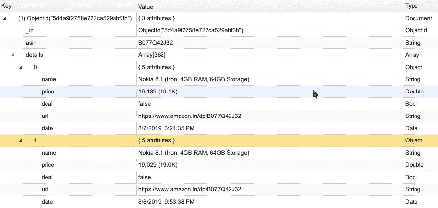

# 教程:使用 Python 和 MongoDB 的 Amazon 价格跟踪器(第 2 部分)

> 原文：<https://medium.com/analytics-vidhya/tutorial-amazon-price-tracker-using-python-and-mongodb-part-2-5a9107ed2204?source=collection_archive---------1----------------------->

## 关于如何创建亚马逊价格跟踪系统的两部分教程


由[奥斯汀·迪斯特尔](https://unsplash.com/@austindistel?utm_source=medium&utm_medium=referral)在 [Unsplash](https://unsplash.com?utm_source=medium&utm_medium=referral) 上拍摄的照片

> 如果您是新手，请访问教程的第 1 部分，点击 [**此处**](/@deeprajpradhan/tutorial-amazon-price-tracker-using-python-and-mongodb-part-1-aece6347ec63) 。

你好，欢迎来到使用 Python 和 MongoDB 的亚马逊价格追踪器的第 2 部分教程。在教程的这一部分，我们将学习如何存储从亚马逊产品页面提取的数据。

## 步骤 1:为项目创建一些文件

打开包含第 1 部分代码的项目文件夹，然后创建`db.py`和`tracker.py`。

我稍后会解释`tracker.py`，现在打开`db.py`，在这里我们将编码存储数据到数据库或者从数据库中检索数据。

现在，导入一些需要的库。

```
import datetime
import pymongo
```

`pymongo`用于连接到 MongoDB，`datetime`用于获取时间戳。

接下来，我们将连接到 MongoDB 并选择`amazon`作为我们的数据库

```
client = pymongo.MongoClient("mongodb://localhost:27017/")
db = client["amazon"]
```

> **注意**:您可能希望使用 [NoSQLBooster](https://nosqlbooster.com/downloads) 或 [MongoDB Compass](https://www.mongodb.com/products/compass) 作为界面来轻松监控或修改数据库，因为它们是基于 GUI 的软件。

## 步骤 2:创建一个向数据库添加产品详细信息的函数

好了，在我们开始之前，让我们看看我们将如何存储细节的结构或格式。

我们将有一个用于产品的**集合**(SQL 术语中的一个表，此处读作[](https://www.tutorialspoint.com/mongodb/mongodb_overview.htm)*)，每个产品都将是一个**文档**(SQL 术语中的一个元组，此处读作[](https://www.tutorialspoint.com/mongodb/mongodb_overview.htm)*)。**

**这里是一个**文档的例子。****

**`‘asin’`是亚马逊标准识别号。这是一组 10 位数的字母数字字符，对于每个产品都是唯一的。例如，在这个 URL[*https://www.amazon.in/dp/B077Q42J3 2*](https://www.amazon.in/dp/B077Q42J32)*中的`asin`是最后一部分 ***B077Q42J3******

**`‘details’`是一个字典数组，每个字典包含一个产品的`name`、`price`、`deal`、`url`和`date`。**

```
**{
  'name': 'Nokia 8.1 (Iron, 4GB RAM, 64GB Storage)',
  'price': 19026.0,
  'deal': False,
  'url': 'https://www.amazon.in/dp/B077Q42J32',
  'date': datetime.datetime(2019, 8, 9, 19, 20, 30, 858904)
}**
```

**现在让我们来看看这个函数。**

**函数将产品细节添加到数据库中**

**我们在函数中做的第一件事是选择 MongoDB 中的集合，在这种情况下，它将是`products`。**

```
**new = db["products"]**
```

**接下来，我们将从 URL 中提取`asin`**

```
**ASIN = details["url"][len(details["url"])-10:len(details["url"])]**
```

**之后，在字典`details`中添加一个带有关键字`date`的时间戳。**

```
**details["date"] = datetime.datetime.utcnow()**
```

**现在是`try`块，我们在这里存储数据库中的数据。**

```
**new.update_one(
    {                
        "asin":ASIN
    },
    {
        "$set": 
        {
            "asin":ASIN
        },
        "$push":
        {
            "details":details
        }
    },             
    upsert=True
)**
```

**功能`update_one()`分为三部分**

```
**{
    "asin":ASIN
}** 
```

**函数的第一部分搜索`asin`**

```
**{
    "$set": 
    {
        "asin":ASIN
    },
    "$push":
    {
        "details":details
    }
}**
```

**第二部分更新`asin`并将数据添加到数据数组中。**

```
**upsert=True**
```

**第三部分是一个条件，当它被设置为 true 时，如果搜索没有找到`asin`就创建一个新的文档，否则就更新它。**

## **步骤 3:创建一个从数据库中检索数据的函数**

**我们可能需要检索存储在数据库中的数据，以构建 excel 表格或可视化数据或您可能想到的任何其他东西。现在让我们开始编写函数代码。**

**该函数将根据`asin`查找文档。这样的输出应该是这样的。**

## **步骤 4:创建驱动程序**

**现在`scraper.py`和`db.py`做好了，就该做`tracker.py`了。打开我们之前创建的文件`tracker.py`。**

**导入`db`和`scraper`,因为我们需要合并我们之前创建的函数，还需要导入时间库。**

```
**import db
import scraper
import time**
```

**接下来，指定 URL**

```
**URL = "https://www.amazon.in/dp/B077Q42J32/"**
```

**现在，让我们创建一个函数`track()`，在这里我们将结合来自`scraper.py`和`db.py`的函数，从网站获取数据并将其推送到数据库。**

**在函数内部要做的第一件事是获取细节，你可以通过调用函数`get_product_details(URL)`和来自`scraper`的参数`URL`来完成**

```
**details = scraper.get_product_details(URL)**
```

**现在检查函数`get_product_details(URL)`返回的细节是否为`None`。**

**如果是`None`，那就意味着有问题，我们必须返回`“not done”`。**

```
**if details is None:        
    result = "not done"**
```

**如果不是`None`，则将详细信息推送到数据库。**

```
**else:        
    inserted = db.add_product_detail(details)**
```

**现在再次检查函数`add_product_details(details)`是否返回了`True`或`False`。返回`True`意味着它被插入，返回`False`意味着数据没有存储在数据库中。**

```
**if inserted:            
    result = "done"        
else:            
    result = "not done"
return result**
```

**最后一部分是每 1 分钟或 60 秒调用一次函数`track()`或根据您的要求进行更改。**

> ****注意**:你**不应该**每秒都这么做**，**这样做你会越过速率限制**亚马逊会阻止你**这意味着你不能丢弃数据。**

```
**while True:    
    print(track())    
    time.sleep(60)**
```

**这是完整的代码。**

**驱动程序每 1 分钟跟踪一次价格**

> **注意:你也应该轮换你的用户代理，因为亚马逊可能会对你设置每分钟 1 个请求的硬性限制。关于如何做的更多信息，请点击 查看 [**。**](https://www.scrapehero.com/how-to-fake-and-rotate-user-agents-using-python-3/)**

**去检查你的基于 GUI 的软件，你应该会看到类似这样的东西。**

****

## **完成了，现在做什么？**

**最后，教程结束了，现在你可以做许多事情之一**

*   **让程序运行在 AWS 云上。**
*   **用数据做一些机器学习。**
*   **随着时间的推移，可视化数据的增加和减少。**

> **我确信你可以用这些数据做很多事情，限制在于你的想象力😄希望这篇教程对你有所帮助。下次再见，✌️**

***在下面找到本文的完整源代码。***

**[](https://github.com/ArticB/amazon_price_tracker) [## ArticB/亚马逊价格跟踪系统

### 这是一个使用 Python 和 MongoDB 的亚马逊价格追踪器

github.com](https://github.com/ArticB/amazon_price_tracker)**