# 教程:如何将带有免费域和 SSL 的 Angular app 部署到 AWS S3 和 CloudFront

> 原文：<https://medium.com/analytics-vidhya/tutorial-how-to-deploy-an-angular-app-with-a-free-domain-and-ssl-to-aws-s3-and-cloudfront-d0143de53d2d?source=collection_archive---------3----------------------->

## 使用免费域名和 SSL 将 Angular 应用程序部署到 AWS 的简单教程。

马文·迈耶在 [Unsplash](https://unsplash.com?utm_source=medium&utm_medium=referral) 上的照片

大家好！我已经有一段时间没有发布新的教程了，因为我的大学和工作都很忙。接下来，今天我将展示如何在 AWS 上使用 S3 和 CloudFront 以及免费域和 SSL 部署 Angular 应用程序。你的应用将在 15 分钟内启动并运行。让我们开始吧，好吗🤘？

## 第一步:获得一个免费域名

第一步是从【www.freenom.com】**获得一个免费域名。我向你保证，这是完全免费的一年，无需添加任何信用卡。去 freenom.com 输入你选择的域名，但是记住你只能选择其中一个**。ml，。tk，。参见。嘎，。gq** 作为你的顶级域名，如果你想免费域名。**

> 强烈建议你使用**。ml** 作为你的 TLD。

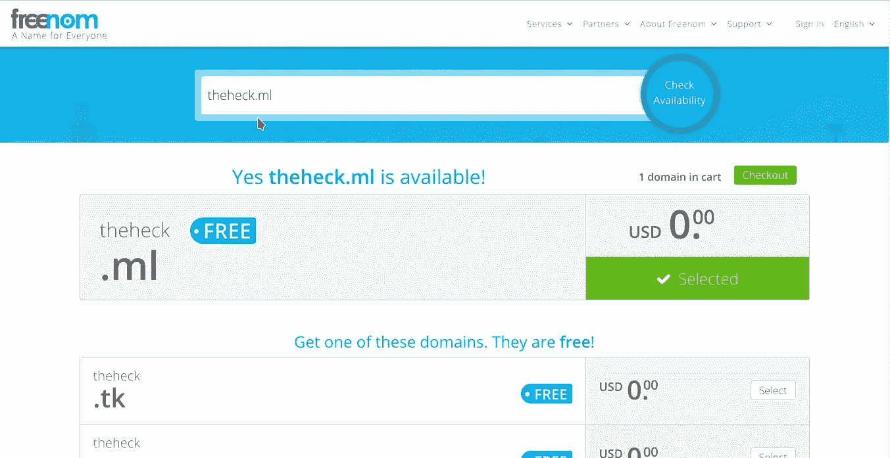

检查域可用性

> **注意:**当您结账时，请确保选择 **12 个月@免费。**

12 个月免费域名

## 步骤 2:允许 AWS 管理 DNS

现在您有了自己的域名，让 AWS 来管理 DNS。从 AWS 服务打开 **Route53** 并创建托管区域。

*   创建一个没有 www 的托管区域，并将类型设置为“ ***”公共托管区域“*** ”。

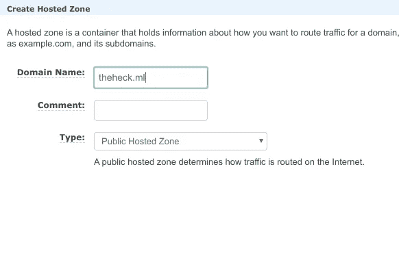

创建托管区域

*   你会发现如下所示的 4 个域名服务器，复制它。

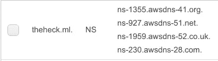

AWS 名称服务器

*   进入你的 ***freeno* m** 账号然后点击 ***服务***下拉菜单>点击***【mydomains】***>点击 ***【管理域】*** >从 ***管理工具*** 下拉菜单>点击>

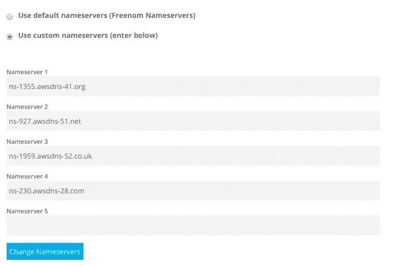

在 freenom 上更改名称服务器

*   访问这个网站[**www.dnschecker.org/#NS**](https://dnschecker.org/#NS)并输入你的域名，如果一切正常，你应该在 5-10 分钟内看到 AWS 域名服务器。但是，有时可能需要一段时间。

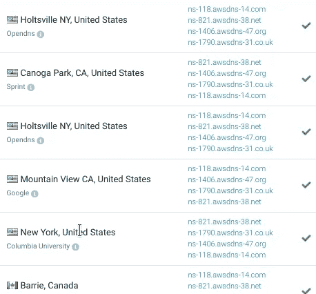

DNS 检查器

## 步骤 3:获取 SSL 证书

近年来，获得 SSL 证书对网站很重要，你可以从 AWS 免费获得证书。

*   从 AWS 服务转到证书管理器，并选择 N.virginia 作为您的地区。

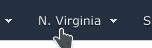

AWS 区域

*   点击 ***【请求证书】*** 按钮。

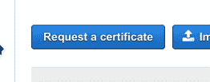

申请证书

*   如下所示添加您的域。

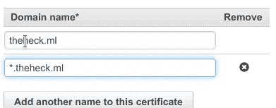

添加域名

*   只需点击***创建 53 路记录*** 按钮。

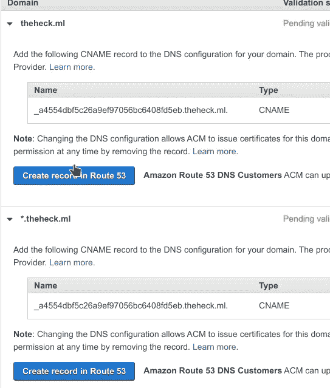

允许 ACM 颁发证书

*   如果您做了所有正确的事情，那么在 5-10 分钟内，状态将变为“*”。*

*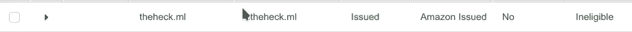*

*SSL 已成功发布*

## *第四步:上传角度应用到 S3*

*现在你已经准备好在 S3 上上传你的应用了。*

*   *从 AWS services 前往 S3，用您的域名创建一个 bucket，例如“theheck.com”，**选择**您的 ***地区*** 作为离您最近的**，将一切留给**默认**。***

***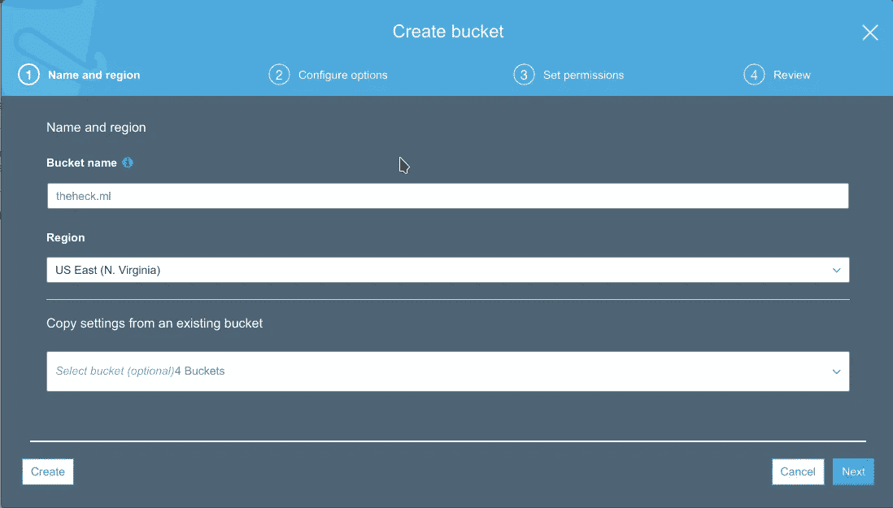***

***创建 S3 存储桶***

*   ***转到桶并上传您的应用程序，保留所有默认设置。***

***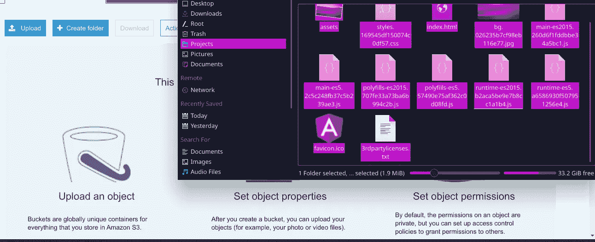***

***上传文件到 S3***

## ***步骤 5:创建 CloudFront 发行版***

*   ***从 AWS services 转到 CloudFront，为 web 创建一个新的发行版。***

***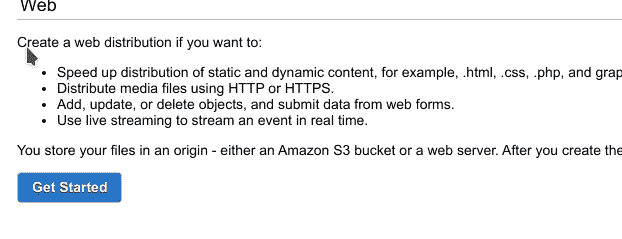***

*   ***在 ***“源域名”*** 中选择您创建的 S3 桶，并完全按照下图所示进行操作。***

***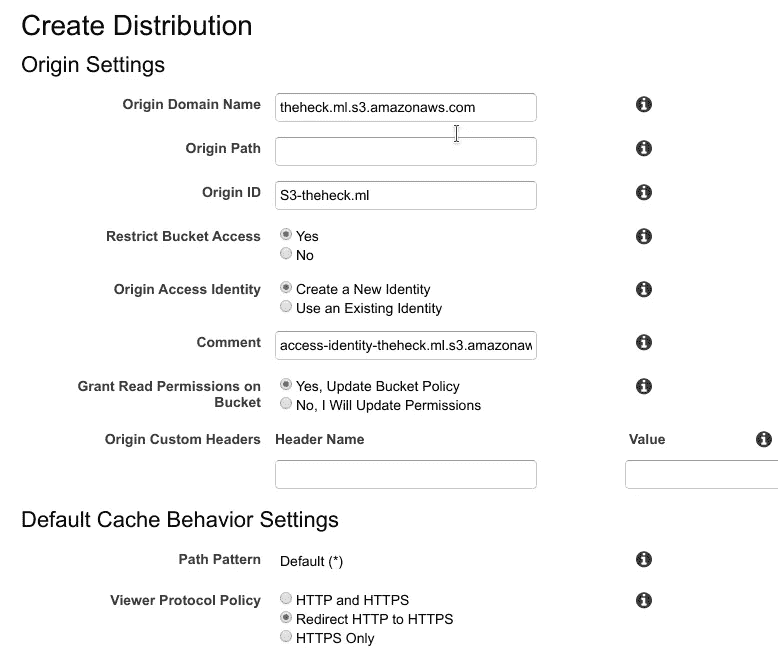***

***创建一个 CloudFront 分布图 1***

***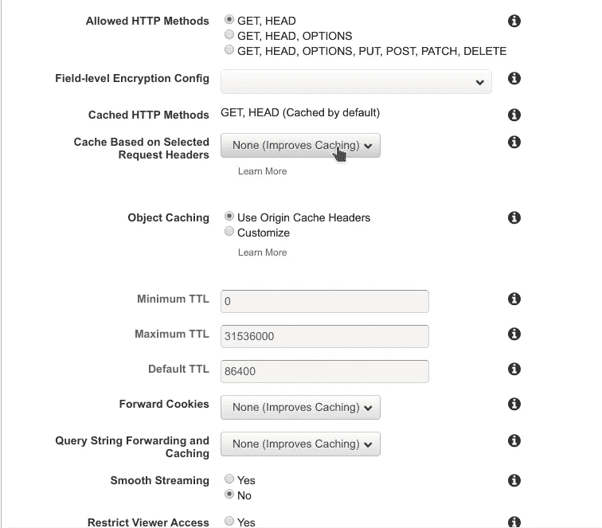***

***创建一个 CloudFront 分布图 2***

*   ***在 ***备用域名*** 中添加您的域名，有无 ***www。******

***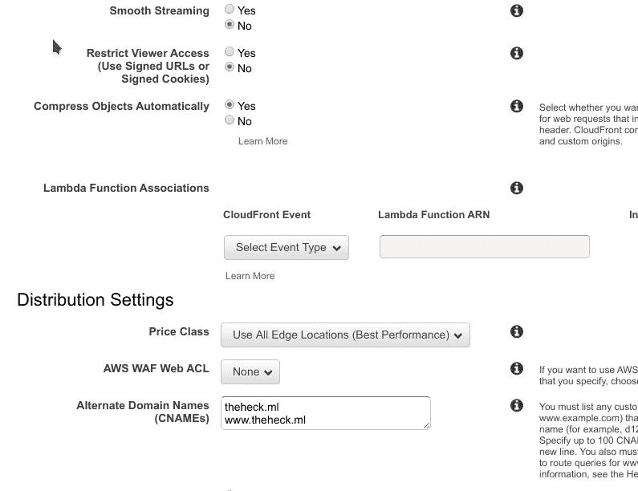***

***创建一个云锋分布图 3***

*   ***选择自定义“ ***SSL 证书”*** ，并从文本框中添加您之前创建的 SSL。如果您没有看到您的域的 SSL，那么再次执行**步骤 3** 。***

***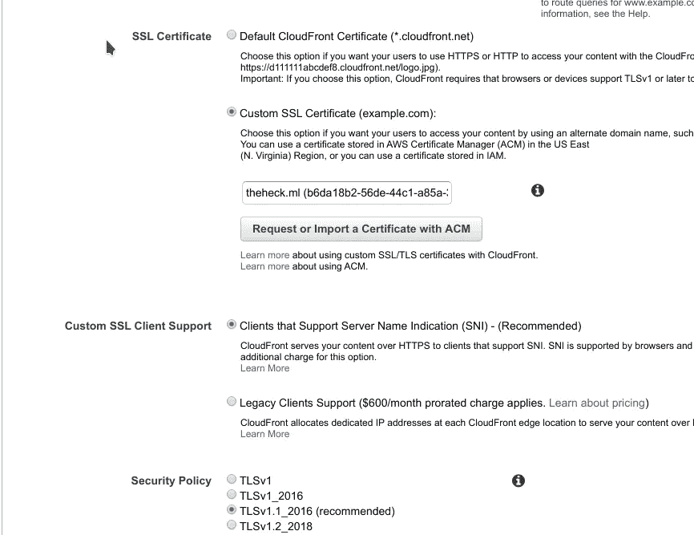***

***创建一个云锋分布图 4***

*   ***将分发状态保留为**禁用**并点击 ***【创建分发】*** 按钮***

***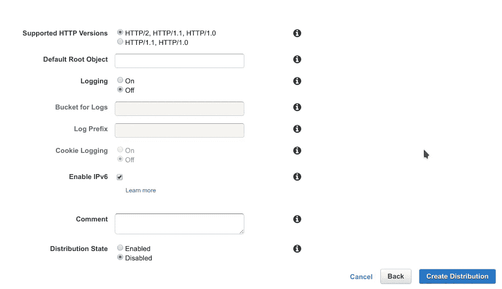***

***创建一个云锋分布图 5***

> *****注意:**记得设置你的**“默认根对象”**为**index.html**或者是你的应用程序的主 html 文件。***

*   ***你现在可以看到你的 Cloudfront 发行版为****_ _ _ _ _ . Cloudfront . net***。等等，现在还不行。****

****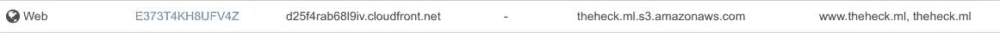****

****云锋分布****

*   ****点击您的发行版，进入 ***【错误页面】*** 选项卡，为 403 和 404 创建两个自定义错误，如下所示。****

****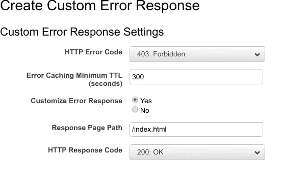****

****自定义 HTTP 错误代码 403****

****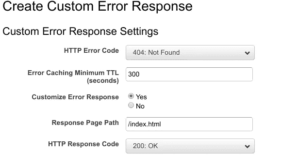****

****自定义 HTTP 错误代码 404****

*   ****现在，你可以**启用**你的**发行版**，一旦进程完成，如果一切顺利，你可以通过 CloudFront 链接“______.cloudfront.net”访问你的应用。****

## ****步骤 6:将 CloudFront 与您的域链接起来。****

****在最后一步，您将把您的 CloudFront 发行版与您的域链接起来。****

*   ****从 AWS 服务转到 Route53 并转到您的托管区域。**创建一个记录集，**选择 alias 作为你的 CloudFront 分布。****

****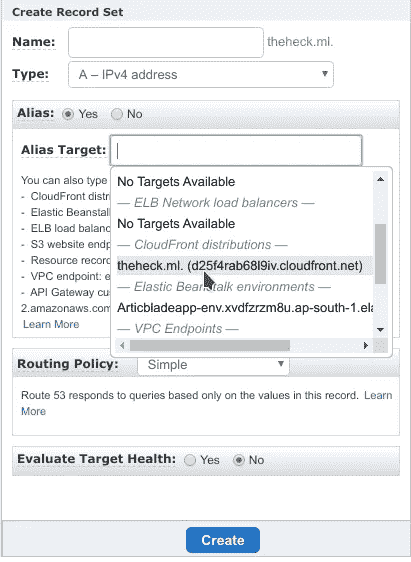****

****将 CloudFront 与您的域链接起来****

*   ****创建另一个记录集，和前面一样，但是添加 **www** 作为名称。****

****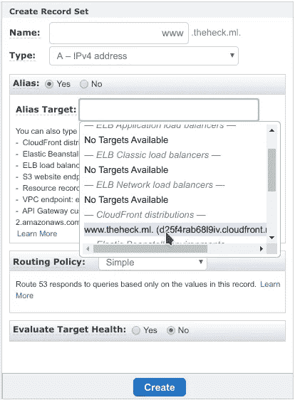****

****将 CloudFront 与您的域链接起来****

*   ****您已经使用 S3 和 CloudFront 在 AWS 上成功部署了您的 angular 应用程序，您应该会在 URL 上看到***【HTTPS】***。****

****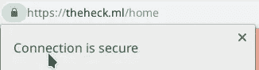****

****HTTPS 开始了****

> ****教程现在已经完成，如果你有任何疑问，可以问我。下次再见，✌️.****