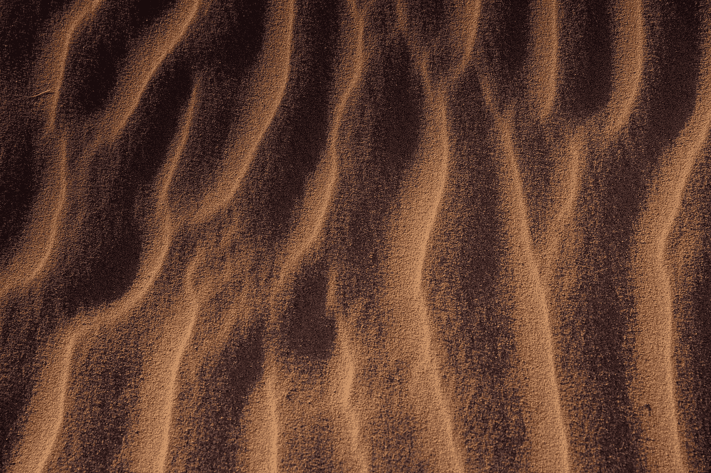

# 教程:如何使用 Python 在 OpenCV 中缩放和旋转轮廓

> 原文：<https://medium.com/analytics-vidhya/tutorial-how-to-scale-and-rotate-contours-in-opencv-using-python-f48be59c35a2?source=collection_archive---------0----------------------->

在本教程中，我将带您了解如何基于 OpenCV Python API 缩放和旋转轮廓

如果您想了解实现背后的简单思想，请继续学习。

# 为什么？

为什么要缩放或旋转图像中物体的轮廓？对我来说，我有一个非常…