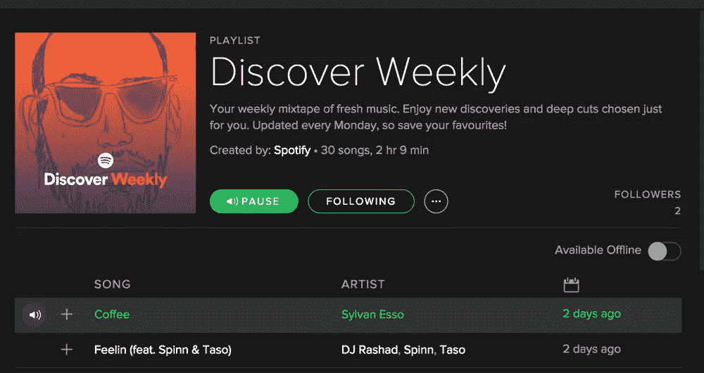
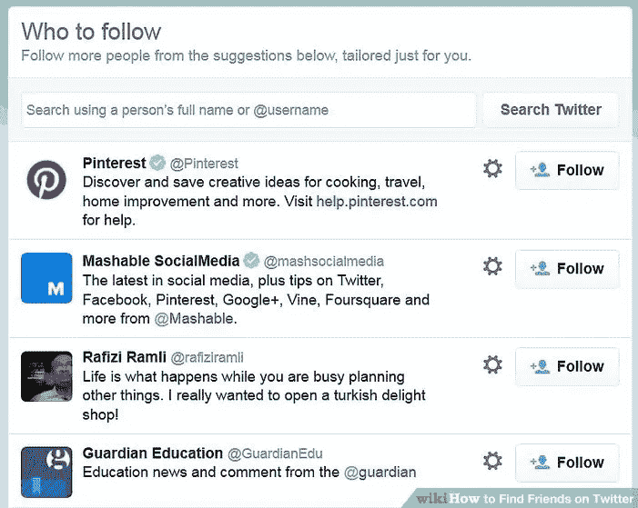
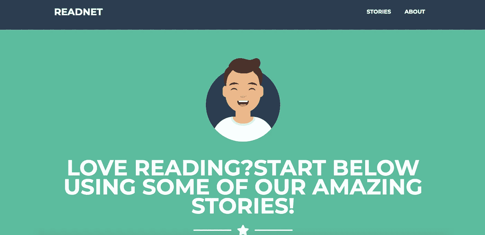
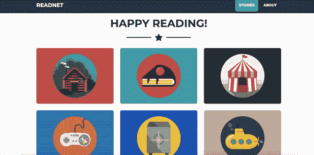
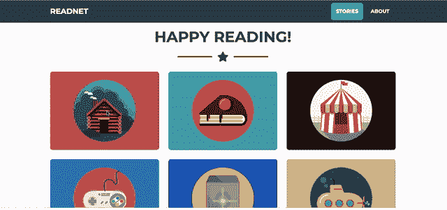
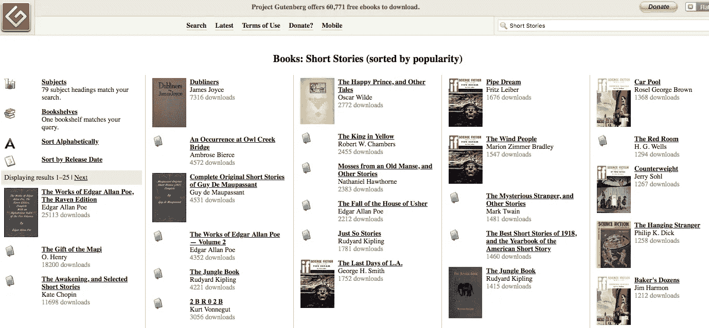
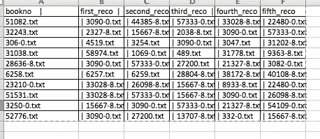

# 推荐优秀短篇小说的人工智能引擎开发教程

> 原文：<https://medium.com/analytics-vidhya/tutorial-on-development-of-an-ai-engine-for-recommending-great-short-stories-2e136b3afa27?source=collection_archive---------16----------------------->

# 介绍

在今天的超数字时代，有多种产品争夺你的注意力，无论是社交网络(脸书、推特、Reddit 等)还是电影推荐(网飞、Prime、Hulu)。这些产品的目的都是为了提高您使用产品获得服务的参与度。更多的参与意味着在门户网站上花费更多的时间，这意味着获得订阅、销售定向广告或其他收入机会的可能性更大。提高参与度的关键是根据你是谁、你在哪里、你的个性以及你喜欢或不喜欢什么，为用户提供高度个性化的推荐。技术代理应该为产品提供最佳和个性化的客户旅程，这是事情变得真正有趣的地方。

# 推荐引擎

推荐引擎无处不在，你用于服务的任何好的技术产品很可能都有个性化推荐的成分。以下是几个例子:

**听音乐**



**看电视节目**


**社交网络**



这一点以及更多，只要想想你可能正在使用的任何技术服务，它都试图为你提供一种更个性化的产品体验导航路径。他们能够通过使用他们在门户网站上拥有的关于你和其他用户的数据来做到这一点。用户越多，推荐算法就越好。

# 为什么我们需要一个短篇小说推荐引擎？

在众多基于推荐的产品中(都是付费产品)，我们有音乐、电影、社交网络服务，但对于现场阅读短文，没有可行的替代方案。亚马逊确实有一个很好的推荐引擎来推荐下一步该读什么，但它只推荐一本书或选集，而不是短文、故事、散文等。这个项目的想法是在根据用户的喜好和偏好推荐下一个最佳短文阅读的同时，增强短文内容的阅读。

# **一个名为 readnet 的短篇小说免费阅读门户**

我们开发了 readnet 这个门户网站，任何人都可以去那里免费阅读一些著名作家的精彩散文。该网络应用还会根据用户当前可能正在阅读的短篇小说推荐其他短篇小说。用户之旅就像下面三点一样简单:

1.  用户访问 web 应用程序



2.用户可以选择六个短篇故事，开始他们的阅读冒险



3.一旦用户选择了一个用户可能喜欢的故事，就会有一个选项来获得更多的推荐故事



从用户体验的角度来看，这是一个非常简单的工作流，但在后端，当它被开发时，有大量的智能被开发出来，我们现在将研究这些智能。

# 我们是如何开发 Readnet 的？

开发过程包括以下步骤:

1.  内容集合
2.  推荐算法的发展
3.  创建用于报道和推荐的源数据库
4.  为读者提供文本和推荐的后端 API 开发
5.  前端用户界面开发，提供良好的用户阅读体验
6.  在 Heroku 平台上部署 web 应用程序

## 步骤 1:内容收集

readnet 上的所有短篇故事都是免费的，因为这是我们可以让用户免费使用的唯一方法。最大的免费版权书籍和故事库之一是[https://www.gutenberg.org/](https://www.gutenberg.org/)(古腾堡计划)。**你能在网站上找到的所有内容都摘自古腾堡计划(请考虑向这个杰出的计划捐赠一小笔**[](https://www.gutenberg.org/wiki/Gutenberg:Project_Gutenberg_Needs_Your_Donation)****)。****

**手头的任务是浏览古腾堡网站上超过 64K 的电子书/故事，并找出短篇故事用于 readnet 推荐引擎。我在 http://www.gutenberg.org/ebooks/search/?query=Short+Stories 找到了大量短篇小说集**

****

**现在，我们知道从哪里可以获得我们需要的短篇故事，将它们提取到文件中，用于文本处理和 web 应用程序的开发。通过使用 python 中令人惊叹的漂亮的汤库，这很容易做到。首先，我们在 webapp 上获得我们想要的短篇故事的链接**

```
/*Get the list of short stories*/
while n<1000:
    url = f"[http://www.gutenberg.org/ebooks/search/?query=Short+Stories&start_index={n](http://www.gutenberg.org/ebooks/search/?query=Short+Stories&start_index={n)}"
    page = requests.get(url)    
    data = page.text
    soup = BeautifulSoup(data)
    for link in soup.find_all('a'):
        List.append(link.get('href'))/*Get the urls for the corresponding short stories*/from bs4 import BeautifulSoup, SoupStrainer
import pandas as pd
import requests
url_download=[]
url=f"[http://www.gutenberg.org/files/](http://www.gutenberg.org/files/)"
df=pd.read_csv('ID_shortstories2.csv')
Ids=list(df['ID_shortstories'])for Id in Ids:
    url2=url+str(Id)+'/'
    page = requests.get(url2)    
    data = page.text
    soup = BeautifulSoup(data)
    zips=[]
    for link in soup.find_all('a'):

        if link.get('href').endswith('.txt'):
            zips.append(link.get('href'))
    if len(zips)==0:
        print("The ID {} has no txt".format(Id))
    else:
        url3=url2+zips[0]
        #print(url3)
        url_download.append(url3)
```

**接下来，我们将所有短篇小说提取到单独的文本文档中。**

```
import os
import urllib.request
check=[]DOWNLOADS_DIR = 'books/'# For every line in the file
for url in open('links.txt'):
    # Split on the rightmost / and take everything on the right side of that
   # name2=os.path.split(url)[-1]
    #name2=os.path.split(urllib.parse.urlparse(url).path)[-1]
    #print(name2)
    name = url.split('/')[-1]
    name2=name.split(sep='txt')[0]
    name3=name2+'txt'
    #print(name)# Combine the name and the downloads directory to get the local filename
    filename = os.path.join(DOWNLOADS_DIR, name3)
    print(filename)

    # Download the file if it does not exist
    if not os.path.isfile(filename):

        print(url)
        urllib.request.urlretrieve(f"{url}",f"{filename}")
```

**现在我们将获得我们提取的短篇小说的标题、作者和语言**

```
import osbookno=[]
Title=[]
Author=[]
Language=[]
for a in os.listdir(path='books'):
    if a.endswith('.txt'):with open(f"books/{a}",'r',errors='ignore') as f:Title1=[]
            Author1=[]
            Language1=[]
            for line in f:y=line.split()
                #raise Exception("The files is {}".format(f))
                #print(len(y))
                #if y[1]=='Title:':
                if (len(y)>0 and y[0]=='Title:'):
                     Title1=y.copy()
                if (len(y)>0 and y[0]=='Author:'):
                    Author1=y.copy()
                if (len(y)>0 and y[0]=='Language:'):
                    Language1=y.copy()bookno.append(a)
        Title.append(Title1)
        Author.append(Author1)
        Language.append(Language1)
```

**最后，我们将所有内容放入熊猫数据框，以便于可视化和分析**

```
import pandas as pd
db_books=pd.DataFrame()
db_books['bookno']=bookno# db_books['Title']=[T for T in Title if T!='Title:' ]
# db_books['Author']=[A for A in Author if A!='Author']
# db_books['Language']=[L for L in Language if L!='Language']db_books['Title']=[' '.join(T) for T in Title]
db_books['Author']=[' '.join(A) for A in Author]
db_books['Language']=[' '.join(L) for L in Language]
```

**现在，通过一些简单的编辑和检查，我们已经准备好了我们的源数据。**

## **步骤 2:开发推荐算法**

**我们将使用的推荐算法是一种无监督模型，它基于两个文本的相似程度，分配相应的相似性指数。这里有两个子流程，首先我们将对应短篇小说的所有文本转换成 [TFIDF](http://www.tfidf.com/) (词频-逆文档频)。我们需要这样做，因为算法/数学只能在数学或矢量表示上进行交互。**

```
from sklearn.feature_extraction.text import  TfidfVectorizer
from sklearn.feature_extraction import text
my_stop_words = text.ENGLISH_STOP_WORDS.union(['gutenberg','ebook','online','distributed','transcriber','etext','note','copyright',"start",'project','end','produced','proofreading','team','http','www','pgdp','net','illustrated'])vectorizer=TfidfVectorizer(stop_words=my_stop_words)
vectorizer.fit(stories['content'])X_vector=vectorizer.transform(stories['content'])
```

**接下来，基于两个文本有多相似([余弦相似度](https://www.sciencedirect.com/topics/computer-science/cosine-similarity))，我们将分配各自的等级。比如有哪些和故事 A 相似的 top5 短篇等等。**

```
from sklearn.metrics.pairwise import cosine_similarity
similarity_matrix=cosine_similarity(X_vector)
```

****步骤 3:创建用于提供报道和推荐的源数据库****

**现在，我们有了短篇小说及其元数据(作者、语言、标题)以及哪些故事彼此最相似，现在我们需要将它们全部存储到一个数据库中，可以通过我们的 web 应用程序进行查询。我使用的是 Postgres 数据库，但根据开发人员的喜好，也可以使用任何其他 RDBMS。**

```
/*First the metadata*/ from sqlalchemy import create_engine
engine = create_engine('postgresql:///stories')db_books.to_sql("metadata", engine,if_exists='append',index=False)/*Then the stories*/
stories.to_sql("short_stories", engine,if_exists='append',index=False)
```

**除此之外，我们还需要另一个表，我们将其命名为 recos，其中每个文本(短篇小说)都有前五个相似的文本。**

****

## **步骤 4:为读者提供文本和推荐的后端 API 开发**

**现在我们有了制造产品的所有肉。我们有:**

1.  **短篇小说的正文**
2.  **我们有故事的元数据**
3.  **我们对每个短篇故事都有 5 个最佳推荐**

**我们现在需要开发一个基于前端用户交互的 API，从产品的角度推送所需的文本和数据。我们将使用 flask，这是一个非常好的微框架，可以快速开发和服务产品的后端。下面是一个完整的代码，告诉你如何开发它**

```
import osfrom flask import Flask, session,render_template,request,session,redirect,url_for,escape,flashfrom flask_session import Sessionfrom werkzeug import check_password_hash, generate_password_hashfrom itsdangerous import URLSafeTimedSerializerfrom sqlalchemy import create_enginefrom sqlalchemy.orm import scoped_session, sessionmakerimport requestsimport osimport pandas as pdimport time# Set up databaseengine = create_engine(os.getenv("DATABASE_URL"))db = scoped_session(sessionmaker(bind=engine))app = Flask(__name__)# Set the secret key to some random bytes. Keep this really secret!app.secret_key ='#######'Security_password_salt='########'@app.route("/",methods=["GET","POST"])def home():stories=db.execute("select metadata.bookno,metadata.title,metadata.author,short_stories.content from metadata LEFT JOIN short_stories on metadata.bookno=short_stories.bookno order by random() LIMIT 6").fetchall()return render_template("index.html",story=stories)@app.route("/recommendations",methods=["GET","POST"])def reco():bookno=request.form.get("bookno")# return booknorecos=db.execute("select * from recos where bookno=:bookno",{'bookno':bookno}).fetchone()reco1=db.execute("select metadata.bookno,metadata.title,metadata.author,short_stories.content from metadata LEFT JOIN short_stories on metadata.bookno=short_stories.bookno  where metadata.bookno=:bookno",{'bookno':recos.first_reco}).fetchone()reco2=db.execute("select metadata.bookno,metadata.title,metadata.author,short_stories.content from metadata LEFT JOIN short_stories on metadata.bookno=short_stories.bookno  where metadata.bookno=:bookno",{'bookno':recos.second_reco}).fetchone()reco3=db.execute("select metadata.bookno,metadata.title,metadata.author,short_stories.content from metadata LEFT JOIN short_stories on metadata.bookno=short_stories.bookno  where metadata.bookno=:bookno",{'bookno':recos.third_reco}).fetchone()reco4=db.execute("select metadata.bookno,metadata.title,metadata.author,short_stories.content from metadata LEFT JOIN short_stories on metadata.bookno=short_stories.bookno  where metadata.bookno=:bookno",{'bookno':recos.fourth_reco}).fetchone()reco5=db.execute("select metadata.bookno,metadata.title,metadata.author,short_stories.content from metadata LEFT JOIN short_stories on metadata.bookno=short_stories.bookno  where metadata.bookno=:bookno",{'bookno':recos.fifth_reco}).fetchone()return render_template("recommend.html",reco1=reco1,reco2=reco2,reco3=reco3,reco4=reco4,reco5=reco5)# reco2=db.execute("select * from metadata where bookno=:bookno",{'bookno':recos.second_reco}).fetchone()# reco3=db.execute("select * from metadata where bookno=:bookno",{'bookno':recos.third_reco}).fetchone()# reco4=db.execute("select * from metadata where bookno=:bookno",{'bookno':recos.fourth_reco}).fetchone()# reco5=db.execute("select * from metadata where bookno=:bookno",{'bookno':recos.fifth_reco}).fetchone()# return render_template("recommend.html",reco1=reco1,reco2=reco2,reco3=reco3,reco4=reco4,reco5=reco5)
```

## **步骤 5:开发前端用户界面以获得良好的用户阅读体验**

**如果你像我一样，主要是一名数据科学家，而不是前端或产品人员，你很可能不熟悉前端设计如何工作的细节，以及围绕它的最佳实践是什么。在当今这个快速专业化的时代，拥有一套 T 型技能总是更好，一些 HTML、CSS 和 Javascript 的基础知识真的很有用。有一些奇妙的框架让我们的生活变得非常简单，比如 Bootstrap(【https://getbootstrap.com/】)。因为我们只是在开发一个原型，所以使用 Bootstrap 来快速投放市场比在前端开发上花费大量时间要有用得多。我们将使用一个非常流行的模板称为自由职业者模板。只需将模板从 git 克隆到您的本地，并针对您的版本进行所需的更改([https://github . com/black rock digital/start bootstrap-freelancer](https://github.com/BlackrockDigital/startbootstrap-freelancer))。需要的主要变化是在模板中。我有两个 HTML 文件，一个用于登录页面，另一个用于推荐。**

## **步骤 6:在 Heroku 平台上部署 web 应用程序**

**现在，您已经在您的个人机器上准备好了产品，包括一个数据库、一个基于 flask 代码的 API 和一个使用 Bootstrap4 开发的前端。现在，您可能希望将它部署在全世界面前，以便任何拥有可访问互联网的计算设备的人都能够连接到它并开始阅读。有多种平台可供使用，如 Heroku、Pythonanywhere、Digital Ocean 等。我们已经使用了 Heroku，但是您可以随意使用任何您觉得合适的平台。只要您为项目的 python 环境创建了 requirement.txt 文件，就可以直接点击了。以下是使用 Heroku 用户界面的简单步骤:**

1.  **登录 Heroku**
2.  **创建新项目**
3.  **使用 Github 作为部署方法**
4.  **将数据库从本地迁移到 Heroku**
5.  **部署项目**

## ****最终想法****

**简单地说，以上五个步骤总结了如何从零开始快速开发一个非常有用的推荐引擎。可以在这些方面尝试的其他增强是，您可以使用 Travis CI 或类似工具开发 CI/CD 管道，以快速增强产品并进行测试。**

**感谢您抽出时间阅读本文！祝你一切顺利。**