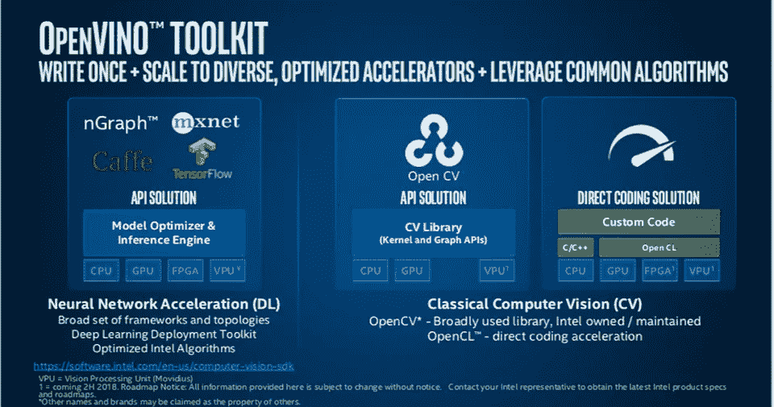

# 2021 年如何用 OpenVino 运行推理的教程

> 原文：<https://medium.com/analytics-vidhya/tutorial-on-how-to-run-inference-with-openvino-in-2021-a96e5e7c99f8?source=collection_archive---------2----------------------->

本文旨在提供关于如何使用 OpenVino 推理引擎的 Python API 通过对象检测器运行推理的见解。在我寻求了解 OpenVino 以及如何使用它的过程中，我在网上找到了一些有用的代码示例和教程。然而，我发现的大部分代码使用了不推荐的方法，我努力寻找最新的和最少的推理例子。这就是本文的目的，使用最新的 OpenVino 包为读者提供最少的代码

本文分为以下几个部分，您可以随意跳过:

*   OpenVino 简介
*   Linux 的安装说明
*   运行推理的教程代码

**open vino 概述**



英特尔 OpenVino 工具包概述|图片鸣谢:英特尔

OpenVino 是英特尔为英特尔硬件开发的工具包。该工具包最初是作为视觉推理和神经优化(VINO)的 API 解决方案开发的，但是，它已经发展到包括对用于 NLP 任务的 BERT 等模型的支持。该工具包的目标是通过应用各种[优化技术](https://docs.openvinotoolkit.org/latest/openvino_docs_MO_DG_prepare_model_Model_Optimization_Techniques.html)充当推理加速器，并充当推理机接口。英特尔提供的 API 解决方案可分为两个主要部分:

1.  模型优化器
2.  推理机

[模型优化器](https://docs.openvinotoolkit.org/latest/openvino_docs_MO_DG_Deep_Learning_Model_Optimizer_DevGuide.html)是运行推理的第一步。它包括从您的原生训练框架(TensorFlow、PyTorch、MXNet、ONNX)转换一组模型权重和模型图，并将其转换为描述网络拓扑的. xml 文件和存储网络权重的. bin 文件。

[推理引擎](https://docs.openvinotoolkit.org/latest/openvino_docs_IE_DG_Deep_Learning_Inference_Engine_DevGuide.html)是运行推理的第二步，也是最后一步。它是一个高度可用的接口。xml 和。模型优化器创建的 bin 文件，并对您的数据进行推理。推理机正是本文所要讨论的。如果您正在寻找关于模型优化器的信息，请查看超链接或留意该帐户的更多内容。

【Linux 的安装说明

我们将使用 2020 年 10 月 14 日发布的 OpenVino 的最新版本。这就是 2021 年 V1 一揽子计划。这个版本的特别之处在于它可以通过 pip 安装！以前的版本需要注册并从源代码安装，这会给最初的学习曲线增加不必要的负担。安装需要一个 pip 命令:

```
pip install openvino-python
```

关于操作系统兼容性的细节，这里的[是 pip 项目的链接。](https://pypi.org/project/openvino-python/)

**运行推理教程代码**

首先我们必须下载一个例子。xml 和。bin 文件。如果你有自己的。xml 和。bin 文件可以跳过这一步。如果没有，让我们从英特尔下载一个[预训练的对象检测模型](https://docs.openvinotoolkit.org/latest/omz_models_intel_faster_rcnn_resnet101_coco_sparse_60_0001_description_faster_rcnn_resnet101_coco_sparse_60_0001.html)。我们可以使用 wget 来做到这一点

```
wget [https://download.01.org/opencv/2021/openvinotoolkit/2021.1/open_model_zoo/models_bin/1/faster-rcnn-resnet101-coco-sparse-60-0001/FP32/faster-rcnn-resnet101-coco-sparse-60-0001.xml](https://download.01.org/opencv/2021/openvinotoolkit/2021.1/open_model_zoo/models_bin/1/faster-rcnn-resnet101-coco-sparse-60-0001/FP32/faster-rcnn-resnet101-coco-sparse-60-0001.xml)wget [https://download.01.org/opencv/2021/openvinotoolkit/2021.1/open_model_zoo/models_bin/1/faster-rcnn-resnet101-coco-sparse-60-0001/FP32/faster-rcnn-resnet101-coco-sparse-60-0001.bin](https://download.01.org/opencv/2021/openvinotoolkit/2021.1/open_model_zoo/models_bin/1/faster-rcnn-resnet101-coco-sparse-60-0001/FP32/faster-rcnn-resnet101-coco-sparse-60-0001.bin)
```

现在你应该下载了两个文件。的。xml 文件是网络结构或拓扑。的。bin 文件是模型权重，这就是为什么下载时间明显较长的原因。下载了模型结构和权重之后，我们就可以开始运行推理了。

首先让我们导入我们将使用的库。

```
from openvino.inference_engine import IECore, Blob, TensorDesc
import numpy as np
```

IECore 是处理所有重要后端功能的类。Blob 是用于保存输入和输出数据的类。TensorDesc 用于描述输入数据特征，如位精度和张量形状。

现在让我们设置一些文件路径。

```
XML_PATH = "PATH_TO_XML_FILE"
BIN_PATH = "PATH_TO_BIN_FILE"
```

根据您的 xml 和 bin 文件路径调整它们的值。这些以后会用到。接下来是加载 IECore 类。

```
ie_core_handler = IECore()
```

IECore 负责处理所有后端功能。点击查看 Python API [。现在，让我们加载网络。](https://docs.openvinotoolkit.org/2021.1/ie_python_api/classie__api_1_1IECore.html)

```
network = ie_core_handler.read_network(model=XML_PATH, weights=BIN_PATH)
```

read_network 加载模型结构(。xml 文件)和模型权重(.bin 文件)到网络变量中。加载模型信息后，我们可以构建可执行的网络。

```
executable_network = ie_core_handler.load_network(network, device_name='CPU', num_requests=1)
```

load_network 接收网络信息，在指定的设备(在本例中是 CPU)上构建一个可执行的网络，并返回一组推理请求。为了简单起见，我们将 num_requests 设置为 1，并使用同步执行。请留意未来关于在异步执行中使用多个推理请求的文章。

随着 executable_network 的建立，我们可以访问推理请求。因为我们将 num_requests 设置为 1，所以我们引用索引 0 并从可执行网络中获取推理请求。

```
inference_request = executable_network.requests[0]
```

在这里查看 Python API 的推理请求。现在，我们可以构建一些虚拟输入数据，并为网络输入做准备。

```
random_input_data = np.random.randn(1, 3, 800, 1280).astype(np.float32)tensor_description = TensorDesc(precision="FP32", dims=(1, 3, 800, 1280), layout='NCHW')input_blob = Blob(tensor_description, random_input_data)
```

在这三行中，我们将 random_input_data 设置为随机数据，它将被用作推理请求的输入数据。这可以替换为一个实际的图像，但是，一定要调整到适当的输入大小！我在这里使用为模型[定义的输入大小](https://docs.openvinotoolkit.org/latest/omz_models_intel_faster_rcnn_resnet101_coco_sparse_60_0001_description_faster_rcnn_resnet101_coco_sparse_60_0001.html)。然后，我们设置 tensor_description，它指定位精度、维度和通道布局。[这个](https://docs.openvinotoolkit.org/2021.1/ie_python_api/classie__api_1_1TensorDesc.html)是对 TensorDesc 类的 Python API。最后，我们从 blob 类构建一个 input_blob。Blob 类是 OpenVino 使用的输入层和输出层数据类型。[这里的](https://docs.openvinotoolkit.org/2021.1/ie_python_api/classie__api_1_1Blob.html)是 Blob 类的 Python API。

现在我们需要将 input_blob 放在推理请求的 input_layer 中。为此，我们使用 inference_request.set_blob()方法。但是，我们首先需要 input_layer 的名称。为了找到名称，我们可以打印所有输入层的名称。

```
print(inference_request.input_blobs)
```

input _ blobs 是一个将输入层名称映射到相应 blob 的字典。我们可以通过获取 input _ blobs 中的第一个键来捕获输入层名称，而不是打印字典，如下所示:

```
input_blob_name = next(iter(input_blobs))
```

有了可用的推理请求和相应的输入 blob 名称，我们可以在推理请求中设置输入 blob。

```
inference_request.set_blob(blob_name=input_blob_name, blob=input_blob)
```

有了 input_blob 集合，我们终于可以运行推理了！

```
inference_request.infer()
```

为了在运行推理后获得 output_blob，我们还需要 output_blob 的名称。让我们用上面同样的方法得到它:

```
output_blob_name = next(iter(inference_request.output_blobs))
```

有了 output_blob_name，我们就可以从 inference_request 中获得输出。

```
output = inference_request.output_blobs[output_blob_name].buffer
```

的。buffer 属性是 output_blob_name 为的 output_blob 中的数据。

使用 OpenVino v2021 运行推理的教程到此结束。期待看到更多来自这个帐户的相关内容，所以如果你觉得有趣，请关注！