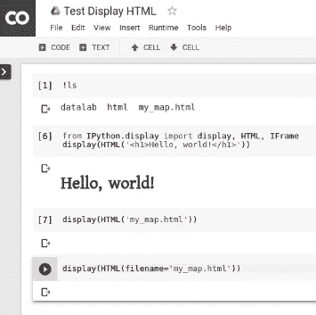
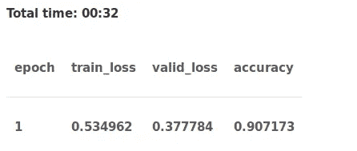

# 使用 Python 中的 ULMFiT 和 fastai 库进行文本分类(NLP)的教程

> 原文：<https://medium.com/analytics-vidhya/tutorial-on-text-classification-nlp-using-ulmfit-and-fastai-library-in-python-2f15a2aac065?source=collection_archive---------0----------------------->

自然语言处理(NLP)在当今世界无需介绍。这是最重要的学习和研究领域之一，在过去的十年里，人们对它的兴趣显著增加。NLP 的基础知识广为人知，易于掌握。但是当文本数据变得巨大且无结构时，事情就变得棘手了。

这就是深度学习变得如此关键的地方。是的，我说的是针对 NLP 任务的深度学习——一条相对较少有人涉足的道路。DL 已经证明了它在图像检测、分类和分割等计算机视觉任务中的有效性，但是像文本生成和分类这样的 NLP 应用长期以来一直被认为适合传统的 ML 技术。


来源:Tryolabs

深度学习无疑对 NLP 产生了非常积极的影响，正如你将在本文中看到的那样。我们将关注迁移学习的概念，以及我们如何在 NLP 中利用它，使用流行的 fastai 库来构建极其精确的模型。在这个过程中，我还将向您介绍 ULMFiT 框架。

**注-** *本文假设基本熟悉神经网络、深度学习*和*迁移学习。如果你是深度学习的新手，我强烈推荐你先阅读以下文章:*

如果你是 NLP 的初学者，看看这个包含 3 个真实项目的[视频课程](https://trainings.analyticsvidhya.com/courses/course-v1:AnalyticsVidhya+NLP101+2018_T1/about)。

# 目录

1.  迁移学习的优势
2.  NLP 中预先训练的模型
3.  ULMFiT 概述
4.  理解问题陈述
5.  系统设置:Google Colab
6.  用 Python 实现
7.  下一步是什么？

# 迁移学习的优势

我在简介里称赞了深度学习，也当之无愧。然而，任何事情都是有代价的，深度学习也不例外。深度学习的最大挑战是训练模型的海量数据需求。很难找到如此大规模的数据集，而且准备这样的数据集成本太高。对于大多数组织来说，想出它们是不可能的。

另一个障碍是运行高级深度学习算法所需的 GPU 成本高。


幸运的是，我们可以使用预先训练的最先进的深度学习模型，并调整它们为我们服务。这就是所谓的迁移学习。它不像从零开始训练深度学习模型那样需要大量资源，即使在少量训练数据上也能产生不错的结果。当我们在一个相当小的数据集上实现我们的学习时，这个概念将在本文后面扩展。

# NLP 中预先训练的模型

预训练模型通过提供他们可以利用的现有框架，帮助数据科学家开始处理新问题。你不必总是从零开始建立一个模型，尤其是当别人已经投入了他们的辛勤工作和努力的时候！这些预训练模型在计算机视觉领域被证明是真正有效和有用的([查看本文](https://www.analyticsvidhya.com/blog/2018/07/top-10-pretrained-models-get-started-deep-learning-part-1-computer-vision/)查看我们挑选的 CV 中前 10 名预训练模型)。

他们的成功普遍归功于 [Imagenet 数据集](http://www.image-net.org/)。它有超过 1400 万个带标签的图像，超过 100 万个图像还伴随着边界框。该数据集于 2009 年首次发布，此后成为最受欢迎的图像数据集之一。它导致了计算机视觉深度学习研究的几项突破，迁移学习就是其中之一。


然而，在 NLP 中，迁移学习并不成功(至少与计算机视觉相比)。当然，我们有预先训练的单词嵌入，如 word2vec、GloVe 和 fastText，但它们主要用于初始化神经网络的第一层。模型的其余部分仍然需要从头开始训练，并且需要大量的例子来产生良好的性能。

在这种情况下，我们真正需要的是什么？像前面提到的计算机视觉模型一样，我们需要一个用于 NLP 的预训练模型，它可以进行微调并用于不同的文本数据集。预训练自然语言模型的竞争者之一是通用语言模型文本分类微调，或 ULMFiT ( [Imagenet 数据集](https://arxiv.org/abs/1801.06146)【cs。CL])。

它是如何工作的？它的应用有多广泛？如何才能让它在 Python 中发挥作用？在本文的其余部分，我们将通过解决一个文本分类问题来测试 ULMFiT，并检查它的性能。

# ULMFiT 概述

由 fast.ai 的[杰瑞米·霍华德](https://medium.com/u/34ab754f8c5e?source=post_page-----2f15a2aac065--------------------------------)和 NUI Galway Insight Center 的 [Sebastian Ruder](https://medium.com/u/e3999e445181?source=post_page-----2f15a2aac065--------------------------------) 提出的 ULMFiT 本质上是一种支持任何 NLP 任务的迁移学习并取得良好结果的方法。所有这些，都不需要从零开始训练模型。这引起了你的注意，不是吗？

ULMFiT 使用以下新技术实现了最先进的结果:

*   区别微调
*   倾斜三角形学习率，以及
*   逐步解冻

该方法包括将在 [Wikitext 103 数据集](https://einstein.ai/research/the-wikitext-long-term-dependency-language-modeling-dataset)上训练的预训练语言模型(LM)微调到新的数据集，以使其不会忘记之前学习的内容。


语言建模可以被认为是自然语言处理的 Imagenet 的对应物。它捕捉语言的一般属性，并提供大量的数据，这些数据可以提供给其他下游的 NLP 任务。这就是为什么语言建模被选为 ULMFiT 的源任务。

我强烈建议你通读乌尔姆菲特[的原始论文](https://arxiv.org/abs/1801.06146)，了解更多关于它的工作原理，杰瑞米和塞巴斯蒂安推导它的方式，并解析其他有趣的细节。

# 问题陈述

好了，足够的理论概念—让我们通过在数据集上实现 ULMFiT 来尝试一下，看看宣传是怎么回事。

我们的目标是微调预训练模型，并将其用于新数据集上的文本分类。我们将在此过程中实施 ULMFiT。有趣的是，这个新数据非常小(<1000 labeled instances). A neural network model trained from scratch would overfit on such a small dataset. Hence, I would like to see whether ULMFiT does a great job at this task as promised in the paper.

**数据集:**我们将使用 [sklearn.datasets](https://scikit-learn.org/stable/modules/generated/sklearn.datasets.fetch_20newsgroups.html#sklearn.datasets.fetch_20newsgroups) 中的 20 个新闻组数据集。顾名思义，它包括来自 20 个不同新闻组的文本文档。

# 系统设置:Google Colab

我们将在 Google [Colab](https://colab.research.google.com/) 而不是本地机器上执行 python 实现。如果你以前从未在 colab 上工作过，那么就把这当作一个奖励吧！Colab，或 Google Colaboratory，是一个运行 Python 的免费云服务。它最好的一点是它免费提供 GPU 和 TPU，因此，它对于训练深度学习模型非常方便。


## Colab 的一些主要优势:

*   完全免费
*   配备了相当不错的硬件配置
*   连接到您的 Google Drive
*   非常好地与 Github 集成
*   在使用它的过程中，您会发现更多的特性..

因此，即使您的系统硬件规格非常普通也没关系，只要您有稳定的互联网连接，您就可以使用了。唯一的其他要求是，你必须有一个谷歌帐户。我们开始吧！

# 用 Python 实现

首先，登录你的谷歌账户。然后选择“新 PYTHON 3 笔记本”。这个笔记本类似于你典型的 Jupyter 笔记本，所以如果你熟悉 Jupyter 环境的话，在上面工作不会有太大的麻烦。Colab 笔记本看起来像下面的截图:



然后进入`Runtime`，选择`Change runtime type`，然后选择`GPU`作为硬件加速器，免费使用 GPU。

# 导入所需的库

大多数流行的库，如*熊猫*、 *numpy* 、 *matplotlib* 、 *nltk* 和 *keras* ，都预装了 Colab。然而，PyTorch 和 fastai v1 这两个库(我们在本练习中需要)需要手动安装。因此，让我们将它们加载到我们的 Colab 环境中:

```
!pip install torch_nightly -f [https://download.pytorch.org/whl/nightly/cu92/torch_nightly.html](https://download.pytorch.org/whl/nightly/cu92/torch_nightly.html) !pip install fastai# import libraries 
import fastai 
from fastai import * 
from fastai.text import * 
import pandas as pd 
import numpy as np 
from functools import partial 
import io 
import os
```

导入我们之前下载的数据集。

```
from sklearn.datasets import fetch_20newsgroups dataset = fetch_20newsgroups(shuffle=True, random_state=1, remove= 
                             ('headers', 'footers', 'quotes'))documents = dataset.data
```

让我们创建一个包含文本文档及其相应标签(新闻组名称)的数据框架。

```
df = pd.DataFrame({'label':dataset.target, 'text':dataset.data})df.shape
```

**(11314，2)**

我们将通过从数据集中出现的 20 个标签中只选择 2 个来将这转换成二元分类问题。我们将选择分别对应于“comp.graphics”和“rec.sport.hockey”的标签 1 和 10。

```
df = df[df['label'].isin([1,10])] 
df = df.reset_index(drop = True)
```

让我们快速地看一下目标分布。

```
df['label'].value_counts()
```


分布看起来相当均匀。在这种情况下，准确性是一个很好的评估指标。

# 数据预处理

向模型提供干净的数据总是一个好的做法，尤其是当数据以非结构化文本的形式出现时。让我们通过仅保留字母并删除所有其他内容来清理我们的文本。

```
df['text'] = df['text'].str.replace("[^a-zA-Z]", " ")
```

现在，我们将从文本数据中删除停用词。如果你以前从未使用过停用词，那么你必须从 *nltk* 包中下载它们，如下所示:

```
import nltk nltk.download('stopwords') 
from nltk.corpus import stopwords stop_words = stopwords.words('english')# tokenization 
tokenized_doc = df['text'].apply(lambda x: x.split()) # remove stop-words 
tokenized_doc = tokenized_doc.apply(lambda x:[item for item in x if 
                                    item not in stop_words]) # de-tokenization 
detokenized_doc = [] for i in range(len(df)):
    t =' '.join(tokenized_doc[i]) 
    detokenized_doc.append(t) df['text'] = detokenized_doc
```

现在，让我们按照 60:40 的比例将清理后的数据集分成训练集和验证集。

```
from sklearn.model_selection import train_test_split # split data into training and validation set 
df_trn, df_val = train_test_split(df, stratify = df['label'], 
                                  test_size = 0.4, 
                                  random_state = 12)df_trn.shape, df_val.shape
```

**((710，2)，(474，2))**

完美！

在继续之前，我们需要分别为语言模型和分类模型准备数据。好消息是什么？使用 fastai 库可以很容易地做到这一点:

```
# Language model data 
data_lm = TextLMDataBunch.from_df(train_df = df_trn, valid_df = 
                                  df_val, path = "") # Classifier model data 
data_clas = TextClasDataBunch.from_df(path = "", train_df = df_trn, 
                                      valid_df = df_val,  
                                      vocab=data_lm.train_ds.vocab, 
                                      bs=32)
```

# 微调预训练模型并进行预测

我们可以使用我们之前创建的`data_lm`对象来微调一个预先训练好的语言模型。我们可以创建一个学习对象“learn”，它将直接创建一个模型，下载预先训练好的权重，并准备好进行微调:

```
learn = language_model_learner(data_lm, pretrained_model=URLs.WT103,  
                               drop_mult=0.7)
```

一个周期和循环动量允许模型以更高的学习速率被训练并且收敛得更快。**单周期政策提供了某种形式的规范**。我们不会深入研究它是如何工作的，因为这篇文章是关于学习实现的。然而，如果你希望了解更多关于单周期政策的信息，那么请随意参考 Leslie Smith 的这篇优秀论文——“[神经网络超参数的训练方法:第 1 部分——学习速率、批量大小、动量和权重衰减](https://arxiv.org/abs/1803.09820)”。

```
# train the learner object with learning rate = 1e-2 learn.fit_one_cycle(1, 1e-2)
```


我们将保存这个编码器，以便稍后用于分类。

```
learn.save_encoder('ft_enc')
```

现在让我们使用之前创建的`data_clas`对象来构建一个带有微调编码器的分类器。

```
learn = text_classifier_learner(data_clas, drop_mult=0.7) learn.load_encoder('ft_enc')
```

我们将再次尝试符合我们的模型。

```
learn.fit_one_cycle(1, 1e-2)
```



哇！我们的准确率有了巨大的提高，甚至验证损失也远远小于训练损失。在小数据集上，这是一个非常出色的表现。您甚至可以使用下面的代码从学习者对象中获得验证集的预测:

```
# get predictions 
preds, targets = learn.get_preds() 
predictions = np.argmax(preds, axis = 1) pd.crosstab(predictions, targets)
```


# 下一步是什么？

随着 ULMFiT 等方法的出现，我们正朝着更通用的 NLP 系统前进。这些模型将能够同时执行多项任务。此外，这些模式不仅仅局限于英语，还包括全球使用的其他几种语言。

我们还有即将推出的技术，如 ELMo，一种新的单词嵌入技术，以及 BERT，一种新的语言表示模型，旨在通过联合调节所有层中的左右上下文来预训练深度双向表示。这些技术已经在许多 NLP 任务上取得了最先进的结果。因此，NLP 的黄金时期刚刚到来，它就在这里停留。

# 结束注释

我希望这篇文章对你有所帮助。然而，使用 fastai 库在 ULMFiT 中仍然有更多的东西可以探索，我鼓励你们去探索。如果你有任何建议，请在下面的评论区告诉我。此外，尝试在你选择的不同问题和领域上使用 ULMFiT，看看结果如何。

**代码:**这里可以找到完整的代码[。](https://github.com/prateekjoshi565/ULMFiT_Text_Classification/blob/master/ULMFiT_fastai_Text_Classification.ipynb)

*欢迎致电****prateekjoshi565@gmail.com****联系我，进行一对一讨论。*