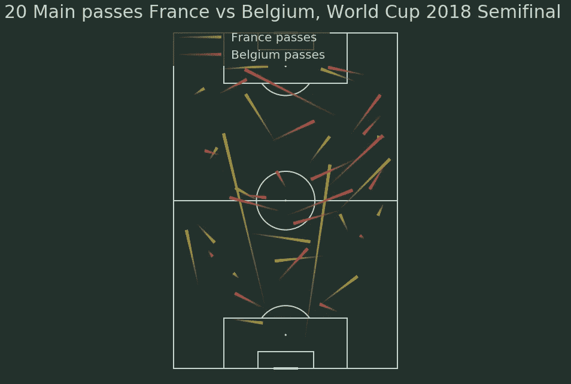

# 教程:通过 2018 年世界杯半决赛法国对比利时的例子，用 Python 传递聚类

> 原文：<https://medium.com/analytics-vidhya/tutorial-pass-clustering-with-python-through-the-example-of-france-belgium-2018-world-cup-edc16a2f5bb8?source=collection_archive---------15----------------------->

本教程的目的是解释一个简单的传球聚类的结构，以及图形可视化，允许增加对战术研究的理解。


萨穆埃尔·乌姆蒂蒂庆祝比赛的唯一进球

# 什么是集群，如何适应足球和传球？

聚类是一种无监督的学习技术，包括将空间上接近的数据分组在一起。一个数据由一个元组定义，这个元组的每个值都与一个不同的变量相关。

这项技术用于足球数据分析领域。它提供了将基本相同的刀路分组并创建定义数量的簇的可能性，每个簇对应于特定类型的刀路。事先，必须用数学方法定义一次通过。在球场上，一次传球由其起点和终点坐标(Xstart、Ystart、Xend、Yend)定义。定义每一个过程后，剩下的工作就是将这些数据提供给一个聚类算法，该算法将创建您想要的聚类数。

最常用的聚类算法是 K-Means。你会在这篇文章中找到一个非常好且详细的解释。

有时数据的结构是这样的，即存在一个最佳的聚类数。例如，在我们的例子中，将有 10 次相同类型的传球。实际上，以足球为例，很难确定最佳的集群数量。我们不会意识到这一点，但我鼓励你阅读[这篇非常好的文章](/@masarudheena/4-best-ways-to-find-optimal-number-of-clusters-for-clustering-with-python-code-706199fa957c)，它解释了如何确定集群的最佳数量。

# 案例研究:2018 年法国对比利时，两种完全不同的比赛风格

介绍的理论，我们试着通过一个例子来更好的理解这个概念，2018 世界杯半决赛，法国-比利时。我们将使用的数据由 Statsbomb 提供。我鼓励你访问这个 [Github 库](https://github.com/statsbomb/open-data)，发现提供数据的比赛和竞赛。为了完成下面的教程，您需要下载这些数据。

提醒一下，这场比赛很特别。很长一段时间，比利时人都在对抗法国人的防守，但是他们从来都不是很危险。另一方面，法国人在控制压力的同时采取了反击。因此，每支球队的传球模式应该是不同的。

我们将借助 Python 及其对数据科学有用的著名软件包来进行这一分析:Pandas、Sklearn、Matplotlib 和 Numpy。此外，您将需要 json 包来读取 Statsbomb 提供的 json 格式的数据，还需要 mplsoccer 来制作漂亮的可视化效果。首先，确保您的机器上安装了以下软件包。然后在实际开始分析之前导入它们。

```
import json
import pandas as pd
import sklearn
import numpy as np
import matplotlib.pyplot as plt
```

让我们从导入数据开始。它是 json 格式的。为了打开正确的文件，有必要检索竞争和比赛的 id。我帮你一把。比赛的 id 是 43。匹配 id 是 8655。为了区分每个队的传球，你需要知道他们的 id。法国 771 分，比利时 782 分。

```
with open('open-data-master/open-data-master/data/matches/43/3.json') as f:
  data = json.load(f)with open('open-data-master/open-data-master/data/events/8655.json') as f:
  data_events = json.load(f)
```

下面的代码用于创建将提供给算法的数据帧。我们为每个团队创建一个表格。我们根据与每个事件相关联的通行证类型来隔离通行证。我鼓励您阅读 Statsbomb 提供的文档中的实际事件文档，这些文档存在于 [Github 库](https://github.com/statsbomb/open-data)中。此外，我们会将每个通行证与收到通行证的玩家的姓名相关联。该信息在算法中没有提供，它将允许我们知道在每个集群中哪些玩家已经收到了通行证。

```
id_team_1 = 771 
id_team_2 = 782start_location_x_team_1 = []
end_location_x_team_1 = []
start_location_y_team_1 = []
end_location_y_team_1 = []start_location_x_team_2 = []
end_location_x_team_2 = []
start_location_y_team_2 = []
end_location_y_team_2 = []player_team_1 = []
player_team_2 = []
recipient_team_1 = []
recipient_team_2 = []for event in data_events :
    if event['type']['name'] == 'Pass' and event['team']['id'] ==    id_team_1 :
        start_location_x_team_1.append(event['location'][0])
        start_location_y_team_1.append(event['location'][1])
        end_location_x_team_1.append(event['pass']['end_location'][0])
        end_location_y_team_1.append(event['pass']['end_location'][1])
        player_team_1.append(event['player']['name'])

        try :
            recipient_team_1.append(event['pass']['recipient']['name'])
        except :
            recipient_team_1.append('no recipient')

    if event['type']['name'] == 'Pass' and event['team']['id'] == id_team_2 :
        start_location_x_team_2.append(event['location'][0])
        start_location_y_team_2.append(event['location'][1])
        end_location_x_team_2.append(event['pass']['end_location'][0])
        end_location_y_team_2.append(event['pass']['end_location'][1])
        player_team_2.append(event['player']['name'])

        try :
            recipient_team_2.append(event['pass']['recipient']['name'])
        except :
            recipient_team_2.append('no recipient') pass_team_1 = pd.DataFrame()
pass_team_1['start_x'] = start_location_x_team_1
pass_team_1['start_y'] = start_location_y_team_1
pass_team_1['end_x'] = end_location_x_team_1
pass_team_1['end_y'] = end_location_y_team_1
pass_team_1['player'] = player_team_1
pass_team_1['recipient'] = recipient_team_1pass_team_2 = pd.DataFrame()
pass_team_2['start_x'] = start_location_x_team_2
pass_team_2['start_y'] = start_location_y_team_2
pass_team_2['end_x'] = end_location_x_team_2
pass_team_2['end_y'] = end_location_y_team_2
pass_team_2['player'] = player_team_2
pass_team_2['recipient'] = recipient_team_2
```

然后，我们实际上执行聚类。由于变量 N_clusters，我们任意决定创建 20 个集群。此外，由于 scikit 学习包的 KMeans 功能，我们实现了每个团队传球的聚类。每一遍的簇号包含在 numpy 数组 cluster_labels 中。我们还可以计算每个星团的质心。质心是每个聚类的平均点。在我们的例子中，它是最好地合成相应集群的所有过程的过程。

```
N_clusters = 20
X_1 = np.array(pass_team_1[['start_x', 'start_y', 'end_x', 'end_y']])
X_2 = np.array(pass_team_2[['start_x', 'start_y', 'end_x', 'end_y']])kmeans = KMeans(n_clusters = N_clusters, random_state = 0).fit(X_1)
cluster_labels = kmeans.predict(X_1)
pass_team_1['n_cluster'] = cluster_labels
centroids_1 = pd.DataFrame(data = kmeans.cluster_centers_, columns = ['start_x', 'start_y', 'end_x', 'end_y'])kmeans = KMeans(n_clusters = N_clusters, random_state = 0).fit(X_2)
cluster_labels = kmeans.predict(X_2)
pass_team_2['n_cluster'] = cluster_labels
centroids_2 = pd.DataFrame(data = kmeans.cluster_centers_, columns = ['start_x', 'start_y', 'end_x', 'end_y'])
```

# 可视化和解释

一旦我们的集群被创建，有必要查看属于同一个集群的传球，以便从足球角度解释结果。我们依靠伟大的 mplsoccer 软件包来可视化结果。我鼓励你[去浏览它](https://mplsoccer.readthedocs.io/en/latest/)，它的可视化效果很棒，会节省你的时间。下面的代码仅用于可视化。

```
from mplsoccer.pitch import Pitch
from mplsoccer.statsbomb import read_event, EVENT_SLUG
from matplotlib import rcParamspitch = Pitch(pitch_type='statsbomb', orientation='vertical',
              pitch_color='#22312b', line_color='#c7d5cc', figsize=(16, 11),
              constrained_layout=False, tight_layout=False)
fig, ax = pitch.draw()lc1 = pitch.lines(centroids_1['start_x'], centroids_1['start_y'],
                  centroids_1['end_x'], centroids_1['end_y'],
                  lw=5, transparent=True, comet=True, label='France passes',
                  color='#ad993c', ax=ax)lc2 = pitch.lines(centroids_2['start_x'], centroids_2['start_y'],
                  centroids_2['end_x'], centroids_2['end_y'],
                  lw=5, transparent=True, comet=True, label='Belgium passes',
                  color='#ba4f45', ax=ax)# Plot the legend
ax.legend(facecolor='#22312b', edgecolor='None', fontsize=20, loc='upper left', handlelength=4)# Set the title
ax.set_title(f'20 Main passes France vs Belgium, World Cup 2018 Semifinal ', fontsize=30)# Set the figure facecolor
fig.set_facecolor('#22312b')
```



每队有 20 个质心传球。两队都是自下而上进攻。

首先，我们看看每支球队的 20 个中锋传球(上图)。我们注意到比利时人大多使用右翼传球或者传到球场中央。对法国人来说，他们在很大程度上减少了中场顶端的人数，在 Kilian Mbappé的走廊上，他们踢边路，主要是右边。此外，我们注意到两个箭头从中场开始，指向球场顶部。正如我们将看到的，他们是来自中后卫瓦拉内和乌姆蒂蒂以及门将乌戈·洛里斯的解围。

我们也可以观察同一个星团的经过，以便更好地了解它的组成。质心通道并不总是完美地合成集群中存在的通道。最引人注目的星团之一是 Kilian Mbappé和 Benjamin Parvard 的区域(下图)。后者在同一区域接受了不少于 15 次模拟传球。我们没有在卢卡斯·赫尔南德斯和布莱斯·马泰迪的走廊里发现这种集群，动画不同。


集群重组了法国右翼的通行证

为所有集群生成图形的代码如下。

```
for c in sorted(pass_team_1['n_cluster'].unique()) :

    pitch = Pitch(pitch_type='statsbomb', orientation='vertical',
              pitch_color='#22312b', line_color='#c7d5cc', figsize=(16, 11),
              constrained_layout=False, tight_layout=False)

    fig, ax = pitch.draw()lc1 = pitch.lines(pass_team_1[pass_team_1['n_cluster'] == c]['start_x'], 
                      pass_team_1[pass_team_1['n_cluster'] == c]['start_y'],
                      pass_team_1[pass_team_1['n_cluster'] == c]['end_x'],
                      pass_team_1[pass_team_1['n_cluster'] == c]['end_y'],
                      lw=5, transparent=True, comet=True, label='France passes',
                      color='#ad993c', ax=ax)# Plot the legend
    ax.legend(facecolor='#22312b', edgecolor='None', fontsize=15, loc='upper left', handlelength=3)# Set the title
    ax.set_title(f'Cluster passes France vs Belgium, World Cup 2018 Semifinal ', fontsize=10)# Set the figure facecolor
    fig.set_facecolor('#22312b')

    dic_pass_players = {}
    for player in pass_team_1[pass_team_1['n_cluster'] == c]['player'].unique() :
        dic_pass_players[player] = sum(pass_team_1[pass_team_1['n_cluster'] == c]['player'] == player)

    sort_pass_players = sorted(dic_pass_players.items(), key=lambda x: x[1], reverse=True)
    sort_dic_pass_players = {}
    for i in range(len(sort_pass_players)) :
        sort_dic_pass_players[sort_pass_players[i][0]] = sort_pass_players[i][1]
    i=0
    for p in list(sort_dic_pass_players.keys()) :
        plt.text(52, 117-i, p + ' ' + str(sort_dic_pass_players[p]), bbox=dict(facecolor='#22312b', edgecolor='None', alpha=0.5))
        i+=3
```

这个实际案例为任何想更多了解一个团队的战术结构的人提供了基本的答案。但是这种分析可以(应该)伴随着附加的分析，例如定位热图或者当跟踪数据可用时对手在传球时的定位。