# 教程设置 Azure EventGrid 主题来调用触发 Sendgrid 电子邮件的 Azure 函数

> 原文：<https://medium.com/analytics-vidhya/tutorial-to-setup-azure-eventgrid-topic-to-call-azure-function-that-triggers-a-sendgrid-email-735f9aa87ba3?source=collection_archive---------0----------------------->

Azure Eventgrid 实际上已经解决了我们等待一个动作(或事件)被执行、触发某个任务的所有需求。它消除了轮询和不必要的成本。我们可以在几分钟内建立一个无服务器监控系统(遵循以下 6 个步骤),向我们发送行动通知。
对关键术语的快速说明:
**事件** →任何动作都是事件(例如，接收到 Http 请求，创建 blob 存储，VM 的试运行/退役)
**主题** →主题是发布者将发送事件的端点。对于所有的 azure 服务，它们已经预先创建了它们的主题，所以例如我们不必为 azure blob 存储创建主题。
**事件订阅→** 事件网格中的内置机制，事件在其中被路由到单个或多个订阅者。
**事件处理程序** **→** 服务，对来自主题和特定订阅的事件做出反应。
**发布者** →触发事件到话题的应用。在我们的例子中，我们将使用 PostMan
**Subscriber**→应用程序发布定制消息，该应用程序等待它订阅的主题的特定事件被触发。

不要过多地从理论上解释什么是事件，或者预先创建的事件和自定义事件之间有什么区别，因为所有这些你都可以通过谷歌或微软文档阅读。

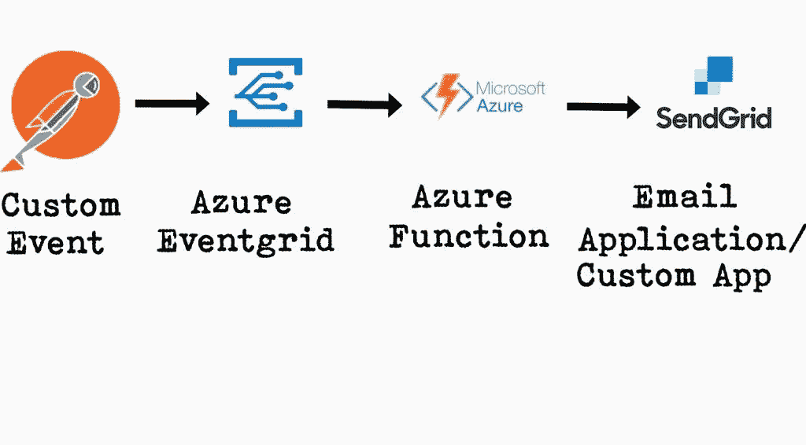

刚开始动手干脏活..！这是我们需要的东西的清单:

# 步骤 0 —先决条件

1.  Azure 订阅
2.  Visual Studio 代码*(在我们的例子中，我们将直接在门户上编写函数)
3.  Sendgrid 帐户。
4.  测试用邮递员

是的，就是它..！！

# 步骤 1-设置事件网格主题

登录 Azure 门户，点击创建资源，搜索事件网格主题

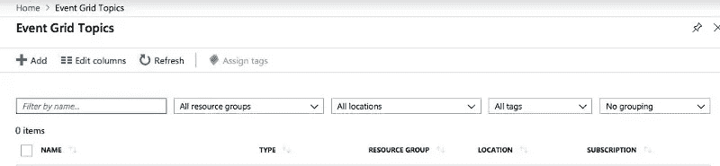

单击 Add(添加新主题)并填写所需的详细信息(下面的截图)。

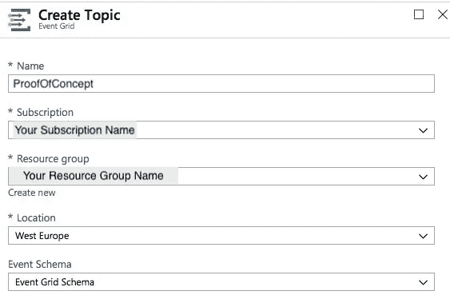

点击主题查看主题详情:

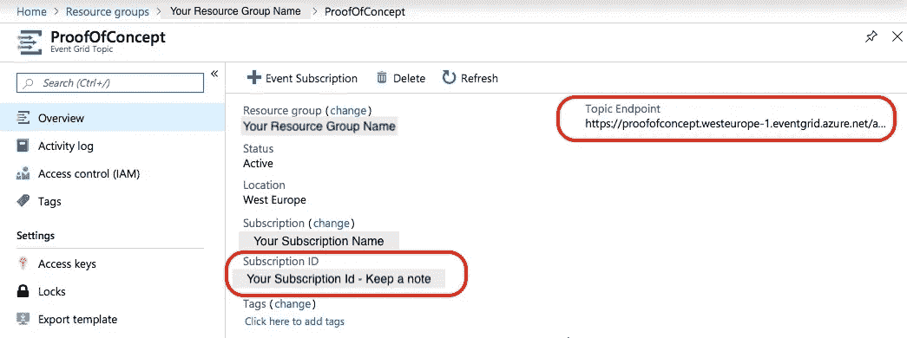

记下您的主题端点 url 和订阅 ID。

# 步骤 2-设置 Azure 功能

无服务器是云计算中最好的发明之一。现在我们将编写一个 Azure 函数来订阅我们的主题——“ProofOfConcept”。

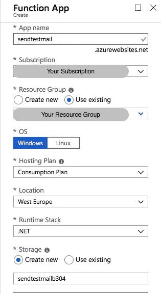

点击主页→功能应用程序→添加，输入所需的详细信息，然后点击创建。

我用的是. Net 的运行时栈[当你用 Azure 的时候，准备好用 Windows 和。网；-)]

function app 将允许我们编写函数逻辑来调用 sendgrid api。

创建功能应用程序后(需要几分钟)，单击查看资源。

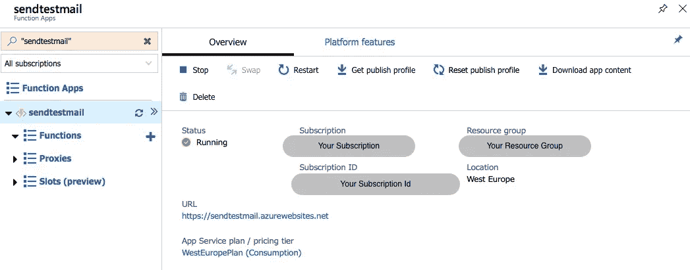

您的 FunctionApp 已经准备好了，现在是时候在其中创建一个函数了，我们在事件触发时调用 Sendgrid email 的逻辑将驻留在这个函数中。

# 步骤 3——编写您的函数逻辑

点击功能上的添加按钮。选择您喜欢的编写函数逻辑的方式。对于本教程，我选择直接通过门户网站。

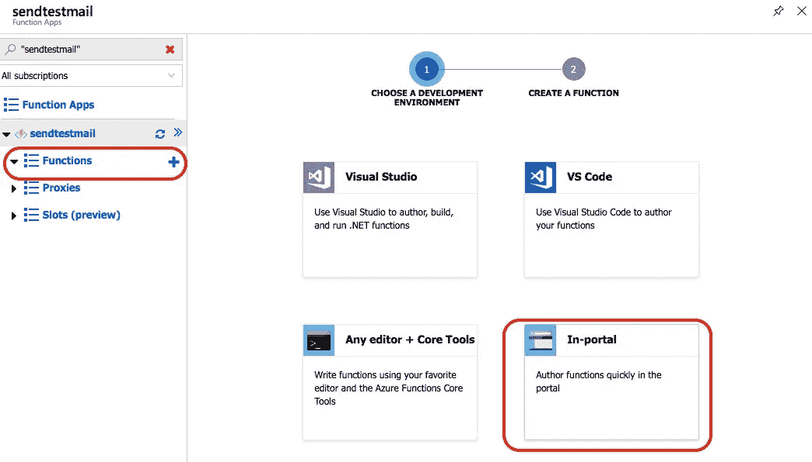

点击更多模板，因为我们需要选择 Azure 事件网格模板

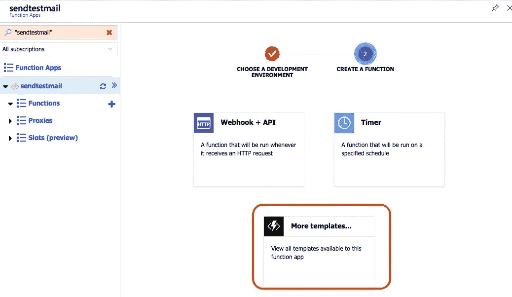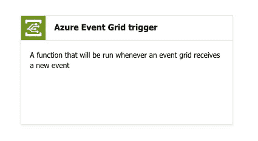

最后选择 Azure 事件网格触发器。它可能会要求你安装" *Microsoft.Azure. WebJobs。Extensions.EventGrid 扩展"*。只需点击安装扩展。

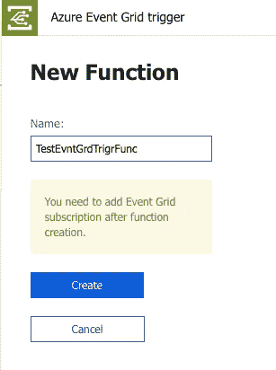

接下来写下函数名并点击 create。这将打开一个带有一些初始代码行的文本编辑器。

您可以在 Run 方法中看到，EventGrid 是作为一个参数添加的，因为我们通过 template 选择了它。

编写以下代码行来配置电子邮件发送。

```
 #r "Microsoft.Azure.EventGrid"
#r "SendGrid"using SendGrid.Helpers.Mail;
using Microsoft.Azure.EventGrid.Models;
using System.Net.Http;public static void Run(EventGridEvent eventGridEvent
                      ,ILogger log
                      ,out SendGridMessage message){
    log.LogInformation(eventGridEvent.Data.ToString());
    message = new SendGridMessage();
    message.SetSubject("Message Via Azure Event Grid");
    message.PlainTextContent= eventGridEvent.Data.ToString();
}
```

上面的代码不会编译或运行，因为我们还没有配置 Eventgrid。所以让我们开始吧。保存功能代码。现在让我们尝试设置事件网格。

# 步骤 4-将事件网格设置为输出参数

在函数应用程序的左侧面板上，我们有 TestEvntGrdTrigrFunc 函数，单击 integrate，然后选择 click on new output 并选择 SendGrid。

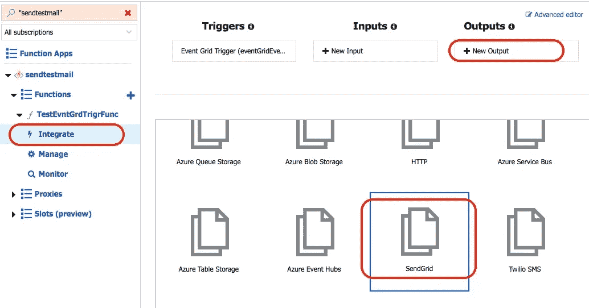

然后更新 SendGrid 输出参数中所有必需的细节。输入收件人和发件人电子邮件 Id、主题(如果你不想通过代码设置)正文，以及最重要的 **SendGrid API 关键应用设置**字段。

在功能配置中记录您的 sendgrid API key，然后从 SendGrid API key app 设置的下拉列表中选择。(*如果你对此有任何问题，请在评论框中告诉我，我会尽我所能回答。*)

现在我们的函数已经准备好了，但是我们还缺少一个关键的步骤。Out Azure 函数仍未订阅 EventGrid 主题。所以让我们开始吧。

# 步骤 5-添加事件网格订阅

添加 eventgrid 订阅有多种方法，最简单的方法是仅通过函数 app。:-)

转到您的函数并单击顶部链接，添加事件网格订阅。

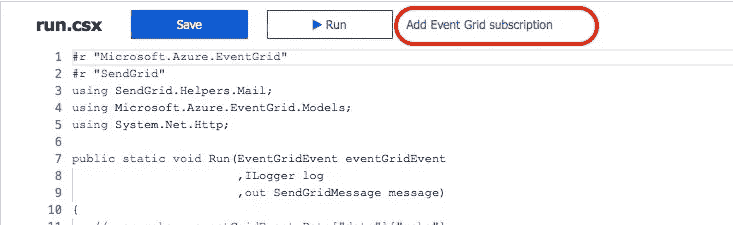

输入事件订阅详细信息。(*我已经将订阅的名称命名为 TestConnection* )。在主题详情中输入:
→主题类型为*事件网格主题*
→订阅为*您的订阅*
→资源组为*您的资源组*
→资源为*您的* *主题* ( *此处为 ProofOfConcept 为主题名称*)

一旦您点击 create 并创建了您的资源订阅，您可以在您的主题(ProofofConcept)订阅列表下看到相同的内容。好极了……..！！！！

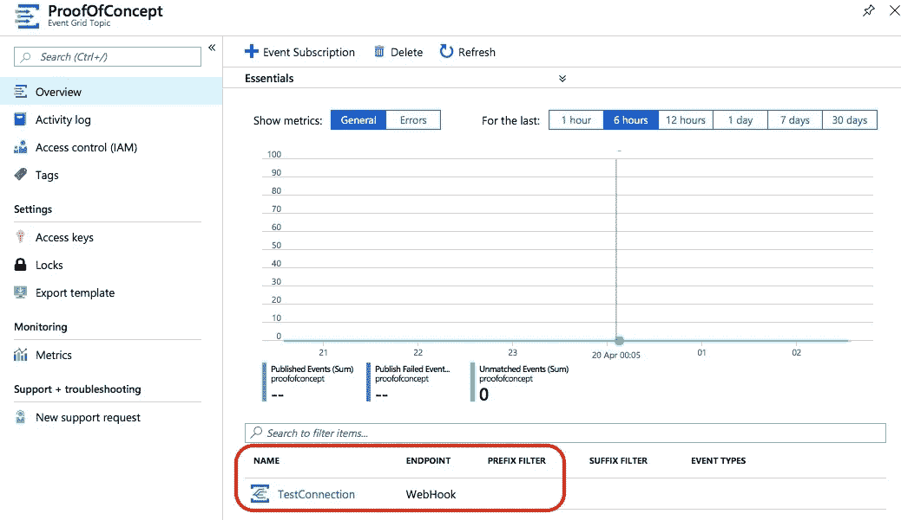

一切都准备好了，我们只需要测试它。我们可以用 Postman 来测试。我们必须遵循一个协议来将事件发布到主题。无论我们是使用自定义事件还是内置事件，每个事件中都有一些必填字段。

*   **Id** —事件的唯一 Id。
*   **主题** —与我们的申请相关的任何名称或标签。这是放置与事件相关的服务/实体名称的好地方。
*   **事件类型** —我们可以根据其创建过滤器的值，例如 CustomerCreated、BlobDeleted、HttpRequestReceived 等。
*   **事件时间** —发布者中事件发生的时间戳。
*   **数据** —对该事件采取行动所需的相关信息。该字段是可选的。然而在自定义事件中，这是我们用来向 Azure 函数提供细节的字段。

一个自定义事件的例子( [*由 Azure*](https://docs.microsoft.com/en-us/azure/event-grid/custom-event-quickstart) 提供)

```
[
   {   "id": "1807",   
       "eventType": "recordInserted",   
       "subject": "myapp/vehicles/motorcycles",   
       "eventTime": "2017-08-10T21:03:07+00:00",   
       "data": {     
                  "make": "Ducati",     
                  "model": "Monster"   
                },  
        "dataVersion": "1.0",   
        "metadataVersion": "1",   
        "**topic**": "/subscriptions/{subscription-id}/resourceGroups/{resource-group}/providers/Microsoft.EventGrid/topics/{topic}" 
   }
]
```

主题标签在这里非常重要。

```
"**topic**": "/subscriptions/{subscription-id}/resourceGroups/{resource-group}/providers/Microsoft.EventGrid/topics/{topic}"
```

{subscription-id} →这是 Azure 函数的订阅 id。
{resource-group} →您的资源组名称
{topic} →您的主题名称(在我们的例子中是 ProofofConcept)

一切都准备好了，让我们用 Postman 测试一下。

# 步骤 6 —最后用 PostMan 测试

1.  打开邮递员，选择邮寄方式
2.  进入 API(主题端点)——[*https://proofofconcept . westeurope-1 . event grid . azure . net/API/events*](https://proofofconcept.westeurope-1.eventgrid.azure.net/api/events)
3.  将上面的示例定制消息复制到 body 部分(作为原始 JSON)。确保更新你的主题细节。
4.  最后一件非常重要的事情**——在标题部分添加一个键值对(*认证密钥* ):
    密钥名— aeg-sas-key
    值—来自主题访问密钥的密钥值**

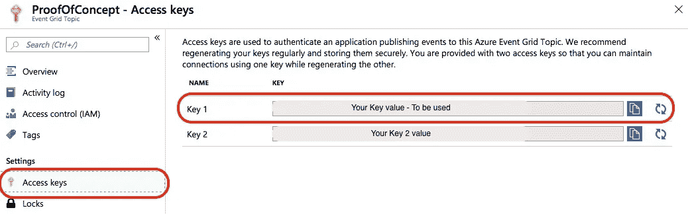

就是这样…..！！！！

您的自定义主题发布消息发送已准备就绪。现在每当你发布你的消息(事件)到你的主题，它将触发一个 Azure 函数来发送电子邮件。

希望这篇文章对你有用。鼓掌表达你的爱。:-)请务必让我知道，以防您在设置它时遇到任何困难，或者您认为有任何更新或改进的余地。