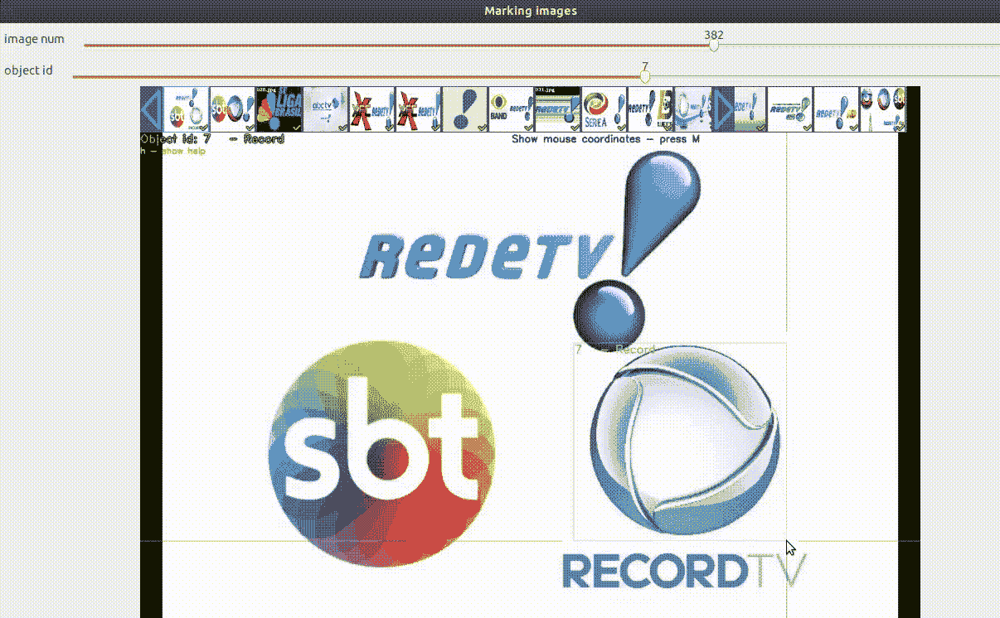
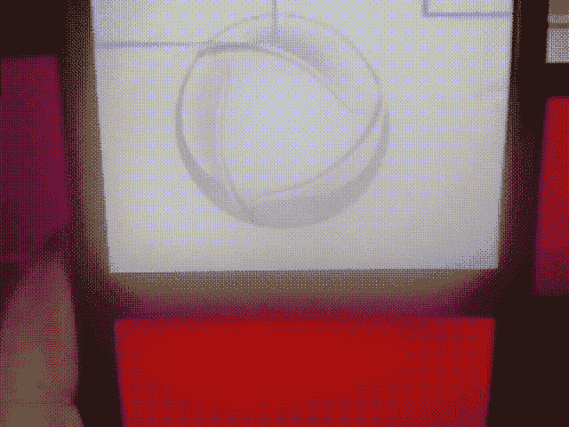

# 电视台徽标识别

> 原文：<https://medium.com/analytics-vidhya/tv-stations-logo-recognition-20812f68e20a?source=collection_archive---------7----------------------->

## *实现部署在 Flutter 上的基于深度学习的 logo 检测应用。*


人工智能正在彻底改变系统，并导致全球范式的转变。
在巴西这样的国家，在强大的媒体环境下，这一概念似乎非常合适，因为公民无法了解他们的公共评估系统是如何工作的，例如:

*   观众系统(一个不可靠机构的垄断)
*   选举投票(由被操纵的机构进行)

Beep 应用程序项目

**⠀⠀⠀⠀⠀⠀⠀⠀⠀**

我是 Beep 应用程序的一部分，该应用程序提出了让人们能够与受众数据进行交互的建议，并通过实时数据向广告商和媒体代理提供可信的信息。

**⠀⠀⠀⠀⠀⠀⠀⠀⠀⠀⠀⠀⠀⠀⠀⠀⠀**

# 在物体识别中，机器会有什么表现？

机器是神奇的，现在在识别图案、形状、颜色和人脸方面比人类更好。更重要的是，它们超越了我们的听力水平，可以在几秒钟内复制一个人的声音。


大规模视觉识别挑战赛的目标检测任务。资料来源:image-net.org

自 2015 年以来，在 Imagenet 比赛中，深度学习模型在对象识别方面的检测水平超过了人类。这种技术可以广泛用于监视、自动识别、利用无人机测绘资源等。

# 如何自动化观众测量系统？

为了实现这个目标，我在 **Darknet** 神经网络框架上训练了两个深度学习模型，第一个用于从**近距离**捕捉电视台标志，以获得更高的检测准确性，另一个用于**更远距离**以获得智能手机操作上的更多便利。

检测的标志对象:


物体检测标志

## 这里展示了最终训练好的卷积神经网络:


用于标识检测的训练卷积神经网络

我决定使用约洛·V2(你只能看一次)，因为它的精确度很高，而且训练时间很短。我无法使用 Yolo V3 版本，因为在转换到 TensorFlow lite (FlatBuffer 模型)时不支持某些操作。我不得不在 Yolo 上使用“ **Tiny** ”配置构建一个轻量级版本的模型，以便在移动设备上正常工作。

# GITHUB 项目:

这个项目与我的 Github 库有关:([链接](https://github.com/leoitcode/tv-recognizer))

# 第 1 部分:获取数据

对于近距离模型，我使用 python 库**Google _ Images _ download**[(链接)](https://pypi.org/project/google_images_download/)从 Google Images 获取数据，我已经在我的 github web 抓取脚本上演示了该用法，在该脚本中我获取了所有 483 个巴西电视台的徽标([链接](https://github.com/leoitcode/webscraping))。


电视节目:2019 年全球电视全国新闻

对于更远的距离模型，我从 Youtube 上的电视节目的录制视频中获取数据，并在屏幕的角落上显示徽标。因此，我使用 FFmpeg 平台从每个电视台获得了至少 2000 幅全屏图像进行视频操作。

**⠀⠀⠀⠀⠀⠀⠀⠀⠀**

```
ffmpeg -i RECORD1.mp4 -vf “fps=1” -q:v 2 record_%03d.jpeg
```

在这个命令中，我每秒钟从这个视频(RECORD1.mp4)中提取 2000 帧，连续生成图像 record_xxx.jpg 用于模型。


# 第 2 部分:数据扩充

为此，我在 Google Colab 上使用了 Fastai 库深度学习的视觉模块。该过程在笔记本上有说明:

数据扩充脚本

这个笔记本应用所有类型的电视标志图像转换，如照明变化，大小，裁剪，视角，模糊等。数据扩充是一种人工扩展数据集并提高模型最终精度的方法。这里，Globo 电视台的数据增强标志:


Globo 的徽标数据增强

# **第 3 部分:注释**

因此，我为每个电视台准备了至少 2000 个增强标识图像。准备好训练了吗？还没有，训练过程需要一个称为注释的过程来特别识别屏幕上的徽标格式和位置。



Yolo 标记工具

之所以选择 Yolo Mark，是因为在 Darknet 标准下可以很容易地得到注释。在每个图像上，软件生成一个包含边界框和类的坐标的 txt 文件。

# 第 4 部分:暗网培训


电脑看到了什么？


**⠀⠀⠀⠀⠀⠀⠀⠀⠀**

**⠀⠀⠀⠀⠀⠀⠀⠀⠀**

CNN(卷积神经网络)通过许多层处理图像，使用过滤器(内核)获得形状和颜色的模式，然后进行分类以识别对象是否属于某个特定类别。所有参数都可以配置用于训练。

**⠀⠀⠀⠀⠀⠀⠀⠀⠀**

**⠀⠀⠀⠀⠀⠀⠀⠀⠀⠀⠀⠀⠀⠀⠀⠀⠀⠀**

我用 AlexeyAB Fork 访问了 Darknet，这是 Darknet 的一个流行版本，有更多的选项，它比原来的 Darknet 程序更快更准确。

[](https://github.com/AlexeyAB) [## AlexeyAB -概述

### 用于目标检测的暗网 Yolo V3 和 V2 神经网络。

github.com](https://github.com/AlexeyAB) 

为了开始训练，你基本上需要 3 个文件:

1- (.数据文件)。为了给 Darknet 所有的图像文件，txt 注释路径和类。

2- (darknet19_448.conv.23)。预先训练的权重用于将学习转移到新的模型中，以避免从头开始。

3- (.CFG 文件)配置文件。我使用了约洛 V2 微小的文件，并做了像过滤器，批量大小，细分参数的配置。

于是，开始训练:

```
./darknet detector train logopaca.data cfg/logopaca_yolov2-tiny.cfg darknet19_448.conv.23 -map
```

我将选项“-map”放在命令上，以便可视化损失函数的历史，该函数显示来自假阳性和假阴性的惩罚分数。mAP indicator 计算模型在特定范围内的平均精度，这对于评估最佳模型非常有用。


我决定使用 14000 次迭代，而不是到期的后续迭代:

1-损失值的变化在 14000 处几乎为零，这表明与后面的迭代相比，过度拟合的机会减少了。

2-良好映射 98.74%，这表明检测具有极好的精度。

3-F1 分数为 0.96，它考虑了精确度和召回率，以分析该模型在检测特定电视台标志时的表现，添加了假阴性结果。

这是一份 14000 磅文件的简历，包含每个电视台的精度:


14000 迭代权重文件的 mAP 计算。

结果，用了(。权重文件)我开始使用暗流将暗网转换为张量流格式:

[](https://github.com/thtrieu/darkflow) [## thtrieu/darkflow

### 将 Darknet 转换为 TensorFlow。加载训练过的权重，使用 TensorFlow 进行调整，将常量图形定义导出到移动设备。

github.com](https://github.com/thtrieu/darkflow) 

这段代码转换成(ProtoBuf)格式:

```
sudo flow — model logopaca_yolov2-tiny.cfg — load logopaca_yolov2-tiny_14000.weights — savepb
```

> 来自暗流:保存`.pb`文件时，旁边还会生成一个`.meta`文件。这个`.meta`文件是`meta`字典中所有内容的 JSON 转储，其中包含了后期处理所需的信息，如`anchors`和`labels`。创建的`.pb`文件可用于将图形迁移到移动设备(JAVA / C++ / Objective-C++)。

与。pb 文件和。meta 我开始把这个图转换成 TensorFlow lite(。tflite)格式，使用 UBUNTU 中 TensorFlow 库的“tflite_convert ”:

```
tflite_convert — graph_def_file=built_graph/logopaca_yolov2-tiny.pb — output_file=built_graph/logopaca_yolov2_tiny_far.lite — input_format=TENSORFLOW_GRAPHDEF — output_format=TFLITE — input_shape=1,416,416,3 — input_array=input — output_array=output — inference_type=FLOAT
```

# **第 5 部分:在颤振上展开**

Flutter 在相机插件中增加了对图像流的支持。这提供了在相机预览中捕捉分离帧的能力。有了这个功能，我可以将这个流与一个 tflite (TensorFlow Lite)插件连接起来，通过对象检测立即处理这些帧。

相机插件:[https://pub.dev/packages/camera](https://pub.dev/packages/camera)

首先，我在相机控制器中调用 startImageStream，以获取***camera image img***(图像格式)、(高度)、(宽度)和(**平面**)图像的字节数。

```
controller.startImageStream((CameraImage img) {
 if (!isDetecting) {
 isDetecting = true;int startTime = new DateTime.now().millisecondsSinceEpoch;
```

tflite 插件访问 TensorFlow Lite API，该 API 在 iOS 和 Android 上都支持检测( [SSD](https://github.com/tensorflow/models/tree/master/research/object_detection) 和 [YOLO](https://pjreddie.com/darknet/yolov2/) )、 [Pix2Pix](https://phillipi.github.io/pix2pix/) 和 [Deeplab](https://github.com/tensorflow/models/tree/master/research/deeplab) 和 [PoseNet](https://www.tensorflow.org/lite/models/pose_estimation/overview) )。

[](https://pub.dev/packages/tflite) [## tflite |颤振包

### 一个访问 TensorFlow Lite API 的 Flutter 插件。支持图像分类、对象检测(固态硬盘和 YOLO)…

公共开发](https://pub.dev/packages/tflite) 

该插件具有函数***detectObjectOnFrame****，该函数接收参数并处理识别:*

```
*Tflite.detectObjectOnFrame(
 bytesList: img.planes.map((plane) {
 return plane.bytes;
 }).toList(),
 model: widget.model == yolo ? “YOLO” : “SSDMobileNet”,
 imageHeight: img.height,
 imageWidth: img.width,
 imageMean: widget.model == yolo ? 0 : 127.5,
 imageStd: widget.model == yolo ? 255.0 : 127.5,
 numResultsPerClass: 1,
 threshold: widget.model == yolo ? 0.2 : 0.4,
 ).then((recognitions) {
 int endTime = new DateTime.now().millisecondsSinceEpoch;
 print(“Detection took ${endTime — startTime}”);widget.setRecognitions(recognitions, img.height, img.width);isDetecting = false;
});*
```

*为了输出识别，我宁愿把预览放到 ***RotatedBox* 和 OverflowBox** 小部件中。第一个是根据移动方向旋转图像，如横向和纵向。第二种方法使预览完全适合手机屏幕大小。*

```
*Widget build(BuildContext context) {
 if (controller == null || !controller.value.isInitialized) {
 return Container();
 }
 var tmp = MediaQuery.of(context).size;
 var screenH = math.max(tmp.height, tmp.width);
 var screenW = math.min(tmp.height, tmp.width);
 tmp = controller.value.previewSize;
 var previewH = math.max(tmp.height, tmp.width);
 var previewW = math.min(tmp.height, tmp.width);
 var screenRatio = screenH / screenW;
 var previewRatio = previewH / previewW;return RotatedBox(
 quarterTurns: MediaQuery.of(context).orientation == Orientation.landscape ? 3 : 0,
 child: OverflowBox(
 maxHeight:
 MediaQuery.of(context).orientation == Orientation.landscape ? screenW / previewW * previewH : screenH,
 maxWidth:
 MediaQuery.of(context).orientation == Orientation.landscape ? screenW : screenH / previewH * previewW,
 child: CameraPreview(controller),),
 );
 }
}*
```

*检测的边界框我从 [ticketdamoa](http://git.kumoh42.com/capstone2019/ticketdamoa/blob/9fbbce50fb7ac8d7db9c1c823810a8a1fe380b31/lib/view/widget/detection/camera_detection_widget.dart) 项目中获得了基础代码，并做了一些修改以提高设备兼容性，并在框上显示类名。*

```
*Widget build(BuildContext context) {
 List<Widget> _renderBoxes() {
 return results.map((re) {
 var _x = re[“rect”][“x”];
 var _w = re[“rect”][“w”];
 var _y = re[“rect”][“y”];
 var _h = re[“rect”][“h”];
 var scaleW, scaleH, x, y, w, h;scaleH = screenW / previewW * previewH;
 scaleW = screenW;
 var difH = (scaleH — screenH) / scaleH;
 x = _x * scaleW;
 w = _w * scaleW;
 y = (_y — difH / 2) * scaleH;
 h = _h * scaleH;
 if (_y < difH / 2) h -= (difH / 2 — _y) * scaleH;return Positioned(
 left: math.max(0, x),
 top: math.max(0, y),
 width: w,
 height: h,
 child: Container(
 padding: EdgeInsets.only(top: 5.0, left: 5.0),
 decoration: BoxDecoration(
 border: Border.all(
 color: Color.fromRGBO(37, 213, 253, 1.0),
 width: 3.0,
 ),
 ),
 child: Text(
 “${re[“detectedClass”]} ${(re[“confidenceInClass”] * 100).toStringAsFixed(0)}%”,
 style: TextStyle(
 color: Color.fromRGBO(37, 213, 253, 1.0),
 fontSize: 14.0,
 fontWeight: FontWeight.bold,*
```

*最终结果:*

***近距离:***

**

***远距离:***