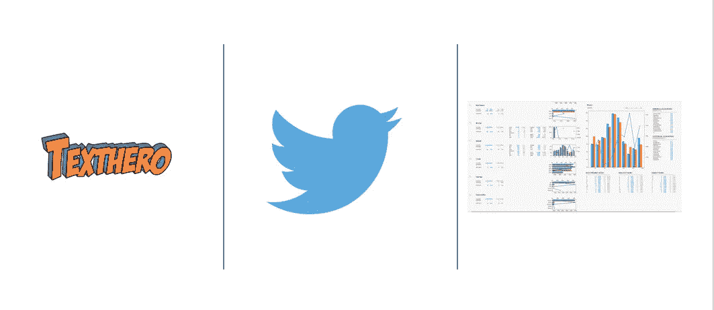
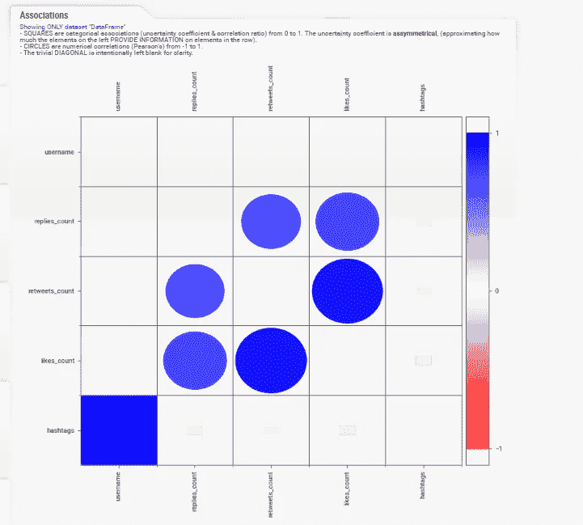
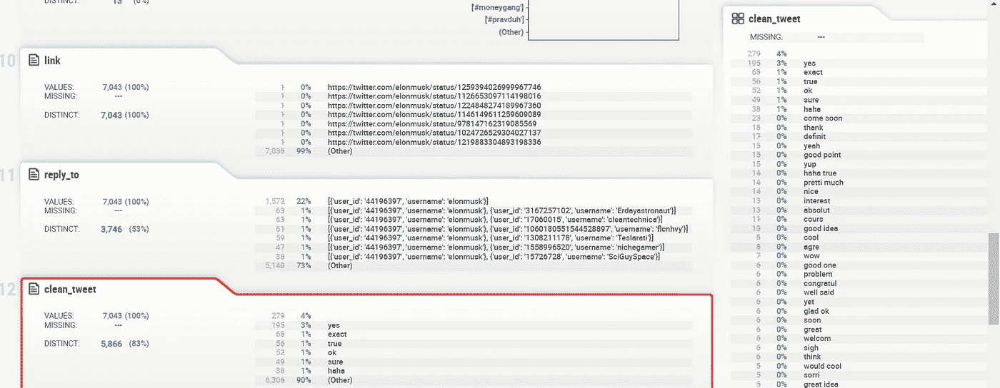
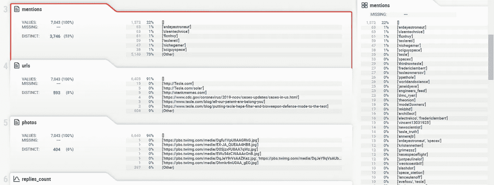
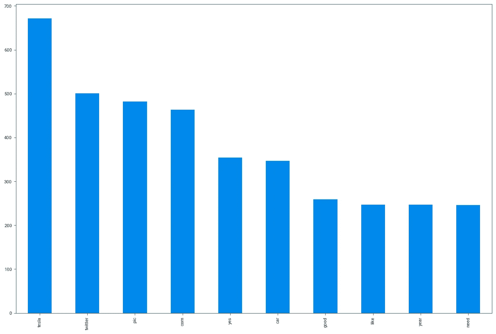
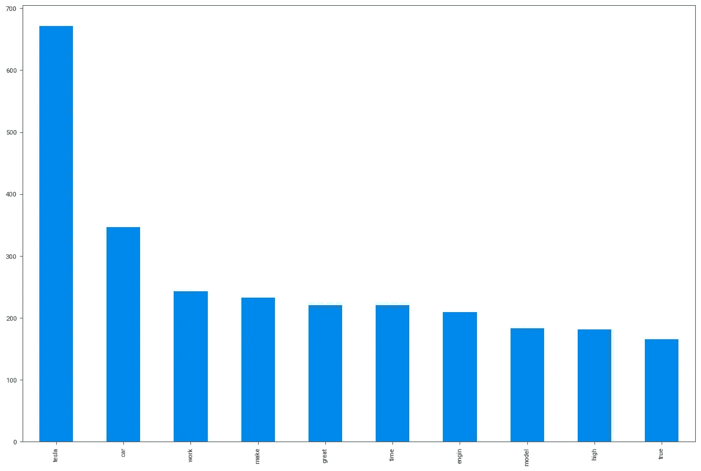
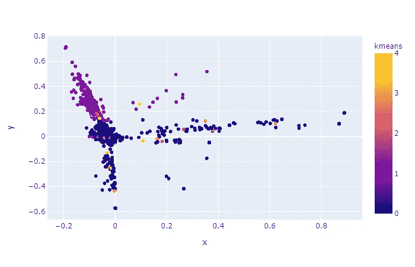
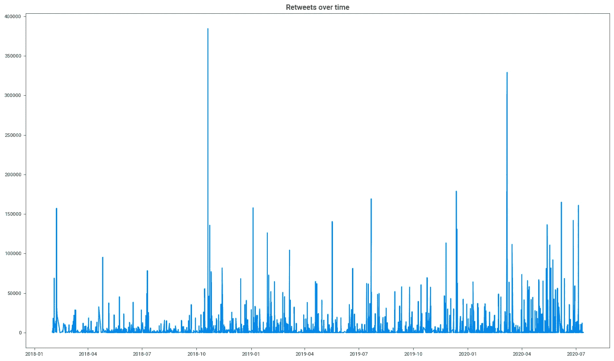

# 仅在< 100 lines of code using Twint, TextHero, SweetViz Python Libraries!

> 原文：<https://medium.com/analytics-vidhya/tweet-analysis-in-just-100-lines-of-code-using-twint-texthero-sweetviz-python-libraries-2c5813cf4d74?source=collection_archive---------7----------------------->

The full code is available on [GitHub](https://github.com/vidyap-xgboost/DataScience-ML_Projects/blob/master/twitter_data_twint_sweetviz_texthero.ipynb) 、 [Colab](https://colab.research.google.com/drive/17nwWFe478Lc0-xzrMW3lVnwCTCNja5vJ?usp=sharing) 和 [Kaggle](https://www.kaggle.com/vidyapb/nlp-with-texthero-eda-with-sweetviz) 中进行推文分析。

这篇文章是关于从收集 twitter 数据开始分析 tweets(没有 API，没有限制！)直到用不到 100 行代码用 PCA 和 K-Means 可视化 tweets(希望如此！)使用一些不太知名的库，比如 **Twint、TextHero、**和 **SweetViz！**



TextHero，Twint，SweetViz

## 目录:

*   [**使用 Twint 抓取 Twitter 数据**](#39c1)
*   [**使用熊猫读取数据**](#6437)
*   [**安装并导入 TextHero**](#1862)
*   [**TextHero 用于快速清理原始文本数据**](#411f)
*   [**EDA 和 SweetViz**](#36e7) 的基本可视化
*   [**使用 pytz**](#3f47) 将时区从 UTC 转换为 IST
*   [**使用 TextHero 的可视化效果**](#53dc)
*   [**还有什么？**](#86bb)
*   [**下一步**](http://a957)

让我们马上开始。

# 0.使用 Twint 抓取 Twitter 数据

让我们使用 [**twint**](https://github.com/twintproject/twint) 库从 twitter 收集数据。

**问题 1:** 为什么我们用的是 **twint** 而不是 **Twitter 的官方 API** ？

**答:**因为 twint 不需要认证，不需要 API，重要的是没有限制。

# 1.使用熊猫读取数据

示例输出如下所示:

```
--------------------------------------------------------------------
Dataframe Info: 
--------------------------------------------------------------------
<class 'pandas.core.frame.DataFrame'>
RangeIndex: 7043 entries, 0 to 7042
Data columns (total 33 columns):
 #   Column           Non-Null Count  Dtype         
---  ------           --------------  -----         
 0   date_time        7043 non-null   datetime64[ns]
 1   id               7043 non-null   int64         
 2   conversation_id  7043 non-null   int64         
 3   created_at       7043 non-null   int64         
 4   timezone         7043 non-null   object        
 5   user_id          7043 non-null   int64         
 6   username         7043 non-null   object        
 7   name             7043 non-null   object        
 8   place            0 non-null      float64       
 9   tweet            7043 non-null   object        
 10  mentions         7043 non-null   object        
 11  urls             7043 non-null   object        
 12  photos           7043 non-null   object        
 13  replies_count    7043 non-null   int64         
 14  retweets_count   7043 non-null   int64         
 15  likes_count      7043 non-null   int64         
 16  hashtags         7043 non-null   object        
 17  cashtags         7043 non-null   object        
 18  link             7043 non-null   object        
 19  retweet          7043 non-null   bool          
 20  quote_url        253 non-null    object        
 21  video            7043 non-null   int64         
 22  near             0 non-null      float64       
 23  geo              0 non-null      float64       
 24  source           0 non-null      float64       
 25  user_rt_id       0 non-null      float64       
 26  user_rt          0 non-null      float64       
 27  retweet_id       0 non-null      float64       
 28  reply_to         7043 non-null   object        
 29  retweet_date     0 non-null      float64       
 30  translate        0 non-null      float64       
 31  trans_src        0 non-null      float64       
 32  trans_dest       0 non-null      float64       
dtypes: bool(1), datetime64[ns](1), float64(11), int64(8), object(12)
memory usage: 1.7+ MBNone
```

如果需要，还可以做一些预处理。否则，跳过下面的代码。

输出:

```
<class 'pandas.core.frame.DataFrame'>
RangeIndex: 7043 entries, 0 to 7042
Data columns (total 12 columns):
 #   Column          Non-Null Count  Dtype         
---  ------          --------------  -----         
 0   date_time       7043 non-null   datetime64[ns]
 1   username        7043 non-null   object        
 2   tweet           7043 non-null   object        
 3   mentions        7043 non-null   object        
 4   urls            7043 non-null   object        
 5   photos          7043 non-null   object        
 6   replies_count   7043 non-null   int64         
 7   retweets_count  7043 non-null   int64         
 8   likes_count     7043 non-null   int64         
 9   hashtags        7043 non-null   object        
 10  link            7043 non-null   object        
 11  reply_to        7043 non-null   object        
dtypes: datetime64[ns](1), int64(3), object(8)
memory usage: 660.4+ KBNone
```

# 2.安装并导入 TextHero

这里，我们将使用 [**TextHero**](https://github.com/jbesomi/texthero) ，一个 python 包来高效快速地处理文本数据。您可以将 texhero 视为基于文本的数据集的 scikit-learn。

**问题 2:** 为什么我们要使用 TextHero，而不是使用 Gensim 之类的库或其他工具从头开始？

**Ans:** TextHero 用一种方法自动化清洁过程，相当有效。如果文本需要进一步清理，我们可以通过手动编写代码来删除那些不需要的单词。在后端，它使用像 Spacy，Gensim，tqdm，regex，nltk 这样的库。所以你不用在使用 TextHero 的时候把这些都单独导入。

# 3.TextHero 用于快速清理原始文本数据。

# 4.使用 Sweetviz 实现 EDA 和基本可视化

**问题 3:** 为什么我们使用 [**Sweetviz**](https://github.com/fbdesignpro/sweetviz) 而不是 matplotlib 或 plotly 或 bokeh 进行探索性数据分析？

**回答** : Sweetviz 是一个开源的 Python 库，只需一行代码就能为 kickstart EDA(探索性数据分析)生成漂亮的高密度可视化效果。输出是一个完全独立的 HTML 应用程序。

该系统围绕快速可视化目标值和比较数据集而构建。它的目标是帮助快速分析目标特征、训练与测试数据以及其他类似的数据表征任务。

[点击此处查看 sweetviz 从 titanic 数据集生成的示例报告](http://cooltiming.com/SWEETVIZ_REPORT.html)

创建另一个数据帧`df1`用于进一步分析。

在我们做任何进一步的分析之前，可以从一个 HTML 报告中分析和理解许多信息。

示例截图:



列之间的相关矩阵。



最重复的单词显示在左侧。



Users @elonmusk 主要是用。

# 5.使用 pytz 将时区 UTC 转换为 IST

如果您愿意，可以避免这一步，但是，我想向您展示如何将 UTC 时区转换为您的本地时区，以防您进行时间序列分析。

# 6.使用 TextHero 进行可视化，以获得更多见解

您可以使用 TextHero 探索一些非常酷的可视化效果。

输出:



输出:



输出:


输出:



# 7.用于进一步分析的其他可视化



随着时间的推移转发。

对`replies_count`和`likes_count`重复上述代码。

# 还有什么？

您可以检查其他库，如 NLP 的 [**、huggingface**](https://github.com/huggingface) 、 [**、钟摆**](https://github.com/sdispater/pendulum) (如果您处理的是日期&、时间[**、Vaex**](https://github.com/vaexio/vaex) (如果您处理的是大型数据集)。

# 后续步骤

*   建立一个主题模型，检查你是否可以将@elonmusk 的推文归类到不同的类别。
*   对他的微博进行情感分析。
*   这种情绪是如何随着时间而变化的。
*   以 TSLA 最近的股票数据为例，检查他的推文是否影响了 TSLA 股票或其他股票。

完整代码可在 [GitHub](https://github.com/vidyap-xgboost/DataScience-ML_Projects/blob/master/twitter_data_twint_sweetviz_texthero.ipynb) 、 [Colab](https://colab.research.google.com/drive/17nwWFe478Lc0-xzrMW3lVnwCTCNja5vJ?usp=sharing) 和 [Kaggle](https://www.kaggle.com/vidyapb/nlp-with-texthero-eda-with-sweetviz) 上获得。

如果对你有帮助，请给这个库打个星，在这里给**鼓掌**，如果你发现任何问题，请提出来。谢谢大家！