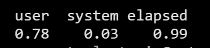

# R 语言中使用朴素贝叶斯算法的推文分析

> 原文：<https://medium.com/analytics-vidhya/tweet-analysis-using-naive-bayes-algorithm-in-r-3f746d09bb0f?source=collection_archive---------2----------------------->

在这篇博客中，我们正在分析发生在 2016 年 8 月俄亥俄州总统辩论中的推文的情绪。我们进行了数据分类和内容分析，以回答推文是否相关，哪个候选人在推文中提到得最多，以及推文的情绪。

将数据读入 R，数据也可以在 SQL 数据库中获得，但是这里我们将 CSV 文件加载到 R 中。

```
data=read.csv("Sentiment.csv") head(data)
```

结构化数据是这个过程中最重要的部分。数据集“情感”具有各种其他不相关的信息，因此在此特别选择“文本”和“情感”列并删除其余的。

```
library(tidyverse) datas=data%>%select(text,sentiment) head(datas) round(prop.table(table(datas$sentiment)),2)
```

**结构化数据后的输出:**


数据清理:

```
 library(tm) library(SnowballC) corpus = VCorpus(VectorSource(datas$text)) corpus = tm_map(corpus, content_transformer(tolower)) corpus = tm_map(corpus, removeNumbers) corpus = tm_map(corpus, removePunctuation) corpus = tm_map(corpus, removeWords, stopwords("english")) corpus = tm_map(corpus, stemDocument) corpus = tm_map(corpus, stripWhitespace) as.character(corpus[[1]])
```

**清理文本后输出:**


为了统计每个单词在整个文档中的出现频率，我们使用了另一个术语，称为文档术语矩阵，这使得我们的语料库函数更具有数字表示性。

```
dtm = DocumentTermMatrix(corpus) dtm dim(dtm) dtm = removeSparseTerms(dtm, 0.999) dim(dtm)
```

下面显示了我们的文本中出现频率至少超过 100 次的单词列表。


通过使用词云来可视化文本数据，从而更好地洞察每个情感中最常用的词。

```
library(wordcloud) 
library(ggplot2) 
install.packages("RColorBrewer") 
#wordcloud requires RColorBrewer positive= subset(datas,sentiment=="Positive") wordcloud(positive$text, max.words = 100, colors = "blue") negative = subset(datas,sentiment=="Negative") wordcloud(negative$text, max.words = 100, colors = "purple") neutral = subset(datas,sentiment=="Neutral") wordcloud(neutral$text, max.words = 100, colors = "turquoise")
```


此外，我们已经使用机器学习算法“朴素贝叶斯”进行下面讨论的预测。

```
#As naive bayes algorithm excepts binary 
convert <- function(x) {
y <- ifelse(x > 0, 1,0)
y <- factor(y, levels=c(0,1), labels=c("No", "Yes"))
y
    }  

    datanaive = apply(dtm, 2, convert)

    dataset = as.data.frame(as.matrix(datanaive))    
    dataset$Class = datas$sentiment
    str(dataset$Class)
```

数据分割

```
 set.seed(31)
    split = sample(2,nrow(dataset),prob = c(0.75,0.25),replace = TRUE)
    train_set = dataset[split == 1,]
    test_set = dataset[split == 2,] 

    prop.table(table(train_set$Class))
    prop.table(table(test_set$Class))
```


训练数据集的比例


测试数据集的比例

```
# naive bayes
    install.packages("e1071")
    library(e1071)
    library(caret)
    control= trainControl(method="repeatedcv", number=10, repeats=2)
    system.time( classifier_nb <- naiveBayes(train_set, train_set$Class, laplace = 1,trControl = control,tuneLength = 7) )
```

模型的输出:



评估朴素贝叶斯模型，预测的准确率为 98.67%，如下所示:

```
# model evaluation

    nb_pred = predict(classifier_nb, type = 'class', newdata =  test_set)
    confusionMatrix(nb_pred,test_set$Class)
```

朴素贝叶斯模型的统计；


感谢您阅读我的文章。希望你对机器学习算法如何与内容分析一起工作有所了解。