# 推文数据分析— SNA 和文本分析

> 原文：<https://medium.com/analytics-vidhya/tweet-data-analysis-sna-and-text-analysis-23e32a2015c5?source=collection_archive---------25----------------------->

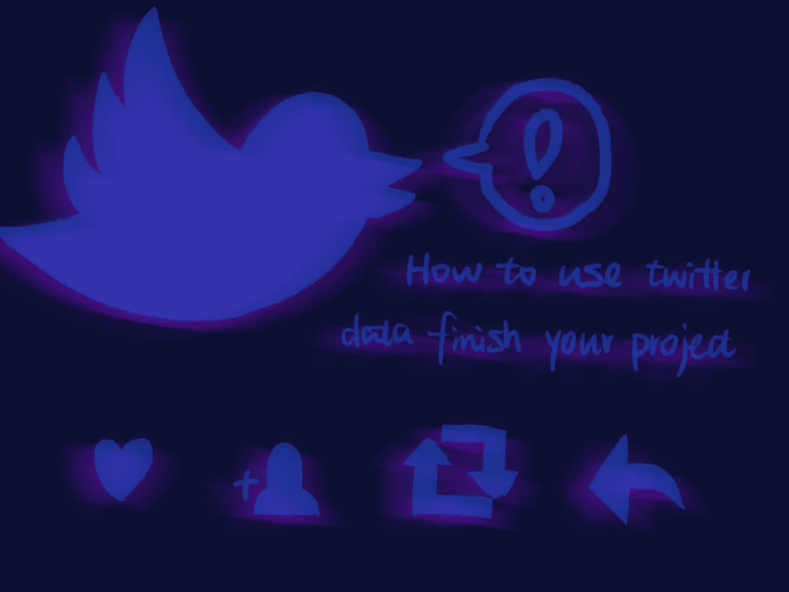

**目标:**

*   提取主题“*宾利学生*下的推文数据
*   使用关于该主题的 tweet 分析用户的基本人口统计数据
*   关于用户及其追随者以及识别有影响力用户的社交网络
*   分析关于推文的内容

# **套餐:**

*提取数据:* getoldtweet3，tweepy

*数据的一般描述:* Pandas，Numpy，Matplotlib，Seaborn

*社交网络分析:* Networkx

*文本分析:* nltk，sklearn，textblob，genism

# **数据概述**

*时间:*从剧情来看，大多数人在 4.24 发微博。平均每天有 5 条关于宾利学生的推文。

*转发和点赞:*因为是最近发的，所以所有的微博都没有转发。而大多数人得到的是 0 赞。但仍有一些帖子获得了五六个赞。

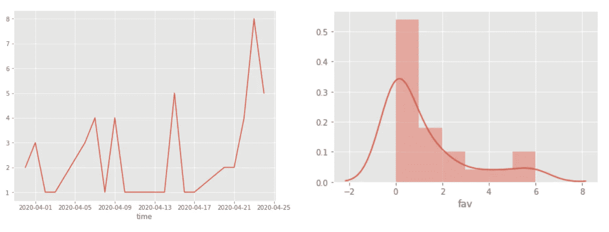

时间和喜欢分布

# **社交网络分析**

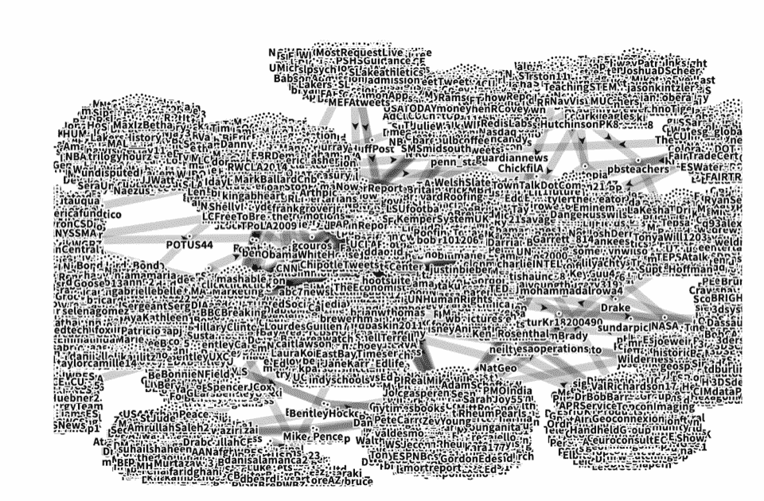

社交网络图

**有影响力的用户**

MarkBallardCnb: 倡导国会新闻局的编辑，负责报道路易斯安那州政府和政治

*巴拉克奥巴马* **:** 爸爸，丈夫，总统，公民。

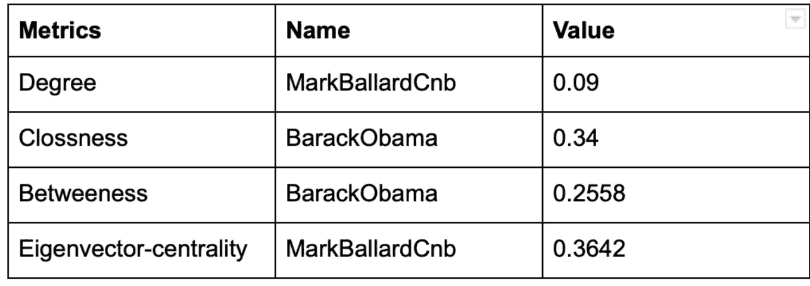

**流行继**

人们更有可能关注政治人物、新闻报道和公共部门。

*政治人物:* 奥巴马，特朗普…

新闻账号:哈佛商业，美联社，华尔街日报，纽约时报，白宫…

*公共部门:* usedgov，edutopia，BentleyU…

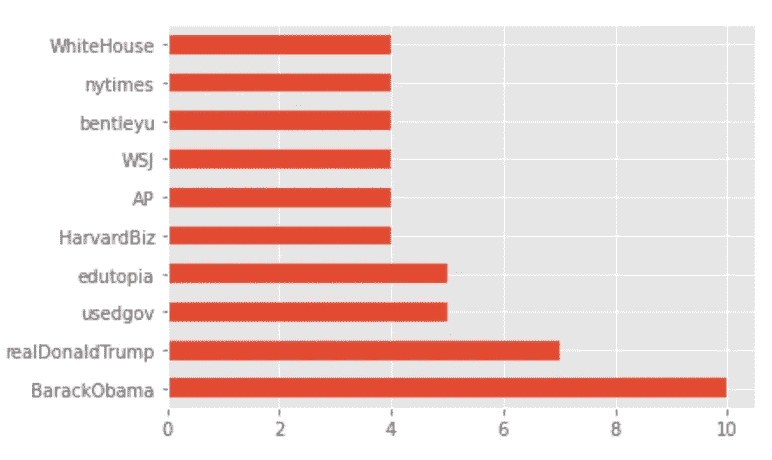

社交网络中最受关注的人

**文本分析**

大多数人的推文包括宾利，学生，年份，学校…大多数单词都与学校生活有关。

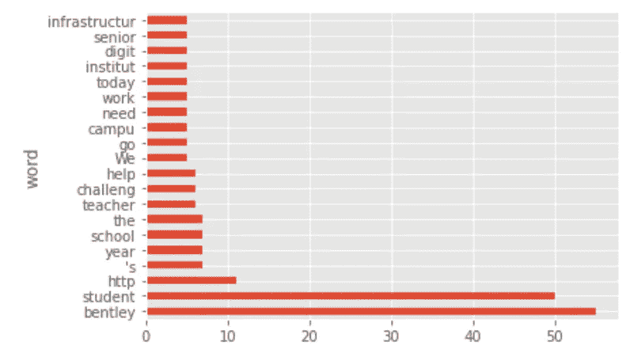

字数

**话题回顾**

使用 LSA，我们主要提取三个主题:

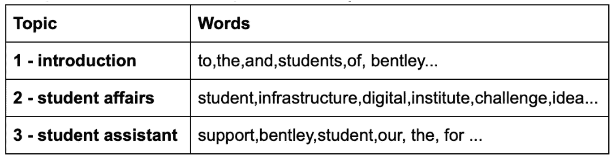

三个主题和每个主题中最有影响力的词

**情绪分析**

大多数推特都是负面和中立的。大多数推特都是客观话题

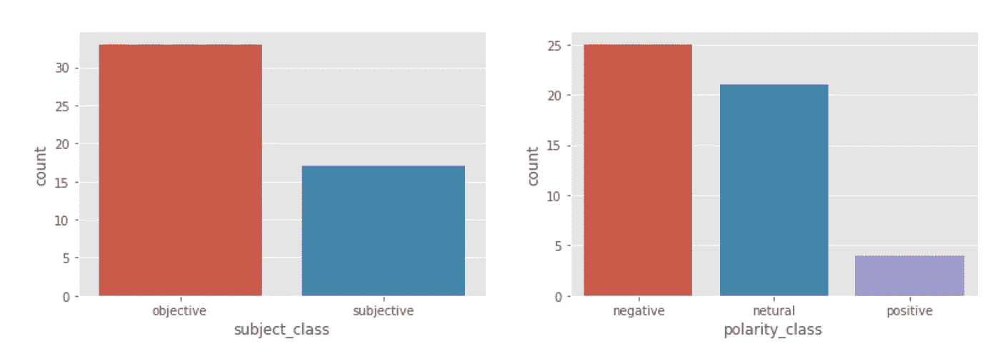

每条推文的主题和极性

**负面推文中出现频率最高的词**

除了常用词，大部分推文都包含话题二的词，话题二是关于学生事务的。所以，我们可以猜测人们在推特上发布学生事务问题。

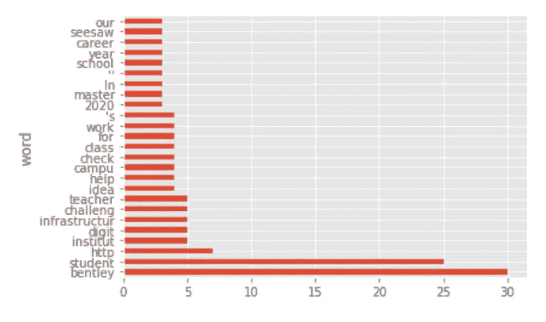

负面推文中的常用词

**负面推文示例**

我真的不觉得这是负面推特。因此，未来需要对 tweet 内容的情感分析进行改进。

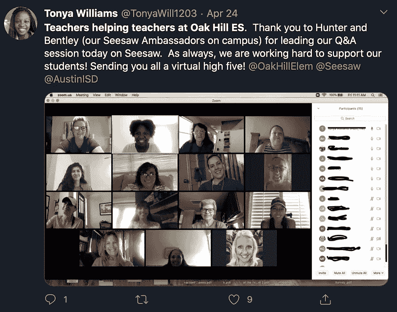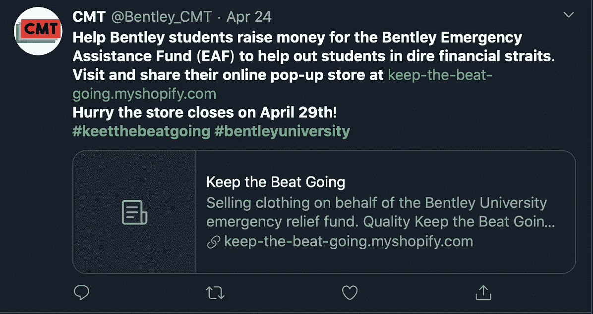

# 结论和局限性

**结论:**

*   人们喜欢关注政治人物、新闻报道和公共部门。
*   这个社交网络中有影响力的人是巴拉克·奥巴马: )
*   人们在推特上谈论本特利大学，主要是介绍本特利，宣传学生活动。并要求学生事务。

**限制:**

*   极性和科目类别截止可能需要改进
*   需要更多数据来提取