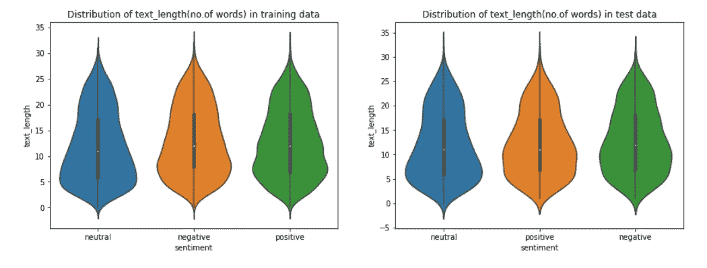

# 推特情感提取

> 原文：<https://medium.com/analytics-vidhya/tweet-sentiment-extraction-e5d242ff93c2?source=collection_archive---------4----------------------->

[https://monkey learn . com/情操-分析/#:~:text =情操%20 分析% 20(或% 20 意见% 20 挖掘，品牌% 20 信誉% 2C % 20 了解% 20 客户。](https://monkeylearn.com/sentiment-analysis/#:~:text=Sentiment%20analysis%20(or%20opinion%20mining,brand%20reputation%2C%20and%20understand%20customers.)

# **目录**

1.  介绍
2.  使用 ML/DL 解决此问题
3.  数据概述
4.  绩效指标
5.  探索性数据分析
6.  使用深度学习模型来解决这个问题
7.  基础模型
8.  改进的基础模型
9.  变形金刚和伯特
10.  TFRoBERTa 问答模型
11.  可以做的进一步改进
12.  模型的部署
13.  GitHub 中的代码
14.  参考

## 介绍

情感分析可以定义为分析文本数据并将其分类为积极、消极或中性情感的过程。情感分析在很多情况下都会用到，比如社交媒体监控、客户服务、品牌监控、政治活动等。通过分析社交媒体对话、产品评论和调查反馈等客户反馈，公司可以更好地了解客户的情绪，这对于满足他们的需求变得越来越重要。

## **此问题 ML/DL 的用法**

手动整理成千上万的社交媒体对话、客户评论和调查几乎是不可能的。因此，我们必须使用 ML/DL 来构建一个分析文本数据并执行所需操作的模型。我在这里试图解决的问题是这场 [Kaggle 竞赛](https://www.kaggle.com/c/tweet-sentiment-extraction)的一部分。在这个问题中，我们得到了一些文本数据以及他们的情绪(正面/负面/中性)，我们需要找到最能支持这种情绪的短语/单词。

## **数据概述**

这里使用的数据集来自 Kaggle 竞赛[推文情感提取](https://www.kaggle.com/c/tweet-sentiment-extraction)。本次比赛中使用的数据集来自[Figure Figure 8 的 Data for Everyone platform](https://www.figure-eight.com/data-for-everyone/) 中的短语。它由两个数据文件 train.csv 和 test.csv 组成，其中训练数据有 27481 行，测试数据有 3534 行。

*数据集中的列列表*

**textID** :每行数据的唯一 ID

**text:** 该列包含推文的文本数据。

**感悟:**文本的感悟(正面/负面/中性)

**selected_text:** 文本中最能支持观点的短语/单词

## 绩效指标

这个问题中使用的性能指标是**单词级 Jaccard 得分**。Jaccard 得分或 Jaccard 相似性是用于理解两个集合之间的相似性的统计数据之一。

https://en.wikipedia.org/wiki/Jaccard_index

文本数据的 Jaccard 得分示例:

**第一句:**人工智能是我们的朋友，它一直很友好
**第二句:**人工智能和人类一直很友好

[https://towards data science . com/overview-of-text-similarity-metrics-3397 c 4601 f 50](https://towardsdatascience.com/overview-of-text-similarity-metrics-3397c4601f50)

## 探索性数据分析

从上面的图中，我们可以得出结论，训练数据和测试数据都包含关于情感的类似分布，因为大多数点属于**中性的**，随后是正面和负面文本。

以上可用于推断文本的长度(字数),因为所有情感都在计数**0–20**之间，只有少数点大于 25 个单词

对于不同的情绪， **selected_text** 栏的字数会有一定的差异。我们可以在上面三个图中的两个图中看到一个**明显的尖峰**，这表明大多数选定文本短语的长度在**0–10**之间，只有少数句子的长度大于 10 个单词。
对于**中性**情感，当与正面/负面情感标签相比时，**大多数所选文本短语更长**，因为大多数短语位于 0–20 的**长度之间。**

上图显示了不同情感在 text 和 selected_text 列中最常见的单词。

对于中性情感，在 1.0 附近有一个**巨大的峰值**，这意味着大多数中性情感标签的 selected_text 短语是文本句子本身，即对于大多数中性情感数据，text 和 selected_text 值都是相同的**。对于积极和消极情绪标签，我们可以在图表中看到两个峰值，一个在 0.1 或 0.15 左右，另一个在 1.0 左右。0.1/0.15 附近的尖峰表明文本和 selected_text 之间的**相似度**非常低**。即给定一个文本，只有几个单词/短语被认为是 selected_text。****

## **使用深度学习模型来解决这个问题**

**如果输入数据是序列或上下文数据，最广泛使用的神经网络之一是**递归神经网络(RNN)。**RNN 提供的优于普通前馈神经网络的主要优势之一是，RNN 不仅考虑当前时间步长的输入，还考虑先前的值来预测当前输出。**

****

**[https://towards data science . com/understanding-rnn-and-lstm-f 7 CDF 6 DFC 14 e](https://towardsdatascience.com/understanding-rnn-and-lstm-f7cdf6dfc14e)**

**从上图中可以看出，在第一个时间步，X⁰作为输入被传递给模型以获得 H⁰.在下一个时间步中，x 和 H⁰都被作为输入传递给模型，该模型给出 h 作为输出。与普通的神经网络不同，所有的输入都是相互关联的。最常用的 RNN 网络是**、LSTM(长短期记忆)和 GRU(门控循环单元)。****

****

**[https://towards data science . com/rnn-simplified-a-初学者指南-cf3ae1a8895b](https://towardsdatascience.com/rnn-simplified-a-beginners-guide-cf3ae1a8895b)**

**我们可能不会在这里深入 LSTM 和 GRU 的内部，但我会给出这些 RNN 网络的一个广泛的概述。**

****LSTM:****

**LSTM 网络有 3 个主要入口
1。忘记门
2。输入门
3。输出门**

****

****C_(t-1)** :旧单元状态
**c_t:** 当前单元状态
**h_(t-1):** 从前一状态输出
**h_t** =当前状态输出**

****遗忘门**决定需要从先前状态保留多少信息以及可以忽略多少信息
**输入门**决定哪些新信息将被添加到单元状态
**输出门**将决定在下一个实例中什么信息将被传递到网络**

**GRU:**

**LSTM 和 GRU 的主要区别在于 GRU 只有两个门**更新门和复位门。****

****

****更新门**是输入门和遗忘门的组合。它决定保留什么信息和添加什么信息。
**复位门**决定在下一个实例中什么信息需要被传递到网络。**

**与 LSTM 相比，GRU 的城门数量较少，因此在计算上比 LSTM 更便宜更快。**

## **基本型号:**

**在这里，我们试图使用 LSTM/GRU 构建一个基本 RNN 模型，该模型将**文本**和**情感**作为输入，将**选择文本**作为输出。
我们有需要转换成数字数据的文本格式的输入，这样我们就可以将它传递给模型。此外，我们需要执行**数据清理和预处理**步骤，以便数据是干净的，并为进一步的操作做好准备。**

*****将文本转换成整数并填充到相同长度*****

**我们有文本栏，包含来自各种推文的文本。每个数据点将具有不同的长度。因此，我们必须将这些文本数据转换成数字，并填充所有的点，以便所有的输入都具有相同的长度。在 TensorFlow 中，我们有**标记器**和 **pad_sequences** 模块可以用来执行这些操作。**

****嵌入层:****

**嵌入层由嵌入矩阵组成，该矩阵包含训练数据中存在的特定单词的高维表示。**

****

**[https://medium . com/@ PE tuum/embeddings-a-matrix-of-meaning-4de 877 C9 aa 27](/@Petuum/embeddings-a-matrix-of-meaning-4de877c9aa27)**

**通常，我们使用预训练的嵌入向量，因为这些向量是通过训练大量数据获得的，我们可以简单地下载它们并在我们的嵌入层中使用它们。**

****

**以上是基础模型的模型架构，其中模型的输入是文本和情感值。这些值被传递到 GRU 层，最后，我们有一个密集层，它预测开始和结束索引，以从文本中获取 selected_text 值。**

**例如:**

****正文**:我今天很开心，因为我买了一部新手机
**情绪**:积极
**选择 _ 正文**:我很开心
开始指数:0
结束指数:3
所以如果我给我的模型提供这个输入数据，预测的**输出应该是 0，3** (开始和结束位置)，这对应于正文“我很开心”**

****基本型号的性能****

**使用这个基本模型，我们得到了大约 0.5 的 Jaccard 分数，当然，模型的性能可以比这提高得多。**

## **改进的基础模型:**

**由于我们的基本模型没有像预期的那样表现良好，我们需要修改我们的基本模型来提高性能。这里我们不使用普通的 LSTM/GRU，而是使用**双向 LSTM/GRU** 。使用双向 LSTM 优于常规方法的优点在于，双向 LSTMs 允许网络在每个时间步中都具有关于序列的前向和后向信息。
双向 RNNs 会以两种方式运行你的输入，一种是从第一个到最后一个，另一种是从最后到第一个。双向 rnn 有助于保存来自后面的输入状态的信息，而单向 rnn 仅有助于保存关于前面的输入的信息。**

****

**[https://valiance solutions . com/bi-lstm-explained/#:~:text =使用% 20 bidirectional % 20 will % 20 run % 20 your，any % 20 point % 20 in % 20 time % 20 to](https://valiancesolutions.com/bi-lstm-explained/#:~:text=Using%20bidirectional%20will%20run%20your,any%20point%20in%20time%20to)**

**此外，在这个模型中，输出格式将与基本模型不同。这里输出的是 len MAX_LEN(max。仪表板的长度)。作为 selected_text 的一部分的单词将被赋予值 1，而其他单词将被赋予值 0**

**比如:
**正文**:今天好开心因为买了新手机
**感悟**:正面
**选定 _ 正文**:好开心
**输出向量**:1 1 1 0 0 0 0 0**

****

****模型的性能****

**这个改进的 Seq2Seq 模型比基本模型表现得更好，因为我们得到了 0.6 的 Jaccard 分数。在分析误差时，我们可以注意到，该模型在中性数据上表现良好，但在正负数据点上表现不佳。**

## **变形金刚和伯特**

**变压器是解决大多数 NLP 任务的最先进的模型。变压器使用一种叫做**注意**的概念来处理输入和输出之间的依赖关系。注意力机制帮助模型查看输入的句子，并在每个时间步决定序列的其他部分是重要的。更重要的一点是，《变形金刚**在模型中没有使用任何 rnn。**这是一个序列到序列架构，即输入被送入编码器，编码器处理输入并传递给预测输出的解码器。**

****

**实际上，变压器是由一堆编码器和解码器组成的。即它包括 6 个编码器和 6 个解码器。进一步编码器有**两个子层:多头自关注层和全连接前馈神经网络。解码器**包含三个子层:**自关注层、编码器-解码器关注层和前馈神经网络**。**

********

**编码器中的**自我关注层**在对特定单词进行编码时，有助于查看输入句子中的其他单词。**

**解码器中的**编码器-解码器注意力层**帮助它关注输入句子的相关部分**

## **关于注意力的简短说明:**

****

**给定一个类似上图中的句子，单词**它**指的是什么？它是指动物、街道还是其他什么东西？人类很容易理解这一点，但这正是注意力层帮助模型理解特定单词如何与文本中的其他单词相关的地方。**

****

**q 是包含查询的矩阵(序列中一个单词的向量表示)，K 表示所有的键(序列中所有单词的向量表示)，V 是值，也是序列中所有单词的向量表示。
在变压器的架构中，自我关注不是一次而是多次计算，并行且独立。因此被称为**多头关注**。**

****

## **变压器双向编码器表示法**

**BERT(来自变压器的双向编码器表示)是谷歌人工智能语言研究人员最近发表的一篇论文。BERT 在各种 NLP 任务中提供了最先进的结果，包括问题回答(SQuAD v1.1)、自然语言推理(MNLI)等。**

**转换器编码器一次读取整个单词序列。因此，它被认为是双向的，虽然说它是非定向的会更准确。这一特性允许模型基于单词的所有周围环境(单词的左侧和右侧)来学习单词的上下文。**

****

**第一个输入令牌由特殊的[CLS]提供，其中 CLS 代表分类。BERT 模型中的编码器单元与我们之前在 Transformer 模型中看到的类似。
BERT 将一系列单词作为输入，这些单词继续流经编码器堆栈，每个编码器的输出被传递到下一个编码器模型。
每个位置输出一个大小为(768 伯特)的向量。**

**BERT 模型还可以针对各种任务进行微调，如序列分类、句子对分类、问答任务、命名实体识别等。自从 BERT 发明以来，已经提出了几种方法来改进 BERT 的性能度量或计算速度。下表列出了各种型号的详细信息。**

****

**[https://towards data science . com/Bert-Roberta-distil Bert-xlnet-one-to-use-3d 5 ab 82 ba 5 f 8](https://towardsdatascience.com/bert-roberta-distilbert-xlnet-which-one-to-use-3d5ab82ba5f8)**

**对于这个问题，我使用了 RoBERTa(**Ro**bustly optimized**BERT****A**pproach)模型来解决这个问题。由于 RoBERTa 是基于 BERT 开发的，所以有很多相同的配置。以下是罗伯塔和伯特之间的一些不同之处。**

*   **保留标记:BERT 使用`[CLS]`和`[SEP]`分别作为起始标记和分隔符标记，而 RoBERTa 使用`<s>`和`</s>`来转换句子。**
*   **子词的大小:BERT 有大约 30k 的子词，而 RoBERTa 有大约 50k 的子词。**
*   **更大的训练数据(16G 对 161G)**
*   **较长序列的训练**

****BERT 使用哪种标记化策略？****

**BERT 使用[词块标记化](https://static.googleusercontent.com/media/research.google.com/en//pubs/archive/37842.pdf)。用语言中的所有单个字符初始化词汇表，然后迭代地添加词汇表中现有单词的最频繁/最可能的组合。**

**伯特如何处理 OOV 的话？**

**任何不在词汇表中出现的单词都被贪婪地分解成子单词。例如，如果 **play** 、 **##ing** 和 **##ed** 出现在词汇表中，但是**play**和 **played** 是 OOV 单词，那么它们将被分别分解为 **play + ##ing** 和 **play + ##ed** 。( **##** 用于表示子词)。**

## **TFRoBERTa 问答模型**

****

**这个模型使用一个 RoBERTa 记号赋予器，它是从 GPT-2 记号赋予器派生出来的，使用字节级字节对编码。**

****如何将我们的问题公式化为问答任务？****

**假设我们的问题是从给定文本中获取 selected_text，那么这个问题可以转化为一个问答任务，其中**问题**是情感，**上下文**是文本，**答案**是 selected_text**

**例如:**

****问题**:正**

****语境**:我很开心，因为我今天买了一部新手机**

****回答**:我好开心**

**在建立模型之前，我们需要了解某些参数。**

****input_ids** —词汇表中输入序列标记的索引。**

**输入 id 通常是作为输入传递给模型的唯一必需的参数。它们是记号索引，记号的数字表示构成将被模型用作输入的序列。**

****attention_mask** —避免对填充令牌索引执行注意的掩码。在[0，1]中选择的掩码值:**

**1 表示没有被屏蔽的令牌，**

**0 表示被屏蔽的令牌。**

**[**加载罗伯塔分词器:**](https://gist.github.com/Shriram016/60bbc46238692bb331edf977a436f5a0)**

****获取输入标识和注意屏蔽:****

**使用 tokenizer.encode_plus()函数可以很容易地获得输入 id 和注意掩码。encoder_plus 以下列格式给出输出。**

**~~**问题**</s></s>**上下文** < /s >~~**

****获取开始令牌和结束令牌:****

**输入文本被转换成记号，并且对应于 selected_text 的记号的开始和结束位置被用于形成输出向量。**

**示例:**

****正文:**可能以前有。此外，没有空调太热了，睡不着**

****精选 _ 正文:**太热了**

****文本到令牌:** [' < s >'，'也许'，'用过'，'到'，'有'，'.'，'除了'，'没有'，' ac '，'它'，'`'，' s '，'太'，'热'，'到'，'睡'，'< /s > ']**

**Roberta tokenizer 将给定文本转换为标记。如上所述，~~和~~ 用于表示给定句子的开始和结束。**

****开始令牌:**[0 0 0 0 0 0 0 0 0 0 0 0 0 0 0 0 0 1 0 0……]**

****结束令牌:**[0 0 0 0 0 0 0 0 0 0 0 0 0 0 0 0 0 0 0 0 1 0 0……]**

**开始和结束标记的长度将等于 MAX_LENGTH 值。**

**如果看到令牌列表，第 12 个和第 13 个索引处的值对应于 selected_text **“太热”。**这就是为什么开始令牌和结束令牌中的第 12 和第 13 个索引被标记为 1，否则为 0。**

**为问答模式加载预训练的 RoBERTa:**

**构建模型:**

****

**以上是模型体系结构，其中模型的输入是 input_ids 和 attention_mask，模型处理输入并给出开始索引和结束索引，从中可以从给定文本中提取所选文本**

****绩效指标****

**该 TFRoBERTA for Question Answering 模型提供了**最佳 Jaccard 分数 0.7，这是所有模型中的最佳分数。****

****可以做的进一步改进****

**可以尝试各种其他版本的 BERT 模型，以查看是否有任何模型比当前模型提供更好的性能(更高的 Jaccard 分数)。此外，我们可以尝试集成多个模型来提高模型性能。**

# **模型的部署**

**将你的模型部署到产品中有多种方法，这里我使用了一种最简单的方法，使用 **Flask 来部署模型。****

********

## **代码参考:**

**[https://github.com/Shriram016/Tweet-Sentiment-Extraction](https://github.com/Shriram016/Tweet-Sentiment-Extraction)**

****联系人** 邮箱 Id:shri16ram@gmail.com
领英:[https://www.linkedin.com/in/shriram016/](https://www.linkedin.com/in/shriram016/)
手机:+91–7200681570**

## **参考资料:**

1.  **[https://towards data science . com/overview-of-text-similarity-metrics-3397 c 4601 f 50](https://towardsdatascience.com/overview-of-text-similarity-metrics-3397c4601f50)**
2.  **[https://www . ka ggle . com/c/tweet-情操-提取/概述/评价](https://www.kaggle.com/c/tweet-sentiment-extraction/overview/evaluation)**
3.  **[https://monkey learn . com/情操-分析/#:~:text =情操%20 分析% 20(或% 20 意见% 20 挖掘，品牌% 20 信誉% 2C % 20 了解% 20 客户。](https://monkeylearn.com/sentiment-analysis/#:~:text=Sentiment%20analysis%20(or%20opinion%20mining,brand%20reputation%2C%20and%20understand%20customers.)**
4.  **[https://towards data science . com/rnn-simplified-a-初学者指南-cf3ae1a8895b](https://towardsdatascience.com/rnn-simplified-a-beginners-guide-cf3ae1a8895b)**
5.  **[https://valiance solutions . com/bi-lstm-explained/#:~:text =使用% 20 bidirectional % 20 will % 20 run % 20 your，any % 20 point % 20 in % 20 time % 20 to](https://valiancesolutions.com/bi-lstm-explained/#:~:text=Using%20bidirectional%20will%20run%20your,any%20point%20in%20time%20to)**
6.  **[https://www . analyticsvidhya . com/blog/2019/06/understanding-transformers-NLP-state-the-art-models/](https://www.analyticsvidhya.com/blog/2019/06/understanding-transformers-nlp-state-of-the-art-models/)**
7.  **【http://jalammar.github.io/illustrated-transformer/】**
8.  **[https://yashuseth . blog/2019/06/12/Bert-explained-FAQs-understand-Bert-working/#:~:text = What % 20 is % 20 Bert % 3F，task % 2d specific % 20 fine % 2d tuning](https://yashuseth.blog/2019/06/12/bert-explained-faqs-understand-bert-working/#:~:text=What%20is%20BERT%3F,task%2Dspecific%20fine%2Dtuning)。**
9.  **[https://towards data science . com/Bert-Roberta-distil Bert-xlnet-one-to-use-3d 5 ab 82 ba 5 f 8](https://towardsdatascience.com/bert-roberta-distilbert-xlnet-which-one-to-use-3d5ab82ba5f8)**
10.  **[https://www.appliedaicourse.com/](https://www.appliedaicourse.com/)**