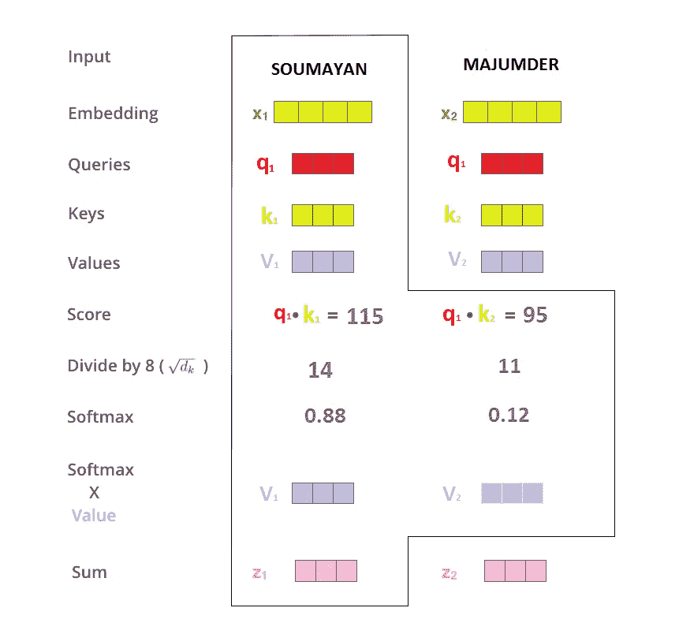
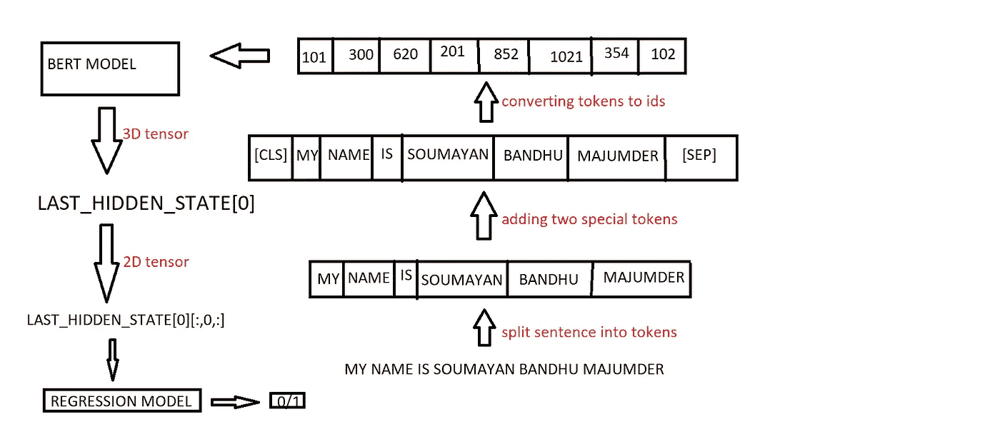

# 灾难的推文是真的？？使用手套和伯特

> 原文：<https://medium.com/analytics-vidhya/tweets-of-disasters-are-real-e5e0a2d3f4b1?source=collection_archive---------6----------------------->

在这里，我们将使用手套嵌入和伯特模型来分析推文。

## **问题定义**

我们得到了一组推特信息。从这个数据集中，我们必须找出哪些推文在谈论真正的灾难，哪些没有。

## **数据集**


target=1，表示这条推文谈论的是真正的灾难，target=0，表示这条推文不是关于灾难的。

## **阶级平衡还是不平衡？**


平衡数据集

## **数据清理**

***删除网址***

```
url="social networking site :[https://www.facebook.com](https://www.facebook.com)"
def remove_URL(text):
    url = re.compile(r'https?://\S+|www\.\S+')
    return url.sub(r'',text)remove_URL(url)
'social networking site :'
```

***删除 html 标签***

我不会写完整的代码，只是给出代码的主要部分-

```
html=re.compile(r'<.*?>')
```

***移除表情符号***

为此，只需使用数据中的表情符号的 unicodes 重新编译即可。表情、图片、地图都有不同范围的 unicode 值。

***去掉标点符号***

使用下面提到的功能删除标点符号

```
def remove_punct(text):
    table=str.maketrans('','',string.punctuation)
    return text.translate(table)
```

***用于矢量化的手套***

GLOVE 是一种矢量化类型，其中每个单词都有一个固定的矢量表示，与上下文无关。但是我们也可以说手套不是完全独立于上下文的，而是它们被投射到上下文中使用最多的地方。因此，如果我们以单词“bank”为例，则创建单个向量来表示多数上下文。如果语料库包含 80%自然相关的“银行”单词和 20%金融相关的“银行”单词。我们将看到“银行”被进一步磁化为河流、小溪等事物，而不是联盟、贷款人等。

GLOVE 考虑的是词对和词对之间的关系，而不是词和词之间的关系。

GLOVE 为高频率单词对赋予较低的权重，以防止无意义的停用词如“the”、“an”不会支配训练过程。

这个模型在单词的共现矩阵上进行训练，这需要大量的内存。

这里，我们正在导入已经预先训练好的 100 维手套向量。所以在这里，文本中的每个单词都将由 100 维向量来表示。


单词“the”的 100D 手套表示


单词‘of’的 100D 手套表示

因此，从上面两幅图像中我们可以看到，在手套表示中，每一行包含 101 个条目。(在上面两张图片中，显示了第 1 行和第 4 行)。这里，该行的第一个条目是单词本身，其他 100 个条目代表该单词。

因此，现在创建一个嵌入字典，使用每行的第一个条目(单词本身)作为索引，该行的其他 100 个数字作为该索引的数组条目。

现在，我们将使用我们的 tweets 文本语料库创建一个字典。我们正在索引语料库中出现的每个独特的单词。越频繁出现的单词索引越低，这意味着“索引 1”处的单词在我们的数据集中出现频率最高。为此，我们必须遵循以下步骤-

1.  创建 Tokenizer 类的对象。[ tokenizer_obj = Tokenizer() ]
2.  现在‘tokenizer _ obj’会调用‘fit _ on _ texts()’函数，在这个函数中传递你的文本语料库。这将创建一个字典，其中每个唯一的单词都有一个索引，更频繁的单词将获得较低的索引值。
3.  现在‘tokenizer _ obj’将调用‘texts _ to _ sequences()’函数，并再次传递文本语料库。这将把文本的每个单词转换成字典的索引。

在这之后，我们使用它在手套嵌入中的表示，给每个索引分配一个 100 维的向量。

所以，现在文本的每个单词都嵌入了手套。

***训练模式***

现在我们必须创建我们的模型。我们神经网络的第一层将是嵌入层。(请记住，我们只能在模型的第一层使用这一层，其他地方都不行)

这里嵌入矩阵的维数是(字数 x 100)。我们从上面的嵌入中得到这个维度。我们将使用 trainable = ' False '，因为我们不想更新我们的嵌入矩阵权重。我们使用 dropout=0.2 来避免过度拟合(我们可以使用超参数调整来找到这个值)

在第二层中，我们使用 100 个 LSTM 单位，dropout=0.2(这里也可以使用超参数调谐来获得更好的结果)。

在第三层中，我们使用具有 1 个 sigmoid 激活单元的致密层。这一层将给出输出 0 或 1。

我们使用学习率为(1e-4)的“Adam optimizer”和“binary_crossentropy”作为损失函数。


模型摘要

该模型的准确率为 79.95%。

# **伯特概念**

BERT 只不过是变压器的唯一编码器部分。BERT BASE 和 BERT LARGE 分别具有 12 和 24 个编码器层。与变压器的默认配置相比，这些变压器还具有较大的前馈网络(分别为 768 和 1024 个隐藏单元)以及自关注层中更多的关注头(分别为 12 和 16 个关注头)。


在 BERT 中，我们只对编码器部分感兴趣

编码器主要有两层自关注层和前馈网络。在任何句子进入编码器之前，我们对句子中的每个单词进行位置编码。位置编码值我们一般取最大值 512。所以每个句子最多可以有 512 个单词。(这里我们说的是通用变压器的编码器)


编码器

这里我们可以看到，输入位置上的每个单词都通过一个单独的或者它自己的路径。但是在“自我关注层”中，这些路径之间存在相关性，而在“前馈层”中没有相关性。因此，在“前馈网络”中，每条路径可以并行执行。这些“前馈网络”对于每个单词都是完全相同的，但是它们是分开执行的。

**更详细的自我关注层**

让我们来看一句**“这个人跑得很慢，因为他累了。”在这个句子中,“他”指的是“人”。但是我们很容易发现这一点，而计算机则不然。因此，为了更好地理解特定上下文中的单词，我们通过查看输入序列中的其他位置来对每个单词进行编码。这导致每个单词更好的编码。**

**现在如何计算这个自我关注度**


**步骤**

1.  从每个编码器输入向量生成 3 个向量。(对于第一编码器输入是每个字的嵌入，对于其他编码器输入是较低层编码器的输出)。因此，我们为每个单词创建一个查询向量、关键向量和值向量。这些向量是通过将每个嵌入乘以我们在训练过程中训练的三个矩阵(Wq、Wk、Wv)而生成的。新向量(q，k，v)的维数小于嵌入向量。
2.  现在，我们必须计算每个单词的分数，这将决定在句子的其他部分放置多少焦点，因为我们在某个位置编码一个单词。为了计算分数，我们只需要做这个单词的查询向量(q)与所有其他单词的关键向量(k)的点积。因此，现在单词“SOUMAYAN”在第一位置的第一得分将是(q1.k1)，第二得分将是(q1.k2)。
3.  现在将这些得分向量除以“关键”(k)向量的维数的平方根。
4.  现在使用“softmax 操作”来标准化每个“分数”向量。使得每个得分向量总和变为 1，且所有向量变为正，并且具有 0 到 1 之间的值。
5.  现在将每个值向量乘以 softmax 操作的输出。因此，它对一些单词给予更高的重要性，而对其他一些单词给予较低的重要性(例如，如果一个单词的值向量乘以 0.0011，那么它给予该单词较低的重要性)。
6.  现在把所有这些加权的价值向量加起来。这将在第一位置产生单词“SOUMAYAN”的自我注意层的输出。



在实际实现中，使用矩阵来完成计算，即，不是像 x1、x2 等每个单词都有向量。我们有一个矩阵“X ”,其中矩阵的每一行都嵌入了一个单词。这里，我们将通过将矩阵‘X’分别乘以‘Wq’、‘Wk’、‘Wv’矩阵来获得查询向量矩阵、关键向量矩阵和值向量矩阵。

之后，只需将矩阵“Q”乘以“转置(K)”并除以关键矩阵维数的平方根。然后对输出进行 softmax，并将其乘以矩阵“V”，这将生成矩阵“Z”。这个矩阵“Z”将是自我关注层的输出。

**多头注意力的概念**

这种多头注意力将在两个方面提高注意力层的性能-

1.  它扩展了模型关注句子不同位置的能力。如果我们使用一个头，那么它只能捕捉一个模式，但是如果我们有许多头，那么我们可以捕捉许多模式。
2.  它赋予注意力层多个“表征子空间”。有了 8 个注意力，我们将有 8 个查询(Q)矩阵、8 个关键(K)矩阵和 8 个值(V)矩阵。


这里我们可以看到两个注意力头，但是有 8 个这样的注意力头

因此，对于 8 个注意力头，它将产生 8 个 Z 矩阵(Z0 到 Z7)。


但是前馈网络将只接受一个矩阵而不是八个矩阵。所以我们要把这 8 个矩阵浓缩成 1 个矩阵。

首先，我们必须连接所有这 8 个矩阵(Z0-Z7)，之后我们必须将这个连接的矩阵乘以一个权重矩阵(W0)，然后这将产生一个像 Z 一样的维数的单个矩阵。现在这个 Z 将被提供给前馈网络。(W0 矩阵与模型联合训练)。

**添加和归一化**


在每个编码器层中存在两个加法和归一化层，一个在自关注层之后，另一个在前馈网络之后。这里，我们首先有一个残留的连接，然后是层标准化。

这都是关于编码器的，现在让我们再次关注 BERT。

BERT 模型是根据下面提到的两个无监督任务训练的

1.  **屏蔽语言模型—** 在将单词序列输入 BERT 之前，每个序列中 15%的单词被替换为一个【屏蔽】标记。然后，该模型尝试根据序列中其他未屏蔽单词提供的上下文来预测屏蔽单词的原始值。
2.  **下一个句子预测—** 在 BERT 训练过程中，模型接收句子对作为输入，并学习预测句子对中的第二个句子是否是原始文档中的后续句子。在训练期间，50%的输入是一对，其中第二个句子是原始文档中的后续句子，而在另外 50%中，从语料库中随机选择一个句子作为第二个句子。假设随机句子将与第一个句子断开。该 NSP 主要用于捕获长期依赖关系。

为了帮助模型在训练中区分这两个句子，输入以如下方式处理

1.  在第一个句子的开头加上[CLS]标记，在每个句子的结尾加上[SEP]标记。
2.  指示句子 A 或句子 B 的句子嵌入被添加到每个记号。句子嵌入在概念上类似于词汇为 2 的标记嵌入。
3.  位置嵌入被添加到每个标记中，以指示它在序列中的位置。

# 伯特模型

这些是我们必须遵循的步骤(每个句子被逐一处理)

1.  首先，我们必须对每个句子进行标记化。(在 BERT 记号化中，不仅生成单词，还生成子单词。子词是通过在该子词之前提到“##”来生成的。举例来说，让我们对单词“学习”进行标记化，如果我们发现只有学习出现在词汇中，那么我们将把它分为“学习”、“学习”。还有一点我们发现，如果“#”存在，那么一般来说词汇中就没有“ing”这个词。)
2.  现在在句子前面加上两个特殊的记号[CLS]，在句尾加上[SEP]。
3.  现在用 id 替换这些令牌。
4.  现在用“0”填充每个句子，使所有句子长度(或者更具体地说，句子中出现的 id 或标记的数量)相同。这里我们取 maxlen=512，即句子中标记或 id 的数量最大为 512。
5.  现在创建另一个 numpy 数组，其中包含的 1 的数量等于句子中出现的记号的数量，包括这两个特殊记号和所有填充序列的 0。这是掩码数组。
6.  现在创建另一个 numpy 数组，它将包含所有第一句话标记的 0 和所有第二句话标记的 1。(只有当我们给出两个句子作为输入时，才需要这个句子分段数组)
7.  现在将这三组 id、掩码和每个句子的片段输入到 BERT 模型中。
8.  BERT 模型的输出将是每个输入令牌(id)的向量。每个向量由 768 个数字(浮点数)组成(意味着存在 768 个隐藏单元)。
9.  因为这是一个句子分类问题，所以我们忽略除了第一个向量(与[CLS]标记相关的向量)之外的所有向量。
10.  我们将这个向量作为逻辑回归模型的输入。
11.  现在，该模型将预测概率 0 和 1 作为输出(即，推文是否与灾难有关)。



建模将如何进行

**解释步骤 8**

伯特模型实际上输出一个三维张量(序列输出是三维的，但合并输出是 2D)。它的三维空间是-

1.  句子数量。(或批量大小，即我们一次发送的句子数量)
2.  序列中令牌或 id 的最大数量。(在我们的例子中是 512)
3.  BERT 模型中隐藏单元的数量(对于 BERT 是 768)。

现在，为了更好地理解这三个维度，我将举一个例子。

我要给我的伯特模型的句子是-

“我的名字是 Soumayan Bandhu Majumder”。

1.  我假设最大长度=12。
2.  在标记了上面的句子后，我得到了[ 'My '，' name '，' is '，' Soumayan '，' Bamdhu '，' Majumder' ]
3.  现在在上述句子的第一句和最后一句加上['CLS']和[ 'SEP' ]。
4.  现在将上述令牌转换为 id，并用“0”填充到 maxlen。[101,34,13,7,3456,678,567,102,0,0,0,0].
5.  现在从上面制作蒙版阵列。[1,1,1,1,1,1,1,1,0,0,0,0]
6.  现在分段数组这将用于区分两个句子，因为我们只发送一个句子作为输入，所以分段数组的每个条目都将包含 0[0，0，0，0，0，0，0，0，0，0]
7.  现在，我们将把一个句子的这三个数组作为我们的 BERT 模型的输入。
8.  现在我们的 BERT 模型将产生两个输出，第一个是序列输出，第二个是混合输出。
9.  序列输出的维数将是[1，12，768]，其中 1 是我们一次发送的句子数，这里是 1。12 是句子的最大长度。每个单词或记号由长度为 768 的嵌入来表示。
10.  现在，为了将这个 3D 张量转换成 2D 张量，我们正在使用 sequence_output[:，0，:]=我们正在获取单个批次的所有句子，我们仅从句子中获取第一个或[CLS]令牌，我们正在使用 all 或 768 的嵌入大小。
11.  现在另一种产出是混合产出(2D 产出)。此输出的尺寸为[1，768]。这里句子的数量是 1，每个令牌的嵌入大小是 768。(这实际上是[CLS]的嵌入或句子的第一个标记，它通过“tanh”激活层。)

BERT 模型输出在这里意味着最后隐藏状态的输出(默认情况下，但我们也可以改变这一点)。现在我们把三维张量转换成二维张量，只需要-

**last_hidden_states[0][:，0，:]**

对所有序列(句子)的第一个位置的输出进行切片，取 last_hidden_state 的所有隐藏单元输出。(第一个位置包含[CLS]标记)

现在，该输出将作为输入提供给逻辑回归模型，该模型具有“sigmoid”激活单元、“binary_crossentropy”损失函数和学习速率为 2e-6 的 adam 优化器。

现在，该模型将输出为“1”或“0”，即谈论灾难与否。


LAST_HIDDEN_STATES[0]

**注意:-在上面的图片中，为了更好地理解,【CLS】标记在每个句子的开头，但实际上,【CLS】的 id 应该在那里。类似地，在句子的最后给出了[SEP]，但实际上它将是令牌的 id[SEP]。在句子的最后一个字段中，也给出了“0”，因为每个句子都不是最大长度，所以在这种情况下，我们用“0”进行填充。**


LAST_HIDDEN_STATES[0][:，0，]

**一个小事情是，这里 LAST_HIDDEN_STATES[0]是指隐藏层中众多隐藏状态中，得分预测高的隐藏状态将是输出。**

**注意——隐藏状态或带有隐藏层的隐藏单元之间存在差异**

在上图中，我们已经定义了什么是 LAST_HIDDEN_STATES[0]。现在[:，0，:]的意思是[所有句子，第 0 个或[CLS]位置的句子，所有隐藏的单位]。

这个 LAST_HIDDEN_STATES[0][:，0，:]被赋予逻辑回归模型，以将其标记为 1 或 0。

BERT 不仅用于微调，像其他模型一样，BERT 也可以用于上下文单词嵌入，然后我们可以将这些嵌入用于我们的模型。沿着该路径的该令牌的每个编码器层的输出可以被用作该令牌的特征表示。

有六种选择来选择单词的嵌入-

1.  最后一个隐藏层。
2.  第一层。
3.  所有 12 层的总和。
4.  倒数第二个隐藏层(因为最后一个隐藏层更偏向目标值)。
5.  最后 4 个隐藏层的总和。
6.  串联最后 4 个隐藏层。

# **现在是编码的时候了**

我不会写完整的代码，只是给你一个如何使用伪代码的想法。

两个主要功能-

1.  **伯特 _ 编码**

```
FUNCTION ARGUMENTS: texts,tokenizer,max_len //this tokenizer is taken from BERTARRAYS: all_tokens[],all_masks[],all_segments[]for (all sentences in texts):{text=tokenize all sentenceinput_sequence=[“[CLS]”]+text+[“[SEP]”]tokens=convert into ids(input_sequence)pad_length=max_len — length(input_sequences)tokens=tokens + [0]*pad_lengthmasks=[1]*length(input_sequences) + [0]*length(pad_length)segments=[0]*max_lennow fill above mentioned three arrays by these tokens,masks,segments respectively}
return( all_tokens[],all_masks[],all_segments[])
```

**2。构建 _ 模型**

```
FUNCTION ARGUMENT: bert_layer,max_lenInput:input_word_ids,input_mask,segment_ids— ,sequence_output=bert_layer([input_word_ids,input_mask,segment_ids])// The Bert layer outputs two things (pooled vector and full sequence), we ignore the first one since we are only interested by the sequence.clf_output=sequence_output[:,0,:]output=Dense(1,activation= ‘sigmoid’)(clf_output)model=Model(inputs=[input_word_ids,input_mask,segment_ids],outputs=output)model.compile(Adam(lr=2e-6),loss=binary_crossentropy,metrics=[‘accuracy’])return model
```


模型如何进行

```
module_url = "https://tfhub.dev/tensorflow/bert_en_uncased_L-24_H-1024_A-16/1"
bert_layer = hub.KerasLayer(module_url, trainable=True)train_input = bert_encode(train.text.values, tokenizer, max_len=512)
test_input = bert_encode(test.text.values, tokenizer, max_len=512)
train_labels = train.target.values
model = build_model(bert_layer, max_len=512)
model.fit(
    train_input, train_labels,
    validation_split=0.2,
    epochs=3,
    batch_size=16
)
test_pred = model.predict(test_input)
```

这个模型产生了 83.026%的准确率。