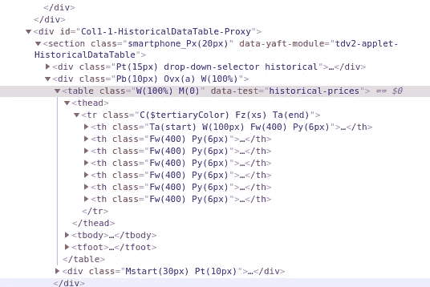
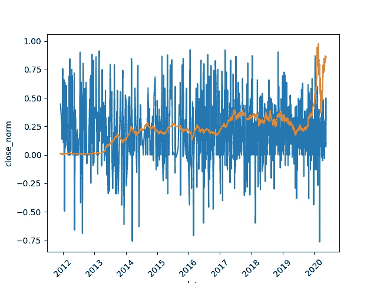
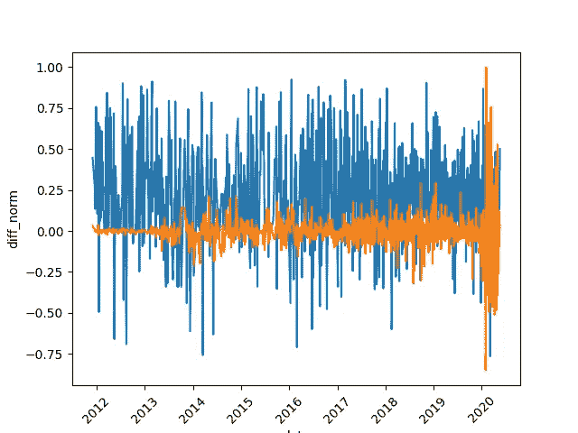

# 推文:你不能点击取消发送(情感分析和网络抓取)

> 原文：<https://medium.com/analytics-vidhya/tweets-you-cant-hit-unsend-sentiment-analysis-and-web-scraping-f44a8652f788?source=collection_archive---------29----------------------->

“在埃隆马斯克(Elon Musk)发推文称股价‘太高’后，特斯拉股价下跌”，这是最近的头条新闻之一，尽管此前法院命令要求他在发布任何关于特斯拉财务状况的书面通信之前，必须获得公司律师的批准。在这篇文章中，我们从雅虎财经上收集了埃隆·马斯克的推文和特斯拉的股价，然后进行了情绪分析，并分析了与特斯拉股价变化的关系。

所有代码和*。csv 文件可以在我的 GitHub 资源库-[https://github.com/ApurvaMisra/tweet_analysis.git](https://github.com/ApurvaMisra/tweet_analysis.git)中找到，这里只提供代码片段。

# 提取推文和情感分析

GetOldTweets3 库用于获取他真正开始发微博时的微博。使用这个库的两个优点是-

1.  无需使用 twitter 创建应用程序
2.  对个人提取的推文数量没有限制

Elon Musk 的所有推文都被提取出来，直到代码运行的日期

提取的推文可以保存到*。csv 文件使用"。熊猫中的 to_csv”方法。

对于情感分析，使用了基于规则的库 VADER(**v**alence**a**ware**d**ictionary for s**e**entiment**r**easing)。它有一个词典，每个单词都有相应的分数。在写这篇文章的时候，它包括了 7500 个单词和它们相应的分数。它基本上是将句子拆分成单词，然后找到每个单词的分数，从而得到复合分数。它适用于短句子，如推特，但随着句子长度的增长，单词的顺序会产生巨大的影响。

VADER 曾经通过推特获得情感分数

# 提取股票价格

美丽的汤和硒被用来获得特斯拉的股价。

如果我们访问雅虎财经网站并寻找“TSLA”，特斯拉的股票价格就会出现，因为我们需要 2010 年的价格，因为那是埃隆·马斯克在该平台上发布第一条推文的时间。我们转到“历史数据”选项卡，更改所需的时间段。该网页由一个表格组成，当我们右键单击并选择“inspect”时，它会显示 HTML 代码，而滚动代码时，我们将能够找到“table”标签和相应的类，如下所示。

检查元件

".“find”方法用于从表标记中获取结构，类似地,“tr”和“td”标记的结构可以被解析以获取属于每一行的内容。每一行的数据都存储在一个列表中，并写入一个*。csv 文件。

从 url 提取股票价格表

# 股票价格和情绪之间的关系

当埃隆·马斯克发布一条推文时，我们想要寻找的是当天收盘价与前一天相比的变化。下面是收盘股价与年度的关系图，以及推文的情感价值。股票价格在[0，1]之间缩放，以便与位于[-1，1]之间的情绪值进行比较。

缩放的“接近”股票价值和情绪与年度的关系。

从上图中没有观察到明显的模式，但我们可以看到股价的下跌。因为，我们只是想看看股票价格的下跌/上涨与他的推文情绪之间是否存在相关性，我们将绘制当天和前一天收盘价之间的差异。

股票价格与年度的变化。

市场人气下降和股价下跌有一些明显的重叠之处。我们将专注于负面推文对股价的影响，这使得皮尔森相关系数为-0.22。这意味着负面情绪会导致股价上涨，这与我们的假设相反。这可能是因为情感值与他试图传达的实际情感不太相符。例如，推文“Tesla stock price is too high imo”被给予中性情绪值 0，尽管如果将两克的“too high”考虑在内，它应该被给予负面情绪，并且像“imo”、“lmao”、“lol”这样的令牌应该被赋予情绪值，这与 VADER 的情况不同。

用于查找皮尔逊相关系数的代码

在未来的工作中，一种更先进的情感分析技术将被用来寻找这种关系。