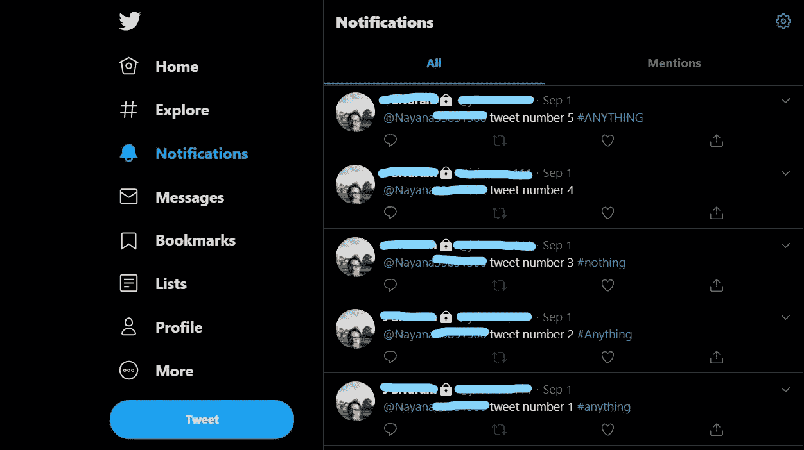
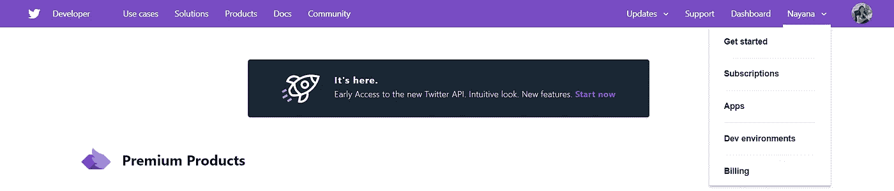
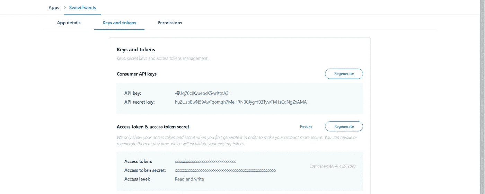
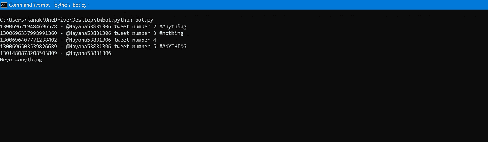
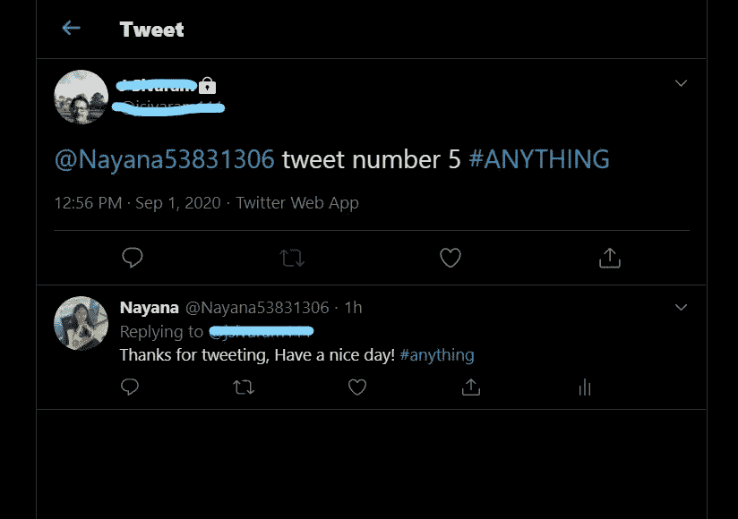

# 推特机器人 101:第一部分

> 原文：<https://medium.com/analytics-vidhya/twitter-bot-101-part-1-4028bb3f268a?source=collection_archive---------13----------------------->

如今的社交媒体平台包含的机器人数量之多超出了我们的想象。

谈到社交媒体上的机器人，Twitter 是最受欢迎的部署和管理机器人的平台之一。

今天，让我们来看看如何创建和运行这些 Twitter 机器人来执行自动回复、自动点赞和自动转发等任务。我会在一个非常基础的水平上详细地涵盖每个方面，这使我称之为“ [**101**](https://www.google.com/search?q=101+meaning&oq=101+meaning&aqs=chrome..69i57j0l7.2669j0j7&sourceid=chrome&ie=UTF-8) ”。

在我们开始创建第一个机器人之前，有一些特定的要求需要满足。我在下面详细解释了每个步骤。

# **第一步:建立你的 Twitter 开发者账户**

Twitter 开发者门户是一套自助式工具，开发者可以使用它来创建和管理他们的项目和应用。

在门户中，您有机会:

*   创建和管理您的 Twitter 项目和应用程序。
*   设置您的开发人员环境。

可以在这里申请 Twitter 开发者账号:[*developer.twitter.com/en/apply-for-access*](http://developer.twitter.com/en/apply-for-access)

填写完所需的详细信息后，您将收到一封确认邮件。那么你的申请会在很短的时间内得到处理。

一旦你的 twitter 开发者账户设置好了，确保你有另一个 Twitter 账户可以用来测试你的机器人。另一个帐户不需要任何开发人员权限。(提示:可以用朋友的账号，也可以用父母的账号)

从第二个账户开始，用不同的标签做几个测试推文，等等。别忘了标记您的开发人员档案。



我通过给自己加标签，在我爸的账户上发了几条测试微博。这将有助于以后检查你的机器人是否工作正常。

# 步骤 2:创建应用程序来生成访问令牌

登录您的 Twitter 开发者账户，点击“开始”。您应该会看到类似这样的内容:



您可以在右上角的用户名下找到“开始使用”。

现在点击“创建应用程序”按钮。你将被引导到一个地方，在那里你必须填写你的应用程序的细节，即你的机器人。

*   首先，给你的应用取一个好名字。(我已经把 SweetTweets 给我的了)
*   然后简单描述一下你的应用程序会做什么。
*   在网址中，你可以提供你的个人网站的链接，或者你可以粘贴你的 Twitter 账户的网址。(它看起来会像这样:[https://twitter.com/Nayana53831306](https://twitter.com/Nayana53831306))
*   继续填写所有其他必需的详细信息，然后点击“create”按钮。

**密钥和令牌**

创建应用程序后，您可以在应用程序列表中查看它。选择该选项并转到“密钥和令牌”。



你可以在这里找到总共四把钥匙。

这里你可以看到四个非常重要的键，任何人都可以用它们来控制你的帐户。您可以多次重新生成它们，但是您必须使用最新的密钥才能使您的应用程序工作。

# **第三步:Tweepy 入门**

**Tweepy** 是一个开源的 **Python** 包，它给你提供了一个使用 **Python** 访问 Twitter API 的便捷方式。 **Tweepy** 包括一组表示 Twitter 的模型和 API 端点的类和方法，它透明地处理各种实现细节，比如:数据编码和解码。

想了解更多 Tweepy，可以访问:[*tweepy.org*](https://www.tweepy.org/)

检查您系统上的 Python 版本，并安装等效的 Tweepy 版本。您可以打开命令提示符并键入以下内容:

```
pip install tweepy
```

完成后，我们可以使用命令轻松地将 Tweepy 导入到我们的文件中。除此之外，还要导入时间，这有助于你定期运行你的机器人。

```
import tweepy
import time
```

# **第四步:开始 Bot 开发**

首先，在你的电脑上创建一个文件夹，用来存储机器人的文件。现在，您可以打开您最喜欢的编辑器开始编写代码。(我用过 VS 代码，你可以用 Atom，Pycharm 或者你喜欢的任何东西)

打开编辑器后，在其中打开您创建的文件夹。在这里，通过使用**命名来创建一个 python 文件。py** 扩展。

**4.1-认证**

在开始之前，我们需要在 bot 文件中验证我们的 Twitter 帐户。首先，创建四个变量，并将访问键存储在其中。然后键入给定的命令进行身份验证。

```
consumer_key = 'viiUq78cJKvueocKxxxxxxxxx'
consumer_secret = 'huZUzbBwN59AwTqomqh7MeHRNBxxxxxxxxxx'
key = '1117661466729910272-61LP2vgzqrKJQTD2nxxxxxxxxxxx'
secret = '5dljJxR2ehKhDrnKdA6NZDqZcq2Txxxxxxxxxxxxxxx'auth = tweepy.OAuthHandler(consumer_key, consumer_secret)
auth.set_access_token(key, secret) 
```

**4.2-通过 bot 更新状态**

这里开始实际的机器人创建。在本节中，我们将看到如何自动更新我们的状态。

现在我们将创建一个 *api* 对象，通过它我们可以利用以下命令的所有功能:

```
api = tweepy.API(auth)
api.update_status('Hello by my first bot!!')
```

使用 *update_status()* 方法，我们可以自动更新 Twitter 句柄上的状态。只需保存文件并运行它。现在刷新您的 Twitter 帐户，查看您的状态更新。

**4.3-自动回复推文**

我们将看到如何自动回复提到我们用户名的推文。(标记了我们)

在 [Tweepy](http://docs.tweepy.org/en/latest/) 的文档中，你可能会发现很多 [*时间线方法*](http://docs.tweepy.org/en/latest/api.html#timeline-methods) ，并附有简单易懂的用法说明。

对于本教程，我将使用 *mentions_timeline()* 方法，该方法返回包括 tweets 在内的最近 20 次提及。

我将声明一个名为 tweets 的变量，它存储我被标记的所有 tweets。

```
tweets = api.mentions_timeline()
#The type of the variable is a Result set
```

现在让我们遍历所有提到我们的推文。

```
for tweet in reversed(tweets):
    print(str(tweet.id) + ' - ' + tweet.txt))
```

我已经使用了 *reversed()* 方法来反转我们拥有的 tweet 列表，以便从第一条 tweet 到最新的 tweet 访问它们。

上面这段代码将检查我们标记的所有 Tweet，并在控制台上返回它们以及 Tweet 的 id。

每条 tweet 都有一个唯一的 id，我们将在教程的后面部分使用。



您的推文将以这种方式显示。

现在我们已经有了推文列表和它们的 id，下一步就是回复这些推文。但是这里有一个陷阱！如果你只是写代码来回复这些推文，机器人会在你每次运行时回复相同的推文。

因此，每次我们都需要存储已经回复的最后一条 tweet id，以便我们下次只回复新的 tweet。

你可以这样做:

*   在我们的 bot 项目的同一个文件夹中创建一个文本文件，您可以在其中存储最后一个 tweet id。
*   复制作为参考的第一条 tweet 的 id，并将其存储在文本文件中。这告诉你的机器人，这条推文之前的所有推文都已经检查过了。
*   现在创建一个变量，并将您的文件存储在其中。

```
FILE_NAME = 'file_name.txt'
```

*   让我们开始编写一个函数来读取最后看到的 tweet id。

```
def read_seen(FILE_NAME):
   file_read = open(FILE_NAME, 'r')
   record_id = int(file_read.read().strip())
   file_read.close()
   return record_id
```

上面的函数基本上是打开并读取我们的文本文件中的内容(我们存储的第一个 tweet id 以供参考)，然后以整数的形式存储在一个名为 *record_id* 的变量中。不要忘记关闭文件并返回 id 值。

*   现在我们已经读取了最后看到的 tweet id，我们需要写一个函数来存储它。

```
def store_seen(FILE_NAME, record_id):
   file_write = open(FILE_NAME, 'w')
   file_write.write(str(record_id))
   file_write.close()
   return
```

在这个函数中，我们以字符串的形式存储 tweet id，每次运行我们的机器人时都会更新。这个函数将覆盖我们文本文件中的所有内容。

我们现在将通过传递两个参数来修改*references _ timeline()*方法，这两个参数是 *read_seen()* 方法和 tweet 模式扩展。(这有助于阅读大型推文)

之后，我们将编写一行代码，自动回复我们被标记的推文。为此，我们将使用之前讨论过的 *update_status()* 方法。我们将提到我们想要回复的人的用户名以及消息。

将这段代码嵌入到名为 *reply_tweet()的方法中。*

```
**def** reply_tweet():
   tweets = api.mentions_timeline(read_seen(FILE_NAME),
tweet_mode='extended') for tweet in reversed(tweets):
      print(str(tweet.id) + ' - ' + tweet.full_text) api.update_status("@" + tweet.user.screen_name + " Thanks for    tweeting, Have a nice day! #anything", tweet.id) store_seen(FILE_NAME, tweet.id)
```

*   到目前为止，我们已经学会了如何回复我们被贴上标签的推文。现在让我们试着回复那些提到我们的用户名以及有特定标签的推文。这可以通过添加一个简单的条件语句来完成，该语句将检查推文中的标签。

```
for tweet in reversed(tweets): if '#anything' in tweet.full_text.lower(): print(str(tweet.id) + ' - ' + tweet.full_text)
      api.update_status("@" + tweet.user.screen_name + " Thanks for tweeting, Have a nice day! #anything", tweet.id)
```

我选择回复任何大小写字母组合的# any tweet。你可以继续检查你想要的标签。

*   如果你想让你的机器人定期运行，检查新的推文，如果有你想要的标签就回复，只要添加一个简单的 while 循环就可以了。

```
while True:
   *# this will remain true forever* reply_tweet() 
   time.sleep(30)
```

*   有了这个，机器人将每 30 秒运行一次。你可以根据自己的选择设定时间。

只需保存文件并运行你的机器人。



你可以看到我的机器人已经回复了推文。

这就对了。您刚刚完成了第一个 Twitter 机器人的创建。相当酷。不是吗？继续前进，探索更多，随心所欲地玩它，但请记住，这只是开始。你也可以在 github 上查看我的代码:【github.com/Nayana-14/Twitter-bot 

由于大多数人可能不知道这个博客中的前三个步骤，我已经详细介绍了它们，因此这个博客有点长。因此，我将在第 2 部分讨论一些其他的话题，比如自动赞和自动转发。

希望你喜欢我的博客。敬请期待！