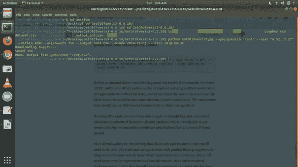
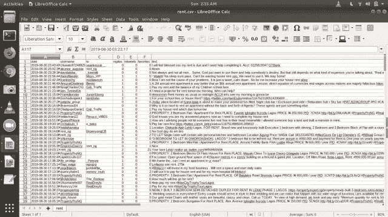

# 挖掘没有 API 键的 Twitter 数据

> 原文：<https://medium.com/analytics-vidhya/twitter-data-mining-mining-twitter-data-without-api-keys-a2a2bd3f11c?source=collection_archive---------0----------------------->

## 使用一行命令获取 Twitter 大数据进行分析。


社交媒体平台:文本大数据的大矿

ata 是新的石油，它无处不在。在过去十年中，超过 90%的大数据是由生活在城市地区的人产生的。随着物联网的出现和互联网使用的增加，社交媒体已经成为人们日常生活中不可或缺的一部分。每秒钟有数百万的非结构化数据被发送到云端，提供几乎任何话语的免费和无偏见的信息。每秒钟，平均约有 6000 条推文在 Twitter 上发布，相当于每分钟发送超过 35 万条推文，每天 5 亿条推文，每年约 2000 亿条推文。看统计[这里](https://www.internetlivestats.com/twitter-statistics/)。

想象一下，在你的个人电脑上获取这些数据，而不必编写任何庞大的代码。只是来自命令行或终端的一堆命令。

我最近有机会加入一个团队，致力于一个以社区弹性和学生化为中心的项目，我需要下载并分析大约 **10 年**以来的**旧/回溯** twitter 数据，我天真地采用了非常标准的方法，首先用 Twitter 创建一个开发者帐户，然后使用 Tweepy 查询 Twitter 的 RESTful API，以便下载用户推文以及一些其他元数据，如转发、喜欢、收藏、日期和时间、用户名等。

我很快发现，走这条路对我的任务没有太大帮助，我的任务是**从** *到* *下载过去 10 年中某个特定话语的 twitter 数据，然后这些数据将被输入到我构建的几个管道中进行分析。这是因为 Twitter 的速率限制和时间限制；使用 twitter 的 API，你不能挖掘超过 7 天的推文，同样，对于一个单一的搜索查询，twitter 只给出 100 个当前周的结果。我得说这对我没多大帮助。*


谢谢计算器，但答案是**没什么帮助。** :-)

所以我进入了默认的研究模式。我有一个问题需要解决，那就是以编程方式获取旧的 tweets，然后我发现 GetOldTweets-python 工具最初是由 python 版本 2.x 中的[**Jefferson Henrique**](https://github.com/Jefferson-Henrique/GetOldTweets-python)开发的，后来由 Python 版本 3.x 中的 [**Dmitri Mottl**](https://github.com/Mottl/GetOldTweets3) 进行了修改。有意思！对我的任务很有帮助。

该算法通过浏览器非常快速地查询 twitter 搜索，寻找您在命令中指定的搜索关键字、用户名或标签，直到您的搜索持续时间结束。基本上，当你进入 Twitter 时，一个滚动加载器开始启动，如果你向下滚动，你会得到越来越多的 tweets，所有这些都是通过调用 JSON 提供者实现的。它可以搜索最深刻和最古老的推文。

在我研究的那个阶段，我已经找到了我正在寻找的东西。本质上，在软件开发和工程中，你不会试图重新发明轮子。所以我欣然接受了它，但是发现很难为我自己的用例编写一个工作实现。我没有得到我想要的结果。另外，我发现很多人都和我一样，或者有一天也会和我一样，所以为什么不为开源做点贡献，让事情变得更容易，即使是那些没有很强的 python/编程背景的人。

这导致了我自己的改进分叉，这是本文的关键。

所以我们才刚刚开始。

TL；速度三角形定位法(dead reckoning)


> 代码的这一改进分支确保了下载数百万条可用于分析的回溯/旧推文变得相对更容易，在 Windows、Ubuntu 或 Mac OS 驱动的机器上以及从命令行都没有压力。基本上是一行命令。只需遵循我之前在 Github 上列举的简单步骤，但为了实用起见，这里只展示这些步骤。

**要求。**

第一个先决条件是在您的本地机器上安装任何 python3.x 版本，并且您应该已经设置了环境变量 path，这样您就可以从命令提示符或终端交互地启动 python，而不会出现任何错误。在 Windows 上，最简单的方法是再次运行 python 安装程序，并勾选高级选项下的“将 Python 添加到环境变量”复选框。[stack overflow](https://stackoverflow.com/posts/54934172/edit)上的这个回答更清楚地说明了这一点。在终端上，如果你使用的是 Ubuntu 发行版(我认为它在喜欢 Linux 操作系统的程序员中更受欢迎)，只需在你的终端上运行`sudo apt-get install python3.6`，你应该能够在安装后通过输入“python”从终端启动 python3。

之后，下一个主要需求是安装 pyQuery 和 Lxml 来处理请求和 xml/html 文档类型。这可以很容易地通过运行终端或命令提示符来完成；`pip install pyquery`和`pip install lxml`

现在，一旦您完成了所有这些先决条件，请前往我的 [**Github 这里**](https://github.com/marquisvictor/Modified-GetOldTweets3/blob/master/README.md) ，派生和/或克隆 Mottl 的 python3 版本的改进派生，这也是 Jefferson Henrique 编写的原始包的改进派生。


请给我来点尼日利亚 Jollof 和火鸡:-)

有一个自述文件，其中包含了我的 repo 的实现和一些基本的例子，但我会给出一个简短的关于下载旧的/回溯的 twitter 数据的实践教程。

现在，一旦您将回购克隆或下载到您的本地机器上，您就可以通过以下步骤开始下载您的旧/回溯 twitter 数据，用于任何类型的分析:

1.  将 repo 克隆或下载到您的本地计算机上。
2.  拉开拉链。
3.  导航到解压缩后的优化-修改-GetOldTweets3-OMGOT-master 文件夹
4.  cd 到解压缩后的 Optimized-Modified-getoldtweets 3-om got-master 文件夹中的 getoldtweets 3–0 . 0 . 10 文件夹，并在那里启动命令提示符或终端。
5.  好了，现在可以开始摆弄数据集了。

运行 GitHub readme 中的命令，开始下载您的 twitter 数据，这些数据将作为 output.csv 文件保存在您的计算机上。但是您可以通过传递一个“名称”来指定一个名称来保存您下载的数据集。“—输出”参数的 csv。例如:`--output dataset.csv`将下载的文件在你的工作目录下保存为 dataset.csv。

现在，用更多的例子来弄脏我们的手。假设我们需要下载特定用户的推文。

我们只需执行上述步骤 1–4，并输入从 Github repo 中摘录的以下命令

```
python GetOldTweets3.py --username "mo4president"  --maxtweets 50 --output dataset.csv
```

上面的命令将查询 twitter 的搜索引擎并下载@mo4president 发出的所有推文，您还可以使用`--maxtweets` 参数指定您需要的推文数量，使用`--output`参数指定输出名称。省略掉`--maxtweets`这个参数，基本上用户下载了所有的推文。但是在这里我们指定了 50，这意味着我们只能得到 50 行 tweet 信息。

此外，如果您需要下载从 2014 年至今的某个地理位置的特定关键字的推文，例如“ **rent** ”，这是大约 5 年的旧推文，您可以在执行上述步骤 1-4 后使用这个命令，该命令也是从我的 github repo 中挑选出来的。

```
python GetOldTweets3.py --querysearch "rent" --near "6.52, 3.37" --within 40km --maxtweets 350 --output rent.csv --since 2014-01-01 --until 2019-08-31
```

因此，上面的这个命令将为我们获取从 2014 年至今，在拉各斯州*(因为这是我们指定的)*的纬度和经度坐标的 40 公里半径范围内，包含单词或标签" **rent** "的所有推文，并将结果存储在 rent.csv 文件中，该文件将保存在我们当前的工作目录中。这里的 maxtweets 参数将返回 350 条 tweets，因为这是指定的。



本质上是开始下载推文的一行命令



csv 格式的输出

运行同样的流程，我能够收集足够多的关于各种由关键词代表的话语的大数据，并相应地对其进行分析，以了解 10 年期间与社区弹性和学生化相关的趋势以及其他分析。

如上所示，在下载了原始非结构化状态的 twitter 大数据后，您将需要使用 python 中的 pandas 库进行一些数据帧操作，以删除一些列，并可能进行一些基本的探索性数据分析。

值得注意的是，这个修改后的工具现在会自动清理所有的 tweet 文本并删除不需要的字符。

然后，您可能希望将推文文本传递到围绕 [vader](https://github.com/cjhutto/vaderSentiment) 或 [textblob](https://textblob.readthedocs.io/en/dev/) 构建的情感分析管道中进行进一步分析，或者使用 [Gensim 的 python 库](https://pypi.org/project/gensim/)和潜在的 Dirichlet 分配模型进行文档-主题-单词建模。但所有这些不同的分析都取决于你作为数据科学家或研究人员的熟练程度和项目方向。

在接下来的几篇文章中，我将会看到几乎所有可以用 tweet 文本进行的分析，以获得更好的见解，以及如何处理数据集中的噪声。但是现在，我希望这篇文章对收集您的 twitter“大”数据有所帮助。

代码贡献者:

[**Irekponor**](https://www.linkedin.com/in/victor-e-irekponor/)**[**Victor**](https://github.com/marquisvictor)，尼日利亚拉各斯大学。**

**[**阿米努**](https://www.linkedin.com/in/aminu-israel-248ab3177/?originalSubdomain=ng) [**以色列**](https://github.com/AminuIsrael) ，尼日利亚拉各斯州立大学。**

**[**Olah**](https://www.linkedin.com/in/olahfemi/?originalSubdomain=ng)**[**Femi**](https://github.com/olahfemi)，尼日利亚拉各斯大学。****

# ****更新**:**13–10–2020。****

****该工具(optimizedGetOldTweets)目前已损坏，因为 twitter 将其 API 端点从 1.1 版升级到 1.2 版，因此，该工具中使用的一些端点已被弃用[以下是关于其新 API](https://blog.twitter.com/developer/en_us/topics/tips/2020/understanding-the-new-tweet-payload.html) 的更多详细信息。事情进展得很快，我已经能够解决这个问题了。但是现在，如果你在这里，[看看我在 Github 自述文件中添加的这个](https://github.com/marquisvictor/Optimized-Modified-GetOldTweets3-OMGOT/blob/master/README.md#update-12-10-20)。****

****我相信这对你的 twitter 数据挖掘冒险有很大的帮助。😊。****