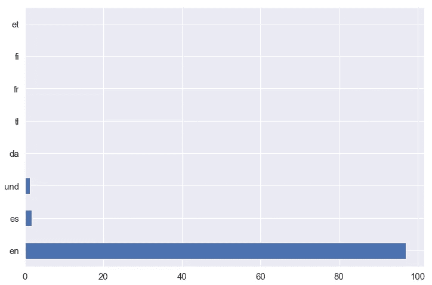

# 推特深度分析:美国总统大选

> 原文：<https://medium.com/analytics-vidhya/twitter-deep-dive-analysis-us-presidential-election-d6b32acc449b?source=collection_archive---------6----------------------->

## 一种使用从 Twitter 提取的数据预测 2020 年下一届美国总统选举获胜者的方法


在 [Unsplash](https://unsplash.com/s/photos/trump-election?utm_source=unsplash&utm_medium=referral&utm_content=creditCopyText) 上用高清拍摄的[历史照片](https://unsplash.com/@historyhd?utm_source=unsplash&utm_medium=referral&utm_content=creditCopyText)

# 概述:

最近，数据科学界已经将兴趣转向分析网络数据，如博客帖子或社交网络“用户”活动，作为对即将到来的美国总统大选***2020 年 11 月****做出准确预测的替代方法。***

*此外，传统的民意调查成本太高，而在线信息已经变得容易获得和免费提供。允许研究人员使用他们的数据的社交媒体之一是 Twitter。它每月有超过 2 亿*的访客，每天有超过 5 亿*的消息。使用来自 **Twitter** 的推文作为数据源的优势:***

*   ***首先，tweets 的数量非常巨大，并且公众可以获得。***
*   ***其次，推特包含了人们的观点，包括他们的政治观点。***

***所以在总统竞选期间，推特已经成为选民从政治候选人那里寻求准确信息和突发新闻的第一站。该公司了解这一责任的重要性，其团队开始为使用 **Twitter** 的人开发新工具，以识别原始来源和真实信息。***

***事实上， **Twitter** 决定为 **2020 美国大选**带回候选人标签，这些标签将出现在候选人的个人资料页面上，以及他们分享的任何推文和转发。他们会告诉你这个人竞选的职位，以及在哪个州和地区。***(***[***阅读更多***](https://www.theverge.com/2019/12/12/21011960/twitter-election-labels-2020-candidates-house-senate-gubernatorial-races)***)******

****

**图片:推特**

# **案例研究:**

**2016 年总统大选的主要战场之一是 **Twitter** 。这是历史上最受关注的*美国总统选举*之一，**推特**在其中扮演了越来越重要的角色。**

**现在让我们把注意力集中在 2016 年美国总统大选*的两位领先者的案例上: [**唐纳德·特朗普**](https://twitter.com/realDonaldTrump?ref_src=twsrc%5Egoogle%7Ctwcamp%5Eserp%7Ctwgr%5Eauthor) **和** [**希拉里·克林顿**](https://twitter.com/HillaryClinton?ref_src=twsrc%5Egoogle%7Ctwcamp%5Eserp%7Ctwgr%5Eauthor) ，本研究考察了他们通过自己的**推特**账户自我展示和与选民沟通的方式的差异。***

**与之前关于女性候选人如何发推特的研究结果一致，这份完整的分析帮助我发现 [**希拉里**](https://twitter.com/HillaryClinton?ref_src=twsrc%5Egoogle%7Ctwcamp%5Eserp%7Ctwgr%5Eauthor) 在推特上胜过共和党候选人，攻击他的次数比他攻击她多，在推特上谈论政治问题的次数也多得多。**

**顺便说一下，我对美国国会候选人如何使用推特进行了另一项分析，你可以在这里看一下文章。**

# ****推文收藏:****

**该数据集包含与 2016 年美国总统选举相关的推文。它们是在 2016 年*7 月 13 日*和 2016 年*11 月 10 日*之间使用[社交订阅源管理器](https://gwu-libraries.github.io/sfm-ui/)从 **Twitter API** 收集的。它是一个开源软件，从 Twitter、Tumblr 和 T42 Flickr 获取社交媒体数据和网络资源。我强烈推荐使用 **SFM** 来收集数据，我是这样编辑的:**

## **1-定义和组织集合**

****

## **2-添加各种收割类型的集合**

****

## **3-添加种子**

****

## **4-打开它， **SFM** 将持续采集数据或根据您指定的时间表采集数据**

****

## **5-将收藏导出到电子表格**

****

**您还可以从命令行将数据输入到您自己的处理管道中。实际上，使用 **SFM** 并不需要特定的专业知识，但是阅读 [SFM 文档](https://sfm.readthedocs.org/)并熟悉社交媒体 API 是有帮助的。**

# **探索性数据分析**

****

**我使用了一个包含 **~3000 条**来自**希拉里**和**唐纳德·川普**的最近推文的推文数据集，这两位大党总统候选人。**

**所以两个候选人的推文数量大致相同。我们可以说我们的数据集是平衡的。**

## **1.一段时间内的推文**

****

**我们可以看到**特朗普**从年初开始发推文，还有**克林顿**发推文从***7 月 16 日*** 左右开始涌入。**

********

## **2.候选人什么时候发微博？**

****

**此外，有趣的是看到每小时的推特倾向，候选人往往在下午和晚上交流更多。**

## **3.转发的百分比**

********

**由此我们可以说**唐纳德·特朗普**比**希拉里·克林顿**使用的推特多一点，但是**克林顿的**推特被转发的次数比**特朗普的**多。**

****

## **4.推特语言**

****

**推文语言百分比**

**我们可以看到，两位候选人使用的大多数推文都是用**英语**写的。但是我们有超过 100 条西班牙语的推文:**

```
**HillaryClinton     102
realDonaldTrump      3
Name: handle, dtype: int64**
```

**这确实有道理，因为克林顿的竞选团队已经努力动员在大选中至关重要的拉丁裔选民。此外，她还有一个强大的 ***拉丁裔*** 领导人和活动家网络。**

## **5.转发的原始作者**

****

# **数据分析:**

****摘录特朗普和克林顿的推文****

## **1.单词云**

*   **希拉里·克林顿的词云:**

****

*   **唐纳德·特朗普的话云:**

****

> **希拉里·克林顿在政治问题上花费的时间明显多于特朗普，特朗普几乎没有在推特上提到任何问题。**

## **2.提及次数:**

****从推文中提取提及****

****候选人使用最多的图表(前 10 名)****

****

**虽然**希拉里·克林顿**在每五条推文中只提到其他 **Twitter** 用户，但大多数用户提到的是 **@POTUS** (+125 次提及)，然后我们有 **@realDonaldTrump** ，她是在她的账户上提到最多的其他 **Twitter** 用户，包括 **@TimKaine** 和 **@JoeBiden** 。**

****

**另一方面，唐纳德·川普没有提到**@希拉里·克林顿**的推特账号。**唐纳德·特朗普**在他三分之二的推文中不断提到其他推特用户，经常提到他自己的账户 **@realDonaldTrump** (+280 次提及)，还提到**@福克斯新闻** (+70 次提及)、 **@CNN** (+60 次提及)和福克斯新闻频道主播 **@MegynKelly** (+52 次提及)，因为他们涉嫌偏见和不公平的报道。**

**似乎两位候选人有一个共同点，那就是他们都经常提到特朗普。令人惊讶的是，虽然**特朗普**是**希拉里**的第二大被提及账户，但她不在**特朗普**的名单上。**

> **哪种策略更好还有待观察:接触并提及你对手的 Twitter 账户，还是干脆忽略它。**

## **3.标签大战:**

****

****希拉里·克林顿**更少使用标签，在她的推文中只有 **18%** 使用标签；最常见的是 **#DemsInPhilly** 和 **#DebateNight** 。在共和党全国代表大会期间，她也使用过标签来回应她的对手。**

****

****唐纳德·特朗普**几乎每隔一条推文就包含一个标签，包括**#特朗普**，使用 ***+340*** 次，以及 **#MakeAmericaGreatAgain** ，使用 ***246*** 次。**

> **特朗普似乎比希拉里更喜欢标签，他最喜欢的标签(#Trump)比她最喜欢的标签(#DemsInPhilly)多 9 倍**

****标签网络****

****账号到标签:**[**@ realDonaldTrump**](http://twitter.com/realDonaldTrump)**

****

****账号到标签:** [@FoxNews](http://twitter.com/FoxNews)**

****

# **情感分析**

****

**我尝试用 [**TextBlob**](https://textblob.readthedocs.io/en/dev/) 将 tweet 专栏分为 ***正面*** 和 ***负面*** 情绪。该包在情感数据集中包含几个情感词典。**

**[**TextBlob**](https://textblob.readthedocs.io/en/dev/) 旨在通过熟悉的界面提供对常见文本处理操作的访问。您可以将`[**TextBlob**](https://textblob.readthedocs.io/en/dev/api_reference.html#textblob.blob.TextBlob)`对象视为学会了如何进行 ***自然语言处理*** 的 Python 字符串。**

****

**与我们想象的不同，大多数推文是正面的，中立的。现在，我将尝试分别关注每个候选人。**

****

**非常有趣的是，唐纳德·特朗普有大量积极的推文，几乎是他中性或消极推文的两倍。**

# **冒充候选人**

**多亏了 [**Markovify**](https://github.com/jsvine/markovify) ，我们可以使用**马尔可夫链** **模型**来基于现有的实际推文库创建合成推文。现在，它的主要用途是建立大型文本语料库的马尔可夫模型，并从中生成随机句子。**

```
**Hillary
- Watch President Obama &amp; Vice President @JoeBiden had the keys to our national debt.
- There’s no doubt about it—Donald Trump is unfit to be Commander-in-Chief.Donald
- Rowanne Brewer, the most prominently depicted woman in the Republican Party can unify!
- I would like to express my warmest regards, best wishes and condolences to Dwyane Wade and his family, on the East coast.**
```

```
**Hillary
- They don’t just want us to solve them.
- They are trying to scam America the clean energy superpower of the iceberg.Donald
- We are superior and have a clue.
- We said no and she went with Obama - and I will beat Hillary!**
```

> **有时这很有效，它有助于将虚假推文指向某个方向。**

# **预测是谁说的:特朗普还是克林顿**

**在最后一部分，我将尝试建立模型来正确预测给定推文的作者。为了识别每位作者，我将创建一个单词包，其中包含两位作者最常用的单词。单词包是给定文本源的最常见单词的列表。这个集合后来成为特征工程的基础。**

**我首先应用了一个多项朴素贝叶斯算法作为分类器。**

```
**Accuracy on training set:  96.34%**
```

****

**训练集上的混淆矩阵**

**然后我决定用 [**流水线**](https://scikit-learn.org/stable/modules/generated/sklearn.pipeline.Pipeline.html) 和 [**交叉验证**](https://scikit-learn.org/stable/modules/generated/sklearn.model_selection.cross_validate.html) **:** 来改进模型**

```
**[0.9244 0.9264 0.9399 0.9147 0.9264 0.9186 0.905  0.8951 0.9261 0.9047] 

Mean score: 0.9181311287268004
Stdev: 0.012670848631606169**
```

****

**测试集上的混淆矩阵**

**所以这次我们在测试集上获得了 92%的准确率。我们可以说 NLP 驱动的模型已经成功地对 **92%** 未知(测试集)样本进行了有效的正确分类。换句话说，92%的推文被正确识别出属于两者中的哪一个作者。**

**现在让我们测试我们的预测模型，看看会发生什么**

```
**Tweet #1: ' We have to build an economy that works for everyone, not just those at the top. '  

 I'm about **89%** sure this was tweeted by **HillaryClinton**Tweet #2: ' My lawyers want to sue the failing @nytimes so badly for irresponsible intent. '  

 I'm about **88%** sure this was tweeted by **realDonaldTrump****
```

# **总结:**

****

**这项研究背后的概念是使用 **Twitter 的 API** 收集推文，并应用不同的算法对它们进行分类，并发现候选人对特定主题的看法趋势。我们能够展示社交媒体，更准确地说是 **Twitter** 如何用于预测未来的结果，如选举，提取可能在大选中投票或对投票者有影响的人的情绪或观点，以及**情绪分析**，对他们的情绪进行分类。**

**因此，我们的目标是收集与选举有关的推文，更具体地说，是指美国总统选举的两位主要候选人:**希拉里·克林顿**和**唐纳德·j·特朗普**。**

# **进一步的工作:**

**尽管如此，我们仍然可以将我们的研究应用于 2020 年**总统选举的未来候选人。****

****

**照片由[元素 5 数码](https://unsplash.com/@element5digital?utm_source=unsplash&utm_medium=referral&utm_content=creditCopyText)在 [Unsplash](https://unsplash.com/s/photos/election-2020?utm_source=unsplash&utm_medium=referral&utm_content=creditCopyText) 上拍摄**

**方法是在选举前几周使用选定的数据。预测可以通过比较提到每个候选人的推文的数量或者通过比较对每个候选人有积极情绪的推文的数量来得出。正如我们在这篇文章中看到的，提到一个政党的推特数量反映了选举结果，来自**推特**的**情绪分析**方法可以减少预测结果的误差。**

**我们还可以采用其他方法，比如分别利用每个州潜在选民和候选人之间的互动信息。我们还可以从候选人的追随者和候选人网络规模(Twitter 上的追随者和脸书上的朋友)的变化中创建趋势线。**

> **你应该记住的是，尽管我们可以从社交媒体中提取大量信息，但它对选举结果的影响仍然很小。因此，它只会在竞争激烈的选举中产生影响。**

# **参考资料:**

*   **社交提要管理器:h[ttps://SFM . readthedocs . io/en/latest/index . html](https://sfm.readthedocs.io/en/latest/index.html)**
*   **https://textblob.readthedocs.io/en/dev/index.html**
*   **用 Python 生成 word cloud:[https://www . data camp . com/community/tutorials/word cloud-Python](https://www.datacamp.com/community/tutorials/wordcloud-python)**
*   **马克维奇:[https://github.com/jsvine/markovify](https://github.com/jsvine/markovify)**
*   ****脸书、谷歌和推特如何在 2016 年‘嵌入’帮助川普:**[https://www . politico . com/story/2017/10/26/Facebook-Google-Twitter-Trump-244191](https://www.politico.com/story/2017/10/26/facebook-google-twitter-trump-244191)**
*   ****选举更新:How-Full-Is-This-Glass 选举:**[https://fivethirtyeight . com/features/Election-Update-The-How-Full-Is-This-Glass-Election/](https://fivethirtyeight.com/features/election-update-the-how-full-is-this-glass-election/)**

**如果你设法来到这里，恭喜你。感谢阅读，我希望你喜欢它。关于机器学习的个人接触或讨论，请随时在[**LinkedIn**](https://www.linkedin.com/in/kamal-chouhbi/)**上联系我，别忘了在 [**GitHub**](https://github.com/chouhbik) 和 [**Medium**](/@chouhbik) **上关注我。******

****[](https://github.com/chouhbik) [## chouhbik -概述

### 在 GitHub 上注册你自己的个人资料，这是托管代码、管理项目和构建软件的最佳地方…

github.com](https://github.com/chouhbik)****