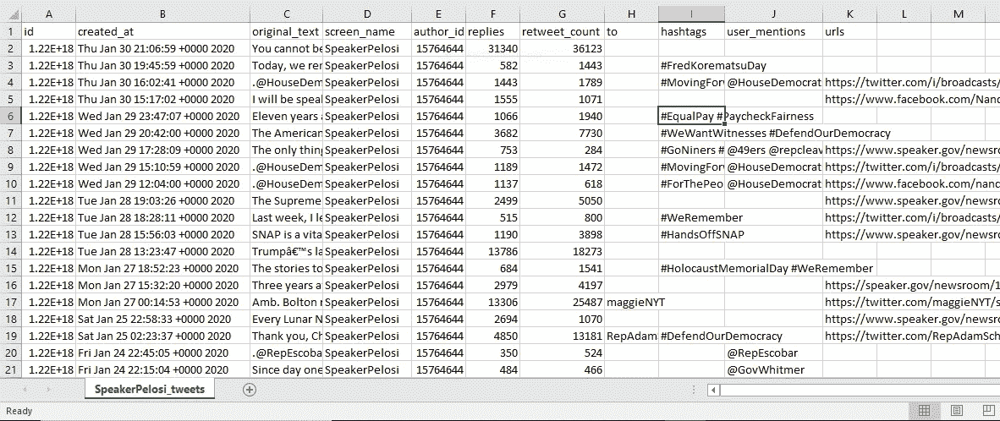
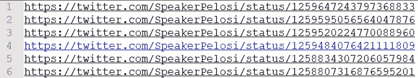

# 使用 Python 恢复 Twitter 丢失的数据

> 原文：<https://medium.com/analytics-vidhya/twitter-missing-data-recovery-using-python-7c193cfecb18?source=collection_archive---------8----------------------->

资料来源:freepik.com

随着互联网的普及，社交媒体已经成为我们日常生活的一部分。数十亿用户在社交媒体平台上分享他们的想法，彼此保持联系，分享视频，上传图片。所有这些状态更新、图片和视频都包含有价值的信息。分享的信息可以用来了解人民的情绪。情感分析可以帮助影响营销策略或预测选举结果，或向人们提供个性化的建议等等。

今天，数据已经成为新的石油；它无处不在。根据官方在 2014 年发布的推特使用统计数据，平均每天有 5 亿条推文被发送，也就是说，每秒钟有 6000 条推文。想象一下，在任何领域的研究中，这些数据是多么强大。

[Twitter 流媒体应用编程接口(API)](https://developer.twitter.com/en/docs/tweets/filter-realtime/overview) 允许我们收集近乎实时产生的推文。这些推文可以基于某些标签或关键词或 twitter 句柄来收集。 [Tweepy](http://docs.tweepy.org/en/latest/) 是最流行的 Python 库，可以用来连接流媒体 API，适当处理错误。

在传输实时推文时，需要遵循一些规则:

1.  创建到 Twitter API 的持久连接，并增量读取每个连接
2.  快速处理推文，不要让你的程序出现备份
3.  认真处理错误和其他问题

在跳到这些规则之前，让我们讨论一下如何建立到 Twitter 流 API 的连接。

*   我们需要一个有效的[开发者账户](https://developer.twitter.com/en/apply-for-access)来访问 API。查看此[链接](https://www.extly.com/docs/autotweetng_joocial/tutorials/how-to-auto-post-from-joomla-to-twitter/apply-for-a-twitter-developer-account/#apply-for-a-developer-account)了解如何申请的更多详情。
*   在设置了 Twitter 开发者的帐户之后，我们需要创建一个应用程序来生成 API 密钥和访问令牌。

按照以下步骤生成 API 密钥和访问令牌:

1.  点击你的 Twitter 开发者账户名，进入“应用”选项
2.  点击你创建的应用程序右侧的“详细信息”按钮。转到“密钥和令牌”选项。您将在那里看到生成的密钥和令牌。
3.  现在，您可以使用这些密钥和令牌开始使用 Twitter API 了

下面你可以看到代码建立到 Twitter API 的连接，并传输接近实时的数据。收集的数据被转储到一个 JSON 文件中。

**注**:用各自的代币替换大写字母。

不幸的是，获取实时流数据并不总是那么简单。Twitter 流 API 施加了速率限制，并禁止太多太快的连接尝试。它还可以防止使用相同的授权密钥建立太多的连接。此外，如果处理 tweets 的时间太长，它们将开始排队，Twitter API 连接将丢失。网络不稳定也可能是断线的原因。很有可能丢失在丢失连接和重新连接之间的时间间隔内发送的数据。

对于任何要得出结论的研究，基础数据的质量决定了商业决策的有效性。高质量的数据有利于做出更明智的决策，通过创建吸引受众的可靠广告来恰当地锁定受众，提高盈利能力等。如果我们没有所需的数据，我们就无法分析特定的趋势或了解我们的业务是如何运作的。糟糕或不完整的数据会导致糟糕的分析，最终导致糟糕的业务决策，带来更糟糕的结果。必须恢复任何丢失的数据，并确保正在分析的数据完整可信。

[Twitter 的标准 REST API](https://developer.twitter.com/en/docs/tweets/search/overview) 确实提供了对旧推文的访问，但只能覆盖一周的推文。如果我们需要检索比这更早的推文呢？也许几周，几个月，甚至几年？

资料来源:giphy.com

幸运的是，当我在寻找解决这个问题的资源时，我发现了一个 Python 库和一个 scraper，可以有效地用来获取旧的 tweets。这两个工具都不需要 Twitter API 凭证来连接 API 和获取数据。他们利用 Python 库，如 requests、urllib、json、bs4、PyQuery 等。来收集推特数据。

1.  **GetOldTweets** → python 工具最初由 [Jefferson Henrique](https://github.com/Jefferson-Henrique/GetOldTweets-python) 在 python 版本 2.x 中开发，后来由 [Dmitri Mottl](https://github.com/Mottl/GetOldTweets3) 在 Python 版本 3.x 中修改
2.  **snscrape**→[snscrape](https://github.com/JustAnotherArchivist/snscrape)是一个社交网络服务(SNS)的刮刀。它抓取用户资料、标签或搜索，然后返回相关的帖子。

# **GetOldTweets3-**

要安装 GetOldTweets3 库，请使用以下命令。

*pip 安装 GetOldTweets3*

可以通过命令行或使用 Python 类使用 GetOldTweets3 获取 tweets。你可以在这里找到更多关于命令行用法或者 Python 类[的信息。](https://github.com/Mottl/GetOldTweets3)

要收集某些 twitter 句柄发布的 tweets，请参考下面的代码，它使用 GetOldTweets3 Python 类并将结果存储在一个**中。CSV** 文件。

**。CSV** 输出文件如下图所示。

# **snscreage-**

要安装 snscrape，请使用以下命令。

*pip3 安装 snscrape*

只能通过命令行使用 snscrape 来获取 twitter 数据。
对于一个单独的 twitter 句柄，可以使用下面的命令获取该句柄发布的 tweets，获取的数据存储在一个文本文件中。

*snscrape Twitter-用户“speaker Pelosi”>Twitter-speaker Pelosi*

下面是该命令的示例输出。

如果想从多个 twitter 句柄获取数据，可以使用下面的 Python 代码。

这里需要注意的一点是，snscrape 只能获取推文的 HTML 链接，这些链接包含发布推文的 twitter 句柄和推文的唯一 id。它不会获取与 tweet 相关的所有信息。

但是好消息是 Tweepy 为我们提供了一个" **get_status()** "方法，它可以根据 tweet id 获取整个 tweet 以及与之相关的所有信息。

最后，之前使用 snscrape 获取的 tweet ids 可以传递给这个 get_status()方法，整个 tweet 信息可以存储在一个**中。CSV** 文件使用下面的 Python 代码。

注意，tweet_mode 被设置为“ **extended** ”以获取 tweet 的整个未截断文本。默认情况下，tweepy 返回 tweet 的状态对象。API 方法包含只有 140 个字符的截短的 tweet 文本。更多详情见[此处](http://docs.tweepy.org/en/latest/extended_tweets.html)。

通过这种方式，我们可以将使用 Twitter Streaming API 收集的数据与新获取的数据进行比较，并恢复丢失的推文。

总之，我们学习了如何连接到 Twitter 流 API 并获取实时数据，Twitter API 施加的限制，确保数据的完整性和有用性的重要性，以及可用于恢复任何丢失数据的各种 Python 包。

我希望这篇文章内容丰富，能够帮助那些正在为类似的丢失数据问题而挣扎的人。这篇文章的源代码可以在 [GitHub](https://github.com/aditideokar93/Twitter-Missing-Data-Recovery) 上找到。

这是我的第一篇技术文章，我很想知道你们是如何发现它的。任何反馈/建议都将不胜感激！

快乐学习！😊