# 推特情感分析

> 原文：<https://medium.com/analytics-vidhya/twitter-sentiment-analysis-134553698978?source=collection_archive---------8----------------------->

使用文本挖掘技术和自然语言处理技术将推文分为正面或负面。

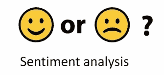

现实世界中的大多数数据都是非结构化文本格式，因此，对于数据科学爱好者来说，学习文本挖掘和自然语言技术以使用这些文本获得有用的见解是必不可少的。

通过这篇博客，我将解释如何对给定的监督数据集进行情感分析。这个问题是从维迪亚的一个分析竞赛中得到的。下面是问题的链接—[https://data hack . analyticsvidhya . com/contest/linguipedia-code fest-natural-language-processing-1/](https://datahack.analyticsvidhya.com/contest/linguipedia-codefest-natural-language-processing-1/)

# 问题介绍

情感分析是文本的上下文挖掘，它识别和提取源材料中的主观信息，并帮助企业在监控在线对话的同时了解其品牌、产品或服务的社会情感。品牌可以使用这些数据来客观地衡量他们产品的成功。在这次挑战中，我们获得了推特数据来预测网民对电子产品的情绪。给定客户关于制造和销售手机、电脑、笔记本电脑等各种技术公司的推文，任务是识别推文是否对这些公司或产品有负面情绪。

# 方法

首先，我们将导入我们将在分析过程中使用的所有必要的库。

```
import numpy as npimport pandas as pdimport reimport matplotlib.pyplot as pltimport seaborn as snsfrom sklearn.linear_model import LogisticRegressionfrom sklearn.svm import SVCfrom sklearn.model_selection import train_test_splitfrom sklearn.metrics import f1_scorefrom sklearn.model_selection import GridSearchCVfrom sklearn.model_selection import cross_val_scorefrom sklearn.model_selection import KFoldfrom sklearn.metrics import roc_curvefrom sklearn.metrics import precision_recall_curvefrom sklearn.metrics import roc_auc_scorefrom sklearn.linear_model import LogisticRegressionfrom sklearn.metrics import classification_reportfrom sklearn.metrics import confusion_matrixfrom sklearn.ensemble import RandomForestClassifierfrom sklearn.ensemble import GradientBoostingClassifierfrom sklearn.model_selection import RandomizedSearchCVfrom sklearn.metrics import f1_score, make_scorer
```

现在，让我们导入给定的训练和测试数据，这些数据包含客户的不同推文。

```
train = pd.read_csv(‘train_2kmZucJ.csv’).drop(columns = [‘id’])test = pd.read_csv(‘test_oJQbWVk.csv’).drop(columns = [‘id’])train.head()
```

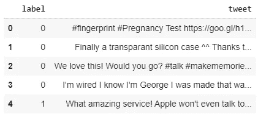

培训数据(表头)

# **文本预处理和可视化**

显然，这些推文包含大量嘈杂的数据，需要在我们继续分析之前将其删除。**标签‘0’**对应于具有**正面**情绪的推文，而**标签‘1’**对应于具有**负面**情绪的推文。现在，让我们检查训练数据中正面和负面推文的百分比。

```
#Printing percentage of tweets with +ve and -ve sentimentsprint(‘Percentage of tweets labeled as a negative sentiment ‘, end = ‘’)print(sum(train[‘label’]==1)*100/train.shape[0], end =’%\n’)print(‘Percentage of tweets labeled as a positive sentiment ‘, end = ‘’)print(sum(train[‘label’]==0)*100/train.shape[0], end =’%\n’)ax = train[‘label’].value_counts().plot(kind=’bar’,figsize=(10,6),title=”Distribution of positive and negative sentiments in the data”)ax.set_xlabel(“Sentiment ( 0 == positive, 1 == negative)”)ax.set_ylabel(“Count”)
```

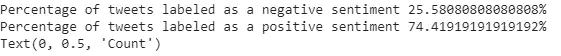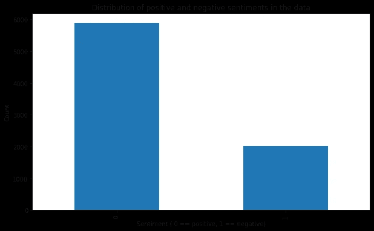

正面和负面标签的推文

上面的条形图和百分比显示，大约 75%的推文是正面的，而 25%是负面的。因此，我们可以推断数据是**不平衡的**。我们将使用一个 ***加权 F1 分数*** 来分析我们的模型。

现在，第一步是去除像标点符号、标签、@和其他非字母数字的噪音数据。只有字母数字数据才是有意义的数据，可以帮助我们识别情感。为了去除有噪声的数据，我们将导入 **RegexpTokenizer** ，它将基于正则表达式将字符串分割成子字符串。我们将使用的正则表达式是' \w+,它将标记所有字母数字数据，并从 tweets 中删除所有其他噪音。可以通过这个链接了解各种记号化器—[https://medium . com/@ makcedward/NLP-pipeline-word-tokenization-part-1-4b 2 b 547 E6 a 3](/@makcedward/nlp-pipeline-word-tokenization-part-1-4b2b547e6a3)。

```
from nltk.tokenize import RegexpTokenizerregexp = RegexpTokenizer(r”\w+”)#applying regexptokenize to both training and test setstrain[‘tweet’]=train[‘tweet’].apply(regexp.tokenize)test[‘tweet’]=test[‘tweet’].apply(regexp.tokenize)train.head()
```

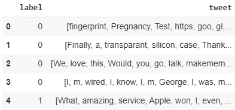

训练集和测试集的处理是相同的。

既然我们有了字母数字数据的符号化版本，我们的下一步将是删除所有对情感分析无用的常用词。像 about、above、other 标点符号、连词等词在任何文本数据中都被大量使用，但对我们的目的来说并不特别有用。这些词被称为**停用词**。我们现在将删除停用词，使我们的推文更干净，便于分析。

```
import nltkfrom nltk.corpus import stopwordsnltk.download(‘stopwords’)#remove stopwords from both training and test settrain[‘tweet’] = train[‘tweet’].apply(lambda x: [item for item in x if item not in list_stop_words])test[‘tweet’] = test[‘tweet’].apply(lambda x: [item for item in x if item not in list_stop_words])
```

移除停用词后，我们将移除所有长度为<=2\. In general, **的词。小词(长度< =2)对情感分析没有用**，因为它们没有意义。在我们的分析中，这些很可能是噪音。除了去掉小单词，我们将把所有的记号都转换成小写。这是因为像“苹果”或“苹果”这样的词在感伤的上下文中有相同的意思。

```
train[‘tweet’] = train[‘tweet’].apply(lambda x: ‘ ‘.join([w for w in x if len(w)>2]))test[‘tweet’] = test[‘tweet’].apply(lambda x: ‘ ‘.join([w for w in x if len(w)>2]))train[‘tweet’] = train[‘tweet’].str.lower()test[‘tweet’] = test[‘tweet’].str.lower()
```

现在，是时候建立一个单词云，并获得一些关于最常见单词的见解了。

```
from wordcloud import WordCloudall_words = ‘’.join([word for word in train[‘tweet’]])#building a wordcloud on the data from all tweetswordcloud = WordCloud(width=800, height=500, random_state=21, max_font_size=110).generate(all_words)plt.figure(figsize=(10, 7))plt.imshow(wordcloud, interpolation=”bilinear”)plt.axis(‘off’)plt.show()
```

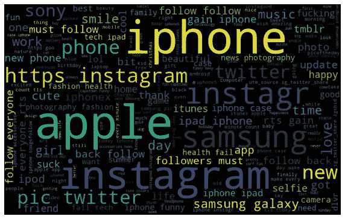

下一步是使用词干化或词汇化方法，这对任何文本挖掘问题都非常重要。**词干化和词汇化**是自然语言处理领域中的文本规范化(或有时称为单词规范化)技术，用于为进一步处理准备文本、单词和文档。这样做是为了为具有相似词根和上下文的单词构建通用单词，这使得使用分类算法建模更容易。例如，玩耍、玩耍和被玩耍的意思相同，但却是不同的词。如果我们不对一个共同的单词“play”进行标准化，每个分类模型都会认为这三个单词是不同的，用这些数据构建模型会导致过度拟合。

词干化和词元化的主要区别在于词干化通过切断单词的结尾或开头来工作，而词元化通过将单词改变为有意义的词根来工作，这是通过使用 **WordNet** 对单词进行词法分析来实现的。

出于我们的目的，我们将使用词汇化，因为它引入了有意义的常用词，从而更好地进行情感分析。

```
nltk.download(‘wordnet’)from nltk.stem import WordNetLemmatizerwordnet_tokenizer = WordNetLemmatizer()train[‘tweet’] = train[‘tweet’].apply(wordnet_tokenizer.lemmatize)test[‘tweet’] = test[‘tweet’].apply(wordnet_tokenizer.lemmatize)
```

现在，是时候看看正面和负面推文中出现频率最高的 20 个词了。

```
pos = train[train[‘label’] == 0]neg = train[train[‘label’] == 1]pos_sentiment_words = ‘’.join([word for word in pos[‘tweet’]]) #words from the tweets that are positiveneg_sentiment_words = ‘’.join([word for word in neg[‘tweet’]]) ##words from the tweets that are negative#top 20 words on positive tweetslist_pos_words = [ x for x in pos_sentiment_words.split()] #list of positive sentiment wordsfreq_dis_pos = nltk.FreqDist(list_pos_words) #number of occurances of each wordfreq_dataframe = pd.DataFrame({‘Words’: list(freq_dis_pos.keys()), ‘Count’: list(freq_dis_pos.values())}) #data frame of words and count# selecting top 20 most frequent hashtagsfreq_dataframe = freq_dataframe.nlargest(columns=”Count”, n = 20)plt.figure(figsize=(16,5))ax = sns.barplot(data=freq_dataframe, x= “Words”, y = “Count”)ax.set(ylabel = ‘Count’)ax.set(xlabel = ‘Top 20 words used in positive context’)plt.title(“Top 20 words in the tweets labeled as POSITIVE SENTIMENT”)plt.show()#top 20 words on negative tweetslist_neg_words = [ x for x in neg_sentiment_words.split()]   #list of positive sentiment wordsfreq_dis_pos = nltk.FreqDist(list_neg_words)   #number of occurances of each wordfreq_dataframe = pd.DataFrame({'Words': list(freq_dis_pos.keys()), 'Count': list(freq_dis_pos.values())})  #data frame of words and count# selecting top 20 most frequent hashtagsfreq_dataframe = freq_dataframe.nlargest(columns="Count", n = 20)plt.figure(figsize=(16,5))ax = sns.barplot(data=freq_dataframe, x= "Words", y = "Count")ax.set(ylabel = 'Count')ax.set(xlabel = 'Top 20 words used in negative context')plt.title("Top 20 words in the tweets labeled as NEGATIVE SENTIMENT")plt.show()
```

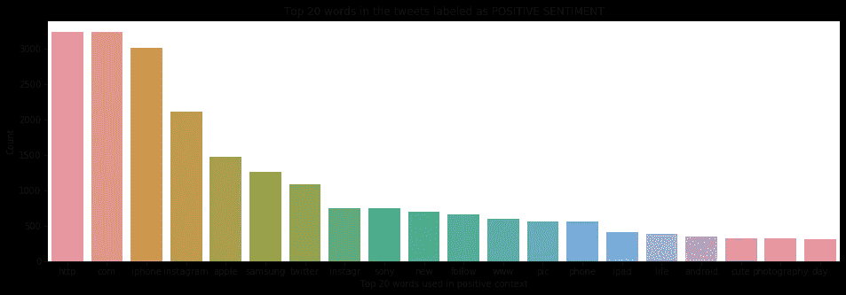

正面推文中的前 20 个词

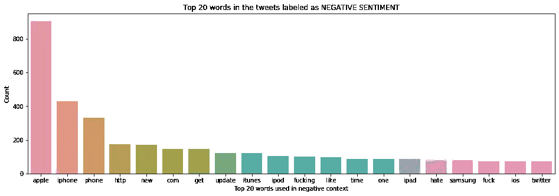

负面推文中的前 20 个词

让我们也看看正面和负面推文的词云。

```
#WordCloud for positive tweetswordcloud = WordCloud(width=800, height=500, random_state=21, max_font_size=110).generate(pos_sentiment_words)plt.figure(figsize=(10, 7))plt.imshow(wordcloud, interpolation=”bilinear”)plt.axis(‘off’)plt.title(‘Wordcloud for positive tweets’)plt.show()#wordcloud for negative tweetswordcloud = WordCloud(width=800, height=500, random_state=21, max_font_size=110).generate(neg_sentiment_words)plt.figure(figsize=(10, 7))plt.imshow(wordcloud, interpolation=”bilinear”)plt.axis(‘off’)plt.title(‘Wordcloud for negative tweets’)plt.show()
```

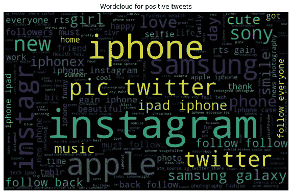

正面推文的 Wordcloud

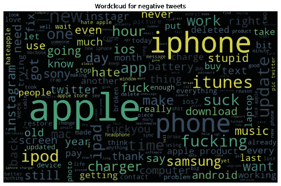

负面推文的 Wordcloud

从上面的柱状图和词云，我们可以看到负面推文中的一些词是 fuck，fucking，ipod，time 等，而正面推文中的一些词是 life，day，photography，sony，instagram 等。

# **建模**

现在，我们已经清理了我们的数据，并通过 WordClouds 获得了一个简要的视图，我们将为建模准备数据。文本数据的准备包括转换成机器学习模型可以理解的某种数字格式。计算机只理解数字数据，因此这是必要的。

通常，有多种方法可以将文本数据转换成数字形式，如 CountVectorizer、TfIdf 等。**计数矢量器**基于单词袋模型。它的工作原理是计算单词在每个文档中的出现频率(在本例中是每个 tweet)。

使用 **TfIdf(** 术语频率-逆文档频率)，数值随着单词计数的增加而增加，但会被相同单词在不同语料库中的出现所抵消。例如，如果有一个单词“apple”在一个文档中出现多次，并且在大约 80%的推文中出现，count vectorizer 将为 apple 提供一个高值，但 **TfIdf** 将具有一个可以忽略的值，因为它是在许多文档中出现的一个常见单词，因此不是一个用于分类文档(或这里的推文)的有用单词。

在这种情况下，我们将使用 **TfIdf。**

```
from sklearn.feature_extraction.text import TfidfVectorizertfidf_vectorizer = TfidfVectorizer(min_df = 2, max_df = .9, max_features = 1000, ngram_range = (1, 1))tfidf_fit = tfidf_vectorizer.fit(train[‘tweet’])tfidf = tfidf_fit.transform(train[‘tweet’])tfidf_test = tfidf_fit.transform(test[‘tweet’])
```

我们现在将使用 train_test_split 来创建新的训练和测试集，以获得最佳模型。然后，我们可以使用原始测试集上的最佳模型来获得 F1 分数。

```
X_train, X_test, y_train, y_test = train_test_split(tfidf, train[‘label’], random_state = 4, test_size = .3)#converting sparse matrices to np.arrayX_train = X_train.toarray()X_test = X_test.toarray()y_train = np.array(y_train).reshape(-1,1)y_test = np.array(y_test).reshape(-1,1)
```

现在，我们将尝试三个模型— **逻辑回归**(具有超参数调整)、支持向量机(SVM)和朴素贝叶斯分类器的**多项式 B** ，并寻找可用于我们测试集的最佳模型。

# **逻辑回归**

```
#Logistic Regression with GridSearchclf = LogisticRegression()# use a full grid over all parametersparam_grid = {“C”:np.logspace(-3,3,7), “penalty”:[“l1”,”l2"]}f1 = make_scorer(f1_score , average=’weighted’)# run grid searchgrid = GridSearchCV(clf, cv=5,scoring=f1, param_grid=param_grid)grid.fit(X_train, y_train)print(“Grid-Search with roc_auc”)print(“Best parameters:”, grid.best_params_)print(“Best cross-validation score (f1)): {:.3f}”.format(grid.best_score_))y_predict = grid.predict(X_test)print(‘The weighted F1 score with the best hyperparameters is ‘, end = ‘’)print(f1_score(y_test, y_predict, average=’weighted’))print (“Classification Report: “)print (classification_report(y_test, y_predict))
```

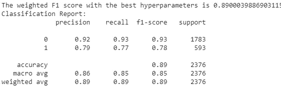

具有最佳超参数的逻辑回归的加权 F1 分数是 0.8900，这看起来非常好。

F1 分数:-

[](https://en.wikipedia.org/wiki/F1_score) [## F1 分数

### 在二进制分类的统计分析中，F 值(也称为 F 值或 F 度量)是测试准确性的度量。它…

en.wikipedia.org](https://en.wikipedia.org/wiki/F1_score) 

加权 F1 分数是标签“0”和标签“1”的 F1 分数的加权平均分数，我们可以从上面的分类报告中看到。现在，让我们检查 SVM 和朴素贝叶斯模型。

# **支持向量机**

```
# Classifier — Algorithm — Support Vector ClassifierSVM = SVC(C=1.0, kernel=’linear’, degree=3, gamma=’auto’)SVM.fit(X_train,y_train)# predict the labels on validation datasety_predict = SVM.predict(X_test)# Use accuracy_score function to get the accuracyprint(‘The weighted F1 score ‘, end = ‘’)print(f1_score(y_test, y_predict,average=’weighted’))print (“Classification Report: “)print (classification_report(y_test, y_predict))
```

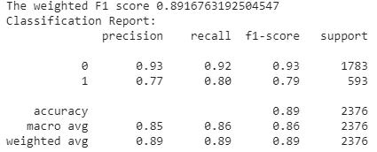

SVC 给我们的加权 F1 值是 0.8916，比逻辑回归好一点。

# **朴素贝叶斯分类器**

```
clf = MultinomialNB()# use a full grid over all parametersparam_grid = {‘alpha’:[0,1] }f1 = make_scorer(f1_score , average=’weighted’)# run grid searchgrid = GridSearchCV(clf, cv=5,scoring=f1, param_grid=param_grid)grid.fit(X_train, y_train)print(“Grid-Search with roc_auc”)print(“Best parameters:”, grid.best_params_)print(“Best cross-validation score (f1)): {:.3f}”.format(grid.best_score_))y_predict = grid.predict(X_test)print('The weighted F1 score with the best hyperparameters is ', end = '')print(f1_score(y_test, y_predict, average='weighted'))print ("Classification Report: ")print (classification_report(y_test, y_predict))
```

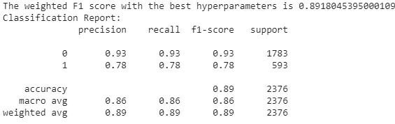

Naive-Bayes 模型为我们提供了三个模型中最好的加权 F1 分数。分数是 0.8918。一般来说，除了最佳得分之外，朴素贝叶斯分类器说话非常快，因此是计算高效的算法。

现在，我们已经获得了最佳模型，我们可以在预处理的测试数据上使用**模型来预测他们的情绪，该数据存储为 tfidf_test。**

```
tfidf_testsparse_test = tfidf_test#storing preprocessed test data into a arraytest_data = sparse_test.toarray()print(test_data.shape)#doing predictions using the best algorithm whicch was Naive Bayes in this casey_predict = grid.predict(test_data)
```

感谢您的阅读，让您的数据科学之旅更进一步。坚持学习，多看博客。

请在模型或博客上发布任何反馈或改进。