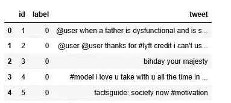
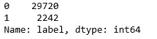
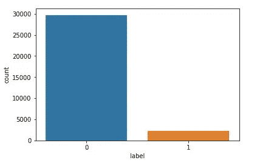
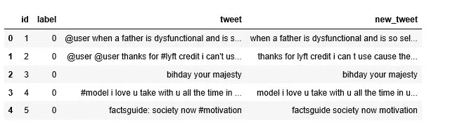
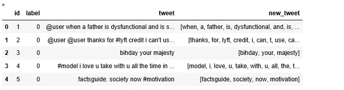
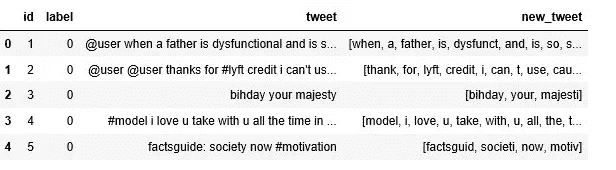
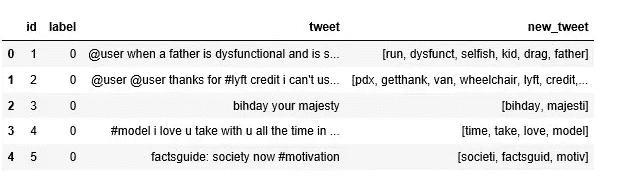
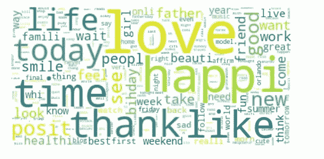
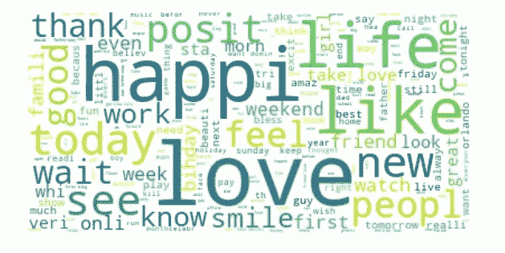
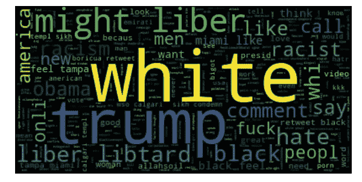

# 推特情感分析

> 原文：<https://medium.com/analytics-vidhya/twitter-sentiment-analysis-8ef90df6579c?source=collection_archive---------2----------------------->


在 [Unsplash](https://unsplash.com?utm_source=medium&utm_medium=referral) 上 [Merakist](https://unsplash.com/@merakist?utm_source=medium&utm_medium=referral) 拍摄的照片

***注:*** *你可以在这里* *全面访问我的 Python 代码* [*以及我在本帖中的全部分析。*](https://github.com/Shrneha/Twitter-sentiment-analysis.git)

**简介:**

情感分析或观点挖掘指的是自然语言处理(NLP)。它是分析文本的过程，以确定它们所承载的情感基调。换句话说，就是用来确定作者对某件事的态度。

情感分析的应用非常强大。它正被大多数组织广泛采用，以从社交媒体数据中提取洞察力。数据的情感分析可以帮助公司获得人们如何谈论他们的品牌和竞争对手的信息。它让公司更好地了解他们的受众，发现行业的新趋势。公司可以获得人们如何谈论他们品牌的信息，并据此做出决定。它有助于组织在没有任何中介的情况下与他们的受众建立联系。

**问题陈述:**

这项任务的目标是检测推文中的仇恨言论。为了简单起见，如果一条推文带有种族主义或性别歧视的情绪，我们就说这条推文包含仇恨言论。所以，任务是将种族主义或性别歧视的推文从其他推文中分类。

**执行自然语言处理的步骤:**

1.  数据清理(包括删除不必要的字符、标记化、词条化等)

2.数据可视化

3.一个热门编码(一袋单词)

4.分类

5.模型评估

那么，让我们开始分析吧。我们将在需要时导入库。

将数据导入 pandas 数据框架并浏览数据。

```
#load csv file
Train = pd.read_csv("train_E6oV3lV.csv")
data=Train
data.head()
```

输出:



在给定的推文样本中，正面推文被标记为“0”，而负面推文被标记为“1”。

一些观察结果:

1.  推文中有用户名，也有一些需要删除的特殊字符。
2.  推文是句子格式的。我们需要把它分解成单词。

探索标签在数据中的分布。

```
data['label'].value_counts()
```



我们可以看到有 29720 条推文被标记为正面，2242 条推文被标记为负面。

```
import seaborn as sns
ax=sns.countplot(data.label)
```



1.  **数据清理:**

a)从推特专栏删除推特用户名

Tweet 包含伪装成“@user”的 twitter 句柄。需要删除它，因为它对数据没有太大影响。我们将创建名为“new_tweet”的新列，在其中存储我们处理过的推文。

```
# removing usernames from tweet
data['new_tweet'] = data.tweet.str.replace('[@user](http://twitter.com/user)', '')
data.head()
```

b)删除标点、数字和特殊字符

和用户名一样，标点符号，特殊字符没有太大帮助。所以我们会把它们从推文中删除。也删除标签。

```
#Removing Punctuations, Numbers, and Special Characters
#[a-zA-Z] = Any single character in the range a-z or A-Z
# ^ = Start of line 
# $ = End of line
data[‘new_tweet’] = data[‘new_tweet’].str.replace(“[^a-zA-Z#]”, “ “)
data[‘new_tweet’] = data[‘new_tweet’].str.replace(“#”, “”)
data.head()
```

输出:



c)标记化

这是一种将文本拆分成标记的方法。这些记号可以是段落、句子或单词。在这种情况下，推文将被转换为单独的单词。所以进一步加工会变得更容易。

```
#tokenization
data[‘new_tweet’] = data[‘new_tweet’].apply(lambda x: x.split())
data.head()
```

输出:



标记化

d)词干化和词汇化:

词干化和词汇化是**自然语言处理**领域中的**文本规范化**技术，用于为进一步处理准备文本、单词和文档。例如

“跑，跑”将被“跑”取代

“am，is，are”将被单词“be”代替

```
#stemmer
from nltk.stem.snowball import SnowballStemmer
stemmer = SnowballStemmer(“english”)data[‘new_tweet’]= data[‘new_tweet’].apply(lambda x: [stemmer.stem(i) for i in x])
data.head()
```



我们可以看到使用词干分析器后单词是如何被缩减的。仍然有一些单词对分析没有太大的影响，比如“the”、“I”、“a”、“is”。这些被称为停用词。停用词是一个搜索引擎经常忽略的词。我们定义了一个名为“process”的函数来从数据中删除停用词。

```
from nltk.corpus import stopwords
from nltk.tokenize import word_tokenize
stopwords = nltk.corpus.stopwords.words(‘english’)import stringdef process(text):
    # Check characters to see if they are in punctuation
    nopunc = set(char for char in list(text) if char not in string.punctuation)
    # Join the characters to form the string.
    nopunc = " ".join(nopunc)
    # remove any stopwords if present
    return [word for word in nopunc.lower().split() if word.lower() not in stopwords]data['new_tweet'] = data['new_tweet'].apply(process)
```

输出:



大部分不必要的单词都被删除了。现在，我们将使用当前的标准化数据进行进一步处理。我们将创建一个单词云，描述整个数据集中最常见的单词。

**2。数据可视化**

```
from wordcloud import WordCloud
import matplotlib.pyplot as plt# get individual words
words = []
for line in data[‘new_tweet’]: 
 words.extend(line)

# create a word frequency dictionary
wordfreq = Counter(words)
# draw a Word Cloud with word frequencies
wordcloud = WordCloud(
 background_color=’white’,
 max_words=2000,
 stopwords=stopwords
 ).generate_from_frequencies(wordfreq)
plt.figure(figsize=(10,9))
plt.imshow(wordcloud, interpolation=’bilinear’)
plt.axis(“off”)
plt.show()
```

输出:



最常见单词的单词云

大部分的话似乎是中性的。它没有给出任何关于种族主义/性别歧视的推文的想法。因此，我们将进一步将它分叉，找出积极和消极的推文。

让我们看看，那些被标为正面的推文。

```
positive = [r for r in data['new_tweet'][data['label']==0]]
pos = ''.join(positive)# draw a Word Cloud with word frequencies
wordcloud = WordCloud(
    background_color='white',
    max_words=2000,
    stopwords=stopwords
   ).generate(pos)
plt.figure(figsize=(10,9))
plt.imshow(wordcloud, interpolation='bilinear')
plt.axis("off")
plt.show()
```

输出:



正面推文的文字云

现在，我们将创建带有负面推文的词云

```
negative = [r for r in data['new_tweet'][data['label']==1]]
neg = ''.join(negative)# draw a Word Cloud with word frequencies
wordcloud = WordCloud(
    background_color='black',
    max_words=2000,
    stopwords=stopwords
   ).generate(neg)
plt.figure(figsize=(10,9))
plt.imshow(wordcloud, interpolation='bilinear')
plt.axis("off")
plt.show()
```

输出:



带有负面推文的词云

**3。一个热编码(一袋字):**

[**词袋模型**](https://en.wikipedia.org/wiki/Bag-of-words_model) 是自然语言处理中使用的简化表示。在这个模型中，一个文本被表示为它的单词包，不考虑语法甚至词序，但保持多样性。

在这种情况下，我们简单地计算数据集中的每个单词。我们创建矩阵，其中每行代表数据集中的一个文档，每列代表 word。cell 的值是该单词在文档中的出现频率。

另一种流行的执行归一化的方法称为**词频—逆文档频率**或[TF-IDFT5。在这种加权方案中，术语计数首先被归一化为频率，然后除以文档数量。TfidfVectorizer 根据出现在&中的文档数量对每个术语计数进行加权，出现在许多文档中的术语权重较低。](https://en.wikipedia.org/wiki/Tf–idf)

我们将使用 **SciKit** Learn 的 **CountVectorizer** 函数，它将把一组文本文档转换成一个令牌计数矩阵。

```
#Split data into training and testing sets from sklearn.model_selection import train_test_splitx_train, x_test, y_train, y_test =     train_test_split(data["new_tweet"], 
      data["label"], test_size = 0.2, random_state = 42)from sklearn.feature_extraction.text import CountVectorizer, TfidfTransformercount_vect = CountVectorizer(stop_words='english')
transformer = TfidfTransformer(norm='l2',sublinear_tf=True)x_train_counts = count_vect.fit_transform(x_train)
x_train_tfidf = transformer.fit_transform(x_train_counts)
print(x_train_counts.shape)
print(x_train_tfidf.shape)
#Output :(25569, 27304) (25569, 27304)x_test_counts = count_vect.transform(x_test)
x_test_tfidf = transformer.transform(x_test_counts)
print(x_test_counts.shape)
print(x_test_tfidf.shape)
#Output : (6393, 27304) (6393, 27304)
```

这里我们已经完成了数据预处理。我们准备通过机器学习分类算法。

**5。型号评估**:

**随机森林分类器**

单个决策树可以学习相当复杂的函数。然而，在许多方面，它可能容易过度拟合。为了克服这一点，我们可以创建许多决策树，然后要求每棵树预测类值。我们可以采取多数投票，并用这个答案作为我们的总体预测。[随机森林](https://en.wikipedia.org/wiki/Random_forest)工作原理就是这样。总体过程中使用了一些参数:

*n_estimators* :这决定了应该建立多少棵决策树。值越大，运行时间越长，精度越高。

*oob_score* : 如果为真，则对不在为训练决策树而选择的随机子样本中的样本测试该方法。

*n_jobs* :指定并行训练决策树时使用的内核数量。

因此，让我们开始用随机森林分类器模型训练我们的数据。

```
from sklearn.ensemble import RandomForestClassifiermodel = RandomForestClassifier(n_estimators=200)
model.fit(x_train_tfidf,y_train)
predictions = model.predict(x_test_tfidf)#Confusion Matrix 
from sklearn.metrics import confusion_matrix,f1_score
confusion_matrix(y_test,predictions)#Output: array([[5898,   39],        
#               [ 207,  249]], dtype=int64)#f1-score
f1_score(y_test,predictions)
#Output : 0.6693548387096774#Accuracy_score
from sklearn.metrics import accuracy_score
accuracy_score(y_test,predictions)*100
# output:96.15204129516658
```

***评价:***

选择评估指标时，考虑评估指标无用的情况总是很重要的。在许多情况下，准确性是很好的评估标准，因为它计算简单，易于理解。然而，它很容易被伪造。换句话说，在许多情况下，您可以创建精确度高但实用性差的算法。

**f1 分数**是基于每个类定义的，并且基于两个概念:精确度*和召回率*。*精度*是被预测为属于实际来自该类特定类的所有样本的百分比。而*召回*是数据集中在该类中并且实际上被标记为属于该类的样本的百分比。

96%的情况下，模型对数据集中所有标签的预测都是正确的。因此，随机森林模型可用于评估目的。

***注:*** *您可以在这里* *全面访问我的 Python 代码* [*。*](https://github.com/Shrneha/Twitter-sentiment-analysis.git)