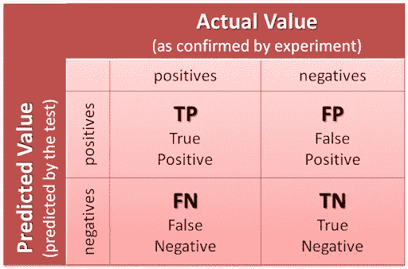
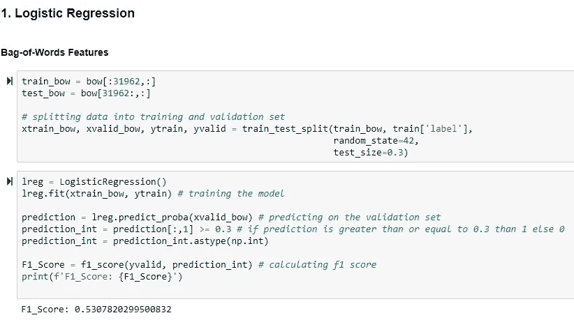
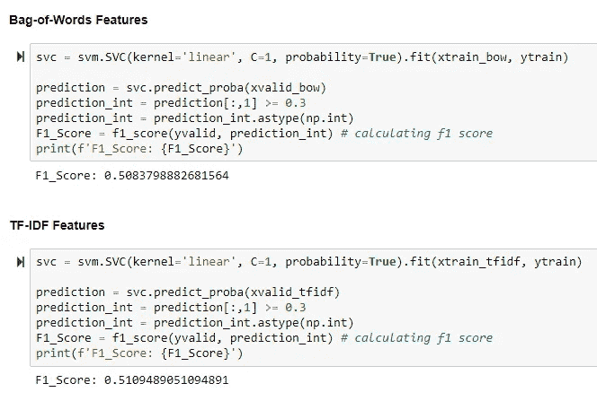

# 推特情感分析

> 原文：<https://medium.com/analytics-vidhya/twitter-sentiment-analysis-b9a12dbb2043?source=collection_archive---------3----------------------->

> 使用**自然语言处理**理解人们的情绪

## 介绍

**Twitter** 是人们在各种场合广泛使用的表达观点和展示情感的平台之一。**情感分析**是一种分析数据并检索其所体现的情感的方法。

tweet 格式非常小，这产生了一个全新的问题，比如俚语、缩写等的使用。本文报告了对数据的探索和预处理，将数据转换为适当的输入格式，并通过使用 Python 和 NLTK 库建立监督学习模型，将用户通过 tweets 的观点分类为 ***积极(非种族主义者)和消极(种族主义者)*** 。

## 先决条件

假定对 **scikit** 库和 **NLTK** 有实际操作知识。我只是在开玩笑，你只需要对学习 NLP 和 Python 基础有强烈的热情，但是你必须对分类算法有很好的了解，因为一旦我们完成 NLTK 部分，这将派上用场。

作为先决条件，请确保您的计算机上安装了 [Jupyter Notebook](https://jupyter.readthedocs.io/en/latest/install.html?source=post_page---------------------------) 和 P [ython](https://www.python.org/downloads/?source=post_page---------------------------) 。代码片段只能在 Jupyter 笔记本上运行。

好吧，我们开始吧。

**下载安装 NLTK**

1.  安装 NLTK:运行`pip install nltk`
2.  测试安装:运行`python`，然后键入`import nltk`

有关特定平台的说明，请在此处阅读。

我想保持这篇文章的准确性，并在需要时触及重要的理论概念。你可以在这里下载数据集和原始笔记本。

## 快速工作流程:

## 查看数据集

让我们看看我们的训练和测试数据中的推文有多长

## 预处理

文本数据的主要问题是它们都是文本格式(字符串)。然而，机器学习算法需要某种数字特征向量来执行任务。基本的**文本预处理**包括:

## 标记化

它只是一个术语，用于描述将普通文本字符串转换为一系列标记(即我们实际需要的单词)的过程。句子分词器可以用来查找句子列表，单词分词器可以用来查找字符串中的单词列表。

## 堵塞物

词干化是将屈折词(或有时是派生词)缩减为词干、词根或词根形式的过程，通常是书面形式。例如，如果我们要对以下单词进行词干处理:“词干”、“词干化”、“词干化”和“词干化”，结果将是一个单词“stem”。

## 转换

将整洁的推文添加回我们的主(合并)数据框

现在，我想看看给定的情感在训练数据集中的分布情况。完成这项任务的一种方法是通过绘制单词云来理解常用单词。

单词云是由单词组合而成的图像，看起来像一个云状。云突出了在源文本中出现频率更高的单词。您可以使用不同的字体、布局和配色方案来调整您的云。

## 从干净的推文中提取特征

> **词汇袋**

词袋模型是自然语言处理和信息检索中使用的一种简化表示。在这个模型中，一个文本(比如一个句子或者一个文档)被表示为它的单词的包(多重集),不考虑语法甚至词序，但是保持多样性

## TF-IDF

***TF-IDF*** 代表词频——逆文档频率:在大型文本语料库中，有些词出现频率很高，但有意义的信息很少。如果我们直接使用计数数据来训练模型，则意义不大的非常频繁的标记将对低频但有趣得多的术语产生显著影响。所以有必要对字数统计结果进行归一化和重新加权。

***Word2vec*** 是处理文本的两层神经网络。它的输入是一个文本语料库，输出是一组向量

Word2vec 的向量是如何创建的？
我创建了一个函数，通过对推文中出现的单词的向量取平均值，为每条推文创建一个向量。

为了实现 Doc2vec，我们必须用唯一的 id 标记每个标记化的 tweet。我们可以通过使用 Gensim 的 LabeledSentence 函数来做到这一点。Doc2vec 是一个将文档表示为向量的 NLP 工具。

## 分类和评估

现在我们已经准备好了数据的预建模阶段，是时候在我准备好数据的部分对它们进行分类了，这些数据是词袋、TF-IDF、word2vec 向量和 doc2vec 向量。我知道你很高兴通过实现你总是听说的不同的机器学习模型来弄脏你的手和头脑。让我带你们一个接一个地看这些算法。请注意，我不会深入每个细节，但足以理解这些算法如何以及为什么对我们的情感分析有帮助。我已经实现了以下算法。

1.  逻辑回归
2.  朴素贝叶斯
3.  支持向量机
4.  随机森林
5.  XGBoost

但是仅仅建立算法是不够的。我们需要根据一些标准来评估我们的算法。因此，我认为衡量已实现模型性能的标准是混淆矩阵、准确性、AUC(曲线下面积)和 F1 分数。

**混淆矩阵** 它是一种机器学习分类问题的性能度量，其中输出可以是两个或更多个类。这是一个包含 4 种不同的预测值和实际值组合的表格，为我们提供了一个矩阵作为输出，并描述了模型的完整性能。下面是混淆矩阵中涉及的术语。

混淆矩阵

**真阳性:**

解读:你预测的是正的，这是真的。

你预测推特是种族主义的，推特确实是。

**真否定:**

解读:你预测的是负数，这是真的。

你预言推特不是种族主义的，推特实际上不是。

**假阳性:(1 型错误)**

解读:你预测的是正的，是假的。

你预测推特是种族主义的，但推特实际上不是。

**假阴性:(2 型错误)**

解读:你预测的是负数，这是假的。

你预测推特不是种族主义，但推特确实是。

**准确性** 由于我们正在研究对推文进行分类的分类问题(种族主义者&非种族主义者)分类准确性将是模型的一个很好的评估者。这是评估机器学习模型表现如何的最常用指标。准确度是做出正确预测的数量与做出的预测总数的比率。

准确度= (TP + TN)/(样本总数)

**曲线下面积**

曲线下面积(AUC)是最广泛使用的评估指标之一。它用于二进制分类问题。分类器的 AUC 等于分类器将随机选择的正例排序高于随机选择的负例的概率。

假阳性率和真阳性率都具有在范围[0，1]内的值。AUC 是在[0，1]内不同点的假阳性率对真阳性率的曲线下面积。

ROC 曲线下的面积通常用作分类模型质量的度量。随机分类器的曲线下面积为 0.5，而完美分类器的 AUC 等于 1。实际上，大多数分类模型的 AUC 在 0.5 到 1 之间

显然，AUC 的范围是[0，1]。值越大，我们模型的性能越好。

当分类器不能区分两组时，面积将等于 0.5(ROC 曲线将与对角线重合)。当两组完全分离时，即分布没有重叠，ROC 曲线下的面积达到 1(ROC 曲线将达到左上角)

**F1 得分**

F1 分数是精确度和召回率之间的调和平均值。F1 分数的范围是[0，1]。它告诉您您的分类器有多精确(它正确分类了多少个实例)，以及它有多健壮(它不会遗漏大量实例)。高精度但低召回，给你一个非常准确的，但它错过了大量的实例，难以分类。F1 分数越大，我们模型的性能越好。数学上，它可以表示为:

F1 评分试图在精确度和召回率之间找到平衡。

精度:它是正确的阳性结果数除以分类器预测的阳性结果数。

召回:正确阳性结果的数量除以所有相关样本的数量(所有应被鉴定为阳性的样本)。

恭喜你，你已经走了这么远。给自己一个鼓励。

在我开始讲模型之前，让我提醒你，这些模型是统计模型，但我不会去探究背后的数学。我将把这留给你去深入研究和理解它背后的数学。

**逻辑回归** 逻辑回归是一种分类算法，可以帮助我们预测给定的推文是否是种族主义的。[逻辑回归](https://en.wikipedia.org/wiki/Logistic_regression)预测截然不同。我们还可以查看模型分类下的概率得分。

逻辑回归

逻辑回归使用逻辑 sigmoid 函数转换其输出，以返回一个概率值，然后可以将该概率值映射到两个或多个离散类。有 3 种类型的逻辑回归。二进制、多进制和序数。这是逻辑回归的度量评估。

度量评估

**朴素贝叶斯**

朴素贝叶斯是一种基于[贝叶斯定理](https://en.wikipedia.org/wiki/Bayes%27_theorem)的分类技术，假设预测器之间是独立的。贝叶斯定理提供了一种方式，其中一个方程是描述统计量的条件概率的关系。在贝叶斯分类中，我们感兴趣的是在给定一些观察到的特征的情况下找到标签的概率。

朴素贝叶斯模型实现

有三种类型的朴素贝叶斯模型。高斯、多项式和伯努利。高斯基本上用于分类问题，而多项式用于获得不同的计数。如果特征向量是二进制的，则使用伯努利。

朴素贝叶斯度量评估

Bernoulli 在具有单词袋模型的文本分类中是有效的，其中 1 和 0 是“单词出现在文档中”和“单词不出现在文档中”。

**支持向量机**

[SVM](https://en.wikipedia.org/wiki/Support-vector_machine) 是一种用于分类和回归问题的监督机器学习算法。在 SVM，我们通过寻找能很好地区分两类的超平面来进行分类。内核技巧技术用于转换数据，然后根据数据在可能的输出之间找到最佳边界。

可以使用超参数(如核、正则化、伽玛和余量)来优化 SVM。

SVM 在清晰的分离边缘和高维空间中表现得非常好

**随机森林**

[随机森林](https://en.wikipedia.org/wiki/Random_forest)是一种监督学习算法。它既可以用于分类，也可以用于回归。这也是最灵活和最容易使用的算法。森林是由树木组成的。据说树越多，森林就越健壮。随机森林在随机选择的数据样本上创建决策树，从每棵树中获得一个预测，并通过投票的方式选择最佳解决方案。它还提供了一个很好的特性重要性指标。

选择随机种子，其从训练数据集中随机抽取样本集合，同时保持类别分布。使用这个选定的数据集，可以根据用户定义的值从原始数据集中随机选择一组属性。由于巨大的计算量和很高的过拟合几率，所有的输入变量都不会被考虑。

在许多情况下，与简单的 CART/CHAID 或回归模型相比，随机森林给出了更准确的预测。这是因为它同时捕获几个输入变量的方差，并使大量的观察值参与预测。

**XGBoost**

有 4 个增强机器学习算法
1。
梯度推进机(GBM)2。极限梯度助推机( [XGBM](https://en.wikipedia.org/wiki/Gradient_boosting) )
3。LightGBM
4。CatBoost

Boosting 就是这样一种使用集成学习概念的技术。boosting 算法结合多个简单模型来生成最终输出。XGBoost 的工作流程是将多个决策树的预测结合起来。梯度推进机器中的所有弱学习器都是决策树。XGBoost 中的树是按顺序构建的，试图纠正前面树的错误。

XGBoost 在节点级实现并行预处理，这使得它比 GBM 更快。使用正则化技术 XGBoost 可以防止过度拟合，并提高整体性能。

由于 XGBoost 是最好的机器学习模型之一，我们在处理超参数时需要小心。我们将按照下面的步骤来调整参数。

1.  选择相对较高的学习率。通常，在这个阶段使用 0.3 的学习率。
2.  调整特定于树的参数，如 max_depth、min_child_weight、subsample、colsample_bytree，保持学习速率固定。
3.  调整学习速度。
4.  最后，调整 gamma 以避免过度拟合。

从上面的综合分析中，我们能够理解，相对于应用于我们模型的其他机器学习算法，XGBoost 模型与我们的数据一起工作得非常好，提高了 f1 分数和准确性。

# 结论

在这个项目中，我们使用多个训练模型来进行预测，并试图在我们的数据集上找到最合适的模型。在这个过程中，我们学习了 NLTK 和 sci-kit-learn 库中有用且易于使用的分析步骤和训练模型。使用不同的矢量器、TFIDF 和计数矢量器，它将生成不同的结果。例如，我们可以通过 TFIDF 去除非常低或非常高频率的单词来改进模型。它将使预测模型过滤异常值，提高模型的准确性。

对 Logistic 回归、SVM、Random Forest、XGBoost 等模型对提取的各种特征进行评价，分别是词袋、Word2Vec、Doc2Vec 和 TF_IDF。考虑到 F1 分数的评估指标，我们性能最好的模型是 XGBoost，它对 Word2Vec 特性应用了经过调整的参数，F1 分数为 0.66。

就这样，我们在这个项目中学到了很多细节，涵盖了 NLP 和统计建模的主题。这里有一个[小测验](https://www.proprofs.com/quiz-school/story.php?title=mjcynzi3nwanez)来测试你自己通过这个博客学到了多少。希望你真的喜欢看这个博客。如果你喜欢这个博客，请给一些掌声，并与那些渴望获得一些伟大知识的人分享。