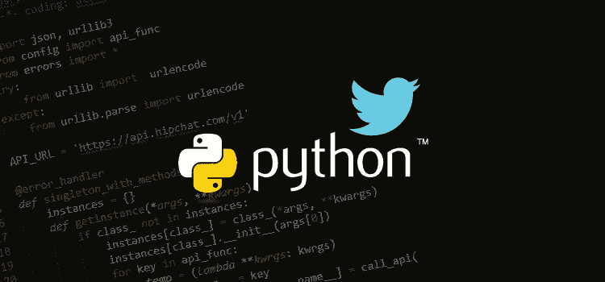
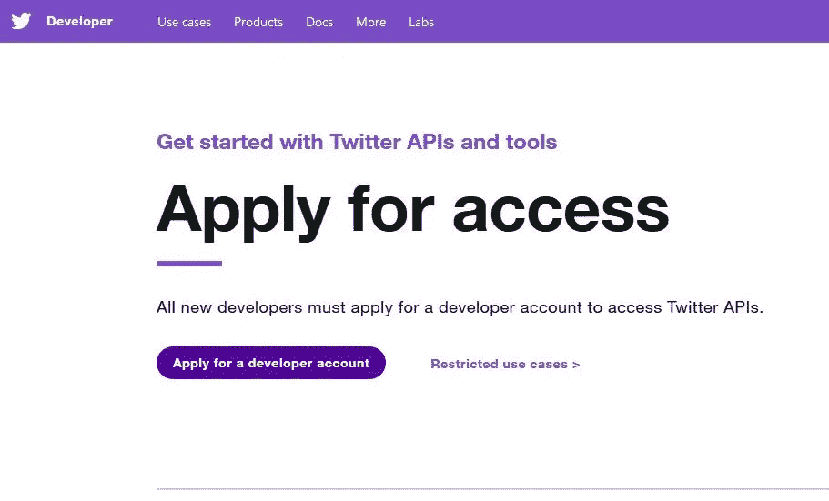
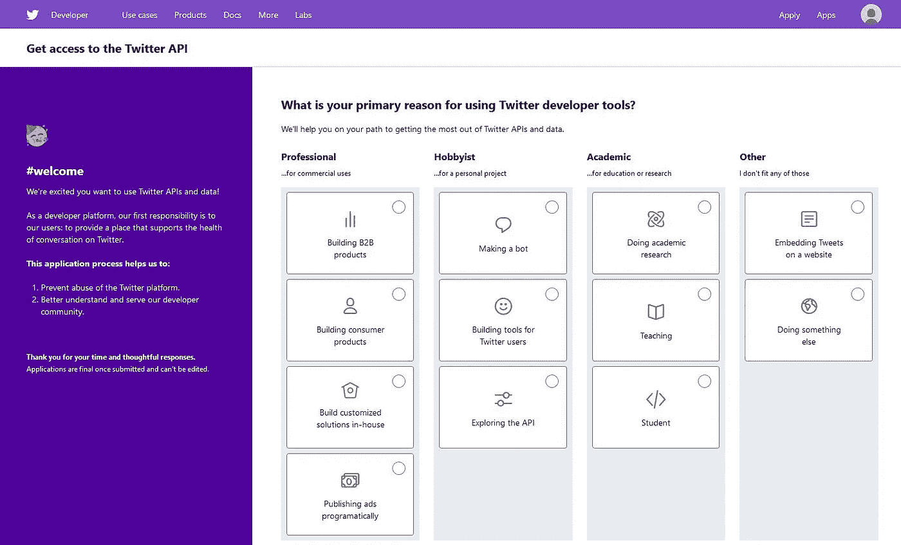
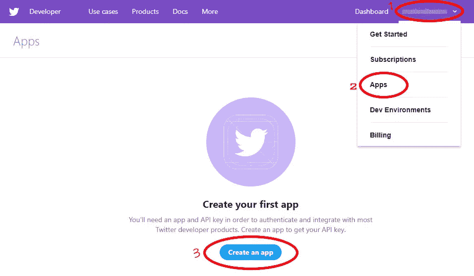
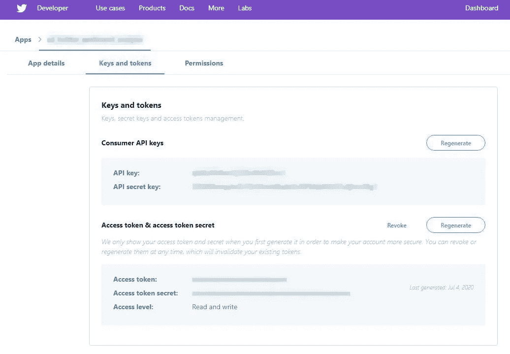
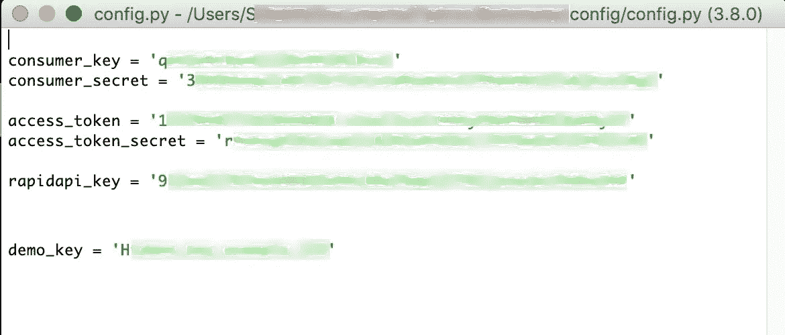

# Twitter 情感分析和 Botometer —第 1 部分:Twitter API

> 原文：<https://medium.com/analytics-vidhya/twitter-sentiment-analysis-botometer-part-1-twitter-api-b7604f7af4e9?source=collection_archive---------27----------------------->



这一次，我选择做一个专注于我全新的 Twitter API(应用程序编程接口)的项目。经过一番思考，我决定对一些推文做一个简单的情感分析，并对推文进行正面或负面分类。情感分析是在一段文字被评定为积极、消极或中性的情感(意见或观点)之后，给该文字赋值的自动化过程。我还想到了另一个项目，并决定将两者结合起来，并添加 Botometer，因为它们都使用 Twitter 的 API。Botometer 是一个软件包，可以在阈值上评估特定 Twitter 用户是机器人还是人类的可能性。但是在这篇博客中，我将讨论如何获得 Twitter API 的密钥和令牌。

首先，为了更进一步，我们需要自己的 twitter 帐户，以获得 twitter 的 API 证书。

# **创建一个 Twitter 开发者账户**

一旦你有了一个 twitter 账户，下一步就是在这里创建一个 Twitter 开发者账户[。](https://developer.twitter.com/en/apply-for-access)



按照屏幕上的步骤完成您的 twitter 开发者帐户。



我选择了学生，但任何选项都可以

# **创建一个 Twitter 应用**

在您的开发人员帐户被审查和批准后，您需要向 Twitter 注册您的应用程序以获得密钥和令牌。twitter 密钥和令牌允许您使用 Twitter API 从 Python 程序访问您的 Twitter 帐户。



1-单击您姓名旁边的箭头，下拉菜单。双击应用程序。3-点击创建应用程序

完成后，您将获得新的 **Twitter** API **密钥和令牌**。



我自然模糊了我的证件

# 隐私

请注意，这些密钥和令牌是您独有的，并且与您的帐户相关联。为了避免不必要的麻烦，一个很好的做法是将您的 Twitter 凭证存储在一个定制的 python 中。py)文件；以及任何其他敏感的 api 信息。这使我们能够调用文件，并从本质上隐藏你的信息，在你的笔记本上，从其他人看你的代码。

有许多方法可以制作一个定制的 python 文件，但我知道的最简单的方法是制作一个新的文本文件，并复制你的机密信息。剩下要做的就是重命名。txt 文件保存为. py 文件。

我的 API 配置 python 文件的一个例子:



确保用引号将值括起来

现在，在您的笔记本中，您可以运行。py 文件和变量可以完全匿名地调用。

```
%run config/config.pydemo_key>>> Hidden demo example key
```

如果你在 Github 这样的平台上分享这个文件，请确保也在那里隐藏你的自定义 python 文件。

这就是第 1 部分的内容，这是情感分析和 Botometer 实现的设置。希望你喜欢这篇文章，并且至少学到了一件新东西。希望能在下一期上看到你。

我希望你喜欢这个博客，如果你有空的话，可以给我一个或十个掌声。👏

注意安全。

PS。抱歉，我忘了把第二部分链接到这个帖子上…呼。我想迟做总比不做好。享受吧。

# [Twitter 情绪分析& Botometer —第二部分](/analytics-vidhya/twitter-sentiment-analysis-botometer-part-2-aecdbbbada30)

[https://medium . com/analytics-vid hya/Twitter-情操-分析-botometer-part-2-aecdbbada 30？source=your_stories_page -](/analytics-vidhya/twitter-sentiment-analysis-botometer-part-2-aecdbbbada30?source=your_stories_page-------------------------------------)