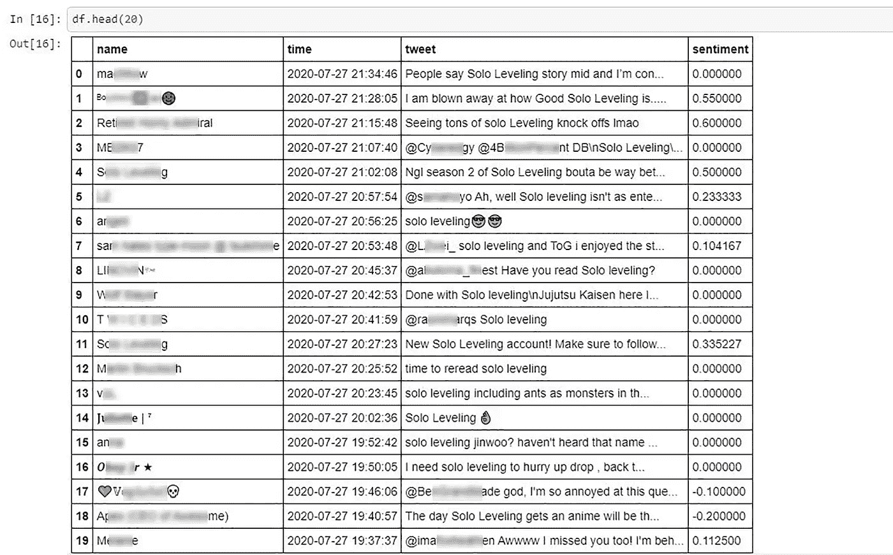

# Twitter 情绪分析和 Botometer——第二部分

> 原文：<https://medium.com/analytics-vidhya/twitter-sentiment-analysis-botometer-part-2-aecdbbbada30?source=collection_archive---------11----------------------->


这是我的 Twitter 情绪分析和 Botometer 项目博客的第二部分。在这里，我将解释我用来对推文进行简单情感分析的过程(分类推文是正面还是负面)。

简单回顾一下，情感分析是给文本分配一个数值的过程，其中段落在情感(观点或看法)上被评定为积极、消极或中立。作为奖励，我还使用 Twitter 的 API，使用 Botometer 来执行 Twitter 用户僵尸检测。Botometer 是一个软件包，可以在某个阈值上评估特定 Twitter 用户是机器人还是人类的可能性。

关于获取 Twitter API(应用程序编程接口)凭证的第 1 部分可以在这里找到:

[https://medium . com/@ sdman 135/Twitter-情操-分析-botometer-part-1-Twitter-API-b 7604 f 7 af 4 e 9](/@sdman135/twitter-sentiment-analysis-botometer-part-1-twitter-api-b7604f7af4e9)

好了，有了我的定制 python 文件(config.py)和 Twitter API 证书，我可以开始使用 python 库' **Tweepy** '拉推了。但是首先我们需要运行定制的 python 文件来加载隐藏变量。

```
*# Running file with my hidden Twitter API info*
%run config/config.py
```

# 十二岁

Tweepy 是一个开源的 python 库，托管在 [GitHub](https://github.com/tweepy/tweepy) 上，使 Python 能够与 Twitter 通信，通过使用其 API 来完成多种不同的操作。Tweepy 还可以帮助制作一个 Twitter 机器人，并自动执行一些操作，如发布推文、喜欢推文或关注某人。但是对于这个项目，我主要是用它来收集推文来进行我的分析。

我使用 OAuthHandler 实例向 twitter 认证，传递我的消费者 API 密钥和访问令牌

```
auth = tweepy.OAuthHandler(consumer_key, consumer_secret)
auth.set_access_token(access_token,access_token_secret)api = tweepy.API(auth)
```

API 类提供了对整个 twitter RESTful API 方法的访问。每个方法都可以接受各种参数并返回响应。

## 拉推文

写了一个函数，用 tweepy 的 api 调用，用一个‘关键字’拉推文；并将提取的推文作为熊猫数据帧返回。调用 tweepy 我专注于拉 10，000 条推文，前提是推文是英文的，并且推文不能是转发(原创推文)。如果他们遵循这些标准，该函数将以字符串格式 提取推文 的 ***用户名、推文*** 的 ***日期时间以及最后的 ***实际推文。还有几个属性我可以拉，但对于这个项目，我只关注这 3 个。拉完推文后，它们被保存到熊猫的数据框中。******

```
**def** get_related_tweets(key_word):

    twitter_users = []
    tweet_time = []
    tweet_string = [] 

    **for** tweet **in** tweepy.Cursor(api.search,q=key_word, count=1000).items(10000):
            *# Using orginal tweets not retweets*
            **if** (**not** tweet.retweeted) **and** ('RT @' **not** **in** tweet.text):
                *# Only using english tweets*
                **if** tweet.lang == "en":
                    *# Tweeter's username* 
                    twitter_users.append(tweet.user.name)
                    *# Date and Time tweet was created*
                    tweet_time.append(tweet.created_at)
                    *# Actual tweet*
                    tweet_string.append(tweet.text)
                    print([tweet.user.name,tweet.created_at,tweet.text])
    *# Creating dataframe with desired info*
    df = pd.DataFrame({'name':twitter_users, 'time': tweet_time, 'tweet': tweet_string})

    **return** df
```

我在两个话题上各发了 1 万条推文。先是唐纳德·特朗普(Donald Trump)，然后是我喜欢的一部韩国漫画(Manhwa)(但它现在处于暂停状态)“单人练级”。如果你正在寻找一部精彩的动作片，强烈推荐这本书。

```
#pulling tweets that mentions 'Trump'
get_related_tweets('Trump')#pulling tweets that mentions 'Solo Leveling'
get_related_tweets('Solo Leveling')
```


使用关键字= 'Trump '提取的内容示例

# 推特上的情感分析:

对于情感分析，我使用了一个非常轻量级的 python 包( **TextBlob** )，它将为我提供一个漂亮而简单的情感极性分数。极性得分是一个浮动值，范围从-1 到+1(分别为 100%负面情绪到 100%正面情绪)。


特定推文的情感分析值示例(显示这是一条稍微负面的推文)

为了更容易调用，我将情感极性包装在一个函数中。


使用函数的特定推文的情感分析值示例(显示这是一条正面推文)

接下来，我使用一个简单的 lambda 函数对整个数据帧执行情感极性函数。


不得不审查用户的屏幕名称



带有情感极性得分的干净数据帧的示例(单平韩文 Manhwa)

*   最后，我将情感极性得分按积极/消极进行分类，并显示每个得分。


关于总统的正反推文数量非常接近

# Botometer

最后，我用 Twitter 的 Api 对一些用户运行了 Botometer。Botometer 分析用户是机器人还是人类。阈值分数小于 0.5，Botometer 预测用户最有可能被人类控制。

首先，我用类似 Tweepy 的 Twitter API 证书认证了 Botometer。我还需要一把 rapidapi 钥匙，用于在这里找到的。

```
twitter_app_auth = {
                    'consumer_key': consumer_key,
                    'consumer_secret': consumer_secret,
                    'access_token': access_token,
                    'access_token_secret': access_token_secret
                   }
botometer_api_url = "https://botometer-pro.p.rapidapi.com"

bom = Botometer(
                wait_on_ratelimit = **True**,
                botometer_api_url=botometer_api_url,
                rapidapi_key = rapidapi_key,
                **twitter_app_auth)
```

响应对象有五个主要部分:

*   **用户**正是来自请求的用户对象。我们将它原封不动地返还给您，并牢记异步工作流，这样您就不必担心保存用户数据并在以后将其与适当的响应相匹配。
*   **分数**包含总体分类结果。*英语*评分使用所有六个类别的特征，而*通用*评分省略了情感和内容特征，两者都是英语特有的。
*   **类别**给出了六个要素类的子分数。
*   **CAP** 完全自动化概率(CAP)是根据我们的模型，这个账户完全自动化的概率，即一个机器人。这种概率计算使用贝叶斯定理来考虑对机器人总体流行程度的估计，以便平衡误报和漏报。
*   **显示分数**基本上是对应的原始分数乘以 5。显示分数显示在[https://botometer.iuni.iu.edu/](https://botometer.iuni.iu.edu/)上。

接下来我用一行代码检查了几个使用 Botometer 的用户。


样本显示，根据 Botometer，用户(评分= 0.032)最有可能是人类。


示例显示用户(评分= 0.892)最有可能是基于僵尸工具的僵尸工具。

希望你喜欢我的过程。并继续关注更多项目。

注意安全。