# 用 Orange + Vader + Power BI 进行 Twitter 情感分析(第 1 部分)

> 原文：<https://medium.com/analytics-vidhya/twitter-sentiment-analysis-with-orange-vader-powerbi-part-1-184b693b9d70?source=collection_archive---------4----------------------->

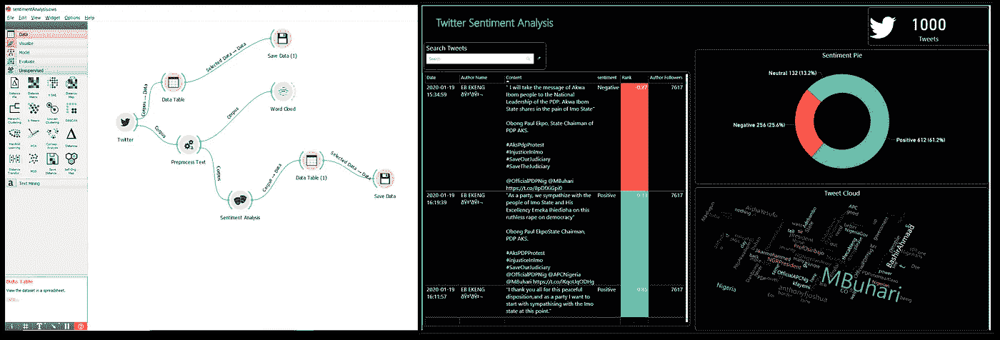

自然语言处理(NLP)是目前数据科学研究的核心，NLP 最常见的应用之一是情感分析。情感分析也被称为“观点挖掘”或“情感人工智能”，是确定一篇文章是积极、消极还是中性的过程。

> 从民意调查到制定营销和公共政策战略，情绪分析已经完全重塑了企业和治理的工作方式，这就是为什么它是每个人(无论是技术人员还是非技术人员)都必须熟悉的领域。

在本文中，我们将学习如何使用 Orange3 文本挖掘、Vader 和微软 Power BI 对 twitter 数据进行情感分析。Orange3 将用于从 Twitter 上传输推文，Vader 将用于情绪分析，Power BI 将用于创建情绪分析仪表板。除了 twitter 数据，从本教程中获得的知识可以用于对任何文本数据(调查、投票等)进行情感分析。)

有两种方法可以进行情感分析。

1.基于词典的方法
2。基于机器学习的方法。

我们将使用 VADER (Valence Aware 词典和情感推理器)，这是一个基于词典和规则的情感分析工具，专门针对社交媒体中表达的情感。

## 让我们现在就构建解决方案吧！

## 步骤 1:获取 Twitter API 凭证

要访问开发者帐户，您需要有一个 twitter 帐户。要访问 Twitter API，你需要在 http://apps.twitter.com 的 T2 注册一个应用程序。在右上角，点击*应用*按钮，创建一个应用，应用然后继续。接下来，我们将选择“我请求访问供我个人使用”选项:

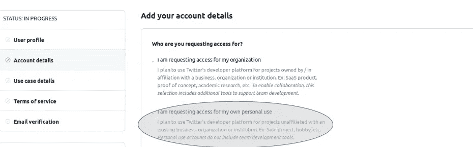

在同一个网页上，向下滚动一点，输入您的帐户名称和国家/地区，然后单击继续，您将被重定向到下一个网页。在这里，您可以选择任何您感兴趣的用例。对于我们的案例，我选择了以下内容:

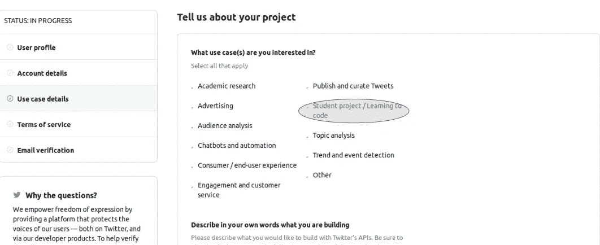

做出选择后，向下滚动并填写所需的用例兴趣段落。本教程是为了学习，所以请确保您强调应用程序是一个自学/学术相关的项目。政府参与问题选择“否”，按“继续”。在下一个网页上，阅读条款和条件列表，同意他们，然后提交申请。现在，你必须等待 twitter 验证你的开发者账户。

当您收到批准电子邮件时，单击其中包含的登录链接。您将被重定向到以下网页，在这里您应该选择“创建应用程序”。

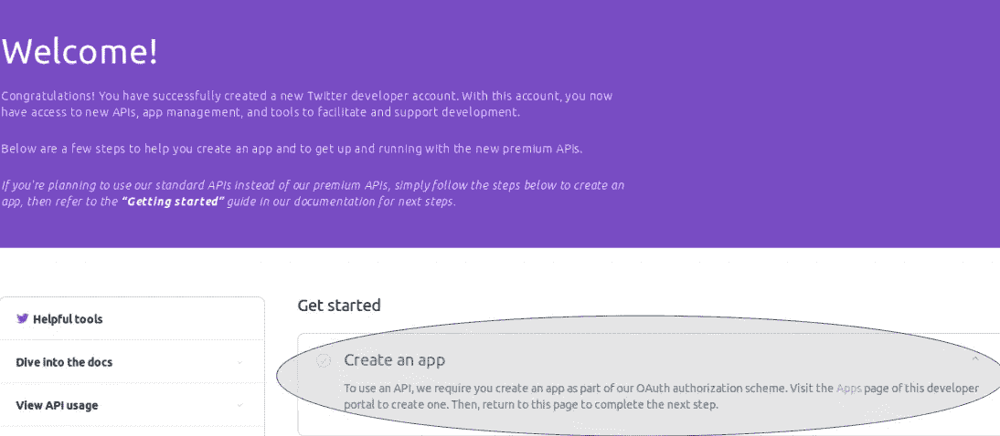

在下一个网页上，点击右上角的“创建应用程序”。重定向后，填写所需的应用程序详细信息，包括——如果你愿意——这是为了自学。点击“创建”。

下一个网页将包括您刚才输入的应用程序详细信息、访问令牌和权限。进入“密钥和令牌”选项卡。将 API 密匙和 API 秘密密匙复制到一个安全的地方(如果你愿意的话，可以是一个文本文件)，因为我们稍后会用到它们。我们已经完成了凭证获取部分！

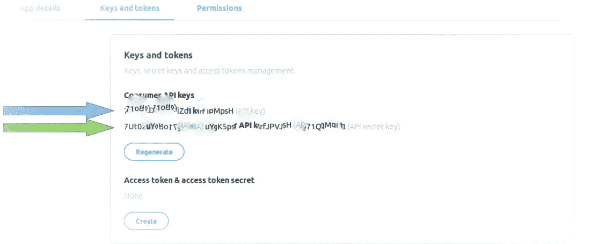

## 步骤 2:下载并安装 Orange3 文本挖掘

如果您的计算机上已经安装了 Anaconda，您可以从 Anaconda Navigator 安装 orange3。

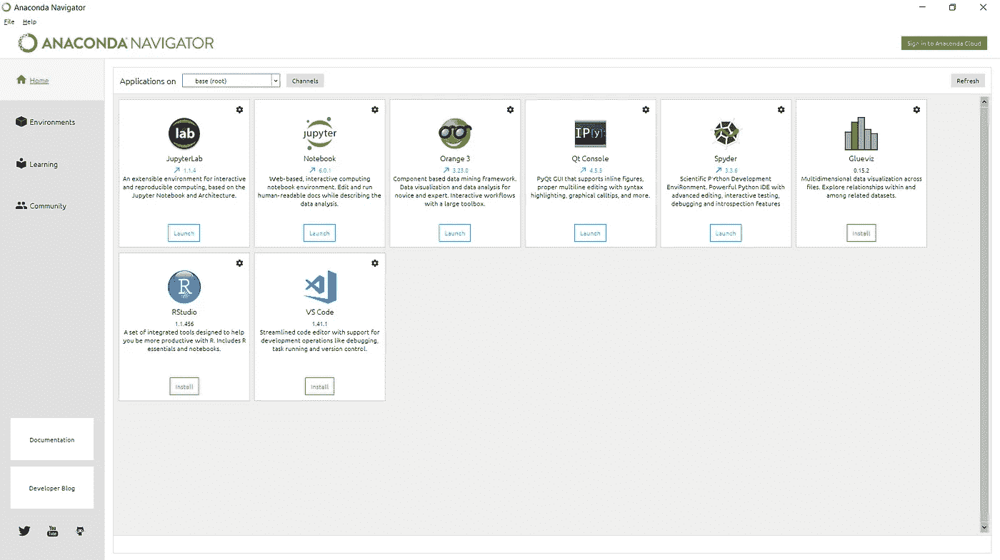

另一方面，Orange3 可以从这里下载:[https://orange.biolab.si/download/#windows](https://orange.biolab.si/download/#windows)windows 用户；【https://orange.biolab.si/download/#macos】T2 面向 mac 用户；【https://orange.biolab.si/download/#linux】Linux 版

现在你已经下载了 Orange3，继续安装吧。

## 第三步:Orange3 + Vader 用于 Twitter 流和情感分析

现在您已经安装了 Orange3，打开应用程序:

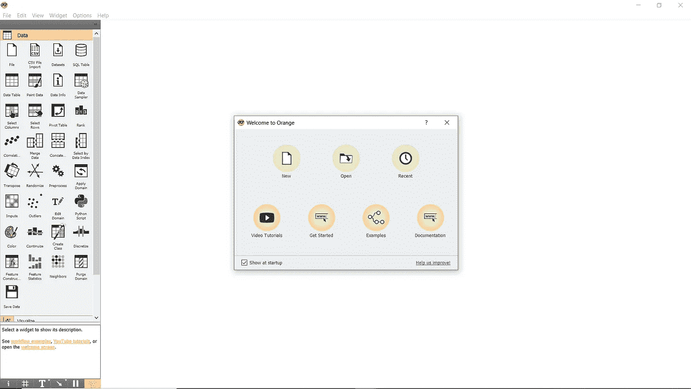

这是 Orange3 的欢迎页面

单击“新建”启动空白画布。Orange3 为数据预处理、可视化、统计建模和机器学习提供了很多分析功能。可以通过链接在他们的 YouTube 频道观看更多教程视频:[https://www . YouTube . com/channel/uclkkwbe 2s caeyv 7 znghie4g/videos](https://www.youtube.com/channel/UClKKWBe2SCAEyv7ZNGhIe4g/videos)

默认情况下，Orange3 不提供文本分析，因此，我们需要安装 Orange-Text 插件。要安装，请单击主页功能区上的“选项”，然后选择“附加组件…”。检查橙色文本 3，然后单击确定；等待附加组件安装。

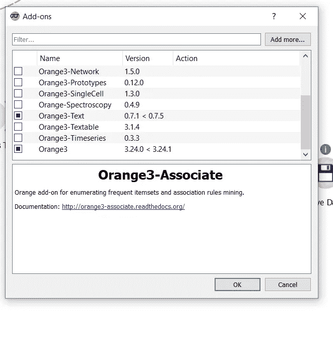

橙色 3 附加窗口

现在您已经安装了文本附加组件，让我们构建流吧！

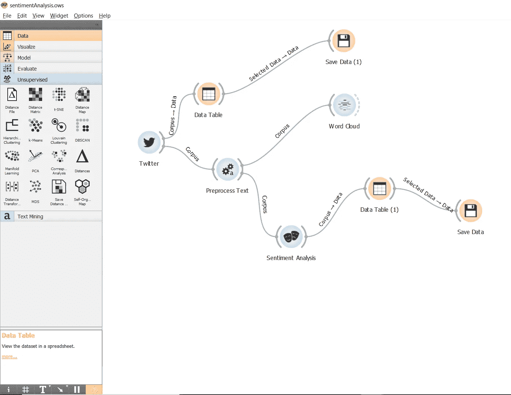

这是我们将要建立的流程

按照以下步骤构建 Orange3 情感分析流程:

1.  Twitter 小部件:展开左侧面板上的*文本挖掘*下拉列表；将“Twitter”小部件拖放到画布上。
2.  数据表:展开左侧面板上的*数据*下拉菜单；将“数据表”小部件拖放到画布上。通过将“Twitter”小部件的虚线弧的任何部分拖动到“数据表”小部件，将“Twitter”小部件连接到“数据表”。注意:这就是你如何在部件之间创建连接。
3.  保存数据:展开左侧面板上的*数据*下拉菜单；将“保存数据”小部件拖放到画布上。将“数据表”小部件连接到“保存数据”。
4.  预处理文本:展开左侧面板上的*文本挖掘*下拉菜单；将“预处理文本”小部件拖放到画布上。将“Twitter”小工具连接到它。
5.  词云:展开左侧面板的*文本挖掘*下拉；将“单词云”小部件拖放到画布上。将“预处理文本”小部件连接到它。
6.  舆情分析:展开左侧面板的*文本挖掘*下拉列表；将“情绪分析”小部件拖放到画布上。将“预处理文本”小部件连接到它。

现在，您已经成功地设置了您的工作流程，让我们来讨论如何使用这些小部件来创建我们的情感分析器。

> T **何推特小工具**

双击“Twitter”小部件，配置窗口打开:

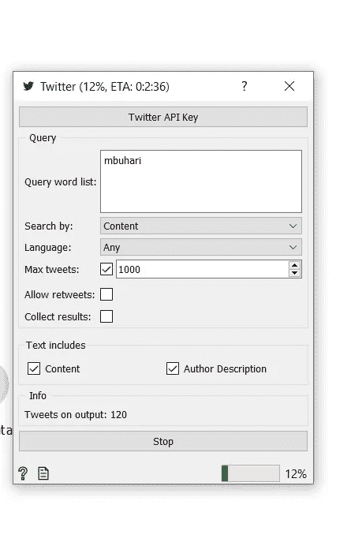

配置高音部件

点击“Twitter API 密钥”按钮，输入您在**步骤 1** 中生成的“消费者 API 密钥”和“秘密密钥”

对于本教程，我们将流 1000 条提到单词 mbuhari(尼日利亚总统穆罕默杜·布哈里·GCFR 的官方推特账号)的推特。因此，如果你想虔诚地追随这篇文章，在查询词列表框中输入“mbuhari ”,并将最大 tweets 设置为 1000。点击“开始”开始从 twitter 传输数据。(推文于 2020 年 1 月 19 日发布)

> 数据表小部件

在这个工作流程中，我们使用了两个“数据表”小部件。这个小部件允许我们以表格的形式查看数据。第一个数据表连接到“Twitter”小部件。我们可以通过双击“数据表”小部件来查看这些数据。

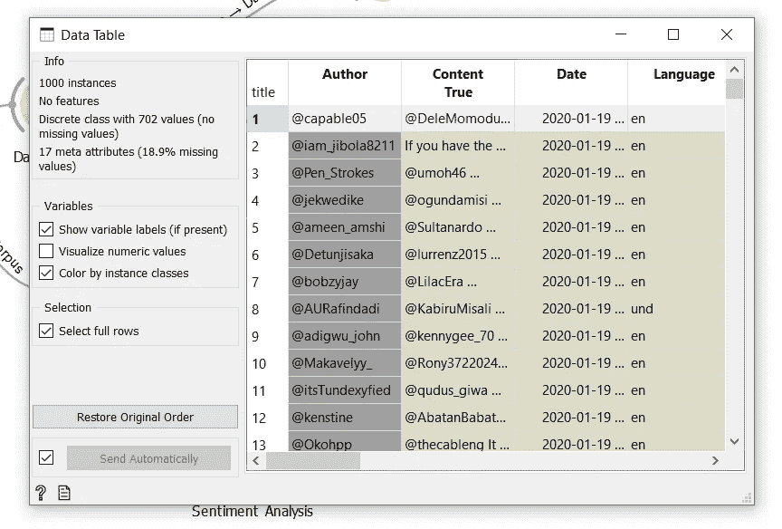

数据表

> 保存数据微件

此小部件将数据表中的数据保存为. csv 格式。双击此小部件可定义文件的名称和路径。

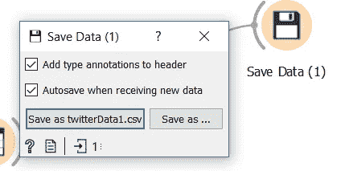

保存数据窗口

注意:“保存数据”将只保存“数据表”上突出显示的数据。因此，要突出显示数据表上的数据，双击“数据表”小部件以打开“数据表”窗口。双击表格左上角的“标题”,整个数据表会高亮显示并自动保存到。战斗支援车

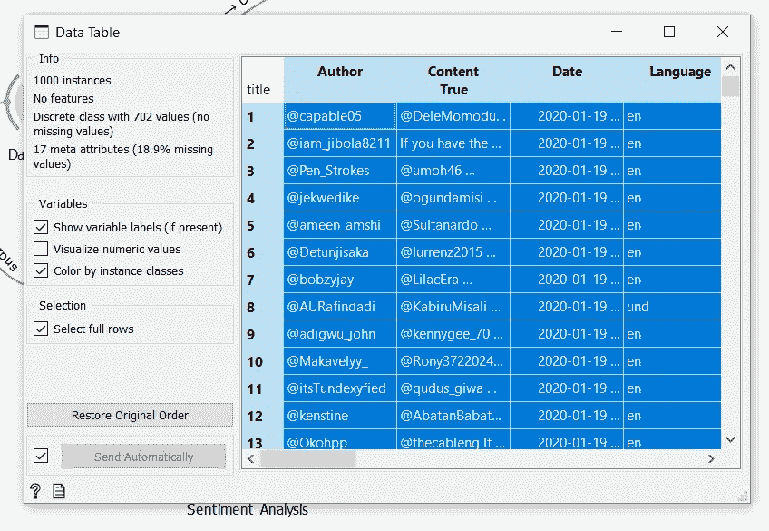

突出显示的数据表将被保存

> 预处理文本

这构建了一个文本预处理管道。它允许我们转换、标记和过滤我们的数据。双击小组件打开预处理窗口。我们希望**通过在所有推文中保持小写，删除重音符号，解析 HTML 和删除 URL 来转换**我们的数据；因此，请勾选**转换**部分下的所有方框。

在**标记化下，**我们只对按正则表达式拆分感兴趣，只保留单词。选择 **Regexp** 并键入 ***\w+*** 作为模式。

在过滤下，我们将删除英语中的停用词。因此，检查“停用字词”并将语言设置为“英语”

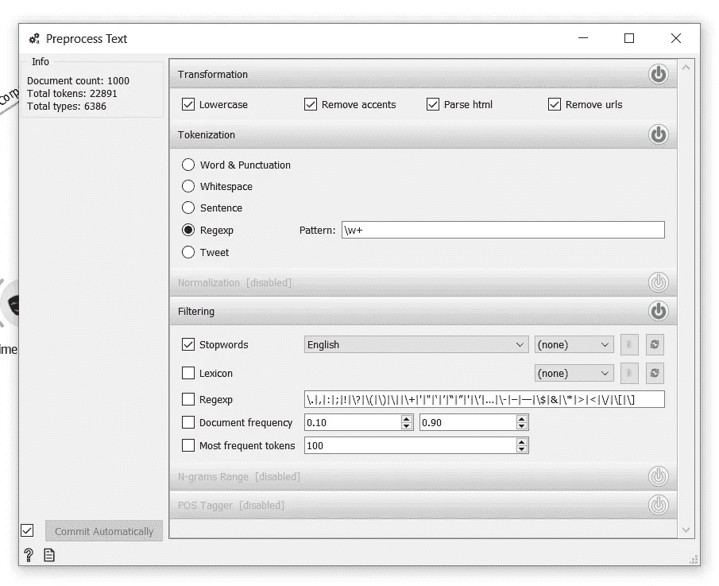

预处理文本窗口

> 云这个词

这个小部件是我最喜欢的文本分析工具之一。它有助于您查看文本数据中提到最多的单词。查看我们的云是什么样的:

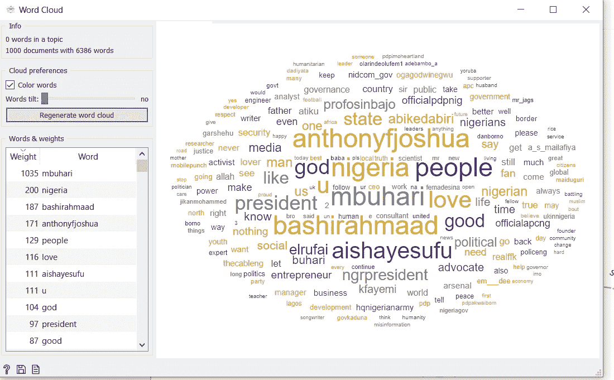

云这个词

> 情感分析

双击这个部件并选择维达。VADER 使用词汇特征列表(例如，单词)的组合，这些词汇特征通常根据它们的语义取向被标记为正面或负面。VADER 不仅告诉我们积极和消极的分数，还告诉我们一种情绪有多积极或消极。

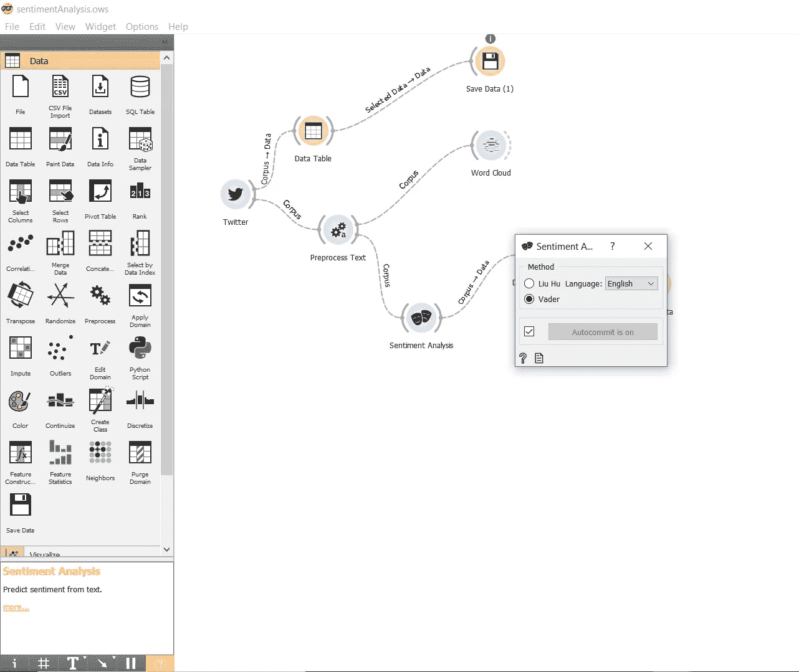

## 下一部分

连接到“情绪分析”小工具的“数据表”包含推文和情绪得分。这是我们感兴趣的数据。它将作为我们交互式仪表板的数据库。在本教程的下一部分中，我们将探索如何使用 Power BI 创建一个全功能的情绪分析仪表板。

到时候见！

我希望你觉得这个教程很有趣。请分享并记得评论您的建议或反馈。

干杯！！！！

你可以在 Twitter @akinsande1 上关注我

在这里阅读第二部分:[https://bit.ly/SimpleSentiment2](http://bit.ly/SimpleSentiment2)