# 用 Orange + Vader + PowerBI 进行 Twitter 情感分析(第二部分)

> 原文：<https://medium.com/analytics-vidhya/twitter-sentiment-analysis-with-orange-vader-powerbi-part-2-9692b60da8fd?source=collection_archive---------8----------------------->

在本文的第一部分中，我们学习了如何创建一个 twitter 开发者帐户，如何下载和安装 Orange3 文本挖掘，以及如何使用 Orange3 文本挖掘对 twitter 数据进行流式处理和情感分析。

在本文中，我们将学习如何在 Power BI 中创建一个情绪分析仪表板，并将其部署到 web 上。本文是[用 Orange + Vader + PowerBi (Part 1)](https://link.medium.com/8Ya96gU6n3) 的 Twitter 情绪分析的延续；如果您还没有阅读这篇文章，请阅读。

在我们开始之前，首先什么是 Power BI？Power BI 是微软的一项商业智能服务，为用户提供聚合、分析、数据共享和可视化工具。有几种可能的方式来使用 Power BI- Power BI 服务(Web)、移动、嵌入式和 Power BI 桌面(桌面应用程序)。事不宜迟，我们开始吧！

## 步骤 1:下载并安装 Power BI Desktop

Power BI Desktop 允许您通过连接到各种数据源来接收、转换、集成和丰富数据。这个免费的桌面应用程序通过可扩展的仪表板、交互式报告、嵌入式视觉效果等简化了数据评估和共享。

要下载 Power BI Desktop，您只需:

1.  到这里:【https://www.microsoft.com/en-us/download/details.aspx? id=58494
2.  单击下载按钮。
3.  在下一页上，选中复选框以下载适合您系统的 powerbi 版本，然后单击下一步下载。

pagePowerBi 下载

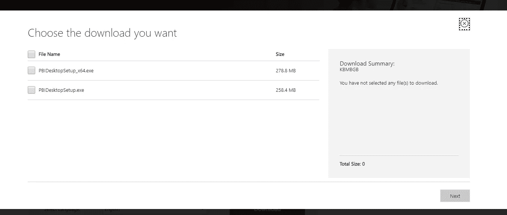

要安装它，只需运行下载的。然后按照简单的安装向导提示进行操作。

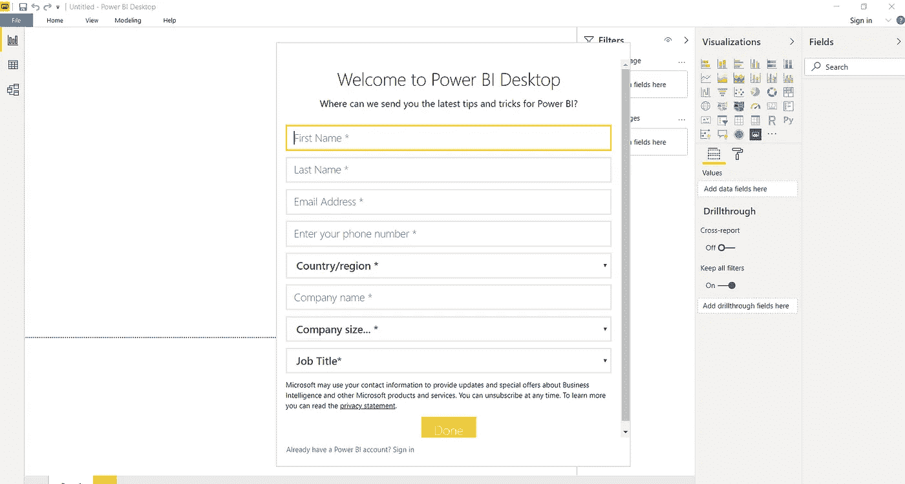

下一步是注册一个超级商务智能帐户(如果您想以后再注册，可以点击“已经有一个超级商务智能帐户”跳过注册过程。“登录”并关闭登录页面。)如果您已经有帐户，只需使用您的凭据。**注意:**如果你有官方邮箱，我会推荐你创建 Power BI 账户，因为我们会从 Power BI Marketplace 导入一些视觉效果；为此，需要有一个超级 BI 帐户。现在，我们准备探索。

## 步骤 2:将数据集导入 PowerBi

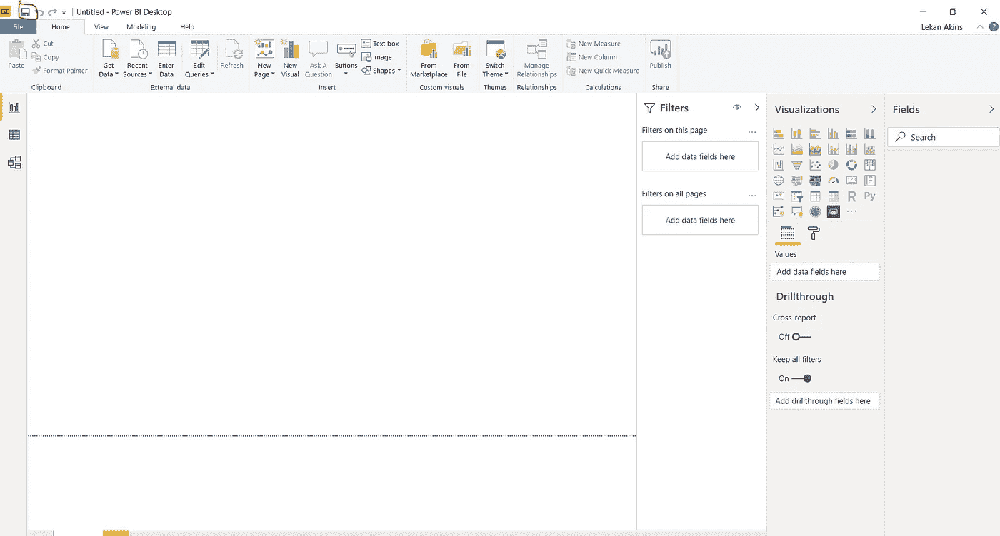

最佳实践:保存报告

作为最佳实践，您应该在执行任何其他操作之前保存您的 Power BI 报告。要保存您的报告，请单击页面左上角的保存按钮。现在，让我们导入我们的情感分析数据。csv 文件，它是从我们教程的第一部分中的 Orange3 文本挖掘导出的。您可以点击这里的【https://bit.ly/2Rw8QYx】和下载数据。)

要构建仪表板，您必须连接到数据源。以下是连接到数据源时需要遵循的步骤:

1.  点击“获取数据”按钮。
2.  选择源类型；在本教程中，我们将使用文本/CSV 文件

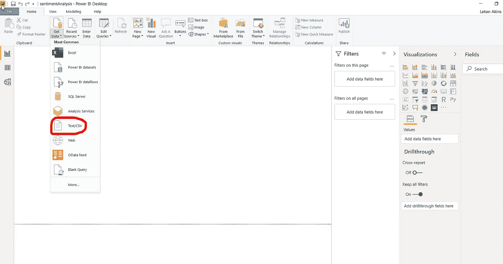

3.在文件资源管理器中找到数据并选择它；一旦您成功连接到我们的数据源，您将看到下面的窗口:

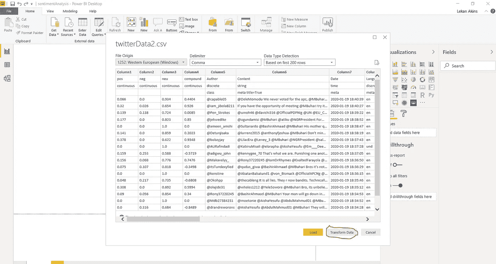

单击转换

## 步骤 3:为加载准备数据

数据并不总是干净和有准备的。在将数据加载到 powerbi 之前，最好在 Power Query 中清理数据。为加载准备数据，点击*‘转换数据’*按钮。

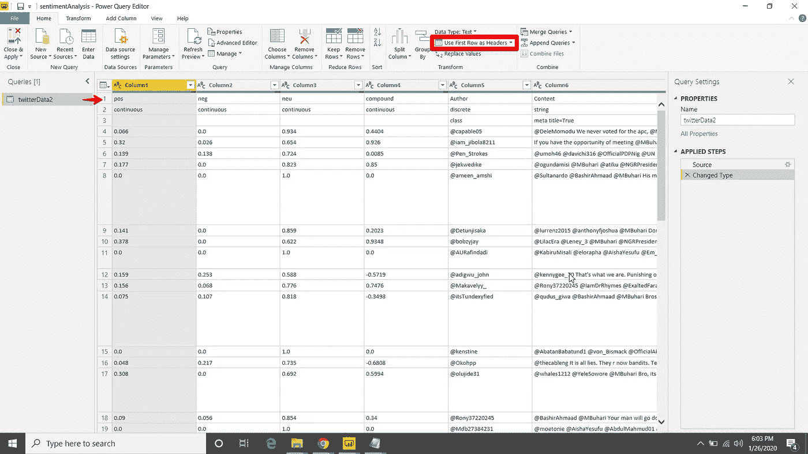

超级查询视图

按照以下步骤准备要加载的数据:

1.  使用第一行作为标题:我们数据的第一行很适合作为我们数据表的标题。在**主页**功能区上，点击“用户第一行作为标题”。
2.  删除前 2 行:我们不需要数据表中的前 2 行，所以让我们去掉它。在**主页**功能区，点击**“移除行”**并点击“移除顶行”

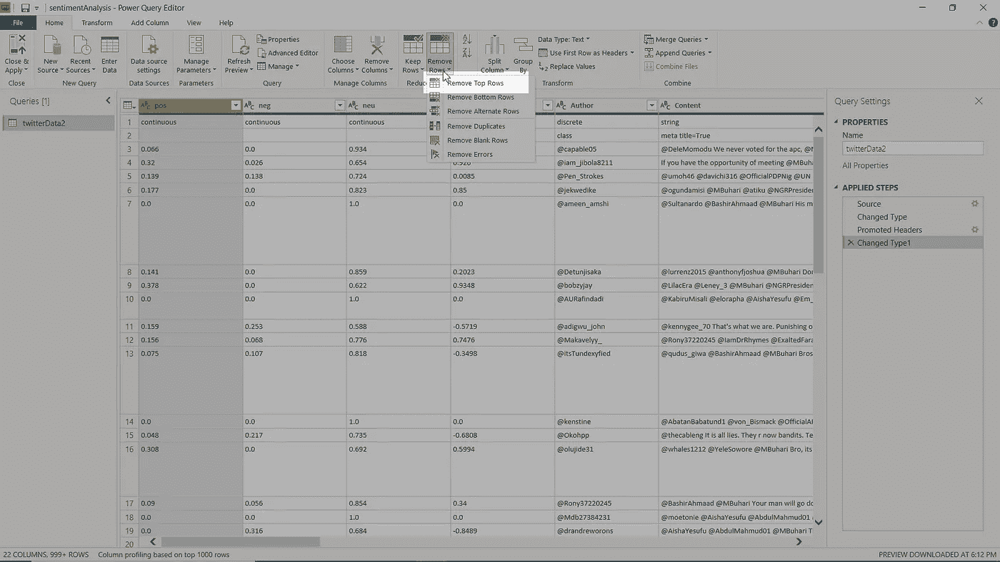

删除行

在*移除顶行*对话框中输入 2，如下图所示:

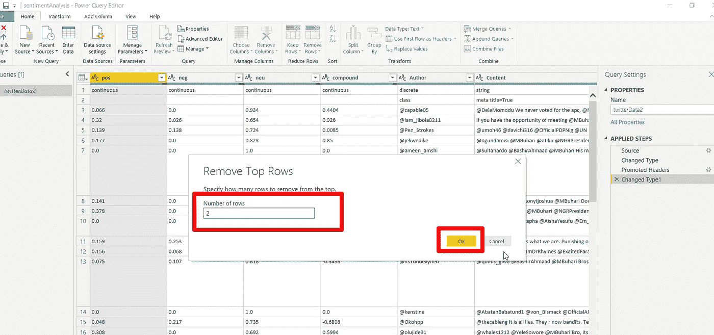

移除顶部行

3.更改数据类型:要更改数据类型，请单击列名左侧的数据类型按钮。我们需要将一些数据转换成正确的数据类型；以下各列应改为*十进制数、*‘pos’，‘neg’，‘neu’和‘compound’；其他数字列应改为*整数。*日期栏应转换为*日期/时间。*

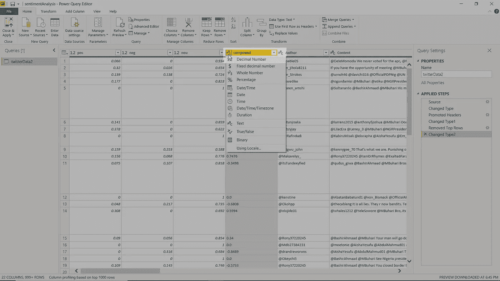

4.创建条件列:让我们创建一个名为“情绪”的条件列。情绪栏将帮助我们从“复合”得分中识别负面、正面和中性情绪。按照以下步骤创建条件列。

4a。在上部功能区，单击“添加列”并选择“条件列”

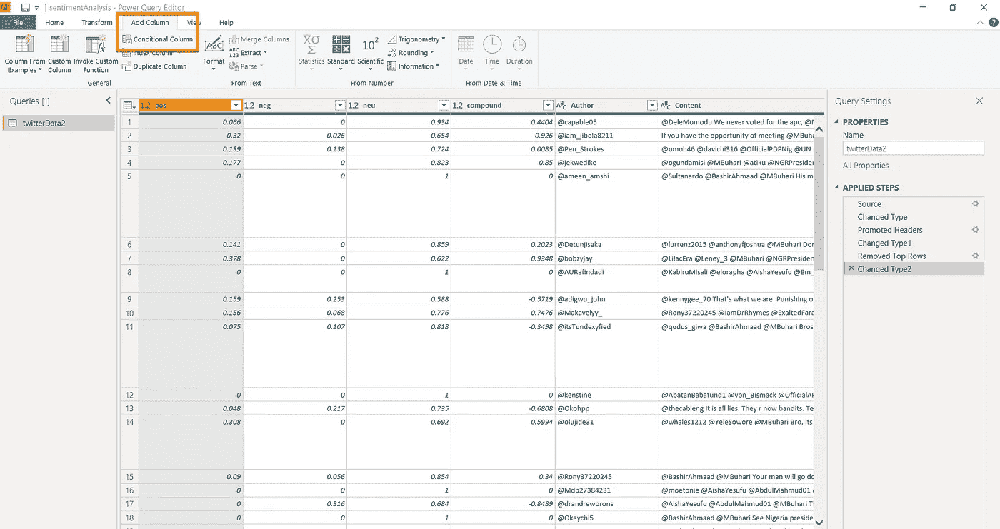

4b。现在输入条件；如果‘复合’小于 0，则情绪为‘负面’；如果‘复合’等于 0，则情绪为‘中性’；如果“复合”大于 0，则情绪是“积极的”。见下面截图:

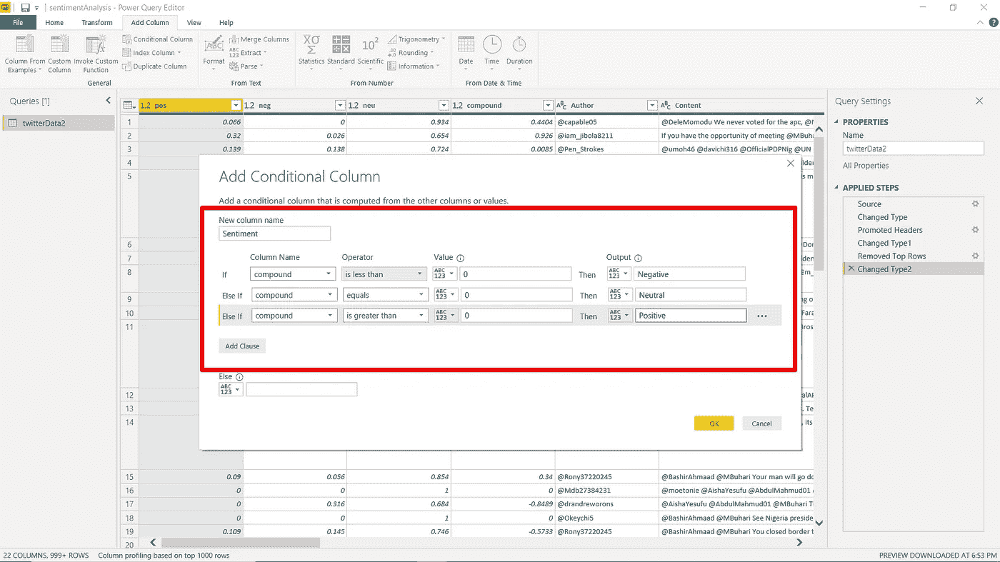

5.加载数据:现在我们已经准备好了数据，让我们继续*加载*。点击*关闭&应用*按钮加载数据。

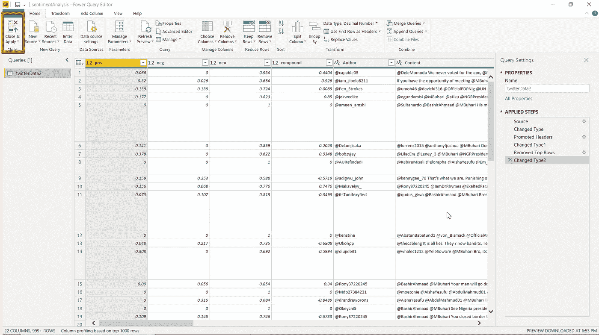

## 步骤 4:构建仪表板

现在我们已经清理了数据，让我们继续构建仪表板。

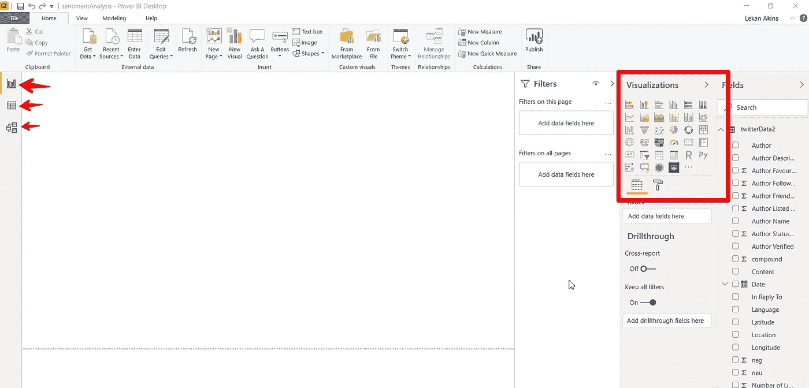

按照以下步骤构建仪表板:

1.  **更改仪表盘背景:**见下图，按以下步骤操作:

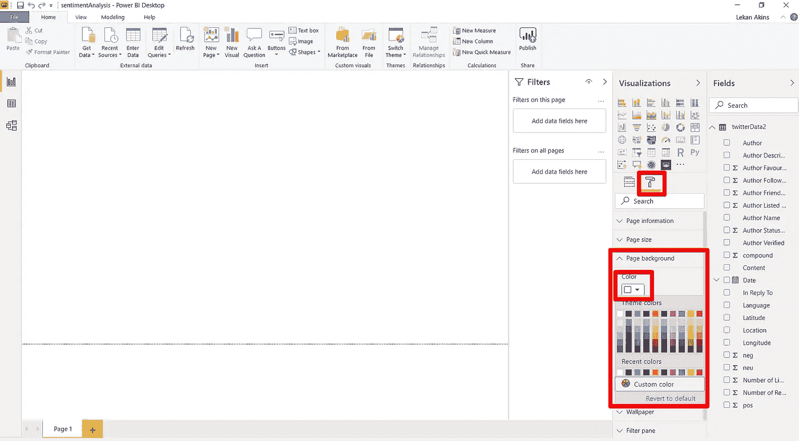

格式化背景

1a。在可视化面板上，选择*格式*图标

1b。选择*页面背景，*点击*颜色*并选择黑色。将颜色透明度设置为 0%。背景现在是黑色的，如下图所示:

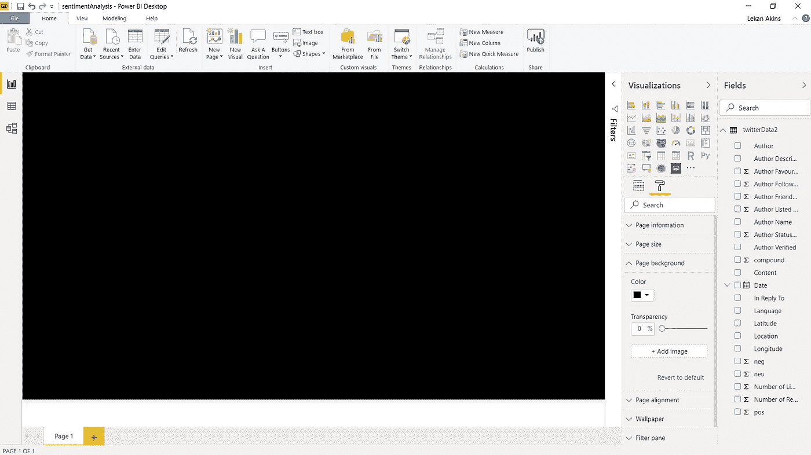

黑色背景

2.**可视化 1-表:**要将可视化从可视化窗格导入到报表空间，请单击该可视化，您将在报表空间中看到它。我们将从把*表*可视化带到报告空间开始。

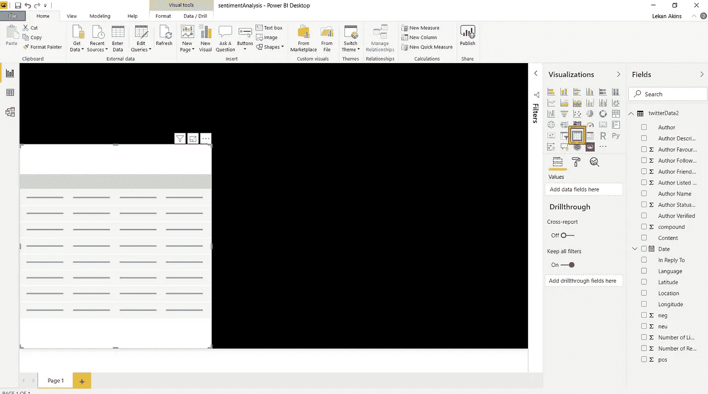

现在您已经在报告空间中有了表，请执行以下操作:

a.在数据字段上，将日期列拖到表的值字段，如下面的屏幕截图所示

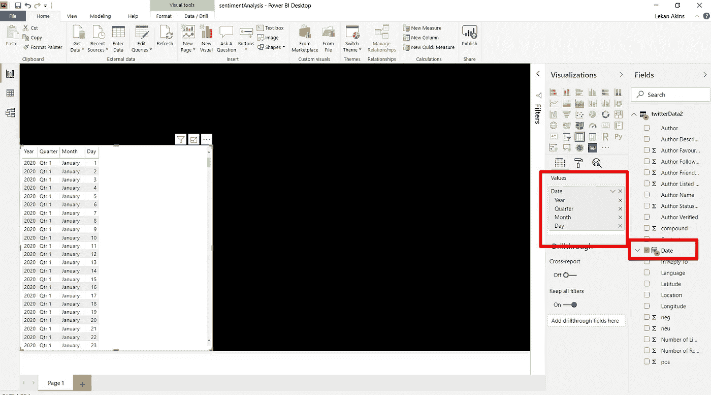

我们的日期是分层显示的；这不是我们想要的。因此，让我们将日期从层次结构更改为普通日期，如下图所示:

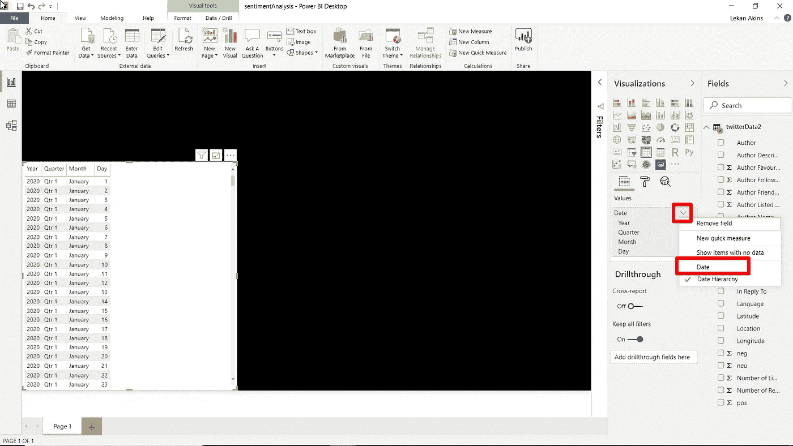

b.将“作者姓名”、“内容”、“情感”、“作者追随者计数”和“复合”列拖到可视内容的值字段中。双击*值*窗格上的“复合”将其重命名为“分数”

**视觉 2-卡片:**为了避免您当前的视觉被新的视觉改变，在选择*卡片*视觉之前，点击您的报告的背景。在可视化窗格上，单击卡片可视化，如下图所示:

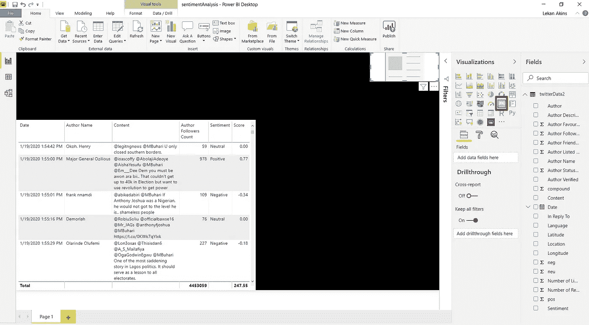

现在您已经在报告空间中拥有了卡片，将内容拖动到可视区域中。默认情况下，卡片将显示第一句话，通过单击视觉效果上的下拉箭头并选择“计数”来更改这句话，如下所示:

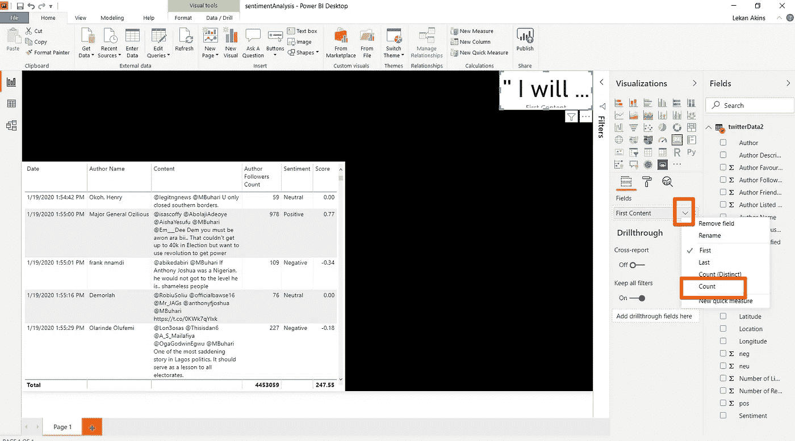

请记住，您可以通过双击值字段上的名称来重命名字段名称。

**视觉效果 3-圆环:**为了避免新的视觉效果改变您当前的视觉效果，请在选择圆环视觉效果之前单击您的报告的背景。将“情绪”字段拖到“图例”中，将“内容”字段拖到“价值”中，如下图所示。

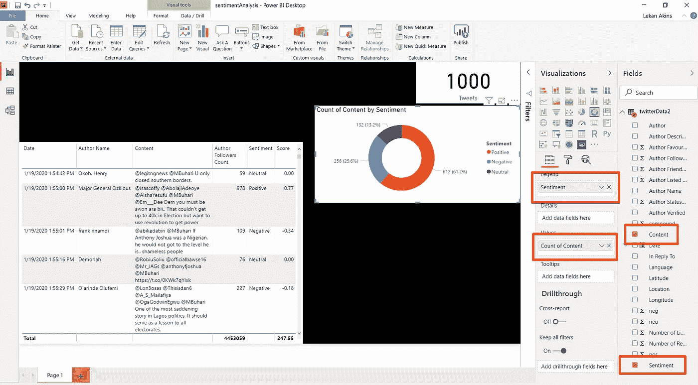

**可视化四字云:** Word cloud 不属于 Power BI 中的默认可视化，因此我们必须将其作为自定义可视化从 Power BI Marketplace 导入。要从市场导入视觉效果，请单击省略号(…)，然后选择“从市场导入”,如下图所示:

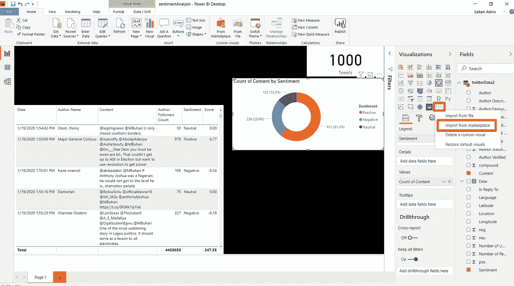

注意:您必须登录 Power BI 才能从市场导入 visual。

在 marketplace 中搜索“Word Cloud ”,然后单击“添加”,将自定义视觉效果导入到您的可视化窗格中，如下所示:

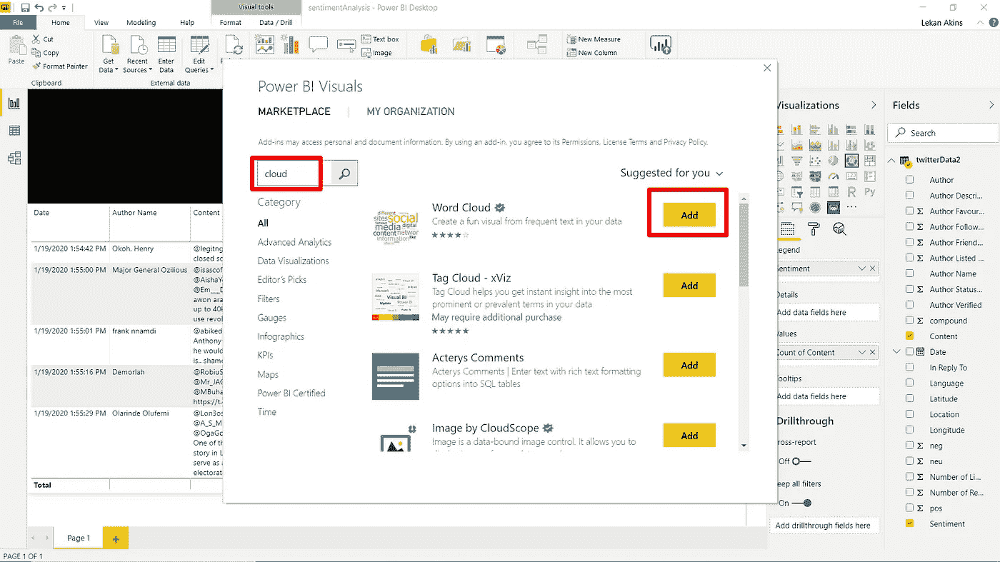

现在，您已经从 marketplace 中导入了可视内容，单击该可视内容将其添加到您的报告空间中。将*内容*字段拖动到可视化的*类别*中，如下图所示:

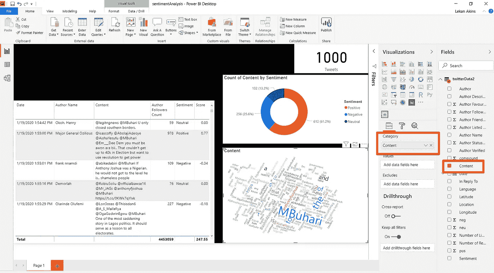

**视觉 5-文本过滤器:**重复我们用来从市场导入*文字云*视觉的相同过程来导入*文本过滤器。*点击*文本过滤器*视觉，将其添加到报告空间。将“内容”数据字段拖动到可视区域，如下所示:

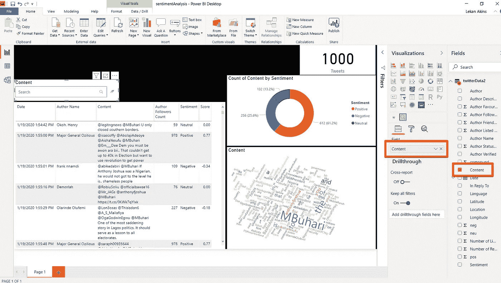

**可视化 6-文本框:**在“主页”功能区上，单击*文本框*图标并在其中键入“Twitter 情绪分析”，如下图所示:

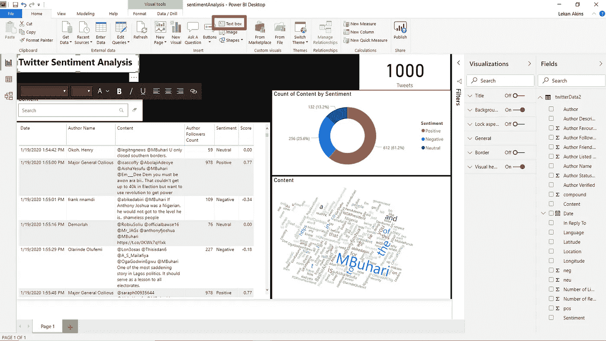

现在，您已经有了一个准备就绪的 PowerBi 仪表板，您可以根据需要选择格式化该仪表板。你可以在这里阅读更多关于如何格式化 powerbi 视觉效果的信息[。最后，让我们将仪表板发布到 web 上，以便互联网上的任何人都可以与之交互。](https://docs.microsoft.com/en-us/power-bi/visuals/power-bi-visualization-customize-title-background-and-legend)

## 发布到 Web

> 您需要有一个 Power BI 服务帐户来发布您的仪表板。

当您可以分享自己漂亮的仪表板时，Power BI 仪表板会变得很有趣。要使您的仪表板在 web 上可用，请按照下列步骤操作:

1.  发布:单击“发布”按钮将仪表板推送到您的 powerbi 服务帐户。
2.  发布仪表板后，在此处登录您的 powerbi 服务帐户
3.  您新发布的仪表板可以在“我的工作区”的“报告”部分找到。单击仪表板以在 web 上查看。
4.  要创建嵌入链接，您需要发布到公共网站，如下图所示:

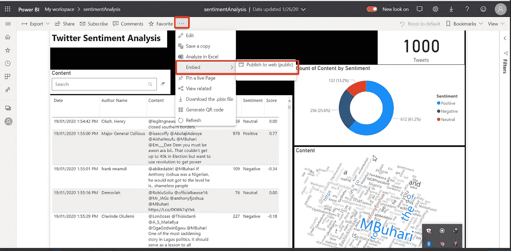

5.发布仪表板，将为您生成一个链接，如下所示:

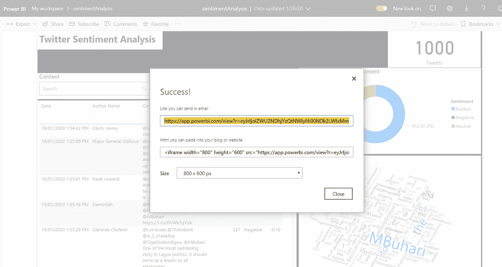

## 最后的话

祝贺你完成了这篇文章。我们的仪表板可在这里查看[https://bit.ly/sentimentLekan](http://bit.ly/sentimentLekan)T22。随意和它互动。

请放下你的问题和评论。

如果你喜欢这篇文章，请鼓掌！

可以在 Twitter @akinsande1 关注我；Instagram @thegrowthcatalyst

干杯！！！