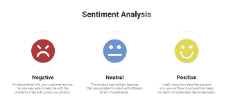
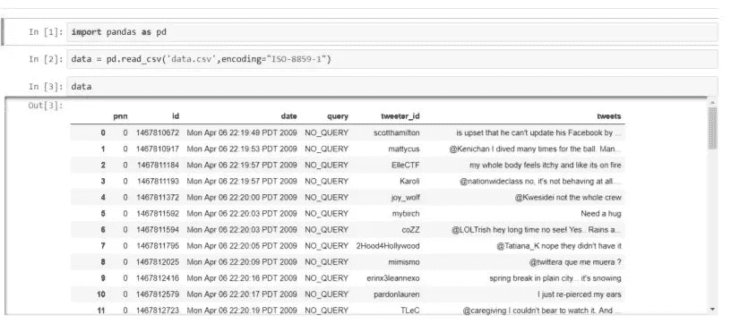
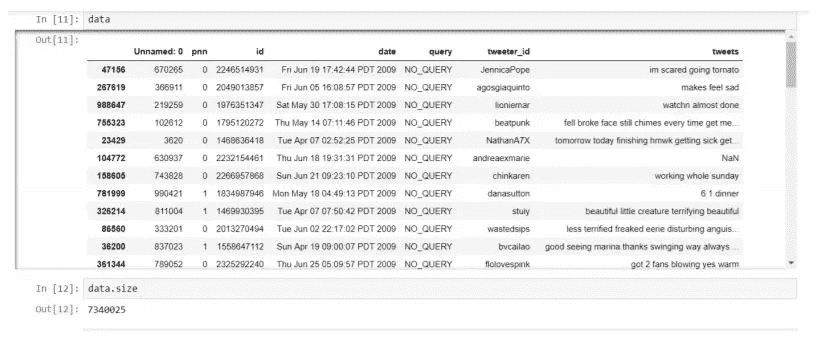
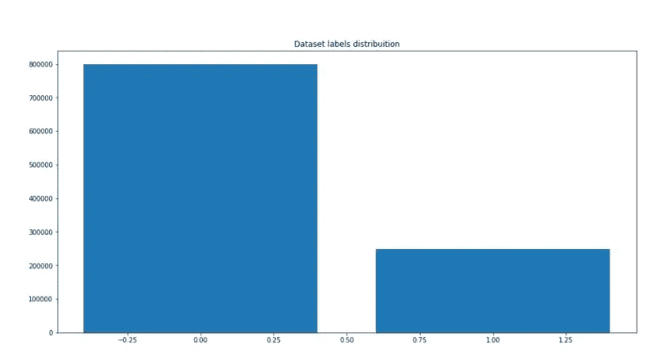
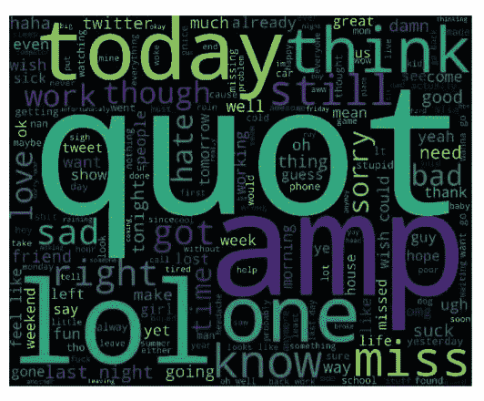
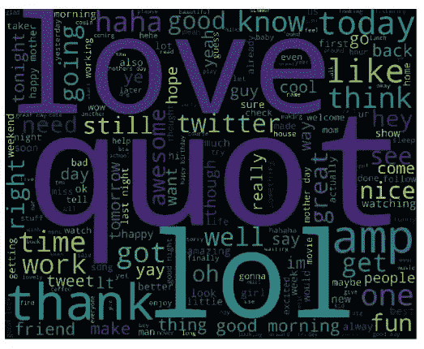
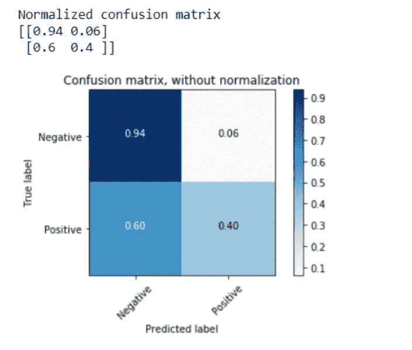
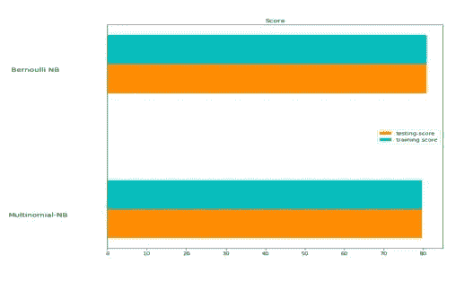
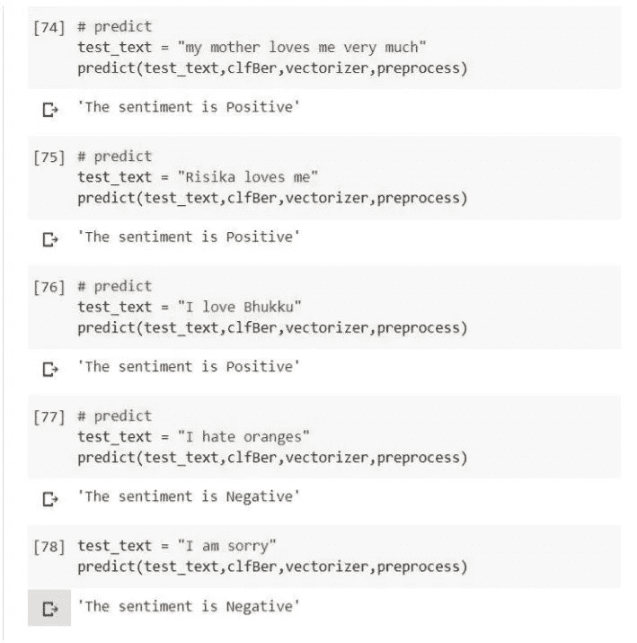

# 使用朴素贝叶斯分类器的 Twitter 情感分析(过程解释)

> 原文：<https://medium.com/analytics-vidhya/twitter-sentimental-analysis-using-naive-bayes-classifier-process-explanation-f532b96b30b8?source=collection_archive---------2----------------------->

来源:https://www . social bakers . com/blog/social-media-sensation-analysis

情感分析主要是对文本中的情感和观点进行分析。一种用于文本分析的情感评估系统结合了自然语言处理(NLP)和笔记本电脑控制方法，以将加权的情感分数分配给句子或短语内的实体、主题、问题和类别。它试图找到并证明人对给定内容源的情感。我正在从包含推文的数据集提出一个高度准确的情感分析模型，在分类器如朴素贝叶斯的帮助下，该应用程序可以正确地将给定数据集的推文分类为正面和负面，以给出每个推文的情感。自从社交媒体出现以来，人类就利用媒体来表达他们的需求、偏好和情感。以及 Twitter、脸书等社交网络的发展，收集了大量关于用户偏好的信息。

> 通过这篇文章，我试图实现一个系统，试图了解一个给定主题的意见。本文基于解决两个子问题:
> 
> ***1。将一个句子分类为主观或客观，称为主观性分类。***
> 
> **2*。把一个句子分类为表达肯定、否定的称为极性分类。***

# **解决方案**

Binary 致力于二元情感分析，使用具有多项分布的朴素贝叶斯分类器以及伯努利分类器对给定句子的正面和负面推文进行分类。为了开发，从 Kaggle 中提取了包含 tweet 的数据集。首先，将进行预处理。在这个阶段，白色单词、重复单词、情绪以及#标签都将被删除。然后 tweets 使用训练数据的机器学习技术将被分类。将使用几种方法从源文本中提取特征。特征提取将分两个阶段进行:1 .twitter 相关数据的抽取，2。添加到特征向量的其他数据提取。在特征被添加到特征向量之后，训练数据中的每个 tweet 都与类别标签相关联，并被传递到不同的分类器，分类器被训练。最后，将对模型进行测试，并在这些训练好的分类器的帮助下进行分类。最后，我们将推文分为正面和负面。

# 开发过程说明

**A .加载情感数据**

这个项目的数据集是从 Kaggle 中提取的。这个数据集包含了这个项目中用于分析情绪的 100 多万条推文。这些文件包含正面标签和负面标签的推文。首先，数据集被加载到程序中。包含以下 6 个字段:1。pnn:推文的极性(0 =负，1 =正)

2.身份证:身份证号码

3.日期:推文的日期

4.query:查询如果没有查询，那么这个值就是 NO_QUERY。

5.Tweeter_id:推文的 id

6.tweets:tweet 的文本

## B.预处理数据

加载数据后，会进行预处理。为了准备消息，在该程序中使用了文本预处理技术，例如用关键字替换 URL 和用户名、去除标点符号以及转换成小写字母。它们描述如下:

*   **解码数据:**这是将信息从复杂的符号转化为简单易懂的字符的过程。文本数据可能会受到不同形式的解码，如“拉丁”、“UTF8”等。UTF-8 编码是被广泛接受的编码格式，推荐使用。
*   **停用词的去除:**常用词(停用词)应该被去除。它们包括像' am '，' an '，' the '等词。通过将该参数值设置为 English，Count Vectorizer 将自动忽略在 scikit-learn 的内置英文停用词列表中找到的所有单词(来自我们的输入文本)。
*   **去除标点:**所有的标点符号都要按照轻重缓急来处理。比如:“”, ",","?"是重要的标点符号，应该保留，而其他需要删除。
*   移除 URL:应该移除文本数据中的 URL 和超链接，如评论、评论和推文。

## C.训练朴素贝叶斯分类器

朴素贝叶斯方法是一组基于应用贝叶斯定理的监督学习算法，其“朴素”假设是在给定类变量的值的情况下，每对要素之间的条件独立性。

管道类用于使矢量器= >转换器= >分类器更容易使用。诸如 IDF 使用、使用网格搜索的 TF-IDF 标准化类型的超参数。所选超参数的性能是在模型训练步骤中未使用的测试集上测量的。数据集被分成训练和测试子集。使用了两个朴素贝叶斯分类器。它们列举如下:—

*   **伯努利朴素贝叶斯:**它假设我们所有的特征都是二元的，因此它们只取两个值。表示 0 可以表示“文档中没有出现单词”，1 表示“文档中出现了单词”。
*   **多项式朴素贝叶斯:**当我们有离散数据时使用(例如，tweets 评级范围为 1 到 5，因为每个评级都有一定的频率来表示)。在文本分类中，我们有每个单词的计数来预测类别或标签。如果单词可以用它们的出现次数(频率计数)来表示，那么就使用多项式事件模型。如果我们只关心一个单词在文档中的存在与否，那么使用伯努利事件模型。

## D.计数矢量器和 TFI-DF 矢量器的实现

计数矢量器只计算词频。它将字符串标记化(将字符串分隔成单个单词)，并为每个标记提供一个整数 ID。它计算这些标记的出现次数。计数矢量器方法会自动将所有标记化的单词转换为小写形式，这样就不会对“he”和“He”这样的单词进行不同的处理。它使用默认设置为 True 的小写参数来实现这一点。它还会忽略所有标点符号，以便单词后跟一个标点符号。

Tfidf 矢量器将 CountVectorizer 和 TfidfTransformer 的所有选项组合在一个模型中。TfidfTransformer 用于统计一个词在语料库中出现的次数(仅指词频，而非词频倒数)。TfidfVectorizer 对其结果进行归一化，即其输出中的每个向量的范数为 1。

## E.评估指标的实施

最后，对于数据的评价使用了混淆矩阵。混淆矩阵是一种总结分类算法性能的技术。计算混淆矩阵可以让我们更好地了解我们的分类模型是正确的，以及它会产生什么类型的错误。正确和不正确预测的数量通过计数值进行汇总，并按每个类别进行细分。

混淆度量中有 4 个重要术语:

1.  真阳性:我们预测的结果是肯定的，而实际结果也是肯定的。
2.  真正的否定:我们预测没有，而实际结果是没有的情况。
3.  假阳性:我们预测结果是肯定的，而实际结果是否定的。
4.  假阴性:我们预测结果是否定的，而实际结果是肯定的。

# 使用的库

1.  Wordcloud:单词云(也称为标签云)是一种数据可视化技术，它突出了大型文本语料库中的重要文本数据点
2.  NumPy:它是使用 Python 进行科学计算的基础包，可以用作通用数据的高效多维容器。它是一个 Python 库，提供了一个多维数组对象，各种派生对象(比如掩码数组和矩阵)，
3.  熊猫:它获取数据(如 CSV 或 TSV 文件，或 SQL 数据库)并创建一个包含行和列的 Python 对象，称为数据框，它看起来非常类似于统计软件中的表格。
4.  Matplotlib: Matplotlib 是一个 Python 2D 绘图库，它以各种硬拷贝格式和跨平台的交互环境生成出版物质量数字。
5.  Scikit learn: Scikit-learn 是 Python 中的一个库，它提供了许多非监督和监督学习算法。
6.  Nltk:自然语言工具包(NLTK)是一个平台，用于构建 Python 程序，这些程序处理人类语言数据，以应用于统计自然语言处理(NLP)。它包含用于标记化、解析、分类、词干、标记和语义推理的文本处理库。

# **解决方案的伪代码**

开始

1.  输入:数据集 D 和训练数据 T
2.  对于每个:TW TW 在数据集 D 中

a.摘录:在推特上发布来自数据集 D 的 Tw

b.初始化:将 C 切到推特 Tw 的根目录

c.获取:特征向量 F

d.提取:从特征向量 F 到提取的特征 E 的特征 Fe

3.对于每个:数据集 D 中提取的特征 E

a.比较:使用朴素贝叶斯算法将提取的特征 E 与训练数据 T 进行比较，并将极性存储在 P 中

4.如果极性 P 是正的

a.显示:阳性结果

5.否则，如果极性 p 为负

a.显示:阴性结果

6.其他

a.显示:中性结果

停止

# **结果**

## A.从数据集加载数据

正在加载数据集

为了进一步处理，数据集已使用 ISO8859-1 编码的 panda 库加载到程序中。上图显示了成功加载的数据集。

## B.清洗数据集

清洗数据集

在数据集被加载后，我清理了数据集，得到了上面的结果。数据集已成功清理，以供进一步演示。数据集分布如下图所示。

数据集标签分布

## C.词云生成

在“pnn”字段值的帮助下，在清理的数据集的帮助下，生成单词云。它分为正面词云和负面词云两种类型，如下图所示:

负词云生成

积极的词云生成

## D.混淆矩阵

混淆矩阵

上图展示了我们程序的混淆矩阵。有 4 个重要术语:

*   真阳性:我们预测的结果是肯定的，而实际结果也是肯定的。
*   真正的否定:我们预测没有，而实际结果是没有的情况。
*   假阳性:我们预测结果是肯定的，而实际结果是否定的。
*   假阴性:我们预测结果是否定的，而实际结果是肯定的。

## E.多项式与伯努利分类器结果的讨论

多项式朴素贝叶斯在某种意义上更复杂，因此，伯努利模型可以使用较少的数据进行训练，并且不容易过拟合。

多项式 NB 将基于它发现的多个关键词的计数来分类文档；而 Bernoulli NB 只能关注单个关键字，但也会计算该关键字在文档中没有出现的次数。所以，他们确实模拟了稍微不同的东西。如果我们有离散的多个特征要考虑，我们必须使用多项式 NB。但是，如果我们只需要担心一个单一的特性，那么我们可以根据上面的内容进行建模选择。

培训和测试分数

***准确度结果:***

**多项式朴素贝叶斯具有以下属性:**

多项式朴素贝叶斯模型的训练精度为:0.7969994993205064 多项式朴素贝叶斯模型的检验精度为:0.7969996996

**伯努利分类器具有以下属性:**

伯努利分类器模型的训练精度为:0.8096178146532198 伯努利分类器模型的测试精度为:0.809676867

## F.传递一些随机值来分析情绪

分析情绪

为了进一步演示，使用了名为 predict()的方法，并传递了一些值，以检验程序是否正常工作，结果是否如我所料。以上结果是针对各种输入值获得的，程序运行成功。

# 结论

尽管情感分析有其局限性，但它可以在现实世界中推断出许多好处。这对于公开意见起关键作用的组织来说是有价值的。此外，来自情感分析可以通过使他们获得将他们放在 twitter 中的讨论和对话来提供帮助交易发展，并且提供帮助他们以类似的方式快速响应。政府可以制定法律，大学可以发现学生的失望，商业可以利用假设检验以类似的方式进行展示查询等等。因此，意见调查的领域非常广泛，可以在任何组织中实施，以确定自己的利益。