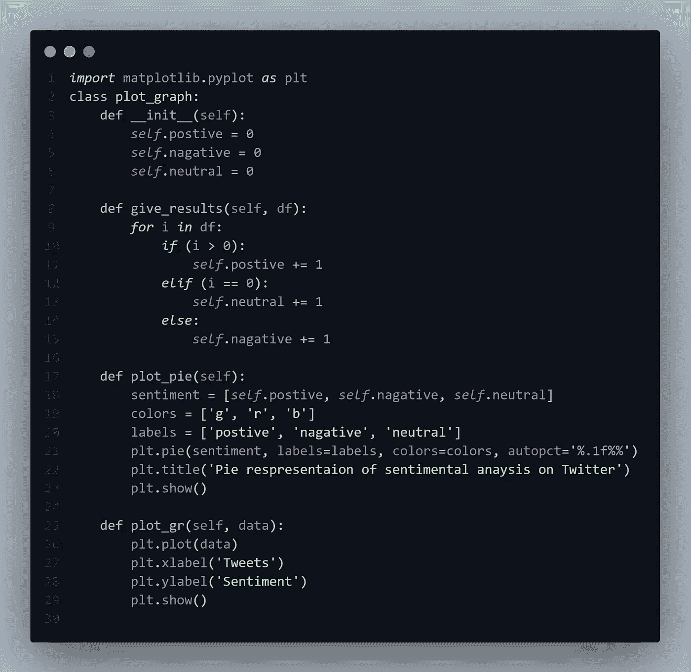

# 使用 Python 进行 Twitter 情感分析。

> 原文：<https://medium.com/analytics-vidhya/twitter-sentimental-analysis-using-python-49b20b262c6f?source=collection_archive---------26----------------------->

你知道公司如何使用 twitter 来了解他们的受众，了解关于他们的品牌和竞争对手的最新消息，并发现行业的新趋势吗？让我们找到方法

语义分析是自动识别文本潜在内容的过程。这可以是一种观点，一种判断，或者是对一个特定话题或主题的感觉。在 twitter 上应用这种分析被称为 twitter 情感分析。如何分析推特数据的情绪

# 如何分析推特数据的情绪？

> 对 twitter 数据执行情感分析涉及几种类型

1.  收集 Twitter 数据
2.  准备您的数据
3.  创建情感分析模型
4.  可视化您的结果

## 1.收集 twitter 数据

你的数据必须能代表你要寻找的东西，因为你将基于你的数据训练你的模型。收集好的数据将有助于更准确地预测。我们可以使用 Twitter API 来获取所有使用 python 的推文

用于访问 Twitter API 的 Python 模块

一旦导入了所需的模块，下一步就是对 Twitter API 进行认证。为了认证 Twitter API，我们需要一个 Twitter API 密钥和令牌来访问 API。你可以在这里拿到你的证件【https://developer.twitter.com/en/apply-for-access 

验证 Twitter API 服务的 Python 代码

完成成功的认证后，就该从你的 Twitter 账户中调出所有的推文了。
创建一个名为 twitter 的类，所有的 diver 代码都可以嵌入其中。这些类拥有所有需要的方法，可以根据你的需求获得各种 tweets。

Python 类从 Twitter 帐户获取所有推文

## 2.准备您的数据

干得好！您成功地从 twitter 上收集了数据，现在是时候准备您的数据来进行分析和处理了。我们可以使用 pandas 数据框和 NumPy 来组织数据。组织好数据后，需要使用 python 中的 regex 模块来清理数据，以提高预测精度并减少处理时间

Python 类来准备要分析和处理的数据

## 3.创建一个情感分析算法

您收集了数据，并为这一步准备了数据。是时候创建一个分析推文的算法了。我们使用 TextBlob 来查找 tweet 中每个单词的极性，并给出特定 tweet 的最终极性。

使用 textblob 查找 tweet 极性的 Python 代码

## 4.可视化您的结果

是时候直观地看到我们的结果了。我们使用 matplotlib 模块来绘制结果，并以图形方式可视化。

绘制最终结果的 Python 代码

你可以在我的 Github 库
Github [链接中找到这个简单的项目，用于回购](https://github.com/surendravj/sentimental_analysis)
[我的投资组合](http://surendravj.github.io/Myportfolio)

感谢您的阅读:)
vadapathy Surendra
关注更多有趣的博客