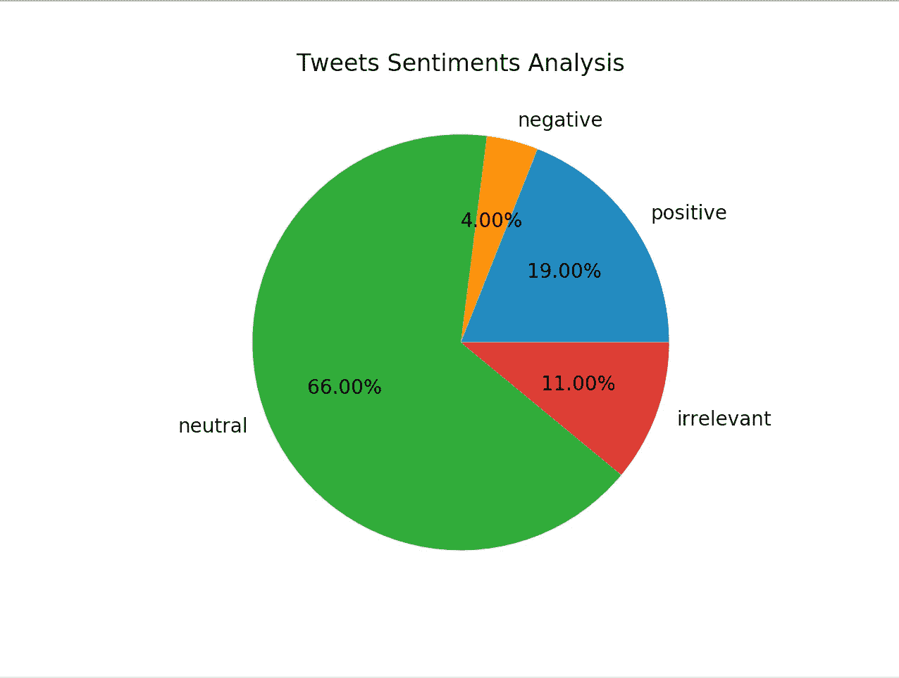

# 使用分类算法的推特情感分析

> 原文：<https://medium.com/analytics-vidhya/twitter-sentiments-analysis-using-a-classification-algorithm-441599b29db0?source=collection_archive---------14----------------------->

对于那些探索 ML 的人来说，Twitter 情绪分析是一个非常受欢迎的项目，它试图通过 NLTK 或自然语言工具包分析最近的推文来捕捉 Twitter 上特定关键字的整体情绪。

例如，一个简单的词，如**“movies”**，可以作为输入传递给模型，它会根据从实时流数据中提取的最近 100 条推文，按百分比显示围绕该词的情感饼状图。



我会尽量详细，这样即使你是机器学习的新手，你也应该能够从头到尾运行它。我们开始吧！

# 开始之前

从我在这篇文章中提到的地方大喊到 towardsdatascience.com 的，总的来说，这是一个很棒的网站。

[](https://towardsdatascience.com/creating-the-twitter-sentiment-analysis-program-in-python-with-naive-bayes-classification-672e5589a7ed) [## 用 Python 和朴素贝叶斯分类创建 Twitter 情感分析程序

### 如果你在科技领域呆得够久，你一定听说过情绪分析这个术语。这是一个过程…

towardsdatascience.com](https://towardsdatascience.com/creating-the-twitter-sentiment-analysis-program-in-python-with-naive-bayes-classification-672e5589a7ed) 

## 先决条件

> *-精通* python、pandas、nltk、matplotlib
> 
> *-一个* Twitter 开发者账户*和四个密钥(*消费者密钥、消费者秘密、访问令牌密钥、访问令牌秘密 *)*
> 
> *-对*朴素贝叶斯分类器算法*和*词向量映射*(NLTK 的一个极其有用和令人敬畏的概念)*

# 让我们编码

导入所有这些包

```
import twitter
import csv
import time
import pandas as pd
import os
from pandas import DataFrame
import numpy as np
import collections
from sklearn.model_selection import train_test_split
import random
import matplotlib.pyplot as plt
import re
import nltk
from nltk.tokenize import word_tokenize
from string import punctuation
from nltk.corpus import stopwords
```

有些是基本软件包，有些软件包需要以不同的方式安装:

```
pip install nltk
python -m nltk.downloader stopwords
```

## 进入 python shell 并键入:

```
import nltk
nltk.download()***Then an installation window appears. Go to the ‘Models’ tab and select ‘Punkt’, ‘Words’ from under the ‘Identifier’ column. Then click Download and it will install the necessary files.***
```

## 初始化 python API 实例(这里使用您自己的 4 个键)

```
twitter_api = twitter.Api(consumer_key=’<<...>>’,
                          consumer_secret=’<<...>>’,
                          access_token_key=’<<...>>’,
                          access_token_secret=’<<...>>’)**# test authentication**print(twitter_api.VerifyCredentials())
```

您应该会看到如下输出:

```
*{"created_at": "Mon Aug 17 01:11:11 +0000 2020", "default_profile": true, .....*
```

您可以从以下位置下载输入文件， **tweets.csv，**。这个文件有两列:tweet 文本和相应的标签(“正面”、“负面”、“中性”、“无关”)

[](https://github.com/guptapallavi30/Datasets/blob/master/tweets.csv) [## Gupta pallavi 30/数据集

### Permalink GitHub 是 5000 多万开发人员的家园，他们一起工作来托管和审查代码、管理项目以及…

github.com](https://github.com/guptapallavi30/Datasets/blob/master/tweets.csv) 

```
**# Import the csv file**script_dir = os.getcwd()
file = 'tweets.csv'
tweetDataFile = os.path.normcase(os.path.join(script_dir, file))**# Convert CSV to Pandas DataFrame**df = pd.read_csv(os.path.normcase(os.path.join(script_dir, file)), header=0, index_col=None)**# shuffle the DataFrame rows**df = df.sample(frac = 1)
X = df[['text', 'label']]
y = df['label']print(X.shape)
print(y.shape)
```

您应该会看到如下输出

```
*(4415, 2)
(4415,)*
```

现在，让我们分割数据集进行训练和测试。

```
X_train, X_test, y_train, y_test = train_test_split(X, y, test_size = 0.2)class_counts = dict(collections.Counter(y))
print (f"X_train: {X_train.shape}, y_train: {y_train.shape}")
print (f"X_test: {X_test.shape}, y_test: {y_test.shape}")
print (f"Classes: {class_counts}")
```

您应该会看到如下输出

```
*X_train: (3532, 2), y_train: (3532,)
X_test: (883, 2), y_test: (883,)
Classes: {'neutral': 1817, 'irrelevant': 1349, 'negative': 701, 'positive': 548}*
```

```
**# get all english words**eng_words = set(nltk.corpus.words.words())**# stopwords, punctuations, you can add your own words too**stopwords = set(stopwords.words('english')
                      + list(punctuation)
                      + ['url', 'google', 'microsoft' + 'apple' + 
                        'twitter', 'rt', 'android'])
```

创建一个函数， **prepare_data_set** ，如下所示，用于从 X_train，X_test 数据集准备一个训练集。

```
def prepare_data_set(data):
       datasets=[]
       for row in data.values:
              tweet_words = clean_tweet(row[0])
              label = row[1]**# important point to be noted here, we are adding              
               # array of data, not individual element               
               # ((tweet_words,label)) instead of(tweet_words,label)                   
               # link words with classification label to train model**

               datasets.append((tweet_words,label))
       return datasets
```

创建一个函数， **clean_tweet** ，如下所示，因为它用于删除 tweet 中不必要的数据。

```
def clean_tweet(tweet):tweet = tweet.lower()**# find words starting from # like hashtags**hashWords = set({tag.strip("#") for tag in tweet.split() if tag.startswith("#")})**# find words starting from @, it is for usernames**usernames = set({tag.strip("@") for tag in tweet.split() if tag.startswith("@")})**# remove url starting from www or https**tweet = re.sub('((www\.[^\s]+)|(https?://[^\s]+))', 'URL', tweet)**# create a dictionary of words from tweet**tweet = word_tokenize(tweet)**# exclude hashWords, usernames**tweet = [word for word in tweet if word not in hashWords]
tweet = [word for word in tweet if word not in usernames]**# remove stopwords, declared above**tweet = [word for word in tweet if word not in stopwords]**# non-english words are not used in this classification model**tweet = [word for word in tweet if word in eng_words]**# remove words of length less than 2, like 'an', 'so'**tweet = [word for word in tweet if len(word) > 2]**# remove words that contains non-alphabetical characters like '...'**tweet = [word for word in tweet if word.isalpha() == True]
return tweet
```

现在，是时候为训练和测试准备数据集了。

```
**# prepare training set for X_train**trainingSet = prepare_data_set(X_train)**# prepare training set for X_test**testSet = prepare_data_set(X_test)
```

```
**# make a list of all words in dataset**all_words = []
for data in trainingSet:
        all_words.extend(data[0])***# it creates mapping, how many times words appear, like   
# 'new':198, 'galaxy':130***wordlist = nltk.FreqDist(all_words)***# it will create a keys of unique words, called word_features***word_features = wordlist.keys()
```

创建一个函数，**convert _ tweet _ to _ feature**，如下图，它从一条推文创建一个矢量地图。

```
def convert_tweet_to_feature(tweet):
        tweet_words=set(tweet)
        features={}
        for word in word_features:
            features[word]=(word in tweet_words)
        return features
```

现在，根据训练特征创建一个模型。

```
**# prepare training features**trainingFeatures = []
for tweet in trainingSet:
         features = convert_tweet_to_feature(tweet[0])
         trainingFeatures.append((features, tweet[1]))**# train the classifier**classifier=nltk.NaiveBayesClassifier.train(trainingFeatures)
```

现在，模型已经准备好了，我们最终可以在测试数据集上使用它来发现它的准确性。

```
testLabels = []
for tweet in testSet:
       features = convert_tweet_to_feature(tweet[0])
       label = classifier.classify(features)
       testLabels.append(label)
```

通过函数 **find_accuracy** ，我们可以将实际的测试标签与我们从模型中生成的测试标签进行比较:

```
def find_accuracy(labels):
        good = 0
        bad = 0
        index = 0
        for label in labels:
            test_data = testSet[index][1]
            if (label == test_data):
                  good = good + 1
            else:
                  bad = bad + 1
            index = index+1
       return good/(good+bad)
print('Accuracy is', find_accuracy(testLabels))
```

您应该会看到大致的准确性，如

```
*Accuracy is 0.6840317100792752*
```

完成模型和预处理步骤后，我们现在可以测试不同的关键字。我使用了**【电影】**这个词，但请随意尝试。

```
search_term = '**movies'** real_tweets = twitter_api.GetSearch(search_term, count = 100)
tweets = [[status.text, ''] for status in real_tweets]
dfTweets = DataFrame(tweets,columns=['text','label'])
newTweets = prepare_data_set(dfTweets)**# use classifier to guess labels using above model**twtLabels = [classifier.classify(convert_tweet_to_feature(tweet[0])) for tweet in newTweets]**# it shows five most features, which are used to label new tweets**classifier.show_most_informative_features(5)
```

为了捕捉情感百分比，创建一个函数 **get_data_for_pie_chart** ，如下所示。

```
def get_data_for_pie_chart():
      pos = 0
      neg = 0
      neu = 0
      irr = 0
      for label in twtLabels:
           if (label == 'positive'):
               pos = pos + 1
           elif (label == 'negative'):
               neg = neg + 1
           elif (label == 'neutral'):
               neu = neu + 1
           elif (label == 'irrelevant'):
               irr = irr + 1
      sum = pos + neg + neu + irr;
      pos = pos/sum;
      neg = neg/sum;
      neu = neu/sum;
      irr = irr/sum;return pos, neg, neu, irr
```

我们现在可以显示饼图:

```
tweetsCategory = ["positive","negative","neutral", "irrelevant"]
Usage = [get_data_for_pie_chart()]**# Pie chart is oval by default, To make it a circle**plt.axis("equal")
plt.pie(Usage,labels=tweetsCategory,autopct='%1.2f%%', shadow=False)
plt.title("Tweets Sentiments Analysis")
plt.show()
```


我希望你喜欢这篇文章！这是一个免责声明，除了预处理之外，没有进行额外的优化来提高模型的准确性，但我确实希望这为进一步试验 NLTK 和 Twitter 的大量数据集提供了一个良好的起点。请分享你的想法/观点！